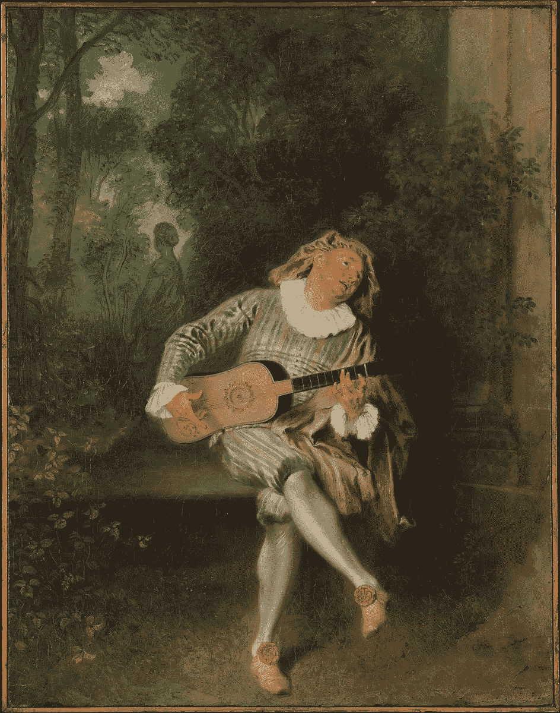
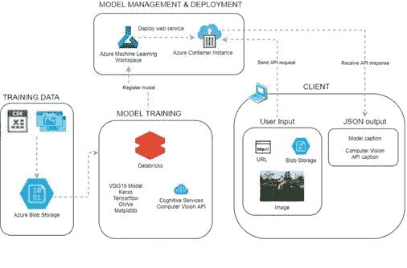
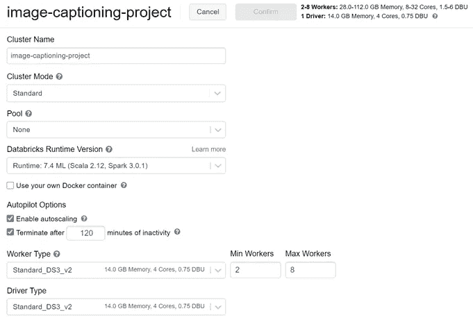
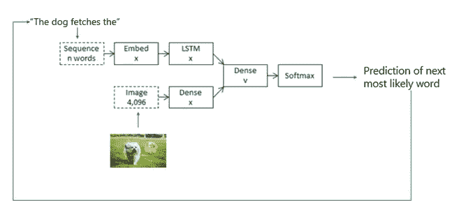
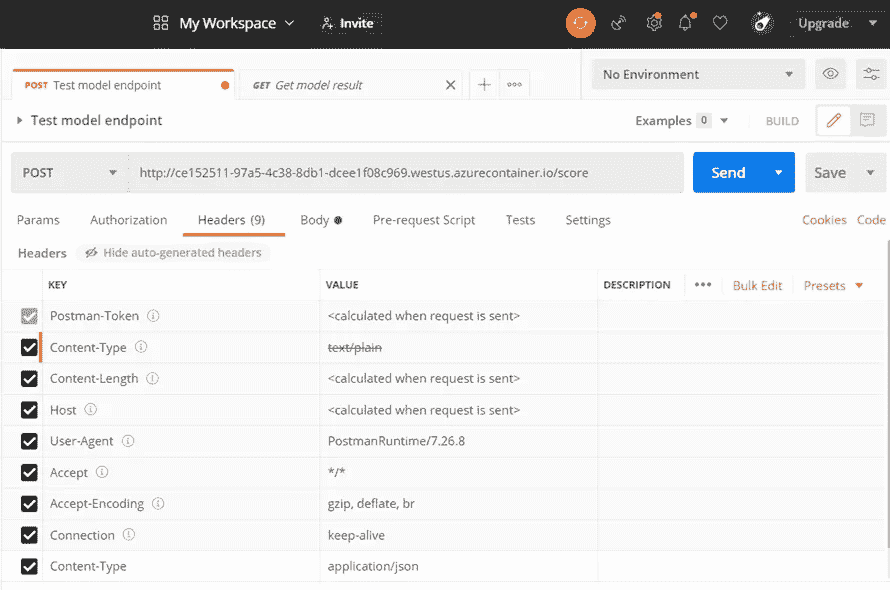
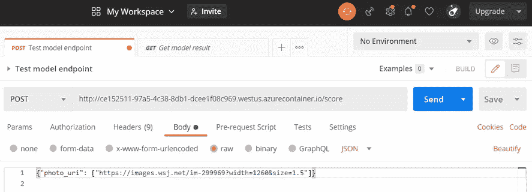
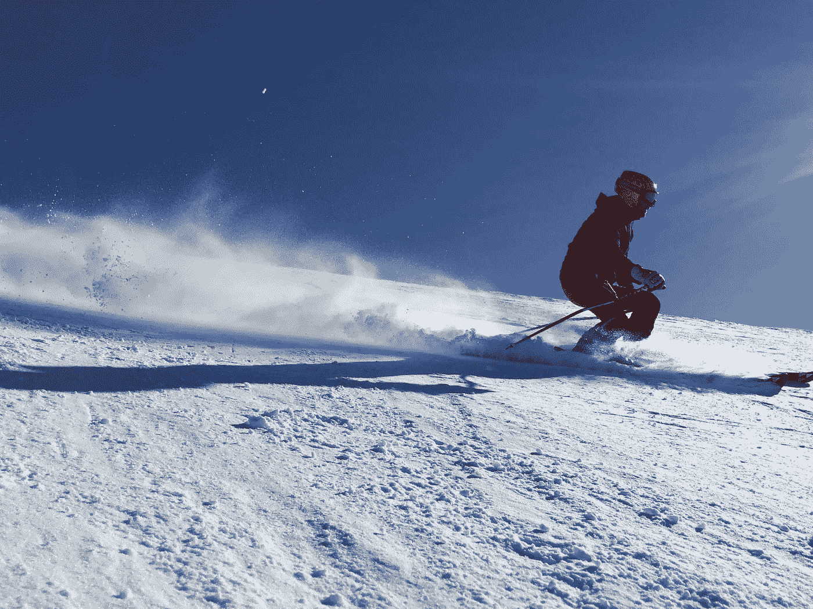
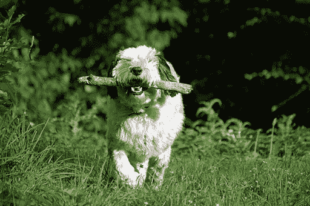

# 在 Azure 上构建深度学习图像字幕模型

> 原文：<https://towardsdatascience.com/building-a-deep-learning-image-captioning-model-on-azure-b14ce4682fbf?source=collection_archive---------16----------------------->

## [实践教程](https://towardsdatascience.com/tagged/hands-on-tutorials)

## 这幅图像中发生了什么？关于如何在云上创建深度学习计算机视觉和 NLP 模型的教程。

你如何描述这幅图像中发生的事情？安托万·华多，“[梅泽廷](https://www.metmuseum.org/art/collection/search/437926?searchField=All&amp;sortBy=Relevance&amp;what=Paintings&amp;high=on&amp;ao=on&amp;ft=*&amp;offset=0&amp;rpp=80&amp;pos=80)”(1718-1720)。大都会博物馆提供。

在我利用 AI/ML 的新角色入职时，我开始从头开始在云上构建深度学习模型。在大学期间，我在一家艺术博物馆实习，在那里我亲眼目睹了整个行业面临的挑战，即将艺术品数字化，以便让广大观众能够接触到它们。

即使一件艺术品被数字化以供在线访问，也不总是容易找到。用户可能很难在博物馆的数据库中找到一幅他们可能见过但不记得名字的画。他们可能会使用语义语言来描述图像(例如，“坐在长凳上拿着一件乐器的人”)，而不是关键短语，如绘画的名称(“[梅泽廷](https://www.metmuseum.org/art/collection/search/437926?searchField=All&amp;sortBy=Relevance&amp;what=Paintings&amp;high=on&amp;ao=on&amp;ft=*&amp;offset=0&amp;rpp=80&amp;pos=80)”)、日期(1718-20)或艺术家的名字(安东尼·华多)。这个用例启发我建立了一个神经网络，它可以识别图像的关键组成部分，并根据场景生成描述性的说明。

然而，图像字幕模型的应用超出了艺术博物馆的范围。处理许多需要易于搜索的描述的图像的组织(如工厂、报纸或数字档案馆)可以从自动生成标题中受益，而无需依赖劳动密集型的手动描述过程。此外，标题还有支持可访问性标准的额外好处。书面字幕可以通过自适应技术为视力残疾的个人大声朗读。

Azure Cognitive Services 提供[图片标记](https://docs.microsoft.com/en-us/azure/cognitive-services/computer-vision/concept-tagging-images)和[图片描述](https://docs.microsoft.com/en-us/azure/cognitive-services/computer-vision/concept-describing-images)服务。然而，我想看看如何从头开始在云中构建和部署一个模型。我的目标是使用 Azure 的工具和服务来训练、测试和部署深度学习模型，并最终看看它的性能与 Azure 的一些现有产品相比如何。

为了建立深度学习模型，杰森·布朗利的[图像字幕模型](https://machinelearningmastery.com/develop-a-deep-learning-caption-generation-model-in-python/)充当了一个切入点。我使用 Azure Databricks 和 Azure Machine Learning 作为创建我的深度学习模型的平台。然而，无论您使用何种云提供商平台，一般的培训和部署工作流程都是相似的:

1.  存储数据
2.  在 Azure 上设置培训和测试环境
3.  加载和预处理数据
4.  训练和评估模型
5.  注册模型
6.  为部署准备模型
7.  部署模型以计算目标
8.  使用部署的模型(即 web 服务)进行推理

在接下来的内容中，我将介绍我是如何构建这个模型的，并分享为自己构建一个版本的技巧。最后，我讨论了为什么模型会有这样的表现，并找出了改进的机会。

# **技术堆栈和架构概述**

当一幅图像被描述时会发生什么？有两个主要的考虑因素:第一，模型必须识别图像中的关键主题和支持细节。这个组件将由“计算机视觉”组成，该模型识别视觉上表示的内容并输出唯一的特征向量。第二个概念是自然语言处理。然后，该模型必须将其所见转化为一个连贯的句子，概括图像中正在发生的任何事情。

该项目建立在微软 Azure 云之上。具体来说，使用从 [Blob 存储器](https://azure.microsoft.com/en-us/services/storage/blobs/)摄取的数据在[数据块](https://azure.microsoft.com/en-us/services/databricks/)上训练该模型。然后，这些模型被注册到一个 [Azure 机器学习](https://azure.microsoft.com/en-us/services/machine-learning/)工作空间中，这样模型就可以作为 RESTful API 端点进行部署，以供最终使用。用户可以向端点发送图像的多个公共 URL，并接收从 [Azure 计算机视觉认知服务](https://azure.microsoft.com/en-us/services/cognitive-services/computer-vision/)和深度学习模型生成的标题。

下面是一个架构图，展示了所使用的工具和服务:

我如何在 Azure 上构建深度学习模型的架构图。图片作者。

我使用的数据集是 [Flickr 8k 数据集](https://www.kaggle.com/adityajn105/flickr8k)，它由从 Flickr 的数据库中抓取的 8000 多张图片组成，该数据库在 Creative Commons 许可下可用。它还包括一个 CSV 文件，其中包含由一个人根据每张图片编写的五个标题(总共超过 40，000 个标题)。每张图片都有多种不同语法风格的标题，因为描述一张图片有多种方式，其中一些比另一些更准确、详细或简洁。

预先训练的单词嵌入模型 [GloVe](https://github.com/stanfordnlp/GloVe) 用于将训练数据中的单词映射到更高维的空间，以提取单词之间的精确关系。

我使用的模型架构是一个[递归神经网络](https://en.wikipedia.org/wiki/Recurrent_neural_network) (RNN)和一个数据生成器的公式，用于逐步加载数据。前一种方法通过根据句子中以前的单词选择单词来帮助构建句子。后者避免了在集群节点的内存中一次性加载所有数据的负担。我利用预先训练好的 [VGG16](https://keras.io/api/applications/vgg/) 模型来应用迁移学习(可以用 [InceptionV3](https://keras.io/api/applications/inceptionv3) 模型作为替代)。这样，我可以使用 Keras 定制一个现有的模型来满足我的解决方案的需求。

为了评估生成的字幕的质量，我使用了 [BLEU 评分](https://en.wikipedia.org/wiki/BLEU)，这是一个量化评估，用于评估字幕与“地面真实”(即人类编写的)字幕相比，听起来有多自然。

# **流程**

了解如何通过八步在 Azure 上训练和部署深度学习模型。

## **1。将数据存储在 Blob 存储器中**

Blob 存储是存储大量非结构化数据(如图像)的最佳选择。(您可以在此了解如何创建 Blob 存储帐户[。)虽然你可以使用](https://docs.microsoft.com/en-us/azure/storage/blobs/storage-quickstart-blobs-portal) [SDK](https://docs.microsoft.com/en-us/azure/storage/blobs/storage-quickstart-blobs-python) 或 Azure Portal 将下载的数据存储到 blob 存储中，但是 [Azure Storage Explorer](https://azure.microsoft.com/en-us/features/storage-explorer/) 有一个方便的 UI，允许你直接上传数据，而不需要太多的努力。

## **2。设置您的 Azure 环境虚拟机(VM)并使用 Databricks 挂载点加载数据**

创建深度学习模型的环境可以通过 Azure 门户网站创建 Azure 机器学习(AML)工作区和 Databricks 工作区的实例来完成[。从那里，您可以启动 Databricks 工作区，创建笔记本电脑，并启动计算集群。](https://docs.microsoft.com/en-us/azure/machine-learning/how-to-manage-workspace)

您可以为您的计算集群选择许多不同的配置。对于 Databricks 运行时版本，最好使用版本名称中带有“ML”的运行时，这样可以确保安装的库版本与流行的机器学习库兼容。在数据块上旋转集群的好处在于，节点在不活动后会关闭，这是一个经济上有益的特性。

*旁注*:如果你使用的是 Flickr 16k 或者 30k 这样的大型数据集，我建议你在 GPU 上训练，这样训练起来更快。 [Horovod](https://github.com/horovod/horovod) ，一个诞生于优步的分布式训练框架，可以进一步加速深度学习训练。

如何在 Azure Databricks 中设置机器学习计算集群？图片作者。

在 Databricks 中，数据是通过一个[挂载点](https://docs.databricks.com/data/data-sources/azure/azure-storage.html)获取的。这授权数据块中的笔记本读取和写入 Blob 存储容器中的数据，其中所有文件夹(即 Blob)都存在。为您的数据创建一个挂载点的好处是，您不必为您的特定数据源欺骗工具，而是利用[数据块文件系统](https://docs.databricks.com/data/databricks-file-system.html)，就好像数据存储在本地一样。

下面是关于如何设置装载点来装载数据的代码片段:

然后，您可以使用前缀`dbfs/mnt/mount-name`导航到该目录。例如，可以编写类似于`open('dbfs/mnt/mycontainer/Flickr8K_data/captions.csv', 'r')`的代码来读取文件。

## **3。预处理图像和字幕数据**

为了准备用于模型训练的数据，字幕数据集和图像目录需要预处理。这一步包括为训练数据集中出现的所有单词创建一个“词汇字典”(这是模型用来创建字幕的单词库)，将图像整形为 VGG16(224×224 像素)模型的目标大小，并使用 vgg 16 模型提取每个图像的特征。

在处理所有字幕并应用标准自然语言处理(NLP)清理实践(例如，使所有单词小写并删除标点符号)后，词汇表大小为 8，763 个单词。

我不会深入讨论关于数据预处理的更多细节，因为在 Brownlee 的演示中已经很好地概述了这一步骤。

## **4。定义模型并根据数据对其进行训练**

有时在 NLP 中，你的训练数据不足以让模型理解单词之间的准确关系。 [GloVe](https://nlp.stanford.edu/projects/glove/) 是一种表示向量空间中单词之间相似度的算法。

使用通过斯坦福大学 NLP 项目获得的预训练单词向量有助于区分训练词汇集中单词之间的关系，以创建可理解的句子。我使用了由 200 维向量表示的 40 万个单词的数据集。通过将训练词汇映射到预训练的手套模型，可以将得到的嵌入矩阵加载到模型中进行训练。

使用数据生成器函数加载字幕和图像数据避免了一次性将整个数据集存储在内存中的开销。关于模型架构如何工作的更多细节，我推荐查看 Brownlee 的解释。

在构建模型时，一个句子可以被认为是一系列单词。[长短期记忆](https://machinelearningmastery.com/gentle-introduction-long-short-term-memory-networks-experts/) (LSTM)是一种特殊类型的 RNN，它是一种神经网络，是处理序列的标准方法，通过特别注意前面的输入来保留序列的上下文。然而，与其他 RNN 不同，LSTM 可以根据前面的单词预测下一个最有可能出现的单词，从而逐字建立标题，其中时间顺序很重要。

下面是神经网络的架构图，它有两个输入，代表图像的特征向量和不完整的字幕。你可以在这里了解更多关于[模型的不同部分(如照片特征提取器、序列处理器和解码器)。](https://machinelearningmastery.com/develop-a-deep-learning-caption-generation-model-in-python/)

该模型以一个“开始标记”开始字幕，并根据跟随前面单词的概率迭代添加单词。图片作者。

以下函数将神经网络架构转换为 Keras 定义的深度学习模型，并输出模型对象进行训练。数据生成器使用 *model.fit()* 函数将训练数据传递给模型。该模型被训练了 20 个时期，总共花费了 1 小时 36 分钟。

## **5。将部署模型注册为 Azure 容器实例(ACI)**

训练好模型后，现在可以将它部署为 Azure 容器实例(ACI ),这样任何人都可以使用它并为任何图像目录创建标题。通常情况下，如果该模型用于生产，它可以作为 Azure Kubernetes 服务(AKS)部署，您可以在这里了解。

不久前创建的 Azure 机器学习(AML)工作区现在派上了用场。通过以下代码片段调用工作区，出于安全考虑，这需要您登录 Azure 帐户。

第二步是在 Azure 机器学习工作区中注册模型和结果所需的任何基本资产，以便端点可以访问它们。我注册了 model 和 tokenizer(词汇),因为输出句子的构造在整个过程中都引用了 tokenizer 来预测句子中最有可能出现的下一个单词。

让我们也确认一下模型和标记器是否成功注册了。

## **6。通过编写入口脚本**准备部署配置

端点如何知道如何使用训练好的模型并给出输出？所有这些都是在 ACI 的入口脚本中定义的。输入脚本定义了预期的用户输入类型、如何处理数据以及如何格式化结果。

下面的代码定义了一个完成四个步骤的端点:

1.  接收到映像目录的 SAS URI，并访问注册的模型和令牌化器
2.  调用训练好的模型为每个图像构建标题
3.  调用 Azure 计算机视觉认知服务资源来生成补充标题
4.  以 JSON 格式返回自定义模型和 Azure 资源的标题

入口脚本必须特别有两个函数， *init()* 和 *run()。*前者加载重要资产；后者获取数据，并执行大部分繁重的工作，对图像进行预处理并构建字幕。下面的代码片段将脚本写入名为“score.py”的本地文件，该文件将包含在 ACI 部署的配置中。

## **7。部署模型以计算目标**

ACI 还需要一个已定义的环境，该环境具有对输入进行评分所需的必备依赖关系。环境和入口脚本在推理配置中定义。

关键时刻:一旦 ACI 被定义，它就可以作为 Azure Web 服务进行部署，这样它就可以被调用了。从部署返回的评分 URI 将用于通过 REST API 调用测试端点，因此复制 URI 并保存起来以备后用。

## **8。通过调用 Azure Web 服务为新数据打分**

测试模型端点有两种方法:用 Python 或 Postman。端点接受图像的任何公共 URL。正如预期的那样，端点返回来自训练模型的标题和 Azure Cognitive Service 的图像标题服务进行比较。用来自任何网站的图片或您自己的图片进行测试，以查看不同的结果。

在 Python 中，使用请求库来构造 API 调用如下:

如果您更喜欢在 [Postman](https://www.postman.com/) 中工作，以获得更快的调试和 UI 的便利性，该过程如下所示:

在 Postman 中测试模型端点的第 1 步。图片作者。

在 Postman 中测试模型端点的第 2 步。图片作者。

*瞧吧*！您现在已经成功地在 Azure 上训练和部署了深度学习模型！

点击了解更多关于在云上部署机器学习模型的信息[。](https://docs.microsoft.com/en-us/azure/machine-learning/how-to-deploy-and-where?tabs=azcli)

# **项目成果**

并非所有的字幕都是同等创建的。描述一幅图像有很多种方式，每种方式在语法上都可能是正确的。但是有些比其他的更简洁和流畅。

如前所述，BLEU 评分是衡量翻译质量的可靠方法，评分范围为 0 到 1。可以导入 NLTK Bleu 评分包，通过将预测的字幕与人类编写的实际字幕进行比较来评估模型的性能。

权重为(1.0，0，0，0)的 BLEU 得分为 0.48。通常，介于 0.50 和 1 之间的 BLEU 分数提供了良好的结果。点击了解有关计算 BLEU 分数[的更多信息。](https://machinelearningmastery.com/calculate-bleu-score-for-text-python/)

# **模型评估和改进**

模型性能仍有改进的空间。它对背景简单、只包含少数几个不同主题的图像表现得相当好。

然而，它有时很难准确识别对象是什么(例如，将一个模糊的人物标记为一个人或无生命的物体标记为狗)，以及在室内拍摄的照片，或者如果在室外，在某些季节拍摄的照片。我想知道为什么会这样，以及将来可以做些什么来使字幕更加准确和真实。

该模型适用于温暖天气拍摄的户外照片，但不适用于冬季场景。([图片来源](https://pixnio.com/sport/winter-sports/snow-winter-downhill-skiing-skier-cold-snowboard-ice-mountain)通过知识共享)

我的假设是训练数据集有偏差。这些数据是在 2014 年从 Flickr 上搜集来的，当时数码相机已经普及，并被休闲摄影师所使用。许多照片是在面向家庭的环境中拍摄的，如体育比赛或后院。虽然也有在其他环境下拍摄的照片，但绝大多数照片包含了狗捡球、小孩在草地上玩耍以及一群人。

对于在图像中描绘的场景类型中有更多差异的较大数据集，我们可以期望在图像上得到模型以前没有见过的更准确的结果。然而，较大数据集的代价是较长的训练时间。为了缓解这种情况，一种选择是对数据进行分区，或者将其转换为 Delta Lake 或 parquet 文件，同时进行分布式培训或使用 GPU 虚拟机。

如果想提高模型的准确性，一种选择是使用训练模型时使用的超参数。例如，增加时期(即，模型通过整个训练数据集的次数)同时保持批量大小(即，它一次训练多少个样本)相对较小有助于模型捕捉数据集中更多的细微差别，因为梯度下降收敛的速度降低了。纪元数量和批量大小之间的适当平衡可以产生一个整体性能更好的模型，而不会增加训练时间。

改善结果的另一种方法是增加神经网络的复杂性，例如在模型结构中增加更多的层。通过使模型更加复杂，它可以产生潜在的更好的结果，因为它能够更详细地训练数据。

一旦模型得到改进并可以投入生产，它就可以作为 AKS 而不是 ACI 实例进行部署，用于大型目录。

# 最后的想法

来自 Flickr 8k 数据集的一只快乐的狗的训练照片，通过 Creative Commons 从 [Flickr](https://flickr.com/) 获得。

和许多人一样，我发现吴恩达的[深度学习](https://www.coursera.org/specializations/deep-learning)和[机器学习](https://www.coursera.org/learn/machine-learning)课程对了解深度学习领域非常有帮助。如果这些话题对你来说是新的，我建议试试他的视频。

概括地说，我们介绍了如何在 Azure 上设置机器学习环境，使用 Databricks 中的 Keras 定义和训练深度学习模型，并将该模型部署为容器实例，以便对新图像进行评估。