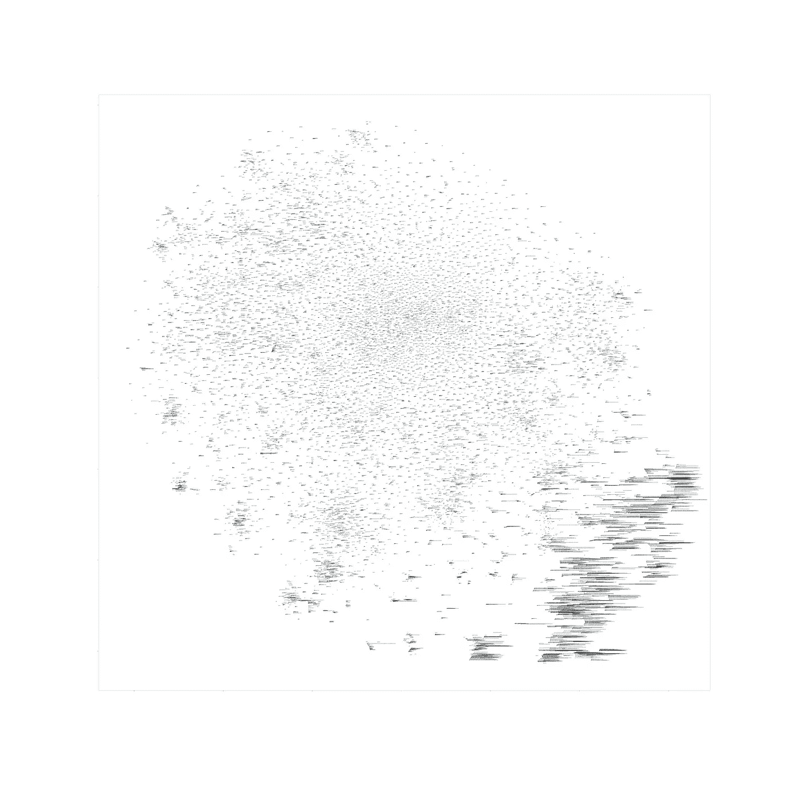
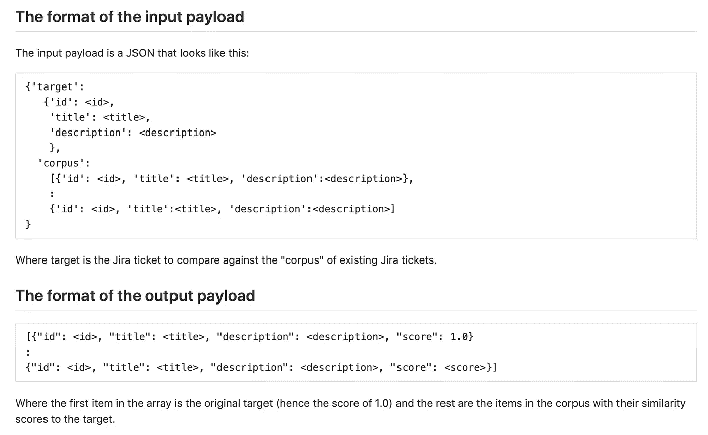

# 使用单词嵌入和余弦相似度构建可部署的吉拉 Bug 相似度引擎

> 原文：<https://towardsdatascience.com/building-a-deployable-jira-bug-similarity-engine-using-word-embedding-and-cosine-similarity-1c78eeb23a8d?source=collection_archive---------71----------------------->

## 循序渐进的方法


巴黎武装博物馆的一台英格玛机(鸣谢:作者自己的收藏)

# 介绍

在之前的[文章](/building-a-deployable-jira-bug-classification-engine-using-amazon-sagemaker-827fda8d0460)中，我详细介绍了如何使用亚马逊的 BlazingText 来构建吉拉 bug 分类引擎。在那里，我还引用了相应的 Gitlab [库](https://gitlab.com/foohm71/octopus2/-/tree/master/BlazingText)。在`README.md`那里，我非常简要地提到了关于 *word2vec* 、 *word 嵌入*和作为输出生成到`word2vec`算法的`vectors.txt`文件。

在本文中，我们将使用相同的`vectors.txt`单词嵌入来构建一个*文本相似度*引擎，以在给定的 bug 语料库中找到相似的 bug。

# 什么是单词嵌入？

我可能无法解释什么是单词嵌入，但是 YouTube 上有一个很好的视频很好地解释了这个问题。简而言之，在单词嵌入中，我们基于它们的*上下文*将语料库中的每个单词映射到一个向量空间，在这种情况下，上下文是与语料库中其他单词的接近度。

你们中的一些人可能会觉得这很有趣:macheads101 使用 word2vec 算法创建了一个单词嵌入，使用的是他在一段时间内收集的 Twitter tweets，然后创建了一个漂亮的小 [web 应用程序](https://embeddings.macheads101.com/word?word=toy)来演示如何使用嵌入在语料库中找到相似的单词。

在我上面描述的`vectors.txt`的例子中，我也绘制了向量空间的 case 图，只是为了对数据有个感觉:



向量的 t-SNE 图. txt

(本质上，t-SNE 是一种*降维*算法，其中我们将一个 n 维空间映射到一个较低的维度(在这种情况下是 2-d 用于绘图)。另一种流行的降维算法是 PCA)

正如你所看到的，有一些单词根据它们的上下文被认为是“相似”的。注意到图中的那些长条纹了吗？这些对应于吉拉门票中的代码片段。注意到它们都聚集在一起了吗？

这种将单词表示为向量的方式的好处是，单词之间的“距离”接近于相似性或更确切地说是亲和力或“它们属于一起”的概念。有几种方法来衡量这一点,[2]有一个很好的列表。为了简单起见，我们将只使用*余弦相似度*(正如我们将在后面看到的，这是一个不错的主意)。

# 但是我们不是在和单个单词打交道

现在，记住最初的目标:我们如何估计吉拉臭虫的相似性？我们可以扩展这个单词相似性的概念吗？

在[3]中，Yatin Vij 提供了几个选项:

1.  TF-IDF 加权单词嵌入
2.  Doc2Vec
3.  平均单词嵌入

同样，为了简单起见，我们将使用(3) ie。对 bug 中的所有单词执行向量加法(在这种情况下，只有 bug 摘要和描述)。但是在[3]中，这种方法要求平均而不是求和。如果一个 bug 比另一个 bug 有更多的单词，这将是一个问题，对吗？如果我们使用余弦相似度就不会，因为与欧几里德距离不同，余弦相似度使用向量空间上两点之间的角度来确定相似度。这意味着可以使用矢量和来代替平均值。

这概括了主要思想。接下来就是尝试一下，看看是否有希望成功。在下面的部分中，我将引用在这里找到的代码:

> [https://gitlab.com/foohm71/cuttlefish](https://gitlab.com/foohm71/cuttlefish)

(为什么是“墨鱼”？我的上一个项目叫做“章鱼”,所以我就顺其自然了)

# 算法探索

在本节中，我将浏览在`cuttlefish`存储库中找到的`TextSimilarityExplorations.ipynb`。这个 Python 笔记本是为在 Google Colab 上运行而设计的，我推荐它在那里运行。

注意:正如本文[中所描述的，吉拉 bug 信息的语料库是从几个开源项目的吉拉票证的开源存储库中获得的。也有 2 个数据集被使用:`JIRA_OPEN_DATA_LARGESET.csv`被用来获得`vectors.txt`，我将使用`JIRA_OPEN_DATA_ZOOKEEPER.csv`来尝试这种方法。这两个数据集应该是正交的，因为“大数据集”不包含任何 Zookeeper 错误。我想这样做是为了看看单词嵌入方法有多健壮。](https://levelup.gitconnected.com/building-a-deployable-jira-bug-classification-engine-using-tensorflow-745667c72607)

## 设置

基本设置材料:

第一部分即。`drive.mount('/content/drive')`基本上挂载你的 gdrive，这样你就可以从 gdrive 读入数据到 Colab。

## 读入数据

第一次读入`vectors.txt`:

```
wv = KeyedVectors.load_word2vec_format('/content/gdrive/My Drive/Colab Notebooks/Octopus2/BlazingText/vectors.txt', binary=False)
```

注意:您必须根据您上传`vectors.txt`文件的位置相应地修改路径(如果您计划运行笔记本)。

接下来，读入动物园管理员数据:

```
dataset = pd.read_csv("/content/gdrive/My Drive/Colab Notebooks/Octopus2/JIRA_OPEN_DATA_ZOOKEEPER.csv")
```

接下来，我们只需要`id`、`title`和`description`字段，我们还将`title`和`description`组合成一个名为`features`的字段

```
df = dataset[["id","title","description"]]
df["features"] = df["title"] + " " + df["description"]
```

`features`本质上是我们将要比较相似性的“文档”。

## 预处理

接下来，我们删除功能 ie 中不需要的文本。电子邮件地址和网址不能提供大量信息:

```
df.features = df.features.str.replace(r"[\n\r\t]+", " ")
df.features = df.features.str.replace(r"([a-zA-Z0-9_\-\.]+)@([a-zA-Z0-9_\-\.]+)\.([a-zA-Z]{2,5})", " ")
df.features = df.features.str.replace(r"((http[s]?|ftp):\/)?\/?([^:\/\s]+)((\/\w+)*\/)([\w\-\.]+[^#?\s]+)(.*)?(#[\w\-]+)?", " ")
```

## 审判

接下来的部分是问题的核心。我还跳过了一些代码，因为它们对我来说是探索性的代码。

首先是一些有用的函数:

第一个`sentance2vector`基本上是把一个句子(没错，是拼写错误)转换成 100 维向量来匹配`vectors.txt`中的单词嵌入。还要注意，我必须跳过词汇表中没有的单词。如果特性中的所有单词都不在词汇表中，这可能很糟糕。我认为情况不会是这样。

接下来是`cosineSimilarity`函数，它不言自明。

然后，我在数据帧中创建另一列来存储分数 ie。相似性估计并将其初始化为零:

```
df["score"] = np.zeros(len(df))
```

接下来是主要计算:

```
for i in range(0,len(df)):
   vect = sentance2vector(df.iloc[i].features)
   df.iloc[i,4] = cosineSimilarity(vector, vect)
```

注意:`vector`是`df`中第一行`features`列的矢量版本。

这实际上是计算第一行`df`相对于所有其他行的相似性。

那么相似度估计有什么好的吗？

为了找到答案，我需要把小麦从谷壳中分离出来。也就是说，只选择相似度高的 bug(我选择的阈值是 0.87)。

```
df1 = df.loc[df.score > 0.87]df2 = df1[["features","score"]]df2
```

然后我看了看那些高分的，和“目标”bug 比较:

```
Quota is not correctly rehydrated on snapshot reload traverseNode in DataTree will never actually traverse the limit nodes properly.
```

一些得分较高的是:

```
C Client might not cleanup correctly during close I was looking through the c-client code and noticed a situation where a counter can be incorrectly incremented and a small memory leak can occur.In zookeeper.c : add_completion(), if close_requested is true, then the completion will not be queued. But at the end, outstanding_sync is still incremented and free() never called on the newly allocated completion_list_t. I will submit for review a diff that I believe corrects this issue.andThe last logged zxid calculated by zookeeper servers could cause problems in leader election if data gets corrupted. It is possible that the last loggged zxid as reported by all the servers during leader election is not the last zxid that the server can upload data to. It is very much possible that some transaction or snapshot gets corrupted and the servers actually do not have valid data till last logged zxid. We need to make sure that what the servers report as there last logged zxid, they are able to load data till that zxid.
```

这还不错。第一个处理数据结构问题，目标也是如此。第二个与一些数据处理的过程问题有关，目标也是如此。

所以问题来了:在传统的 ML 中，你有一个标记数据集，你把它分成训练/测试子集，并使用测试子集来评估你的算法执行得有多好。在这种情况下，除非你非常熟悉 bug，否则执行评估真的非常具有挑战性。执行评估的一个简单方法是部署它，使用它，并有一种方法对算法进行评分(这个想法类似于 A/B 测试)。

# 部署

使这个算法可部署的一个简单方法是将其构建为 Docker 容器，并将其发布在 Docker 注册表上。在以前的[文章](https://levelup.gitconnected.com/building-a-deployable-jira-bug-classification-engine-using-tensorflow-745667c72607)(参见“构建可部署模型”一节)中，我描述了 octopus2 项目的步骤。对于墨鱼来说，步骤几乎是一样的，除了这里，我没有自己构建`app.py`，而是使用了我开发的一种方法，首先将`app.py`原型化为 Jupyter 笔记本，然后将其转换为容器的`app.py`。

## 构建过程

我将首先从高级构建过程开始。为此，我们应该查看`.gitlab-ci.yml`文件:

构建主要有两个阶段:(a)从`Cuttlefish.ipynb`构建`app.py`；以及(b)构建和部署 Docker 容器。

(b)是一个漂亮的锅炉板，在前面的文章中也有描述。(a)基本上只是用`nbconvert`把笔记本转换成`app.py`，用`remove_lines.py`去掉不想要的代码(稍后再解释)。

## 墨鱼网

如果你仔细看看这个笔记本，你会注意到它几乎是一个清理过的`TextSimilarityExplorations.ipynb`版本。还有额外的标准 Flask 代码使它成为一个 API，差不多就是这样。

注意所有的`# START REMOVE`和`# END REMOVE`。这些是为了让`remove_lines.py`知道删除哪些代码块。共有 3 个代码块:(a)第`pip install`部分(b)第`app.run()`部分。(b)适合作为笔记本测试代码，但不适合作为 Docker 容器部署。这将需要:

```
app.run(host='0.0.0.0', port='33')
```

# 运行发动机

我们终于到了有趣的部分！第一部分是做一个这样的`docker run`:

```
docker run --publish 5000:33 --name cuttlefish foohm71/cuttlefish:master
```

接下来我们给你一个选择:使用笔记本调用 API(`testing.ipynb`)或者运行脚本(`test.sh`)。两个人都很直率。`test.sh`只是一个使用`test.json`中有效负载的 curl，`testing.ipynb`只是使用`requests`对 API 进行同样的调用。

repo 上的`README.md`也描述了有效载荷格式:



仅此而已。我希望您发现这很有用！

(对于那些希望在 GCP 或 AWS 上部署这个的人来说，`README.md`有一些关于如何做的提示)

# 参考

[1]词嵌入，machead101，2017 年 7 月，【https://youtu.be/5PL0TmQhItY 

[2]文本相似度:估计两个文本的相似程度，阿德里安·锡格河，2018 年 7 月，[https://medium . com/@ adriensieg/Text-Similarities-da 019229 c894](https://medium.com/@adriensieg/text-similarities-da019229c894)

[3]结合单词嵌入形成文档嵌入，Yatin Vij，2019 年 9 月，[https://www . analyticsvidhya . com/blog/2020/08/top-4-sentence-embedding-techniques-using-python/](https://www.analyticsvidhya.com/blog/2020/08/top-4-sentence-embedding-techniques-using-python/)