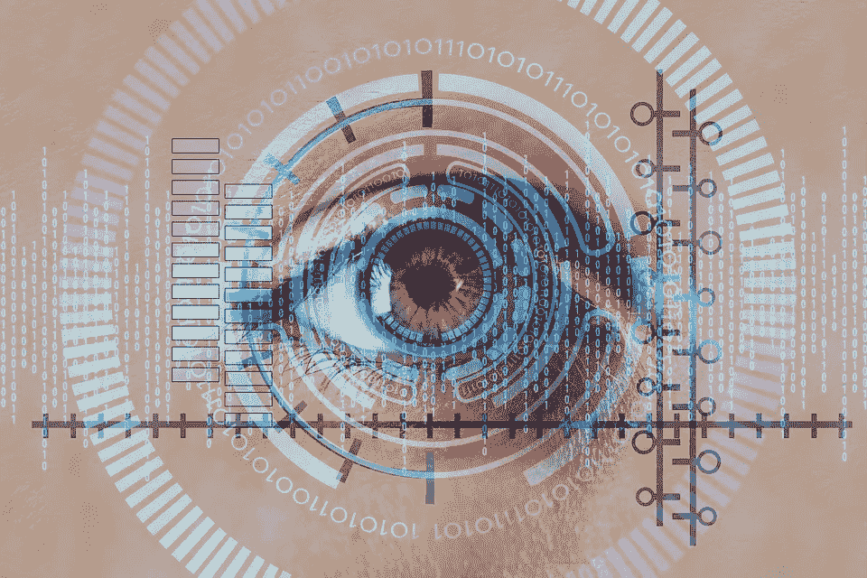
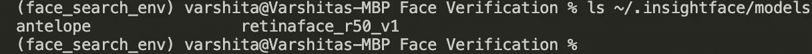
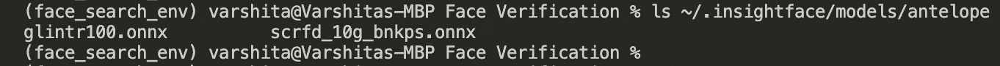
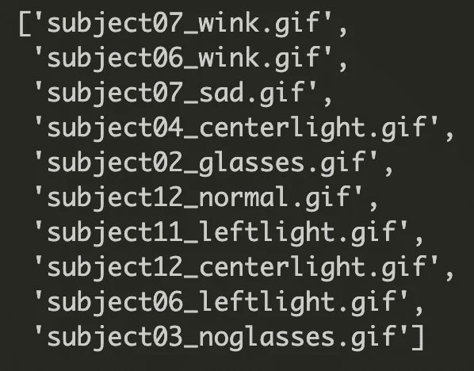
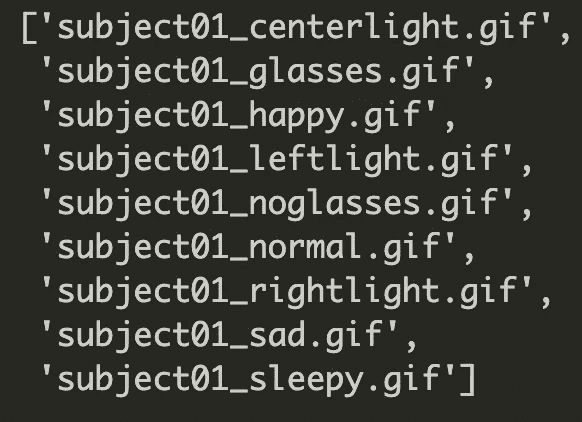
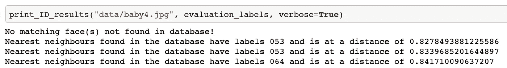

# 用 Python 中的 Scikit Learn 构建人脸识别系统

> 原文：<https://towardsdatascience.com/building-a-face-recognition-system-using-scikit-learn-in-python-163fd423513b?source=collection_archive---------3----------------------->

## 计算机视觉

## 使用 Insightface 嵌入比较人脸



图片由 [Gerd Altmann](https://pixabay.com/users/geralt-9301/?utm_source=link-attribution&utm_medium=referral&utm_campaign=image&utm_content=5814965) 从 [Pixabay](https://pixabay.com/?utm_source=link-attribution&utm_medium=referral&utm_campaign=image&utm_content=5814965) 拍摄

# 什么是人脸识别？

人脸识别的任务是将一个未知人的脸与数据库中存储的图像进行比较。映射可以是一对一或一对多，这取决于我们运行的是人脸验证还是人脸识别。

> 在本教程中，我们感兴趣的是建立一个面部识别系统，该系统将验证图像(通常称为探针图像)是否存在于预先存在的面部数据库(通常称为评估集)中。

# 直觉

建立这样一个系统有四个主要步骤:

## 1.检测图像中的人脸

可用的人脸检测模型有 MTCNN、FaceNet、Dlib 等。

## 2.裁剪和对齐面以获得一致性

OpenCV 库提供了这一步所需的所有工具。

## 3.找到每个面的矢量表示

由于程序不能直接处理 jpg 或 png 文件，我们需要某种方法将图像转换成数字。在本教程中，我们将使用 [Insightface](https://github.com/deepinsight/insightface) 模型为人脸创建多维(512-d)嵌入，从而封装与人脸相关的有用的*语义*信息。

为了使用一个库来处理这三个步骤，我们将使用`insightface`。特别是，我们将使用 Insightface 的 ArcFace 模型。

> [InsightFace](https://github.com/deepinsight/insightface) 是一个开源的深度人脸分析模型，用于人脸识别、人脸检测和人脸对齐任务。

## 4.比较嵌入

一旦我们将每个独特的脸转换成一个向量，比较脸的本质归结为比较相应的嵌入。我们将利用这些嵌入来训练一个 sci-kit 学习模型。

*附:如果你想跟随，代码可以在*[*Github*](https://github.com/V-Sher/Face-Search)*上找到。*

# 设置

创建虚拟环境(可选):

```
python3 -m venv face_search_env
```

激活此环境:

```
source face_search_env/bin/activate
```

此环境中的必要安装:

```
pip install mxnet==1.8.0.post0
pip install -U insightface==0.2.1
pip install onnx==1.10.1
pip install onnxruntime==1.8.1
```

更重要的是，一旦完成 pip 安装`insightface`:

> -从 [onedrive](https://1drv.ms/u/s!AswpsDO2toNKrU0ydGgDkrHPdJ3m?e=iVgZox) 下载**羚羊**车型发布。(它包含两个用于检测和识别的预训练模型)。
> -放在`*~/.insightface/models/*`下，所以`*~/.insightface/models/antelope/*.onnx*`有 onnx 款。

如果设置正确，应该是这样的:



如果你在`antelope`目录中查找，你会找到两个用于人脸检测和识别的`onnx`模型:



*注意:自从上周最新发布的* `*insightface*` *0.4.1 以来，安装并不像我希望的那样简单(至少对我来说是这样)。因此，我将在本教程中使用 0.2.1。以后我会相应更新 Github 上的代码。如果你卡住了，请看这里的说明*<https://github.com/deepinsight/insightface/issues/891#issue-489506780>**。**

# *资料组*

*我们将使用 [Kaggle](https://www.kaggle.com/olgabelitskaya/yale-face-database) 上可用的耶鲁人脸数据集，该数据集包含 15 个人的大约 165 幅灰度图像(即每个身份 11 幅独特的图像)。这些图像由各种各样的表情、姿势和照明配置组成。*

*一旦你有了数据集，继续把它解压到你的项目中新创建的`data`目录中(参见 [Github](https://github.com/V-Sher/Face-Search) 上的项目目录结构)。*

# *让我们开始吧…*

*如果你想跟随，Jupyter 笔记本可以在 Github 上找到。*

## *进口*

```
*import os
import pickle
import numpy as np
from PIL import Image
from typing import List
from tqdm import tqdm

from insightface.app import FaceAnalysis
from sklearn.neighbors import NearestNeighbors*
```

## *加载 Insightface 模型*

*一旦`insightface`安装完毕，我们必须调用`app=FaceAnalysis(name="model_name")`来加载模型。*

*因为我们将`onnx`模型存储在**羚羊**目录中:*

```
*app = FaceAnalysis(name="antelope")
app.prepare(ctx_id=0, det_size=(640, 640))*
```

## *生成 Insightface 嵌入*

*使用`insightface`模型为图像生成嵌入非常简单。例如:*

```
**# Generating embeddings for an image*img_emb_results = app.get(np.asarray(img))
img_emb = img_emb_results[0].embedding
img_emb.shape------------OUTPUT---------------
(512,)*
```

## *资料组*

*在使用这个数据集之前，我们必须修复目录中文件的扩展名，使文件名以`.gif`结尾。(或`.jpg`、`.png`等)。*

*例如，下面的代码片段将把文件名`subject01.glasses`改为`subject01_glasses.gif`。*

*接下来，我们将数据分为评估集和探测集:每个受试者的 90%或 10 张图像将成为评估集的一部分，剩余的 10%或每个受试者的 1 张图像将用于探测集中。*

*为了避免采样偏差，将使用名为`create_probe_eval_set()`的辅助功能随机选择每个对象的探头图像。它将包含属于特定主题的 11 个图像(的文件名)的列表作为输入，并返回长度为 1 和 10 的两个列表。前者包含用于探针组的文件名，而后者包含用于评估组的文件名。*

## *生成嵌入*

*由`create_probe_eval_set()`返回的两个列表被顺序地提供给一个叫做`generate_embs()`的帮助函数。对于列表中的每个文件名，它读取灰度图像，将其转换为 RGB，计算相应的嵌入，最后返回嵌入和图像标签(从文件名中提取)。*

*现在我们有了一个生成嵌入的框架，让我们继续使用`generate_embs()`为探针和评估集创建嵌入。*

*需要考虑的事情很少:*

*   *由`os.listdir()`返回的文件是完全随机的，因此第 3 行的排序很重要。*为什么我们需要排序的文件名？*记住第 11 行的`create_probe_eval_set()`要求在任何一次迭代中所有文件都属于一个特定的主题。*

****

*os.listdir()的输出，不排序(左)和排序(右)*

*   *【*可选*如果我们使用`sklearn`提供的*分层* `train_test_split`功能，我们可以替换`create_probe_eval_set()`功能，去掉`for`循环，并简化上面代码片段中的几行代码。然而，对于本教程，我认为清晰比代码简单更重要。*

*通常，`insightface`无法检测到人脸，并随后为其生成空嵌入。这解释了为什么`probe_set`或`eval_set`列表中的一些条目可能是空的。重要的是，我们要过滤掉它们，只保留非空值。*

*为此，我们创建了另一个名为`filter_empty_embs()`的助手函数:*

*它将图像集(或者是`probe_set`或者是`eval_set`)作为输入，并移除那些`insightface`不能生成嵌入的元素(见第 6 行)。在此之后，它还更新标签(或者是`probe_labels`或者是`eval_labels`)(见第 7 行)，使得集合和标签具有相同的长度。*

*最后，我们可以仅获得在**评估集和**探测集中的良好指数的 512-d 嵌入:*

```
***assert** len(evaluation_embs) == len(evaluation_labels)
**assert** len(probe_embs) == len(probe_labels)*
```

*有了这两个数据集，我们现在准备使用 Sklearn 库中实现的一种流行的无监督学习方法来构建我们的人脸识别系统。*

## *创建人脸识别系统*

*我们使用评估嵌入为`X`的`.fit()`来训练[最近邻](https://scikit-learn.org/stable/modules/neighbors.html#unsupervised-nearest-neighbors)模型。对于无监督的最近邻学习来说，这是一种巧妙的技术。*

> *最近邻方法允许我们找到距离新点最近的预定数量的训练样本。*

**注意:一般来说，距离可以是任何度量标准，例如欧几里德、曼哈顿、余弦、M* inkowski、*等。**

*因为我们正在实现一个*无监督的*学习方法，请注意，我们没有向`fit`方法传递任何标签，即`evaluation_label`。我们在这里所做的就是将评价集中的人脸嵌入映射到一个潜在空间。*

**为什么？？，*你问。
简单回答:通过提前将训练集存储在内存中，我们能够在推理时间内加快对其最近邻居的搜索。*

*这是怎么做到的？
简单回答:在内存中以优化的方式存储树非常有用，特别是当训练集很大并且搜索新点的邻居变得计算量很大时。*

> *[基于邻居的方法被称为**非一般化机器学习方法**，因为它们简单地“记住”所有的训练数据(可能被转换成快速索引结构，如球树或 KD 树)。](https://scikit-learn.org/stable/modules/neighbors.html#unsupervised-nearest-neighbors) [ [来源](https://scikit-learn.org/stable/modules/neighbors.html#unsupervised-nearest-neighbors)*

**注:见* [*本*](https://stats.stackexchange.com/questions/349842/why-do-we-need-to-fit-a-k-nearest-neighbors-classifier) *Stackoverflow 讨论如果你还不服气！**

## *推理*

*对于每个新的探针图像，我们可以通过使用`nn.neighbours()`方法搜索它的顶部 *k* 邻居来发现它是否存在于评估集中。举个例子，*

```
*# Example inference on test imagedists, inds = nn.kneighbors(X = probe_img_emb.reshape(1,-1),
                            n_neighbors = 3,
                            return_distances = True
                            )*
```

*如果评估集中返回的索引(`inds`)处的标签与探测图像的原始/真实标签完全匹配，那么我们知道我们已经在验证系统中找到了我们的脸。*

*我们已经将上述逻辑包装到了`print_ID_results()`方法中。它将探头图像路径、评估集标签和`verbose`标志作为输入，以指定是否应该显示详细的结果。*

*这里需要注意一些重要的事情:*

*   *`inds`包含`evaluation_labels`集合中最近邻居的索引(第 6 行)。例如，`inds = [[2,0,11]]`表示发现`evaluation_labels`中索引=2 处的标签最接近探头图像，随后是索引= 0 处的标签。*
*   *由于对于*任何*图像，`nn.neighbors`将返回非空响应，如果返回的距离小于或等于 0.6(第 12 行)，我们必须仅将这些结果视为面部 ID 匹配**。(p . s . 0.6 的选择完全是任意的)。
    例如，继续上面的例子，其中`inds = [[2,0, 11]]`和假设`dists = [[0.4, 0.6, 0.9]]`，我们将只考虑索引=2 和索引= 0 处的标签(在`evaluation_labels`中)作为真正的面部匹配，因为最后一个邻居的`dist`对于它来说太大而不是真正的匹配。***

*作为快速检查，让我们看看当我们输入一个婴儿的脸作为探测图像时系统的反应。不出所料，它显示没有找到匹配的面孔！然而，我们将`verbose`设置为 True，因此我们可以在数据库中看到其*伪*最近邻居的标签和距离，所有这些看起来都相当大(> 0.8)。*

**

## *评估人脸识别系统*

*测试该系统是否好的方法之一是查看在前 k 个邻居中有多少*相关*结果。相关结果是真实标签与预测标签相匹配的结果。该度量通常被称为 k 处的*精度，其中 k 是预先确定的。**

*例如，从探针集中选择一个图像(或者更确切地说是一个嵌入)，其真实标签为“subject01”。如果`nn.neighbors`为该图像返回的前两个`pred_labels`为['subject01 '，' subject01']，则表示`k=2`在 k (p@k)处的精度为 100%。同样，如果`pred_labels`中只有一个值等于‘subject 05’，p@k 就是 50%，以此类推…*

```
*dists, inds = nn.kneighbors(X=probe_embs_example.reshape(1, -1),
                            n_neighbors=2,
                            return_distance=True)pred_labels = [evaluation_labels[i] for i in inds[0] ]
pred_labels----- OUTPUT ------['002', '002']*
```

*让我们继续计算整个探针组的平均`p@k`值:*

*厉害！90%不算太差，但肯定可以改进(但那是另一次)…*

*你能坚持到底，我向你致敬！希望这篇热情洋溢的关于人脸识别的介绍足以让你入门，人脸识别是计算机视觉研究的一个活跃领域。一如既往，如果有更简单的方法来做我在本文中提到的一些事情，请让我知道。*

*直到下次:)*