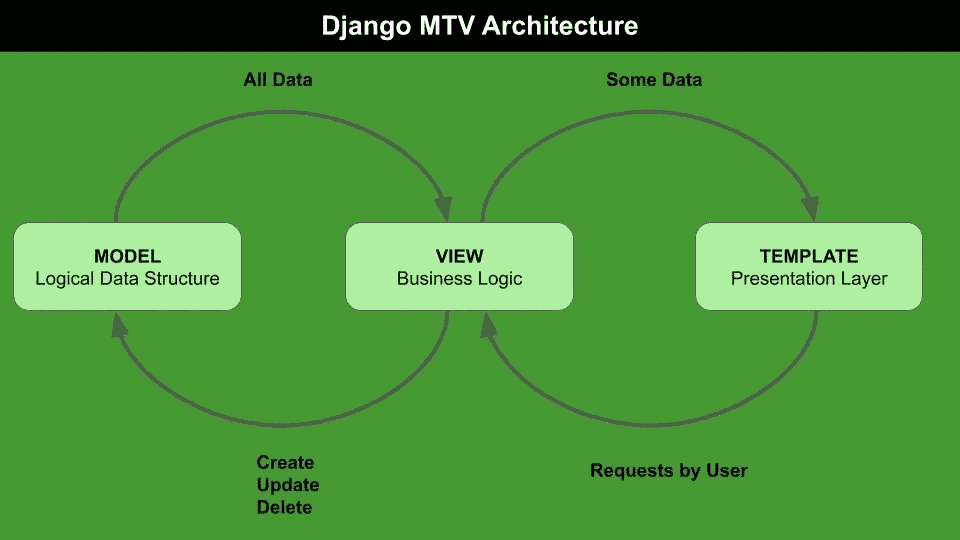
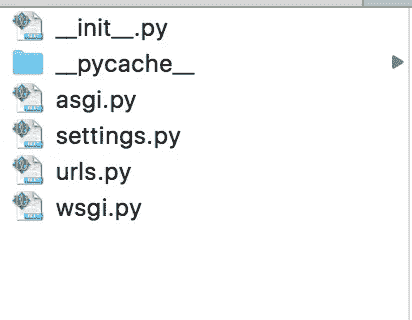
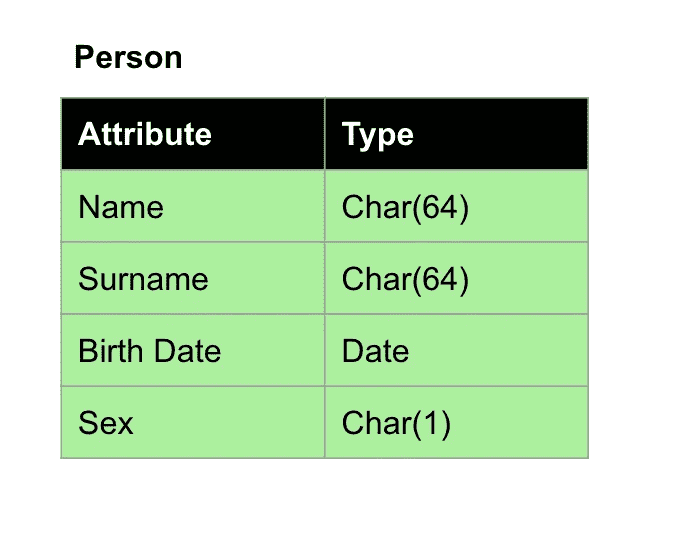
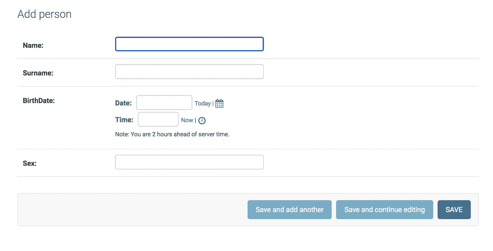

# 在 Django 中构建数据输入的快速 Web 界面

> 原文：<https://towardsdatascience.com/building-a-fast-web-interface-in-django-for-data-entry-62f24947ef23?source=collection_archive---------11----------------------->

## 数据输入

## 关于如何安装 Django 并利用它快速构建数据输入的 Web 界面的教程


图片来自 [Pixabay](https://pixabay.com/?utm_source=link-attribution&utm_medium=referral&utm_campaign=image&utm_content=6521720) 的 [Innova Labs](https://pixabay.com/users/innovalabs-22783312/?utm_source=link-attribution&utm_medium=referral&utm_campaign=image&utm_content=6521720)

在本文中，我描述了一个在 Django 中为数据输入构建快速 Web 界面的简单策略。本文涵盖以下主题:

*   Django 概述
*   安装 Django
*   创建新项目
*   创建新应用程序
*   创建您的数据库
*   构建数据输入 Web 界面

# 1 Django 概述

Django 是一个 Python Web 框架，旨在构建快速 Web 应用程序。Django 的一个实例叫做**项目**。一个项目可能包含一个或多个**应用**。

**Django 遵循模型-模板-视图(MTV)架构。MTV 与模型-视图-控制器(MVC)架构的不同之处在于控制器部分已经由框架本身通过模板实现。**

Django MTV 架构由以下组件组成:

*   **模型**:定义逻辑数据结构。实际上，**模型是一个 Python 类，它代表数据库中的一个表**。所有表示数据库逻辑结构的类都存储在一个名为 **models.py** 的脚本中。
*   **视图**:它定义了业务逻辑，也就是说，它与模型进行通信，并将其转换成模板可读的格式。**视图是一个 Python 函数，它将请求作为输入，并将 Web 响应作为输出返回**。所有代表业务逻辑的功能都存储在一个名为 **views.py** 的脚本中。
*   **模板**:定义一个文件的结构或者布局，比如 HTML 文件。**它是通过 Django 模板语言编码的文本文档或 Python 字符串。**所有的模板都存放在名为 **templates** 的 App 的子目录下。

下图展示了 Django MTV 架构以及模型、模板和视图组件之间的交互方式:



作者图片

# 2 安装 Django

首先，必须通过以下命令安装 Django 库:

```
pip3 install django
```

您可以决定将它直接安装在您的主工作环境中，或者安装到一个特定的`virtualenv`中。[本文](/have-you-ever-thought-about-using-python-virtualenv-fc419d8b0785)解释了如何构建一个 Python `virtualenv`。

在创建新项目之前，必须配置关联的数据库。**因此，你的机器上必须有一个正在运行的关系数据库**(如 MySQL 或 Postgres)。我个人安装了 MySQL 服务器。由于我有一个旧的安装 [XAMPP](https://www.apachefriends.org/it/index.html) ，我已经利用了它提供的 MySQL 服务器。在 [PhPMyAdmin](https://www.phpmyadmin.net/) 中，我创建了一个名为 *mywebsite_db 的数据库，*最初为空。姜戈会填充它。

为了与 SQL 服务器通信，Django 需要一个用于 SQL 的 Python 驱动程序。在 MySQL 的情况下，你应该安装`mysqlclient` Python 库。

根据您的操作系统，您可能会遇到一些安装问题，尤其是当您的操作系统非常旧的时候。就我个人而言，我在安装`mysqlclient`库时遇到了一些问题，通过遵循[链接](https://stackoverflow.com/questions/454854/no-module-named-mysqldb)中提出的建议，我克服了这些问题。

在接下来的部分中，我将概述如何构建和运行 Django 应用程序。更多细节可以参考 [Django 官方文档](https://docs.djangoproject.com/en/3.2/)。

# 3 开始一个新项目

一个 Django 网站实例被称为项目。在一个项目中，您可以运行许多 Web 应用程序。你可以使用 django-admin 工具创建一个新项目:

```
django-admin startproject mywebsite
```

其中 *mywebsite* 是您项目的名称。这个命令将在您运行前一个命令的文件夹中创建一个名为 *mywebsite* 的新目录。



作者图片

文件夹 *mywebsites* 包含两个元素:

*   `manage.py`，这是用于配置的主脚本
*   与您的项目同名的文件夹(inner *mywebsite* )。

左图显示了内部 *mywebsite* 文件夹的内容。

在运行新项目之前，您必须在内部`mywebsite/settings.py`脚本中配置数据库参数，如下所示:

```
DATABASES = {
    'default': {
        'ENGINE': 'django.db.backends.mysql',
        'NAME': '*mywebsite_db*',
        'USER': 'root',
        'PASSWORD' : 'YOUR PASSWORD'
    }
}
```

您可以使用 **manage.py** 和`runserver`命令从这个文件夹中运行*开发 Web 服务器*:

```
cd mywebsite
python3 manage.py runserver
```

# 4 启动新的应用程序

在一个项目中，你可以随心所欲地运行应用程序。为了创建应用程序，您可以进入项目文件夹并运行以下命令:

```
python3 manage.py startapp myapp
```

其中 *myapp* 是应用名称。

**注意，一旦创建了一个项目，对它的所有操作都将通过** `**manage.py**` **脚本来完成，例如 *startapp* 、 *migrate* (您将在本文后面读到，等等)。**

如果你想激活新的应用程序，你必须把它添加到活动应用程序列表中，包含在内部`mywebsite/setting.py`脚本中。

```
INSTALLED_APPS = [
    'django.contrib.admin',
    'django.contrib.auth',
    'django.contrib.contenttypes',
    'django.contrib.sessions',
    'django.contrib.messages',
    'django.contrib.staticfiles',
    **# Add you new application,
    '****myapp.apps.MyappConfig****'**
]
```

现在你必须告诉网络服务器一个新的应用程序已经被添加。你可以通过`migrate`命令来完成。您可以从项目的根目录启动它:

```
python3 manage.py migrate
```

# 5 创建您的数据库

现在环境准备好了。你可以专注于内容，在**数据模型**和**网站展示**方面。

可以在以下文件中修改模型:

```
myapp/models.py
```

数据库中的每个表对应于模型中的一个类。例如，该表可以很容易地转换成下面的模型。



作者图片

```
**from** **django.db** **import** models

**class** **Person**(models.Model):
    Name = models.CharField(max_length=64)
    Surname = models.CharField(max_length=64)
    BirthDate = models.DateTimeField()
    Sex = models.CharField(max_length=1)
```

该模型独立于特定的 SQL 数据库，因此可以由 Django 翻译成任何 SQL 数据库(MySQL、Postgres……)

一旦创建了模型，您必须告诉 Django 您已经对您的模型做了一些更改。这可以通过`makemigrations`命令完成，然后是`migrate`命令，该命令应用所有尚未应用的迁移:

```
python3 manage.py makemigrations myapp
python3 manage.py migrate
```

# 6 构建数据输入 Web 界面

为了创建 Web 界面，您可以利用基于管理界面的 Django 功能。您可以通过以下命令激活管理界面:

```
python3 manage.py **createsuperuser**
```

现在，您必须授予管理员对所有模型类的访问权限。这可以通过编辑`myapp/admin.py`脚本来完成。您应该为希望授予管理员访问权限的每个表添加一个注册选项:

```
**from** **django.contrib** **import** admin

**from** **.models** **import** Person

admin.site.register(Person)
```

管理界面将在以下地址可用:[http://127 . 0 . 0 . 1:8000/admin/](http://127.0.0.1:8000/admin/)。它看起来将如下所示:



作者图片

那都是乡亲们！

# 摘要

在本文中，我描述了如何在 Django 中为数据输入构建一个快速的 Web 界面。在环境的初始设置之后，部署 Web 界面非常简单，因为它可以利用 Django 提供的管理界面。

> 而你，你利用哪个框架来构建快速的 Web 界面？给我留言吧！我很乐意听听你的意见！

如果你已经走了这么远来阅读，对我来说今天已经很多了。谢谢！你可以在[这篇文章](https://alod83.medium.com/which-topics-would-you-like-to-read-c68314dc6813)中读到更多关于我的信息。

如果你想更多地了解 Django 是如何工作的，你可以阅读[这篇有趣的文章](/working-structure-of-django-mtv-architecture-a741c8c64082)，作者[里努·古尔](https://medium.com/u/d8b99ba6ec83?source=post_page-----62f24947ef23--------------------------------)，他解释了 Django 的 MTV 架构。

# 相关文章

[](https://pub.towardsai.net/building-a-fast-interactive-dashboard-in-jupyter-through-gradio-95a1981772aa) [## 通过 Gradio 在 Jupyter 中构建快速交互式仪表板

### 关于 Gradio 的现成教程，这是一个非常强大的 Python 包，用于机器学习演示。

pub.towardsai.net](https://pub.towardsai.net/building-a-fast-interactive-dashboard-in-jupyter-through-gradio-95a1981772aa) [](/how-to-run-animations-in-altair-and-streamlit-2a0624789ad) [## 如何在 Altair 和 Streamlit 中运行动画

### 一个现成的教程，描述了如何使用 Altair 和 Streamlit 构建动画折线图。

towardsdatascience.com](/how-to-run-animations-in-altair-and-streamlit-2a0624789ad) [](/data-visualisation-principles-part-2-layout-and-emphasis-d682bbc38217) [## 数据可视化原理第 2 部分:布局和重点

### 基本图形设计原则入门。

towardsdatascience.com](/data-visualisation-principles-part-2-layout-and-emphasis-d682bbc38217) 

离开前再多说一句:**你可以从[我的 Github 库](https://github.com/alod83/data-science/tree/master/DataVisualization/Django/mywebsite):)下载本教程的完整代码**

# 新到中？您可以每月订阅几美元，并解锁无限的文章— [单击此处](https://alod83.medium.com/membership)。