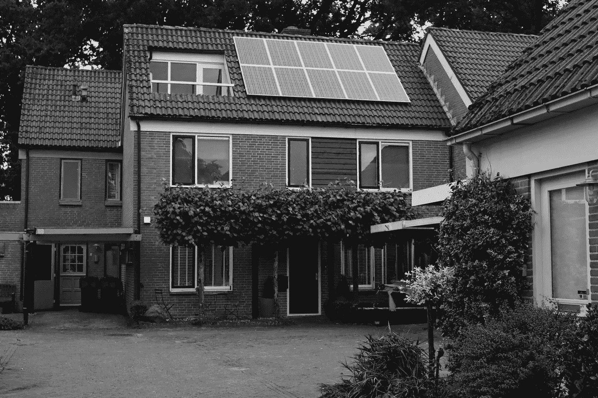
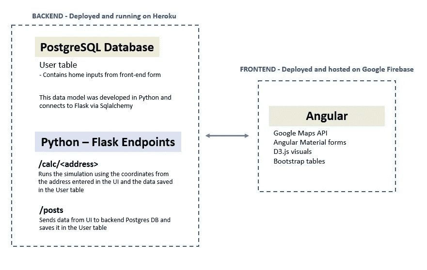
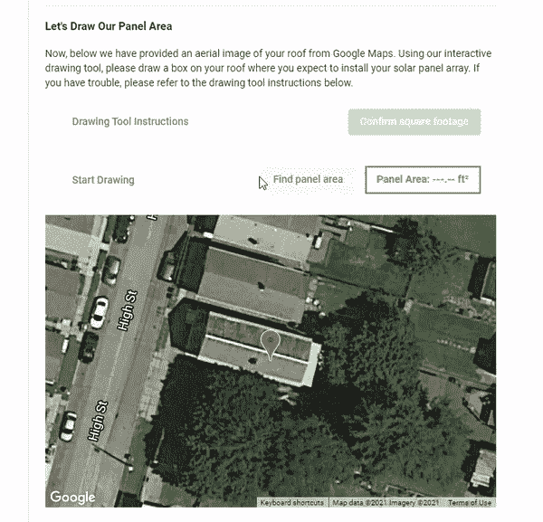
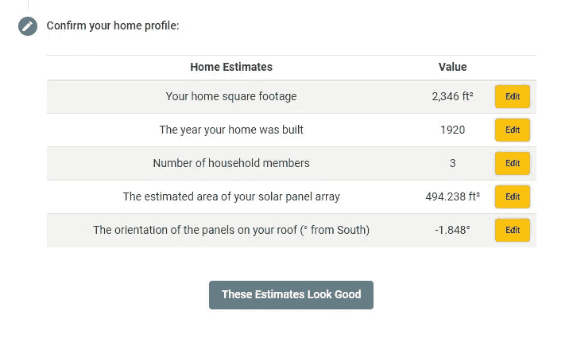
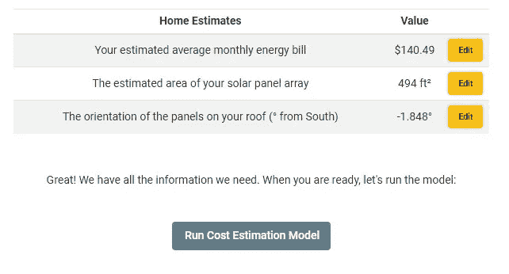
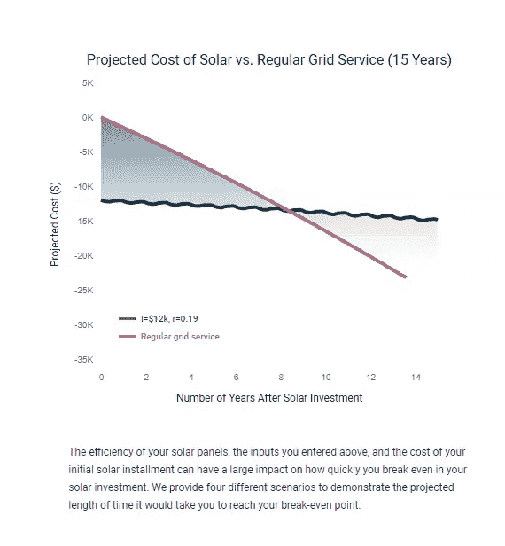
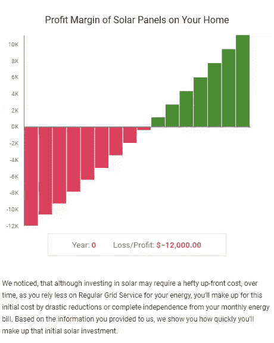
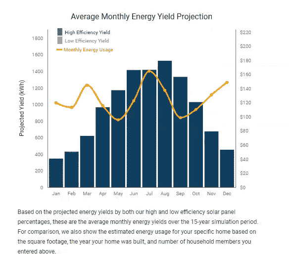
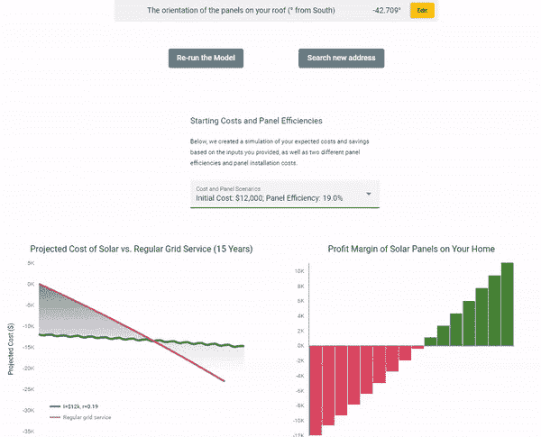

# 构建一个完全部署的太阳能计算器应用程序来模拟为您的家庭节省成本

> 原文：<https://towardsdatascience.com/building-a-fully-deployed-solar-calculator-app-to-simulate-cost-savings-for-your-home-over-the-3d5f464824c0?source=collection_archive---------6----------------------->

## [实践教程](https://towardsdatascience.com/tagged/hands-on-tutorials)

## 构建生产级太阳能计算器应用程序的过程，包括 Python 模拟、D3.js 可视化、用 Javascript 编写的交互式绘图工具、PostgreSQL 后端等等。

照片由[玛格利特·波林德](https://unsplash.com/@margot97?utm_source=unsplash&utm_medium=referral&utm_content=creditCopyText)在 [Unsplash](https://unsplash.com/s/photos/solar-panels-home?utm_source=unsplash&utm_medium=referral&utm_content=creditCopyText) 上拍摄

几个月前，我完成了纽约城市大学专业研究学院的数据科学硕士学位。我写了一篇关于我决定攻读数据科学研究生学位的深入文章，并权衡了在该领域采用更传统的学习和发展方法的利弊。如果你对这个话题感兴趣，或者你自己正在努力做这个决定，请在这里[随意阅读。](/what-a-masters-in-data-science-can-and-cannot-do-for-you-82f9327e523d)

在这篇文章中，我将讨论我作为研究生的最后几个月，通过一个太阳能计算器顶点项目进行讨论，这个项目是我和一个城市大学 SPS 的学生一起开发的。鉴于项目的复杂性(以及我们缩短的三个月时间表)，我们决定将开发的主要部分分成两个子项目:

1.  开发和编写一个 Python 模拟，根据用户输入到我们的应用程序中的特定输入来估计用户家庭的太阳能发电量，并将其扩展以衡量 15 年内的成本节约。
2.  开发和部署完整的基于 web 的应用程序以及我们的 Python 模拟、Flask 框架、前端 JavaScript 绘图工具和 PostgreSQL 后端背后的工程。

因为我承担了第二个子项目的大部分工作，所以我将在本文中更详细地介绍这个过程。但是，如果您对模拟计算、我们用于创建这些预测的数据以及关于我们整体研究/发现的更多信息感兴趣，请随时在 Youtube 上观看我们的最终演示视频:

我们最终的顶点演示视频，提供了我们工作的背景，并概述了我们项目的所有组成部分|作者视频

## **初始研究和动机**

在美国，在过去的 25 年里，在住宅屋顶安装太阳能电池板的势头越来越猛。利用太阳能为家庭供电不仅有助于减轻气候变化的影响，而且随着时间的推移，还可以为住宅消费者节省大量资金。不幸的是，根据 2019 年的[皮尤调查，只有 6%的美国房主表示他们已经在家里安装了太阳能电池板。](https://www.pewresearch.org/fact-tank/2019/12/17/more-u-s-homeowners-say-they-are-considering-home-solar-panels/#:~:text=The%20same%20Pew%20Research%20Center,installed%20solar%20panels%20at%20home.)

由于这个紧缩的统计数据，我们真的很有兴趣了解更多关于当前太阳能市场的情况，以及在美国发展的一些障碍。我们发现，尽管消费者犹豫的原因很多，但其中一个主要原因是面板安装的前期成本。根据你需要为你的家提供足够电力的太阳能电池阵列的大小，安装费可能在 10，000 美元到 25，000 美元之间(税收优惠前)。对许多人来说，这个成本有点令人望而生畏。然而，重要的是要明白，一旦你投资了太阳能，你就从当地的电网服务提供商那里获得了大量的能源独立，同时也大大降低了你每月的能源费用。随着时间的推移，您每月节省的电费可能会抵消安装的初始成本。因此，我们认为，如果我们能够构建一个应用程序，将这一点有效地传达给公众，我们也许能够说服那些“犹豫不决”的人进行初始投资。

## **发展我们的目标**

最终，我们的应用程序的目标变成了一个工具，旨在更好地告知纽约奥尔巴尼的居民将他们的住宅转换为太阳能的财务收益，并明确他们何时可能期望达到“收支平衡”点，即他们在家中安装电池板的初始投资成本将被他们通过停止常规电网服务节省的能源抵消。

为了做到这一点，我们需要开发一个 15 年的能源成本模拟，其中考虑了用户房屋的许多组成部分(即房屋的总面积、屋顶表面积、房屋建造年份、家庭成员人数等)。)，以及他们的屋顶通常接受的阳光照射量(具体取决于房屋的纬度/经度和屋顶方向)。然后，我们将获取这些数据，通过我们的模拟运行这些数据，计算一个面板系统可以产生的能量，并将其与同一时期的电网服务成本进行比较。

尽管我们希望将来将该项目扩展到其他地区，但考虑到缩短的时间表和能源使用/成本数据的限制，我们不得不将地理范围缩小到奥尔巴尼大都市区。

## **解决围绕应用功能的问题**

你可能在想…好吧，这听起来是一个很酷的项目，但是你实际上如何构建这个应用程序呢？为了完成这一过程，我们必须解决一些关于应用程序功能的重要问题:

*   **对于我们应用程序的用户来说，我们需要为他们特定的家庭获取大量的输入。我们如何设计一个用户界面，允许用户输入他们特定家庭的所有必要信息？**

*回答:*在 Javascript/Typescript 中构建一个包含有角度的材质表单的用户界面，获取用户输入。然后，我们可以将这些信息从应用程序的前端发送到后端 PostgreSQL 数据库。这些数据的交换可以通过 Python 和 Flask 作为 API 端点来处理。

*   **对于不知道房屋面积的用户，或者想要调查屋顶面板的不同面积计算，我们如何让他们进一步调查并确保他们给出准确的估计？**

*回答*:我们可以利用 Google Maps API 在页面加载中显示特定地址的用户住宅的航拍面积，然后覆盖一个平方英尺绘图工具/计算器(内置于 JavaScript 中)，以允许用户绘制/确定其住宅的正确平方英尺估算值(参见下面的最终产品截图示例)。

*   **我们如何在部署环境中运行我们的太阳能计算器评估和脚本？**

*答:*我们可以利用 Heroku dynos 和云计算在部署的环境中运行这些脚本，最终可以连接到我们的前端和后端环境。通过 Flask 端点触发这些脚本，dynos 就可以执行这些脚本并运行我们的函数。

*   **我们如何帮助用户可视化他们的成本节约？**

*回答*:由于我们的 UI 将在 Javascript/Typescript 中构建，我们可以使用 D3.js 库创建视觉效果。我们可以展示从我们 15 年的模拟中得出的估计值，并与奥尔巴尼地区坚持常规电网服务的成本进行比较，以显示潜在客户的房屋何时能够从最初的太阳能电池板安装投资中“收支平衡”。

## **应用程序是如何设计的**

在确定了这些大问题的解决方案并制定了最终的项目目标后，我们决定开始构建。经过大约两个月的紧张开发，我们提出了一个可行的解决方案。这里有一个图表和它是如何工作的简要概述:

开发框架和基础设施|作者图片

*使用的编程语言、云资源和库* —该应用程序拥有完全托管的前端和后端基础架构。应用程序的后端部分是用 Python 构建的，并利用 Flask 库来服务一系列连接到我们前端系统的 HTTP 端点。运行在 Flask API 上的 Python 脚本执行关键功能，将用户输入数据从前端连接到 PostgreSQL 数据库，并在用户导航应用程序时管理 POST 和 GET 请求。这个后端系统完全由 Heroku 托管和管理。前端基础设施是用 Typescript 和 JavaScript 编写的，并利用 Angular JavaScript 框架来设计组件的样式，管理表单中的用户输入，创建与 Google Maps API 的交互，并为我们的 D3.js 可视化和仪表板提供画布。

## 应用程序如何工作

在页面加载时，用户看到的初始页面是一个请求家庭地址的表单。该表单链接到 Google Maps API，并在用户开始输入时提供自动填充选项，这些选项在地理上是有界限的，并限制在我们定义的纽约奥尔巴尼中心周围 0.1 度的纬度和经度(纬度 42.6526 度，-经度 73.7562 度)。这是为了确保我们的应用程序能够提供准确的估计，因为我们正在利用奥尔巴尼地区的特定数据，包括我们的太阳辐射数据/计算以及能源使用信息。

当输入奥尔巴尼特定的地址时，应用程序将打开一个表单，允许用户输入用于我们模拟的其他重要因素，包括估计的房屋面积、房屋建造年份、居住在房屋中的家庭成员数量、屋顶方向，以及估计适合他们屋顶的太阳能电池阵列的大小。为了帮助这些输入(特别是屋顶方向和太阳能电池阵列大小)，我们创建了一个交互式绘图工具，允许用户直接在他们屋顶的航拍图像上计算他们预期的太阳能电池板阵列的面积。因为居住在用户家中的家庭成员数量是可变的，所以我们也提供了一个输入字段来获取该信息。一旦在表单中识别并确认了所有输入，就会显示一个最终的交互式地图和绘图工具，要求用户识别他们的屋顶相对于南纬的方位，最终从用户那里收集方位角。

JavaScript 内置的自定义绘图工具，覆盖谷歌地图以测量用户屋顶的平方英尺|作者图片

在这些输入完成之后，然后向用户提供所有计算/输入信息的汇总表。此表为用户提供了最后一次机会来查看我们的模型计算中将使用的数字，并纠正任何看似错误的内容。

确认用户输入和收集数据的最终汇总表-一旦用户确认，这些字段将用于创建成本估算|按作者分类的图像

当用户确认这些值时，前三个数字用于计算与美国东北部地区的平均数字相比的家庭能源使用的预计比率。然后，该比率用于向用户提供估计的平均每月能源账单，用户可以调整该比率以定制模拟中使用的比率，并确保该比率更接近他们的能源使用。

估计的平均月账单是通过用户和/或作者的 Realtor.com |图片提供的上述住房信息计算出来的

当用户准备好了，并且平均每月能源账单估计似乎正确时，应用程序运行模拟并提供概述和总结结果的可视化。此外，该应用程序提供了四种不同的场景，根据我们的研究，将效率和初始投资的两个极端值配对。每一个可视化都提供了一种额外的方式来观察所讨论的太阳能电池板系统的预计性能。

## D3.js 可视化和摘要

我们使用 D3.js 库创建，内置翻转功能、工具提示和其他数据可视化最佳实践，使用户可以访问这些指标。

可视化 1 内置于 D3.js |作者图片

*可视化#1:* 显示了如果您放弃一个太阳能电池板系统，您预计要支付的长期(15 年)费用，以及您对所选太阳能系统的现金支出的估计。两条线的交点是你开始省钱的时间点，与没有面板系统的情况相比。鼠标悬停事件和工具提示会显示相对于最初 15 年太阳能投资的预计成本。

D3.js 中内置的可视化 2 |作者图片

*可视化#2:* 显示了预计的太阳能财务前景和估算的无太阳能电力成本之间的差异。从亏损到盈利的转变发生在第一张图中两条线相交的那一年，而每个条形表示给定年份之后的财务增量。相对于如果你的整个能源系统依赖常规电网服务你将支付的费用，条形图从负值变为正值的那一年，是你预期达到盈亏平衡点的时候。鼠标悬停事件也可用于查看自太阳能安装以来每年的相关增量计算。

D3.js 中内置的可视化 3 |作者图片

*可视化#3:* 在这张特殊的图表中，我们提供了高效率和低效率系统的预计每月产量的快照。覆盖在其上的是一条线，显示估计的每月能源使用量，左轴显示千瓦时，右轴显示每月成本(基于纽约州奥尔巴尼市 11.74/千瓦时的价格)。如果需要的话，这里可以使用鼠标悬停事件来隐藏特定的效率，以便为用户提供更好的清晰度。

## 提供不同的面板和成本方案

虽然这些可视化本身很有趣，但我们也想为用户提供一些不同的选项。由于成本预测和“盈亏平衡”范围在很大程度上受电池板安装的初始成本以及安装的太阳能电池板的效率的影响，我们希望展示一系列可能发生的情况。通过在场景中循环，用户可以很好地了解模拟中的变化。为这些场景选择的范围(初始安装成本为 12，000 美元或 20，000 美元，电池板效率为 15%或 19%)基于我们的研究和当前太阳能市场的可接受标准。

可视化效果根据为初始面板安装成本和面板效率选择的方案动态更新|图片由作者提供

## 结论

最后，应用程序很好地组合在一起，但是我们还有很多工作要做。我们能够创建一个用户界面和应用程序，让用户调查转换到太阳能的好处，并展示随着时间的推移进行转换的财务收益。然而，最重要的是，该应用程序针对个人的家庭，为每个用户提供了更现实的时间表。我们很高兴地看到，当我们将我们的许多模拟计算与其他领先工具(如谷歌的项目天窗)进行比较时，我们的“盈亏平衡”估计正好在他们自己的预测范围内。

最终，我们希望将这个项目扩展到更大的地理区域。虽然该应用程序目前只适用于纽约州奥尔巴尼地区，但我们认为它有潜力扩展到更广泛的受众。如果任何人有兴趣在这个持续的项目上合作，请不要犹豫联系我们！

如果您想亲自试用该应用程序，您可以访问此处:

 [## 太阳能计算器

### 编辑描述

capstone-frontend-cuny.web.app](https://capstone-frontend-cuny.web.app/) 

(警告:由于成本限制，自最初发布以来，我们不得不缩减云基础架构的规模。因此，您可能会经历更长的加载时间)。

如果你喜欢这篇文章，请随意查看我的其他帖子。此外，我创建了一个数据科学作品集，您可以在这里查看。我的投资组合也有我的联系方式，如果你想接触这个项目或任何其他人！

 [## 扎克·亚历山大-数据科学投资组合

### Zach Alexander 是一名数据科学家，目前在纽约市生活和工作。查看扎克的数据…

www.zach-alexander.com](https://www.zach-alexander.com)