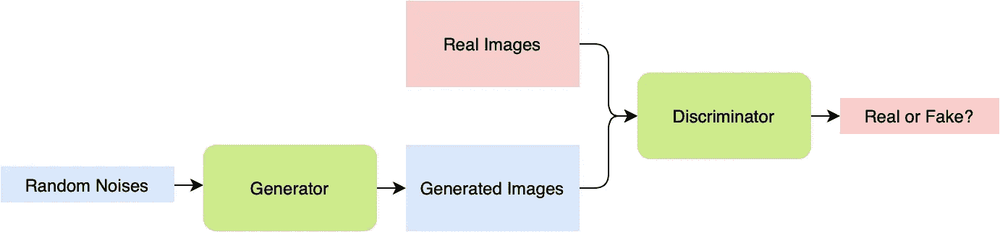
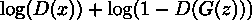
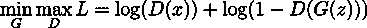
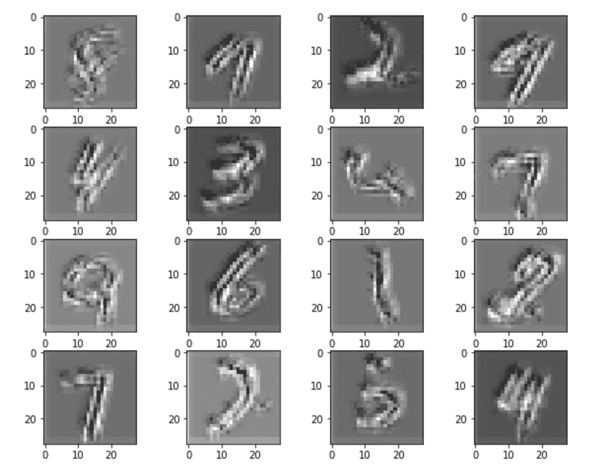
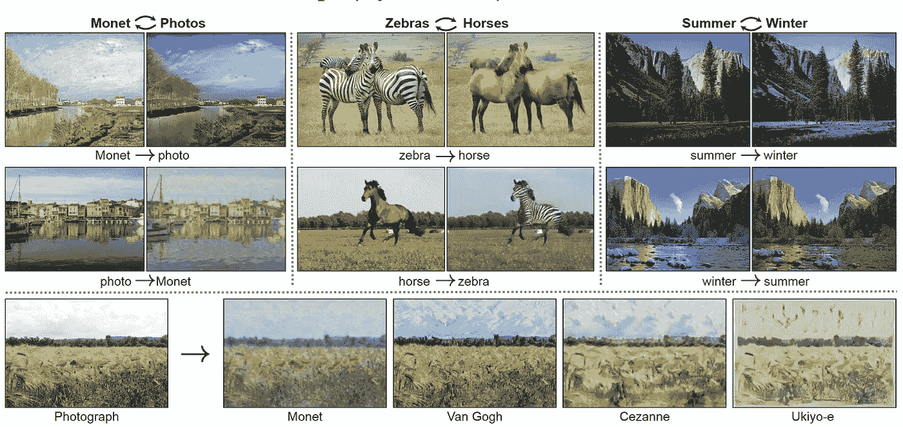
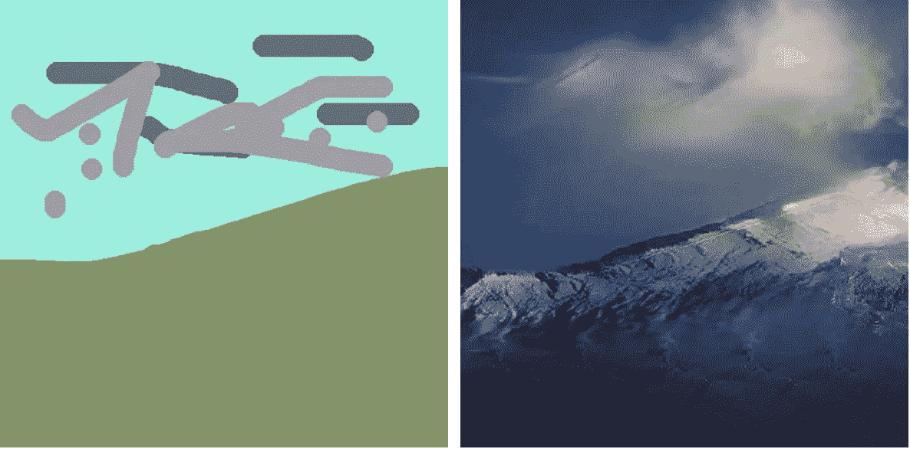

# 用 PyTorch 构建 GAN

> 原文：<https://towardsdatascience.com/building-a-gan-with-pytorch-237b4b07ca9a?source=collection_archive---------5----------------------->

## 凭空产生逼真的图像？

Goodfellow 等人在 2014 年提出的生成对抗网络(GANs)彻底改变了计算机视觉中图像生成的一个领域——没有人能相信这些令人惊叹和生动的图像实际上是纯粹由机器生成的。事实上，人们过去认为生成的任务是不可能的，并对甘的力量感到惊讶，因为传统上，根本没有我们可以比较我们生成的图像的地面真相。

本文介绍了创建 GAN 背后的简单直觉，然后通过 PyTorch 实现了一个卷积 GAN 及其训练过程。

# 甘背后的直觉

与传统分类不同，在传统分类中，我们的网络预测可以直接与真实的正确答案进行比较，生成图像的“正确性”很难定义和测量。Goodfellow 等人在他们的原始论文*生成对抗网络*，中提出了一个有趣的想法:使用一个训练非常好的分类器来区分生成的图像和实际图像。如果存在这样的分类器，我们可以创建并训练一个生成器网络，直到它能够输出可以完全欺骗分类器的图像。

图一。甘的管道。作者创建的图像。

GAN 是这一过程的产物:它包含一个基于给定数据集生成图像的生成器，以及一个用于区分图像是真实图像还是生成图像的鉴别器(分类器)。GAN 的详细流水线如图 1 所示。

## 损失函数

优化发生器和鉴别器都很困难，因为正如你可能想象的那样，这两个网络有着完全相反的目标:发生器希望创造尽可能真实的东西，但鉴别器希望区分产生的材料。

为了说明这一点，我们让 *D(x)* 是来自鉴别器的输出，这是 *x* 是真实图像的概率， *G(z)* 是我们的生成器的输出。鉴别器类似于二元分类器，因此鉴别器的目标是最大化功能:

本质上是没有负号的二元交叉熵损失。另一方面，生成器的目标是最小化鉴别器做出正确决定的机会，因此它的目标是最小化函数。因此，最终的损失函数将是两个分类器之间的极小最大博弈，可以如下所示:

这将在理论上收敛到以 0.5 的概率预测一切的鉴别器。

然而，在实践中，极大极小游戏通常会导致网络不收敛，因此仔细调整训练过程是很重要的。学习率等超参数在训练 GAN 时更为重要——微小的变化都可能导致 GAN 产生单一输出，而不管输入噪声如何。

# 计算环境

## 图书馆

整个程序是通过 PyTorch 库(包括 torchvision)构建的。GAN 生成结果的可视化使用 Matplotlib 库绘制。以下代码导入所有库:

## 资料组

数据集是训练 gan 时的一个重要方面。图像的非结构化本质意味着任何给定的类别(即，狗、猫或手写数字)可以具有可能数据的分布，并且这种分布最终是 GAN 生成的内容的基础。

为了进行演示，本文将使用最简单的 [MNIST 数据集](https://gas.graviti.com/dataset/hellodataset/MNIST?utm_medium=0708Taying_2)，它包含了 60000 个从 0 到 9 的手写数字图像。像 MNIST 这样的非结构化数据集实际上可以在 [Graviti](https://graviti.com/?utm_medium=0708Taying_2) 上找到。这是一家年轻的初创公司，希望用非结构化数据集帮助社区，他们在自己的[平台](https://gas.graviti.com/open-datasets/?utm_medium=0708Taying_2)上有一些最好的公共非结构化数据集，包括 MNIST。

## 硬件要求

最好在 GPU 上训练神经网络，因为它们可以显著提高训练速度。但是，如果只有 CPU 可用，您仍然可以测试程序。要让您的程序自己决定硬件，只需使用以下代码:

# 履行

## 网络体系结构

由于数字的简单性，两种架构——鉴别器和发生器——由完全连接的层构成。请注意，有时全连接 GAN 比 DCGAN 更容易收敛。

以下是两种架构的 PyTorch 实现:

## 培养

在训练 GAN 时，我们优化了鉴别器的结果，同时改进了我们的生成器。因此，在每次迭代过程中会有两个相互矛盾的损失来同时优化它们。我们输入到生成器中的是随机噪声，生成器应该根据给定噪声的细微差异来创建图像:

# 结果

经过 100 个时期后，我们可以绘制数据集，并查看从随机噪声中生成的数字的结果:

图二。GAN 生成的结果。作者创建的图像。

如上所示，生成的结果看起来确实很像真实的结果。考虑到网络相当简单，结果确实看起来很有希望！

# 不仅仅是内容创作

甘的创作与之前在计算机视觉领域的工作大相径庭。随后出现的大量应用让学术界惊讶于深度网络的能力。一些惊人的工作描述如下。

## CycleGAN

Zhu 等人的 CycleGAN 引入了一个概念，该概念将图像从域 *X* 转换到域 *Y* 而不需要成对样本。马变成了斑马，夏天的阳光变成了暴风雪，CycleGAN 的结果令人惊讶而准确。

图 3。朱等人展示的 CycleGAN 结果图片来自其 [Github 页面。](https://junyanz.github.io/CycleGAN/)

## 高根

Nvidia 利用 GAN 的力量，根据画笔的语义，将简单的绘画转换为优雅而逼真的照片。尽管训练资源在计算上很昂贵，但它创造了一个全新的研究和应用领域。

图 3。高干的生成结果。左为原图，右为生成结果。作者创建的图像。

## AdvGAN

GANs 还被扩展到清理对立的图像，并将它们转换成不会欺骗分类的干净的例子。更多关于对抗性攻击和防御的信息可以在[这里](/adversarial-attack-and-defense-on-neural-networks-in-pytorch-82b5bcd9171)找到。

# 结论

所以你有它！希望这篇文章提供了如何自己构建 GAN 的概述。完整的实现可以在下面的 Github 资源库中找到:

 [## ttchengab/MnistGAN

### 使用 PyTorch 实现 GAN 并在 MNIST 数据集上进行测试。没有执行保存/加载的保存检查点…

github.com](https://github.com/ttchengab/MnistGAN) 

*感谢您坚持到现在*🙏！*我会在计算机视觉/深度学习的不同领域发布更多内容。一定要看看我关于计算机视觉方法的其他文章！*