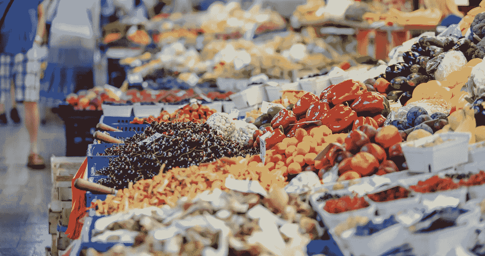
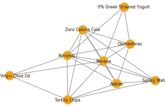
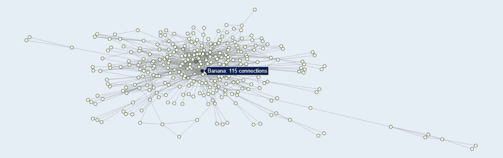
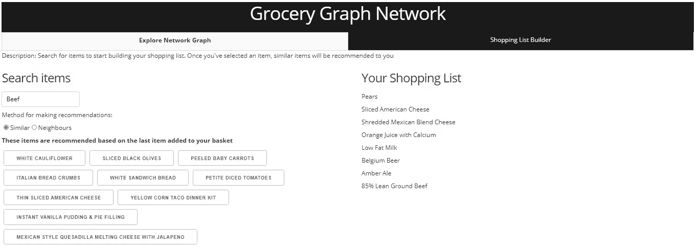

# 在 AWS 上的 Dash 中构建基于图的杂货推荐系统

> 原文：<https://towardsdatascience.com/building-a-graph-based-grocery-recommender-in-dash-on-aws-3d96d262e365?source=collection_archive---------31----------------------->

照片由 [PhotoMIX 公司](https://www.pexels.com/@wdnet?utm_content=attributionCopyText&utm_medium=referral&utm_source=pexels)从 [Pexels](https://www.pexels.com/photo/vegetables-stall-868110/?utm_content=attributionCopyText&utm_medium=referral&utm_source=pexels) 拍摄

为了准备最近在一家大型零售商的工作面试，我想接触一些零售数据，同时专注于回答一个现实生活中的商业问题——我们如何才能建立更有利可图的杂货篮。在最近熟悉了 Python 中的 NetworkX 包之后，我看到了一个极好的机会来构建一些视觉上吸引人的和交互式的东西来帮助回答这个问题。这篇文章概述了:

1)阐述商业案例

2)在 NetworkX 中构建图形

3)提出基于图表的建议

4)在 Dash 中创建一个应用程序，并将其部署到 AWS

所有的代码都在我的 [GitHub](https://github.com/NeilSinclair/GroceryNetwork) 上。

# 阐述商业案例

我们怎样才能让购物者在我们店多消费，在其他店少消费？我从这个问题开始，并认为通过可视化数据集中篮子中产品之间的关系，人们可能很容易找到一些产品，这些产品本质上是将其他产品“粘合”在一起的。然后我们可以推测，这些将篮子粘在一起的产品——这些**锚定产品**——让顾客进入商店，如果我们降低这些商品的价格，我们可以让顾客来我们的商店而不是其他商店。但是为了可持续发展，我们需要在其他地方弥补不足。因此，看一下篮子，我们可以提高不太重要的商品的价格/利润，这些商品不会让顾客进门，但仍然会落在篮子里。最近我发现了 python 中的 NetworkX 包，我认为将食品杂货显示为网络中的节点是一种很好的方式，可以直观地表示篮子中物品之间的关系。

我开始寻找一个数据集，并在 Kaggle 上找到了[这个优秀的数据集(随后，我还在 Dunnhumby 上找到了](https://www.kaggle.com/c/instacart-market-basket-analysis/data)[一个优秀的数据集](https://www.dunnhumby.com/source-files/)——名为“完整的旅程”——我仍希望能深入其中)。

我认为，观察购买小篮子(底部四分位数，少于 5 件商品)的客户和购买中等尺寸篮子(第二个四分位数，5 至 9 件商品)的客户的图形结构之间的差异也会很有趣。

# **在网络中构建图形 X**

如果我没有首先提到将这些数据显示为图表并不一定是找到主打产品的最佳方式，那将是我的失职。还有其他方法，例如在购物篮分析中使用的 [apriori 算法](https://medium.com/@sawravador/overview-about-apriori-algorithm-a5f20f0a4d39)，但是，我真的很想尝试最初从图形可视化中构建洞察力，以及在以后使用图形的结构来构建建议，所以使用了这种方法。另一件要注意的事情是，虽然从逻辑上看，人们也可以只查看哪 20 种产品被购买最多，并将其视为锚定产品，但也有可能有一些产品位于前 1000 名，但不是前 20 名，它们仍然是将许多其他产品粘合在一起的产品。如果你是南非人，篮子里的主打商品可能是你的 braai(烧烤)的 boerewors(一种香肠)，但是这种商品不太可能是你的商店最畅销的商品之一，但了解这种杂货商品如何与其他商品结合在一起仍然是有价值的。

NetworkX 的使用非常简单。只要对数据做一点预处理，篮子项目就被视为在同一个篮子中的节点之间创建了边的节点。然后，根据两个项目一起出现在一个篮子中的次数对边进行加权。为了给出一个具体的例子，下图显示了项目的子图，这些子图表示在数据集中带有杏仁的篮子中找到的所有项目，以及这些项目之间的联系。

杏仁出现的杂货子图；作者图片

下面的代码显示了如何构建*节点—边—节点*对，然后将它们传递给 NetworkX 以创建网络:

瞧，我们有了一个图表网络。最棒的是，我们现在可以看到网络中节点之间的连接。我在这里省略了代码，因为它有点长，但是看一看 GitHub 页面上的 Jupyter 笔记本，就知道如何将这些代码组合在一起了。这里有如此多的数据，以至于我认为这是一个使用 Plotly 构建交互式绘图的理想机会。

小篮子的杂货图表的图像；作者图片

探究这张图表，我们可以看到一些东西。首先，这里有几个非常重要的项目(颜色较深的项目)似乎与大多数其他项目有联系。这些是香蕉和 T2 草莓。现在，回到最初的业务问题，“我们可以用这些信息做什么？”，这表明我们可以考虑降低这些商品的价格，以吸引更多的顾客。现在，如果我们看一下图表“云”之外的商品，例如 l *大鸡蛋*，这些是我们可以提高价格(并增加利润)的商品，因为这些商品不太可能是顾客专门来我们商店购买的，但仍然落在许多篮子里。

这里值得注意的是，我期望在网络图中看到不同的聚类模式。我想象会有多个集群，或者网络中的高密度区域，其中某些种类的产品相互连接；然而，事实并非如此。虽然这在一定程度上削弱了以图形网络格式直观探索食品杂货的价值，但构建图形仍然允许人们使用它来创建推荐系统。

# **构建基于图的推荐系统**

对于那些不熟悉推荐系统的人，请查看维基百科页面[。虽然诸如协同过滤之类的方法对影响我们许多选择的大量推荐负责，例如网飞推荐，但是基于图的推荐系统也已经在许多应用中使用。在本文中，基于图的推荐器仅仅关注于推荐相似的产品，而没有考虑客户以前购买过什么。对于一篇关于二分图推荐系统(即用户和产品)的优秀文章，请查看本文](https://en.wikipedia.org/wiki/Recommender_system)。

我采用了两种方法来构建推荐系统。第一种方法是最明显的，由此推荐系统推荐一个项目的前 K 个邻居，按照当前项目的邻居的边权重排序。第二种方法更有趣，也以稍微不同的方式看待推荐。

第二种方法为图中的每个节点生成一个图嵌入，其中每个节点的嵌入类似于创建词向量时创建的嵌入(如果您不熟悉词向量，请查看[这篇精彩的文章](http://jalammar.github.io/illustrated-word2vec/))。事实上，用于创建这些嵌入的方法之一使用与创建单词嵌入完全相同的过程来创建节点嵌入。本文中介绍的方法称为深度行走。我是在阅读了[这篇关于主题](/deepwalk-its-behavior-and-how-to-implement-it-b5aac0290a15)的精彩综述后构建的，这篇综述比我在这里要详细得多。基本上，节点嵌入是通过在网络中选择一个节点，然后从该节点开始进行 k 步随机行走，并记录在网络中访问的每个其他节点来创建的。这 k+1 个节点的选择然后被存储为一个字符串(k+1，因为我们在字符串中包括第一个节点)。在购物清单示例中，假设您从“杏仁”节点开始，那么您可以通过从该节点进行随机遍历来制作一串如下所示的节点:

杏仁->玉米片->初榨橄榄油->香蕉->苹果->柠檬

您将对网络中的每个节点执行此操作 ***n*** 次，采取 ***k*** 个步骤，并存储所有这些长度为 k+1 的“字符串”,这些“字符串”组成了流程中访问的节点。一旦你有了这些节点串的大小为 ***k x n*** 的集合，你就可以使用一个漂亮的包比如 Gensim 来学习这些节点的 Word2Vec 嵌入，而 viola，你已经为你的图形创建了嵌入。下面是这方面的代码，但请记住，这是大量借用自[这篇伟大的文章](/deepwalk-its-behavior-and-how-to-implement-it-b5aac0290a15)，你应该看看。

现在，从上面的代码中可以看出，查找相似条目的方法很简单，只需使用 Word2Vec 方法。最 _ 相似()。

然而，在比较这里给出的两种推荐方法时，需要考虑一些事情。“最相似”嵌入方法的巧妙之处在于，每个节点的表示捕获节点的上下文信息的方式与 Word2Vec 捕获单词的上下文信息的方式相同。然而，当我们购买鸡汤时，我们可能会对人们用鸡汤购买的其他商品比对上下文相似的商品更感兴趣。当使用这两种方法时，我们最终会得到如下建议:

**与杏仁最相似的东西:**可乐罐、开心果、葡萄干、芒果干、经典烘焙咖啡、各种减肥茶、盐&胡椒开心果、爆米花

**杏仁的近邻:**苏打水，香蕉，什锦沙拉，开心果，覆盆子，柠檬，蓝莓，草莓，无籽黄瓜，格兰诺拉麦片

那么，哪个更好呢？很难说。最近的邻居更一般。香蕉、覆盆子和草莓放在很多篮子里，因此，在这种情况下，一些推荐可能不会比推荐顾客无论如何都会购买的普通产品更有价值。最相似嵌入法表明推荐项目与主项目扮演相似的角色(通过它们的上下文嵌入),因此可能互补性较弱，可能更容易互换。

尽管这很有趣，也很好玩，但这表明，为了真正增加价值，基于与其他客户的相似性向客户推荐商品可能是值得的。我看的数据集没有客户层面的数据，但如果你看看[这篇文章](https://medium.com/dunnhumby-data-science-engineering/network-models-for-recommender-systems-7f0d6d210ccf)(如上所述)，它提供了一个同时使用客户和商品数据进行推荐的绝佳例子。

# **创建互动 Dash 应用**

虽然 Dash 在许多方面与 R-Shiny 非常相似，但这种差异导致了一个相当尖锐的学习曲线。在用 Flask、JS 和 HTML 开发了一两个小东西之后，我发现 Dash 利用 CSS 的一些方式很难理解——例如，用 CSS 类“六列”代替“列-6 ”,并花了一些时间来理解这一点。虽然我不会在这里对 Dash 应用程序进行过多的详细描述——你可以在我的 [GitHub 账户](https://github.com/NeilSinclair/GroceryNetwork)中查看代码——但我会给出一个简单的概述。

Dash 应用的购物清单生成器部分；作者图片

由于 Plotly 和 Dash 合作得非常好，我决定将这个项目转化为一个交互式应用程序，并部署到 AWS。我在 Medium 上找到了[这篇精彩的文章](https://austinlasseter.medium.com/deploying-a-dash-app-with-elastic-beanstalk-console-27a834ebe91d)，它带我完成了在 AWS 上将一个应用程序上传到 Elastic Beanstalk 的基本步骤，并让我的应用程序毫不费力地运行起来。我不会重述那里写的内容，因为它做得很好，没有必要，但是按照那篇文章，几分钟后你就可以开始了。

关于构建应用程序的过程，需要考虑几件事情。Dash 有一个回调系统，允许您的函数改变页面上的 Dash 对象。尝试用大量动态创建的移动部件做一些事情可能是一个相当大的挑战，尽管一旦你掌握了它，你可以做很多事情。学习曲线很陡，但我认为对于未来的仪表板来说这是值得的。为了防止应用程序在每次加载选项卡或下拉列表改变时都必须重新生成图表，我将图表数据保存为 pickle 文件，对于推荐者选项卡，在页面加载时加载它。这可能不是最佳实践，但它完成了工作。我也不太可能为这个小小的网络应用赢得任何 UX/用户界面奖，但这个想法更多的是建立一些东西和探索一些数据，而不是制作一些看起来完美的东西。

# 包裹

这个项目确实帮助我开始尝试首先回答一个商业问题，即“我们如何让顾客在我们的商店购买更多的商品”。通过找到一种可视化探索数据的新方法，我能够推翻我最初关于商品聚集在一起的假设——看起来更像是一个像云一样的杂货网络。然而，这让我开始探索使用图表来为产品提供建议，并最终构建了一个基本的 Dash 应用程序来在线探索数据。总的来说，这是一次极好的学习经历，让我有了许多改进的想法:

*   我们可以构建一个包含客户和订单的图表，根据与其他客户的相似性向客户推荐产品
*   还有其他方法来创建图嵌入，可以进行探索和比较
*   将财务(价格和成本)数据添加到分析中，对于了解哪些产品可以涨价以及对整体篮子价值的影响是有价值的