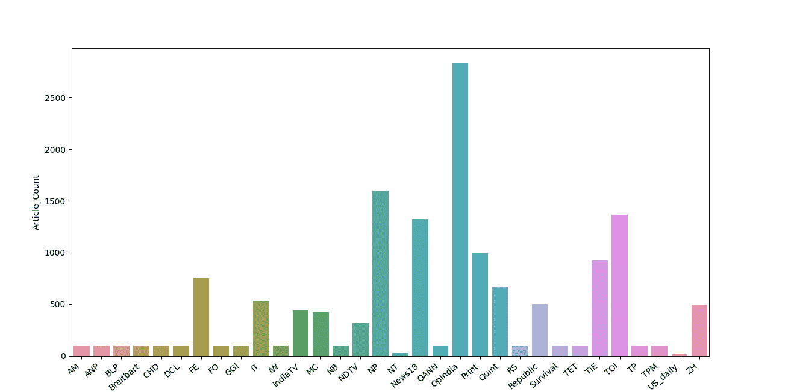
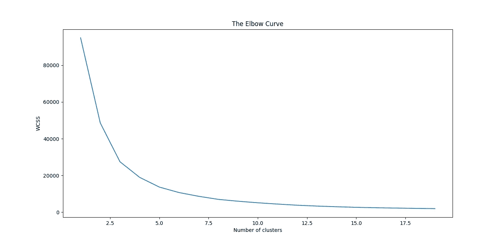
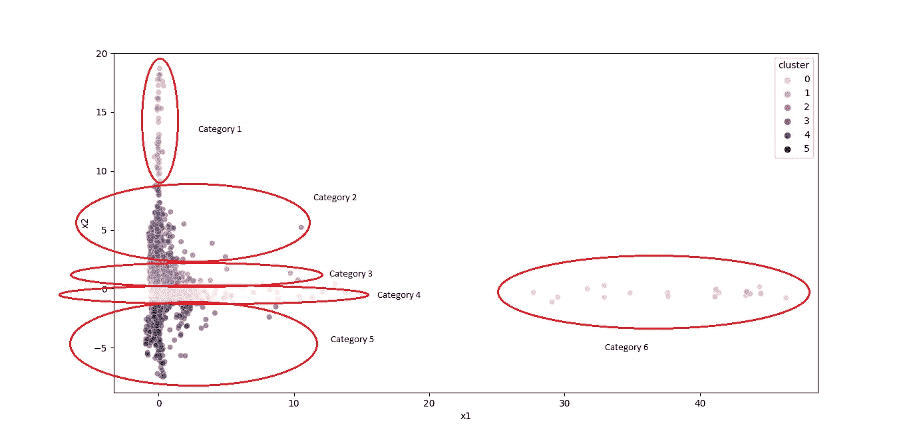
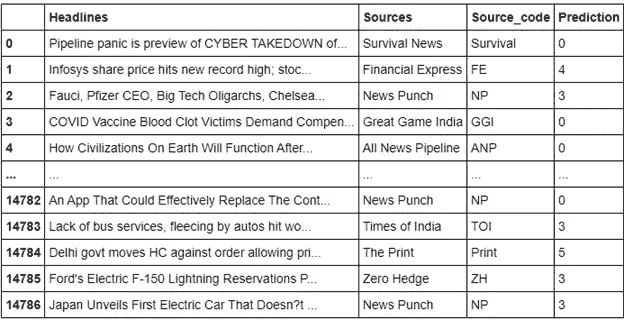
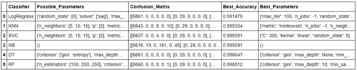
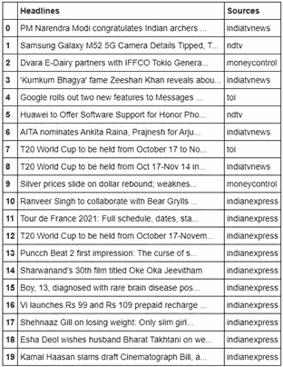
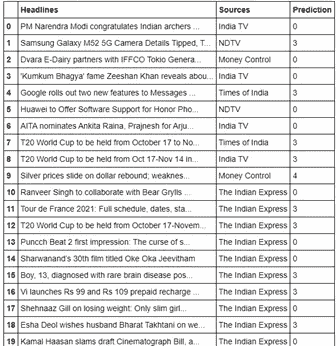
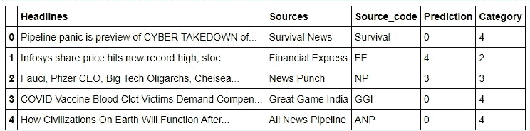
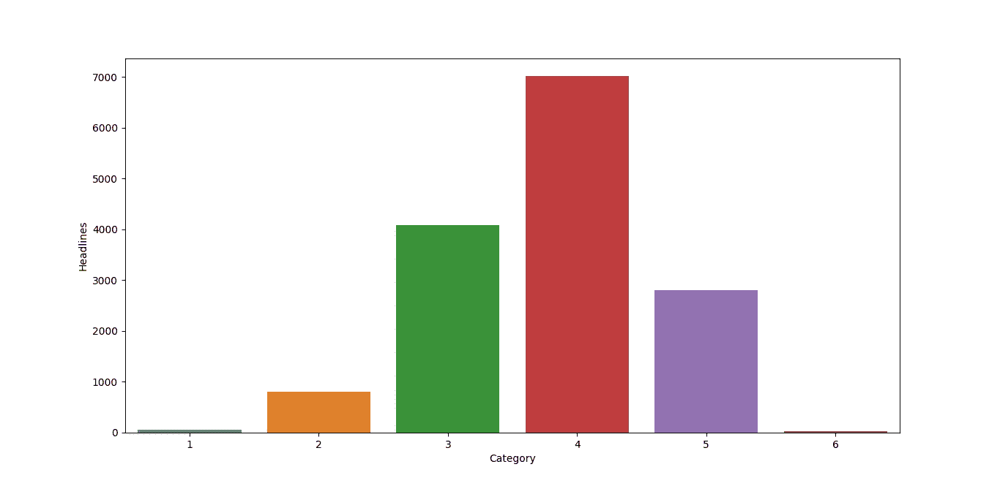

# 用 Python 构建混合假新闻侦探应用

> 原文：<https://towardsdatascience.com/building-a-hybrid-fake-news-detective-app-with-python-28ba87638ade?source=collection_archive---------16----------------------->

## 使用无监督 K 均值和有监督支持向量分类器算法的组合

当今世界，网络上到处都是新闻。我们可以在 CNN、BBC News、India Today、NDTV 和 Times of India 等各种新闻网站以及脸书、Twitter 和 Instagram 等社交媒体网站上轻松找到它们，只需轻点鼠标。新闻的目的是让我们了解身边正在发生的事情。


路易斯·科尔特斯在 [Unsplash](https://unsplash.com?utm_source=medium&utm_medium=referral) 上的照片

不幸的是，我们今天听到的消息的可信度值得怀疑。有人很容易在社交媒体网站上发布随机的东西，而不验证它是否真实。一些人，特别是政党成员，也可能在社交媒体网站上组建团体，歪曲新闻，恶意传播宣传，误导人们，转移对实际问题的注意力。尽管如此，许多主流新闻频道和报纸还是带着选择性的偏见进行报道，传播针对个人和社区的仇恨、阴谋论，其唯一目的是获得更多的电视收视率或简称为 TRP。也就是说，民主的第四大支柱正在瓦解。


照片由 [Nijwam Swargiary](https://unsplash.com/@pixel_talkies?utm_source=medium&utm_medium=referral) 在 [Unsplash](https://unsplash.com?utm_source=medium&utm_medium=referral) 拍摄

新闻来源的可信度在新冠肺炎疫情期间创下新低。这一时期出现了各种错误信息运动，特别是在美国，劝说人们不要遵循 COVID 适当的行为和接种疫苗。因此，在相信这个消息之前，核实事实是必要的。

于是出现了各种事实核查组织，如 Alt News、BOOM 和 Factly，它们核查一篇新闻文章的可靠性。这些组织通过与目击者或有关当局核实，对新闻文章进行人工分类。但是，在许多情况下，他们可以认为反对他们意识形态的新闻文章是假的。所以，这些事实核查网站的可靠性也值得怀疑。因此，我们需要的是一种对新闻标题进行分类的 AI 方式。这在自然语言处理中是可能的。

# **为什么要混合模式？**

现在的问题是，我们应该使用哪种方法。一般情况下，我们使用监督学习算法对新闻进行分类。这种方法有两个问题:

1.  首先，通常可用的数据集都有新闻标题，这些标题被一些事实核查机构手动标记为真实或虚假。我们永远不能确定这个组织是公正的。
2.  第二，监督学习算法需要这些标签进行训练。因此，人们最终偏向了分类器，违背了使用人工智能的初衷。

我们必须明白，在极少数情况下，消息肯定是真的或假的。大多数情况下，我们无法确定。所以，我们应该寻找的是，新闻是真是假的概率。

我们将使用的模型是由**非监督 K 均值聚类算法**和**监督支持向量分类算法**混合而成的。K Means 算法通过捕捉特定单词的用法将新闻标题组织成簇。支持向量算法从这些聚类中学习，并预测未知新闻标题所属的类别。

如果你想了解我的仪表盘是什么样子，请访问 https://fake-news-headlines-detective.herokuapp.com/。

# **数据来源:**

除了我在上一节提到的原因，通常可用的数据集包含来自美国的新闻。因此，我必须自己创建一个数据集，通过收集热门新闻网站的新闻标题进行训练，如《印度时报》、《新闻 18》、《印度快报》和《共和世界》。此外，我还从 Op India、News Punch 和 Great Game India 等纯数字新闻网站收集了这些信息，这些网站被国际事实核查网络(IFCN)视为假新闻网站。

为了训练，我从印度和美国的各种来源收集了 14787 个标题。GitHub 存储库中有这个数据集。同样的链接是[https://github.com/pradeepprajan/Fake-News-Detective](https://github.com/pradeepprajan/Fake-News-Detective)。您还可以找到包含 Python 代码的 Jupyter 笔记本。

# **安装必要的软件包:**

除了常用的软件包之外，我们还需要安装以下特定于 dashboard 应用程序的软件包:

1.  自然语言工具包(NLTK)
2.  海生的
3.  Scikit 学习
4.  Plotly
5.  破折号
6.  仪表板引导组件

# **第 1 部分:用 K-Means 对标题进行聚类**

## 导入必要的库

在开始之前，我们导入必要的库。可以参考我分享过的 GitHub 库中的 Jupyter 笔记本。

## **数据的读取和预处理:**

首先，我们读取收集的训练数据集。因为数据集中的行是按照新闻源排序的，所以我们对它们进行了洗牌。

```
dataset = pd.read_csv('NewsArticles.csv',encoding='unicode escape')
dataset = dataset.drop(columns=['Unnamed: 0'])
dataset_copy = dataset.copy()
dataset_copy = dataset_copy.sample(frac=1).reset_index(drop=**True**)
```

## **一些探索性的数据分析:**

我们找到每个来源发布的新闻文章的数量，并构建一个条形图。

```
news_articles_count = dataset_copy.groupby('Source_code',as_index=**False**).count()
news_articles_count = news_articles_count.rename(columns={'Headlines' : 'Article_Count'})
news_articles_count = news_articles_count.drop(columns='Sources')news_articles_bar_plot = sns.barplot(x=news_articles_count['Source_code'],y=news_articles_count['Article_Count'])
```



作者图片

## 创建单词语料库:

现在，我们创建一个单词语料库。在此过程中，我们执行以下操作:

1.  删除特殊字符，因为它们对我们的模型没什么用。
2.  将大写字母更改为小写字母，因为我们希望我们的模型将大写和小写的同一个单词识别为一个单词。比如新闻，新闻，新闻，要被算法识别为一个词。
3.  将标题符号化，即将标题拆分成单词。
4.  将单词词条化。它将单词转换成有意义的基本形式。

在创建语料库之前，我们安装了 S **topwords** 、 **Punkt、**和 **Wordnet** 字典。

```
lemmatizer = WordNetLemmatizer()
nltk.download('stopwords')
nltk.download('punkt')
nltk.download('wordnet')corpus = []
**for** i **in** range(0,len(dataset_copy)):
message = re.sub('[^a-zA-Z0-9]', ' ', dataset_copy['Headlines'][i])
message = message.lower()
message = word_tokenize(message)
message = [lemmatizer.lemmatize(w) **for** w **in** message **if** **not** w **in** stopwords.words('english')]
message = ' '.join(message)
corpus.append(message)
print(corpus)
```

## **将单词库转换成向量:**

我们通过 **TF-IDF(词频-逆文档频)矢量化**将词语料库中的标题转化为向量。此外，我们将每个向量的维数限制为 1000。

```
tfidf_v = TfidfVectorizer(max_features=1000)
X = tfidf_v.fit_transform(corpus).toarray()
```

## **特征缩放:**

在执行任何非监督分类之前，特征缩放是**必须的**。

```
scaler = StandardScaler()
X = scaler.fit_transform(X)
```

## **应用 PCA:**

因为形成的每个向量的维数是 1000，所以我们应用 PCA。这消除了维数灾难。

```
pca = PCA(n_components=2)
pca_result = pca.fit_transform(X)
```

## **K 均值聚类:**

在执行聚类之前，我们需要使用肘方法找出所需的聚类数。

```
wcss = []
**for** i **in** range(1,20):
 kmeans = cluster.KMeans(n_clusters=i,init='k- means++',max_iter=300,n_init=10,random_state=0)
 kmeans.fit(pca_result)
 wcss.append(kmeans.inertia_)
 print("Cluster", i, "Intertia", kmeans.inertia_)
 plt.plot(range(1,20),wcss)
 plt.title('The Elbow Curve')
 plt.xlabel('Number of clusters')
 plt.ylabel('WCSS')
 plt.show()
```



作者图片

对应于图中“肘部”的聚类数为 6。因此，我们需要 6 个集群。

现在，我们执行聚类。我们还绘制了一个散点图来证明这一点。

```
Kmeans = cluster.KMeans(n_clusters=6,init='k-means++',max_iter=500,verbose=**True**,random_state=0)
clustered = Kmeans.fit_predict(pca_result)
PCA_df = pd.DataFrame(pca_result) 
PCA_df['cluster'] = clustered 
PCA_df.columns = ['x1','x2','cluster'] 
k_means_figure = sns.scatterplot(data=PCA_df,x='x1',y='x2',hue='cluster',legend="full",alpha=0.5)
```



作者图片

不得不承认聚类并不完美。但是我们必须明白，数据科学就是从获得的结果中推导出结论。因为我们可以从这种聚类中得出新闻的可信度，所以我们可以自信地说 K-Means 聚类对于可用的数据集工作得很好。结论在文末。

## **保存模型:**

在 Pickle 的帮助下，我们保存模型以备将来使用。

```
Kmeans = Kmeans.fit(pca_result)
filename = 'news_classifier_KMeans2.sav'
pickle.dump(Kmeans, open(filename, 'wb'))
```

# 第二部分:预测那些看不见的标题群

## **监督培训**

我们首先创建一个 pandas 数据框，其中包含用于训练的标题和由 K-Means 算法分配的聚类(在“预测”列下)。



现在，我们使用监督分类算法，如**逻辑回归**、**K-最近邻、**和**支持向量分类器**，对用于“预测”列聚类的相同新闻标题进行训练，然后选择具有最高准确度的算法。相同的代码可以在我的 GitHub 库中找到。结果总结如下:



从表中我们发现**支持向量分类器**和**朴素贝叶斯**的准确率最高，为 99.93 %。在这里，我们用前者来训练。

```
SVC_classifier = SVC(C=300,kernel='linear',random_state=0)
SVC_classifier.fit(pca_result,y_train)# y_train is the 'Predictions' column of the Data Frame used for supervised training. 
```

## **预测未知标题的聚类:**

这是包含未显示标题的表格。我通过使用 Newsdata.io 提供的 API 键获得了它们，我们称之为测试数据集。



为了获得准确的结果，我们结合测试和训练数据集，并重复预处理步骤。然后，我们将生成的 NumPy 数组拆分回训练和测试数据集的数组。pca_result_test 是测试数据集对应的 NumPy 数组。

现在，我们预测看不见的标题所属的群集:

```
clustered_test = SVC_classifier.predict(pca_result_test)
```

我们再次创建一个熊猫数据框，其中包含看不见的标题和预测的聚类。



然后，我们将训练和测试数据集的分类编号映射到类别编号 1 到 6，以使分类更加直观。



我们最终保存两个数据帧。我们将在创建仪表板应用程序时使用它们。

# **第 3 部分:构建仪表板应用程序并将其部署在 Heroku 上**

最后，我们使用 Python 的 **Dash** 和 **Plotly** 包构建了一个交互式 web dashboard 应用程序，并将其部署在 **Heroku** 上。Heroku 是一个云平台即服务，开发者可以免费部署他们的应用程序。

# **推论和结论:**

阅读完本文后，您可能想知道 K-Means 聚类在这种情况下是如何工作的。原因是 K-Means 分类器通过识别某些词的用法将标题组织成簇。TF-IDF 分配给每个单词的值与该单词在标题中出现的次数成正比，与包含该单词的标题的数量成反比。可信度存疑的新闻标题数量较多，拉低了频繁词的 TF-IDF 值。因此，这些标题的数据点更接近 K 均值散点图中的原点。另一方面，可信的新闻标题数量较少，因此频繁出现的词具有较高的 TF-IDF 值。因此，数据点远离散点图中的原点。

类别描述如下:

## 类别 1:

新闻主要是关于燃料、黄金和白银价格。新闻是假的可能性微乎其微。类别 1 下的标题数量是 53。常用词有— **燃油、汽油、翘尾、黄金、白银、**和**暴跌。**

## 类别 2:

新闻是假的几率稍微高一点。头条大多是关于经济、股市、铁路、航空、汽车、智能手机等。该类别下的标题数量为 798 个。常用的词有— **市场、俏皮、银行、三星、铁路、Flipkart、**和**制造。**

## 类别 3:

新闻有中等概率是假的。新闻标题大多是关于健康(大多与 COVID 相关)、经济、基础设施和技术的。一些政治新闻标题也出现在这个集群中。这个类别有 4089 个标题。常用的词有**比特币、锁定、COVID、疫苗、限制、解锁、项目**和**销售。**

## 类别 4:

发现虚假和被操纵的新闻的概率很高。新闻标题大多与印度和世界的政治以及疫情有关。今天印度国内外主流媒体发表的大部分新闻文章都属于这一类。这一类别还包含说服人们不要服用 COVID 疫苗的宣传和谣言。但是我们也可以在这里找到一些体育和名人新闻。总共有 7018 条新闻标题属于这一类。常用词有— **COVID、疫苗、洗手液、男演员、女演员、网球、火柴、莫迪、拜登、流氓、敌对、列宁主义、愚蠢、**和**叛乱。**

## 类别 5:

找到有偏见的、被操纵的和虚假的新闻的概率非常高。这一类包含了很多宣传。这个分类下有 2800 个标题。常用词有— **莫迪、拉胡尔·甘地、国会、BJP、自由派、左派、穆斯林、印度教、暴动、政府、巴基斯坦、邪教、骗局、谋杀、**和**中国。**

## 类别 6:

这是一个异常类别。这个类别有 29 个标题。所有的标题都来自 Alt-Market，这是一家以发布假新闻而闻名的新闻媒体。这是他们下一期时事通讯的发布通知。因此，我们可以忽略它们。

下面是显示每个类别下的文章数量的条形图。



作者图片

分类 1 到 3 下的训练数据集中标题的数量总共是 4940，与其他分类下的 9847 相比要少。相应的百分比分别为 33%和 67%。

那么，我们能从中得出什么结论呢？只有 1、2、3 类下的新闻标题才值得关注。其他标题下的新闻标题，除了体育标题，一般都是有毒的和固执己见的，更有可能在 WhatsApp 上转发或发布在脸书和推特上。因此，我们必须半信半疑地对待它们，或者忽略它们。