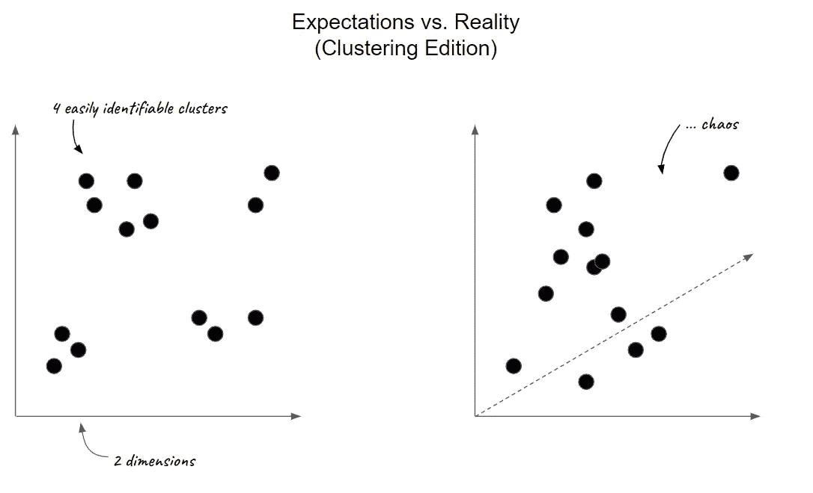
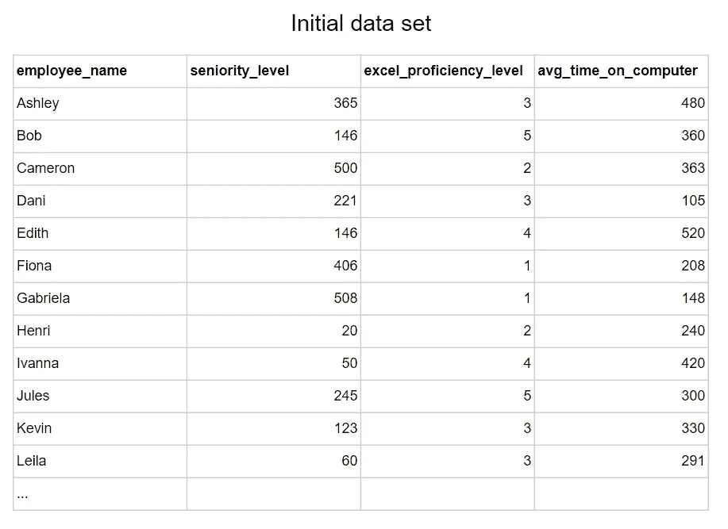
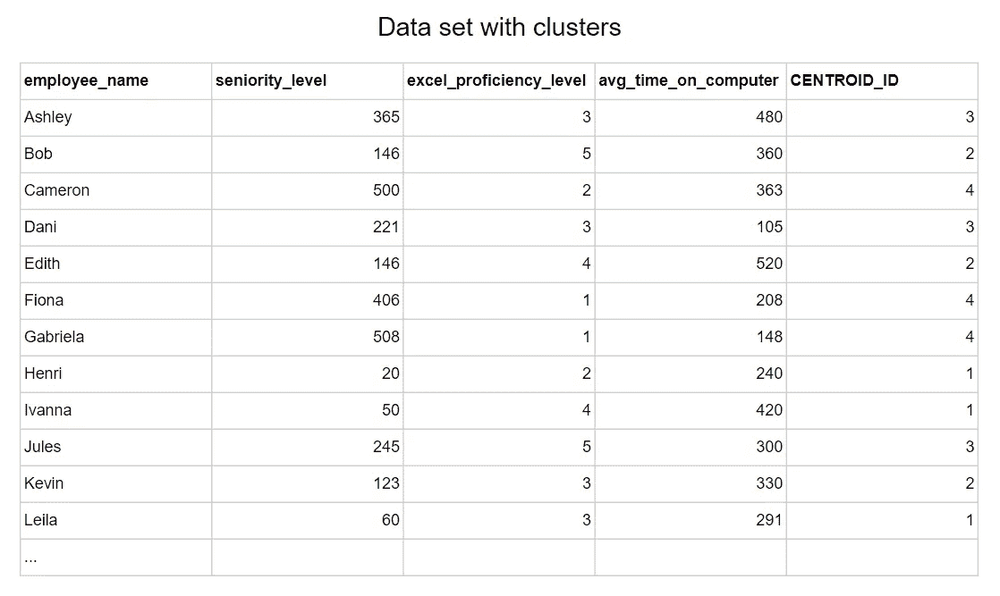
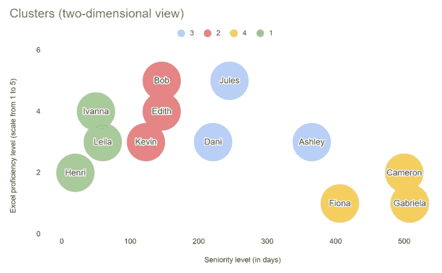

# 用 BigQuery 构建群体 A/B 检验的 K 均值聚类模型

> 原文：<https://towardsdatascience.com/building-a-k-means-clustering-model-for-population-a-b-testing-with-bigquery-57410d1b7d89?source=collection_archive---------22----------------------->

## 你如何使用谷歌的数据仓库来建立同质的个人群体

马丁·桑切斯在 [Unsplash](https://unsplash.com/?utm_source=unsplash&utm_medium=referral&utm_content=creditCopyText) 上的照片

最近，我让到**建立了同质的相同规模的团队**，这样我们就可以分析这两个团队随着时间的推移而发生的变化——一个团队在一个新的软件工具上接受测试，而另一个团队将继续使用通常的工具。换句话说:我的目标是将 n 个观察值划分成 k 个簇——但是我们稍后会谈到技术术语。

这里的挑战是找到一个合理的方法，可以被任何人理解，同时解决我的问题。在尝试了一个简单的方法后，我转向了 k-means 聚类机器学习模型。以下是我这样做的原因，以及如何使用谷歌 BigQuery 的内置模型解决类似的问题。

# 1.如何将不同的个体组成相似的群体？

我的目标是根据几个指标对人进行分类。为了简单和保密，我们假设我想创建 4 个员工小组来进行如何使用 Excel 的研讨会。我希望根据个人在以下方面的相似性来创建同质群体:

*   **资历**，从加入公司开始计算的天数
*   **参加研讨会前对 Excel 的熟练程度**，由员工自己评估，1-5 分
*   **平均每天花费在电脑上的时间**，以分钟为单位，由电脑自己测量(默认设置或通过安装的应用程序)

这里你可能注意到了，考虑的指标都是**连续的数值变量**。如果它们不在您的特定用例中，我建议您将分类变量转换成数字变量。例如，这是我对定性项目“Excel 熟练程度”所做的:通过让“我对 Excel 一无所知”等于 1 和“我完全掌握 Excel，包括 VBA”等于 5，我将定性指标变成了定量指标。

然后**要克服的主要障碍是创建类似规模的群体**。如果唯一的约束是将员工分成具有相似特征(但不一定是相同规模)的组，计算每个指标的中位数，然后根据他们在中位数的哪一边来划分个人就足够了。但是这种方法不一定会导致相同大小的集群，而且现实往往不像理论上的手工绘图那样容易分割。

玛丽·勒费夫尔

第二个问题是**我们有两个以上的指标来评估**。当只评估两个度量时，有时可以找到一个图形化的解决方案，并且可以将观察结果(这里是个人)可视化地分组到或多或少可见的集群中。然而，引入两个以上的维度使得人眼和大脑很难容易地创建相同大小并且由具有相似特征的观察结果组成的集群。

为了总结第一部分，让我展示我们将在整个示例中使用的数据集:

玛丽·勒费夫尔

# 2.构建解决方案:如何创建和运行 k 均值模型？

首先， **k-means 聚类是一种无监督的机器学习算法，旨在将相似的数据点分组在一起**。这正是我们需要的。如果您想更多地了解 k-means 聚类是如何工作的，我推荐一位作者的这篇文章，在这篇文章中，您还将通过一个使用 Python 的示例得到指导:

</understanding-k-means-clustering-in-machine-learning-6a6e67336aa1>  

基本上，k-means 聚类算法将从数据集中 y 个变量的框架内的 x 个点(x 由用户预先定义)开始。从这 x 个初始点，y 个变量中就其相似性而言最接近的点被聚集到每个聚类的先前点。最终，整个多维帧被分成 x 个部分，每个部分定义相似数据点的集群。**因此，k 均值聚类的原理相对容易理解**——这也是我选择使用这个模型而不是另一个模型的原因之一。如果说背后的数学执行是复杂繁琐的，那么它的基本原理就相对容易理解了。

在我们的示例中，我们希望获得 4 个聚类(这是上面解释中的 x ),我们有 3 个变量(这是 y ):资历、参加研讨会前对 Excel 的熟练程度，以及平均每天花在计算机上的时间。**k-means 聚类模型已经内置在 Google 的 BigQuery** 中，所以没有必要重新发明轮子。让我们简单地应用下面两个步骤，正如在 [BigQuery ML 文档](https://cloud.google.com/bigquery-ml/docs/kmeans-tutorial)中所描述的。

## 步骤 1:构建模型

为此，您必须编写一个 SQL 查询，只提取与模型相关的变量。在我们的例子中，我们希望从源数据表中提取所有的观察值(或行),我们需要前面提到的 3 个变量。

## 步骤 2:运行模型

既然已经创建了模型，您可以使用下面几行代码将它应用到您的数据集。我们只是排除了自动创建的列“nearest_centroids_ distance ”,因为该字段的值不应该输入到运行模型的参数中。

*请注意，机器学习算法的使用在这里被大大简化了。因此，严格来说，这里采取的步骤并不对应于“机器学习”。我在这里的目标是使用强大的工具，比如 k-means 聚类算法来帮助解决一个具体的问题——这个问题也可以用其他方法来解决。我想证明的是，机器学习也适用于几乎没有工程背景的人，并且可以应用于大量案例。*

# 3.得到答案:如何解释模型的输出？

由于 k-means 聚类是一种无监督的机器学习模型，该模型将基于数据集和您在第一步中定义的参数运行。**然后它会返回一个名为“CENTROID _ ID”**的新列。该值对应于根据模型预测将每个观察值(在我们的示例中是每个个体)分配到的分类号。

玛丽·勒费夫尔

由于每次迭代都从数据集多维空间中的不同随机点开始，**建议调整模型参数以最佳拟合您的数据，多次运行模型并比较其输出**。如果你想深入研究机器学习算法的世界，你甚至可以尝试不同的模型，并将其他类型的推理应用到你的特定用例中。

最终你会得到一个令你满意的观察分段。在我的案例中，我将模型给出的结果和我的实地知识结合起来，建立了研讨会的最终小组。这里最重要的部分是最终的输出符合您的需求和您的特定用例。虽然你在这里唱的是机器学习算法，但你应该始终掌握你使用的数据类型，并牢记你分析的目标。这是正确解释模型输出并将分析结果传达给第三方的关键。

玛丽·勒费夫尔

# 结论

最重要的是，我认为 k-means 聚类在这个特定应用中的应用是帮助您做出更好决策的**方法之一**。最终，你如何处理机器学习模型的输出才是最重要的。

这就是为什么当您想要复制这种方法时，这里描述的三个步骤是必不可少的:

1.  **设置场景**——你想解决什么问题？
2.  **构建解决方案** —您如何构建并运行最适合您正在处理的数据的模型？
3.  **得到答案** —你如何解释你的模型的输出？

你喜欢读这篇文章吗？ [*成为会员*](https://marie-lefevre.medium.com/membership) *加入一个不断成长的充满好奇心的社区吧！*

<https://marie-lefevre.medium.com/membership> 