# 手动构建线性回归

> 原文：<https://towardsdatascience.com/building-a-linear-regression-by-hand-b930e63bf0ae?source=collection_archive---------13----------------------->


由 [Unsplash](https://unsplash.com/@michalmatlon) 拍摄的图像

## [入门](https://towardsdatascience.com/tagged/getting-started)

## 让我们使用 Python 来创建估计我们自己的线和验证我们的结果所需的所有方程，而不依赖于库来训练我们的模型！

W 我们基于 x 的值采用线性回归来预测 Y 的值。因为我们需要知道 Y，所以这是一种监督学习方法。线性回归分为两种类型:基本的和多重的。让我们从简单的开始。所有代码的笔记本这里是[这里是](https://colab.research.google.com/drive/1vuSLuMxZcFaXu0Z4KVFkJCuWP4mHheyJ?usp=sharing)。所有的方程式都是用乳胶做的[。](https://snip.mathpix.com/dairenkonmajime/notes/note-1)

在我们开始之前，理解线性回归是一种参数方法是至关重要的。

**参数化方法**:

1.它预先假定了函数的形状。

2.它将估计 f (X)的问题简化为估计一组参数。这种假设简化了任务，因为估计参数集合比使用完全任意的函数更容易。

3.这些方法中最困难的方面是做出正确的估计。我们只能猜测曲线的正确形式，从而导致错误的预测。

因此，我们必须估计参数，使我们能够创建一条最接近 Y 值的线，不管是已知的还是未知的。

# 简单线性回归

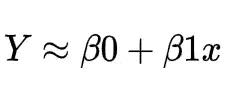

作者图片

这是简单线性回归的函数。这个方程的变体可以在统计文献中找到，但是它们都有相同的实质。可能是 W0 和 W1，α和β，等等。

不过，我想让你注意一件事。注意符号≈。当我们估计值时，我们的主要目标是使我们的预测接近 Y 到 x 的真实值。也就是说，我们的目标是尽可能地最小化真实值和估计值之间的差异。

因此，当处理 f (X) = Y 的估计，或者更具体地，f(X)的参数，其中 f (X) = Y 或者 Y = f (X)时，我们的目标不是完美地定义 f(X)，而是估计最好地代表 f(X)的参数。但是，因为 y = ^f (X)+**+*e***，我们对 f(x)的估计将等于 y 加上 ***e*** 后的余数。

其中 Y = ^f (X) + ***e*** ，则^f (X) = ^B0 + ^B1X = ^Y.也就是说，为了估计^Y，首先要估计^f (X)、^B0、B1 的参数。Y = ^Y + ***e*** 既然 Y = ^f (X) + ***e*** 和^f (X) = ^Y.

考虑到这一点，我们将使用的公式是:

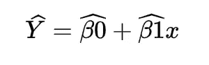

作者图片

不再分心。

## **什么是 B0 和 B1** ？

BO 表示截距，即 X = 0 时的 Y 值，或线性回归线开始处的 Y 值。这里有一个例子。我们希望根据活动中的投资金额来估计销售转化的数量。不投钱能卖多少？

B1 呢？斜率由 B1 的值表示。基本决定了趋势线。这在实践中是如何运作的？考虑根据体重计算身高的例子。身高以厘米为单位，体重以公斤为单位。我们发现斜率为 2.5。表示体重每增加一公斤，人的身高就增加 2.5 毫米。

假设我们知道 B0 和 B1 是什么，我们如何估计它们呢？这些参数可以用多种方法来估计。首先，让我们看看普通的最小二乘法(OLS)，这是最常见和最简单的方法之一。要估算 B0，首先要估算 B1。

> 在统计学中，**普通最小二乘法** ( **OLS** )是一种估计线性回归模型中未知参数的线性最小二乘法。OLS 通过最小二乘法原理选择一组解释变量的线性函数的参数:最小化给定数据集中观察到的因变量(被观察变量的值)和自变量的线性函数预测的变量之间的差的平方和。—来源:[维基百科](https://en.wikipedia.org/wiki/Ordinary_least_squares)。

让我们看看这意味着什么。我们想用这种方法达到什么目的？减少一些东西。应该尽量减少什么？观察数据和估计数据之差的平方和。让我们把这个等式放在一起。

反过来，我们有观察值和估计值之间的差异。作为回归结果的估计值称为估计值。观察值是真实值。因此，

```
observedValue - estimatedValue
```

现在，*平方*估计值和观测值之差。因此:

```
square (observedValue - estimatedValue)
```

最后，观察数据和估计数据之间差异的平方和。：

```
sum (square (observedValue - estimatedValue))
```

好的，但是这个和的意义是什么？observedValue 和 estimatedValue 是值。考虑一下:我们有两列，Y 和 Y。第一列是真实值，观察值，第二列是估计值。正如我之前提到的，我们构建了一个模型，并利用 X 来估计 Y，从而得到 Y。假设每一列都有三个值，Y = [5，9，2]和 Y = [6，7，2]。使用我们的公式，我们得到以下结果:

```
(5–6)²
(9–7)²
(2–2)²
```

总数是这三个操作的总和。结果是，(5–6)+(9–7)+(2–2)。作为这些程序的结果，我们得到了残差平方和(RSS)。这种情况下使用 RSS = 5。我们的目标是使用 OLS 来减少 RSS。

RSS 的一般公式是:

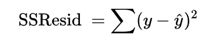

作者图片

我们如何用 Python 来编码呢？

OLS 是减少这种 RSS 的众多方法之一。另一种做法是，我不知道，猜测 B0 和 B1 的各种参数，计算所有的误差，选择最小的一个，但是发现的最小的误差可能没有那么微小。我们将以这样的方式结束。当我们有少量的功能和列时，OLS 是最快捷和最容易使用的方法。

我们将在文章中使用虚构的数据。

在本例中，我制作了两个数组来表示 X 和 y。我创建了 1000 个值，以便提供一个更有趣的视角。我把 X 和 Y 分成四份。训练数据将包含 80%的 X 和 Y 值(X 训练和 Y 训练)，而 20%的数据将用于测试(X 测试和 Y 测试)。

在估计 B0 和 B1 之前，我们先讨论一下假设。线性回归的基本假设是什么？我们利用线性回归来预测新值或做出推论。有许多方法可以估计回归中的参数。许多方法，如 OLS，需要特定的假设，以使他们的结论尽可能准确和公正。这些前提不必在每个线性回归中都严格遵循！

## 因变量和自变量必须有线性关系。

当使用线性回归进行预测时，满足这一要求是合乎逻辑的。本质上，线性回归将通过数据画一条直线。如果数据没有线性关系，模型就无法处理数据的复杂性。我们如何检验这个概念？

在大多数假设下，有两种形式的确认。有图形确认，也有数学确认。只要可行，我将同时介绍这两种方法。当事情变得太复杂时，我就只覆盖视觉效果。

所以我们可以把 X 数据和 Y 数据对应起来，寻找趋势。让我们执行这个命令，看看会发生什么。

```
plt.figure(figsize=(10,10))
plt.scatter(X_train, y_train)
plt.show()
```


作者图片

对我来说，它似乎是线性的！我甚至能看到一条直线！但是这有什么意义呢？我不确定你，但视觉确认并不能完全满足我。当然，你的视角是由你的时间、金钱和教育决定的。然而，我们在这里拥有世界上所有的时间，它是免费的，我们有足够的知识来使用替代方法。

除了图表，我们如何评估线性关系？计算 X 和 Y 之间的相关系数。但是这种相关性到底是什么呢？

> 在[统计中](https://en.wikipedia.org/wiki/Statistics)、**相关**或**相关**是两个[随机变量](https://en.wikipedia.org/wiki/Random_variable)或[二元数据](https://en.wikipedia.org/wiki/Bivariate_data)之间的任何统计关系，无论[是否为因果](https://en.wikipedia.org/wiki/Causality)。从最广泛的意义上来说，**相关性**是任何统计关联，尽管它通常指一对变量线性[相关的程度。依赖性现象的常见例子包括父母及其子女的身高之间的相关性，以及商品价格和消费者愿意购买的数量之间的相关性，正如所谓的需求曲线中所描述的那样..—来源:维基百科。](https://en.wikipedia.org/wiki/Line_(geometry))

在这个简短的解释之后，我将重申一个统计学家的口头禅:相关性并不意味着因果关系！在我们对因果关系做出明确的判断之前，我们需要进行一些统计测试。但这是另一天的话题！

在我们的数据中，我们希望计算 X 和 y 之间的相关程度。有各种方法来解决这个问题。皮尔逊系数是最常用的。其通式如下:

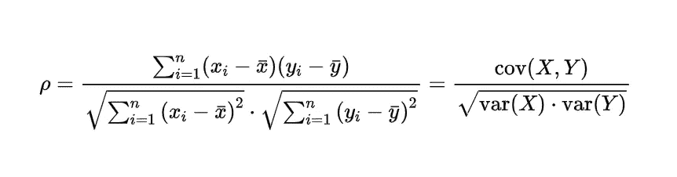

作者图片

也就是说，两个变量的标准差除以它们的协方差。让我们把事情分解一下，这样你能更好地理解它。我们将看两个部分。X 相对于 Y 的协方差，以及 X 和 Y 的方差。我将把这些信息留给方差的概念，其中包括一些图形解释。绝对值得一看。总之，协方差表示两个变量协同波动的程度。

在 Python 中我们如何计算两个变量的协方差？让我们用这个公式:

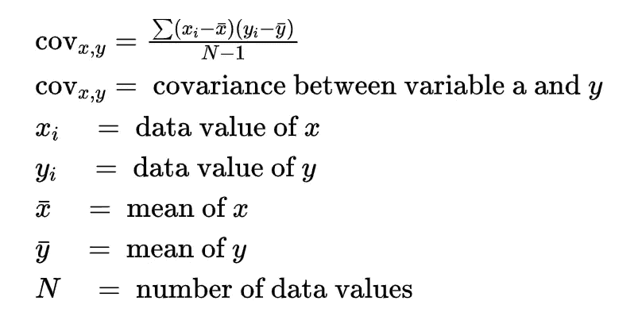

作者图片

仅此而已！样本的标准差是多少？随机变量的标准偏差是对其围绕总体均值的离差的度量。低标准偏差意味着数据点经常接近平均值或预期值。较大的标准差意味着数据点分布在较大的数值范围内(维基百科)。方差的平方根也是标准差。让我们使用 Python 通过利用方差公式并计算其根来创建我们的标准差公式:

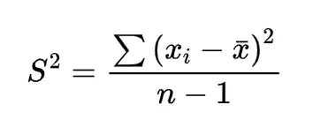

作者图片

我们先来看看标准差。

如你所见，我们利用方差公式来寻找问题的根源。我们现在可以使用皮尔逊系数。让我们从原始公式开始，并从那里创建我们的函数:


作者图片

鉴于我们已经完成了一半以上，让我们进一步简化这个公式:

```
covarianceOfXY / StdX * StdY
```

让我们看看我们的数据结果如何。

```
The Pearson Correlation Coefficient between X and Y is [0.98478235].
```

而皮尔逊系数的意义是什么？皮尔逊系数是一个介于-1 和 1 之间的数字，1 和-1 表示完全线性相关，0 表示不存在相关。完全正相关是 1，而完全负相关是-1。

理想的价值观应该是什么样的？这是有条件的。有时 0.7 的相关性是最佳的，而其他时候 0.9 是不够的。这将取决于你的问题的性质。在多元线性回归中，您可以使用皮尔逊系数来查找模型中最重要的因素或排除相关变量。

现在我们已经确定了一个假设，让我们开始估计参数。

B0 和 B1 将使用 OLS 公式进行估算。以下是方程式:

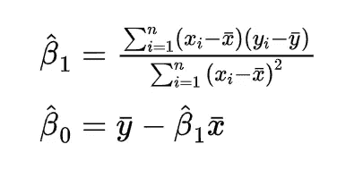

作者图片

这么看，有点难，lol。但是，实际上，这很容易。让我们从 B1 开始:

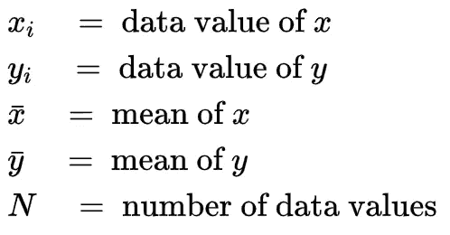

作者图片

如前所述，B1 是 X 和 Y 之间的协方差除以 X 的方差。B0 只是 X = 0 时 Y 的值，考虑了 Y 的中值与角度系数和 X 的中值的乘积之差。

我们用 Python 估算一下 B0 和 B1？

因为我们在训练和测试中划分数据，所以我们的 X 和 Y 将是我们的训练 X 和 Y，是时候估算了！

```
Intercept: -4.959319577525191,        
Slope: [2.00341869].
```

换句话说，我们的线从-4.9593 开始，x 每增加一次，线就前进 2.003。现在我们将这些参数应用到新数据中，看看我们的预测结果如何！现在是时候建立我们的线性回归了！

因为我们之前分离了我们的数据，所以我们现在可以测试和评估我们的模型了！

```
y_pred = predict_function(b0_coeficient, b1_coeficient, X_test)
```

之后呢？现在是时候设计我们的返程路线了！

```
plt.figure(figsize=(8,6))plt.scatter(X_test, y_test,  color='blue')plt.plot(X_test, y_pred, color='red', linewidth=2)plt.title("Linear Regression Demonstration", fontweight="bold", size=15)plt.show()
```

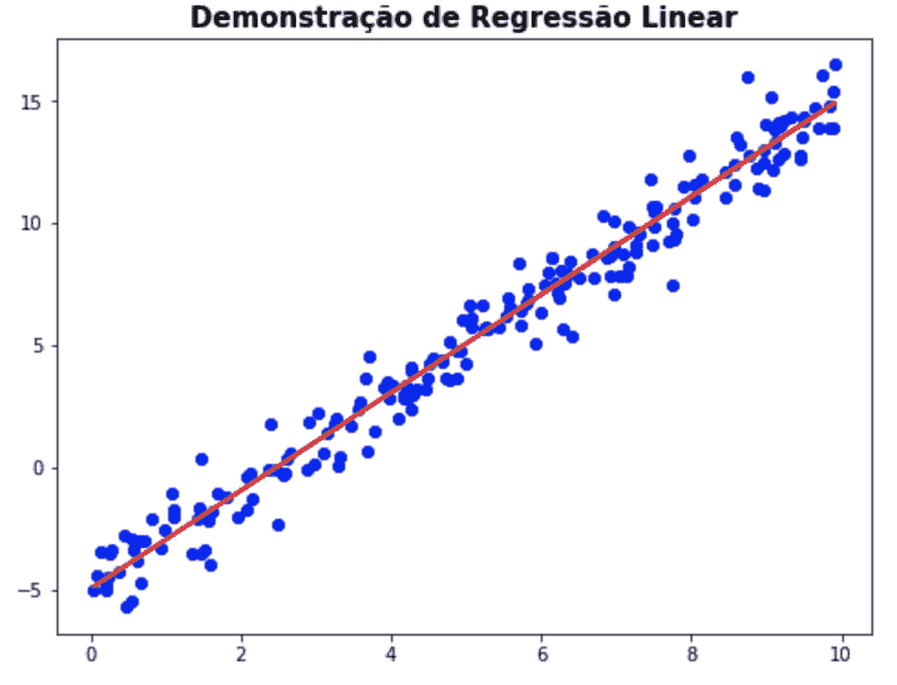

作者图片

看来我们的回归很顺利！

自然，线性回归线永远不会到达所有点。或者，至少，如果他们是正确的，如果模型的意图是将其推广到新数据，这将不是一件好事。这是因为每个线性方程都有误差。

此刻，我们将加入我们等式的最后一个部分，关于它我们已经说过了。错误。

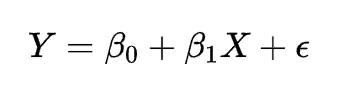

作者图片

误差是 y 的预测值和实际值之间的差值。误差的成本可能是多种因素的结果。有时是你没有考虑的单一变量，而其他时候你假设了现实中不存在的线性关系。

另一个原因可能是数据短缺。由于数据如此有限，你的估计可能无法揭示问题的真正本质。首先，有几种方法可以减少错误。你可能会寻找更多的数据，选择一个非参数或线性模型，并添加更多的变量。策略不同，将由您的评估决定。寻找更多的数据要花多少钱？值得寻找进一步的信息吗？测试另一个模型需要多长时间？专业工作时，你应该问所有这些问题。

有限制吗？是的。称之为不可逆转的错误。不可逆误差是随机的，根据定义，不能测量或观察。我们会给你带来我们的新方程，我会给你解释的。

> Y = ^f(X) + e

当然，我们已经完成了第一阶段，并估计了 f(X)的参数。为了有助于理解，我们采用线性回归来确定或预测给定一定量的辉瑞疫苗应用于小鼠的一小时内的平均心跳水平。

但是，该错误尚未提交，也不会提交。为什么会这样呢？我们猜测你昨晚回家很晚，很累，睡了一夜。同一天晚上，你的一只老鼠皮图被马金奥斯拴住了。Pitu 和 gaiola 里的其他老鼠一样，变得极度紧张。幸运的是，没有人受伤。皮图第二天想跟你说委屈，但是因为你不和动物说话，所以你不知道发生了什么。

Pitu 的压力水平被发生的事情和你不明白发生了什么的事实所改变。压力水平是你的结果中的一个重要变量，但你忽略了 N 个原因，其中之一是你不会说“mouseguese”。

另一只小老鼠玛格达莱娜很孤独，没有人和她说话或一起玩。当你出去的时候，其他人有一个聚会，但是玛格达莱娜留在她的角落里，沉思她的悲伤。你很可能无法识别抹大拉的悲伤，因为你没有主修老鼠心理学。这个你无法测量甚至看不到的变量，在评估抹大拉的结果时将是至关重要的！

你明白我的意思吗？有些因素对于你的分析来说是不可观察或不可收集的。

你应该感到奇怪，但这是什么错误，为什么我相信我在哪里听到过？你在上面看到了它，但是它有一个不同的名字:RSS。我们会计算模型的 RSS 吗？

```
print(f'The RSS is {get_rss(y_pred, y_test)}.')# The RSS is 191.16066429.
```

有了这个数字，我们可以想办法减少它。但这不是今天的议题！我提到这个错误是有原因的。线性回归的第二个前提。

## 残留物必须以规则的方式分布。

为什么会这样呢？关于为什么这个假设应该被证实，以及当它不满足时会发生什么，即使它是必要的，有几个争议。由于这些都是非常技术性的问题，所以我不会在本文中讨论它们。

我们如何知道一个数据分布是否正常？有两种类型的图形:图形和数学。我将在这部分使用图形。如果我们想检查所有剩菜的行为，我们不能使用 RSS，因为 RSS 查看剩菜的总和，但我对剩菜的总和不感兴趣，而是对单个剩菜感兴趣。

还记得一开始的注册吗？我们来看公式 Y = ^Y + e，要计算残差，只需将 y 从左向右切换，结果为:y ^y =***e***。

> e =观察值—估计值

很简单，用 Python 来说:

```
residual_lr = get_residual(y_test, y_pred)
```

因此，我们将有一个剩菜阵列。我们会使用直方图来检查它们的分布吗？

```
plt.subplots(figsize=(12, 6))plt.title('Distribution of Residuals')sns.distplot(residual_lr)plt.show()
```

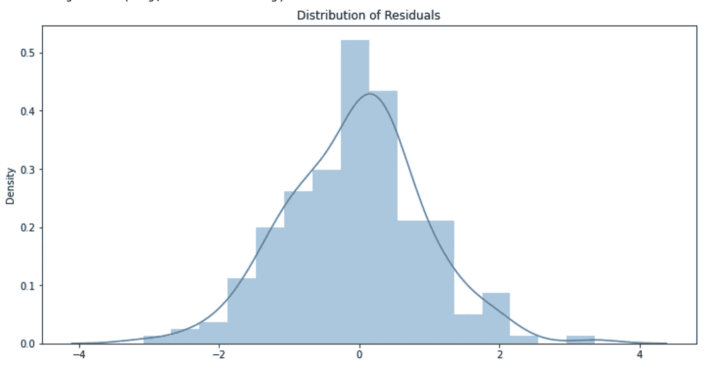

作者图片

这看起来是正态分布，尽管有点不对称！有没有另一种方法可以从图形上确认这是一个正态分布？有，有！它被称为 QQPlot 图！

```
lst = []
for i in residual_lr:
    for n in i:
        lst.append(n)sm.qqplot(np.array(lst), line='45', fit=True)
plt.show()
```

在这段代码中，我从一组数组中提取了值，并将它们放在一个列表中，供我们的 QQPlot 验证！你有它！

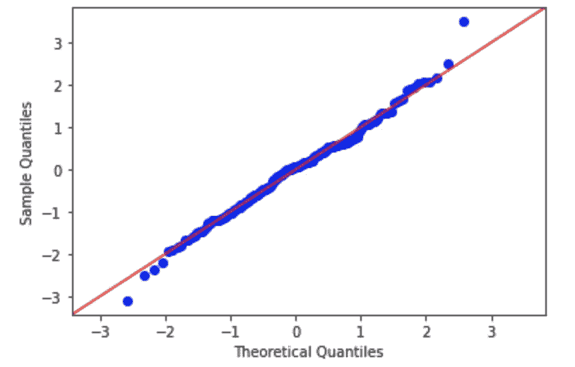

作者图片

这到底是什么我从来没见过的东西？你可能会好奇。我不会花太多时间去概念化 QQPlot，而是去解释它。[如果你有兴趣了解更多](https://pt.wikipedia.org/wiki/Gr%C3%A1fico_Q-Q)。

从一个 QQ 情节中我们可以得出什么结论？我们有一条红色的直线和一个蓝色的残差离差。我们可以使用 QQ 图来可视化我们的数据分布。如果它们完全沿着红线，我们就有一个完美的正态分布。我们的数据离这条直线越远，正态分布特征就越少。为了更好的理解，你可以在这里找到可视化的解释[。](https://qastack.com.br/stats/101274/how-to-interpret-a-qq-plot#:~:text=Se%20os%20valores,menores%20e%20maiores.)

基于这一可视化，我们得出结论，我们的废物有一个典型的分布，尽管一些点远离中心。

有几种统计检验可以确定分布是否正态，如夏皮罗-维尔克检验。但是现在，我们只要坚持视觉化！我们正前往下一站。

## 残差的方差应该是常数

线性回归模型在很大程度上依赖于同方差的前提(即“恒定方差”)。同方差定义了一种情况，其中误差项(自变量和因变量之间关系中的“噪声”或随机扰动)对于所有自变量值都是相同的。

当误差项的大小在独立变量值之间变化时，就会出现异方差(违反同方差)。违反异方差假设的影响与异方差的程度成正比。

这对我们有什么意义？当我们使用 MMQ 时，我们给所有的 X 值相同的权重。如果某些 X 值比其他值有更大的影响，我们就有问题了。

考虑基于家庭收入的奢侈品购买估计。我们有贫困的家庭，他们不买或者只买一些奢侈品。如果奢侈品的购买随着家庭收入的增加而增加，我们就会有一个恒定的方差。但假设只有一部分富裕家庭购买奢侈品，而其他人购买相对较少:我们有异方差的问题。

你还记得 B1 公式吗？X 值的方差在除数部分计算。因为 OLS 为 X 的所有变量提供了相同的权重，所以很大的变化会造成阻碍！

我们如何才能看到这一点？让我们使用 Python 吧！让我们从视觉表现开始。我们将根据预期值绘制残差图，以观察误差的变化。

```
plt.scatter(residual_lr, y_pred)
plt.show()
```

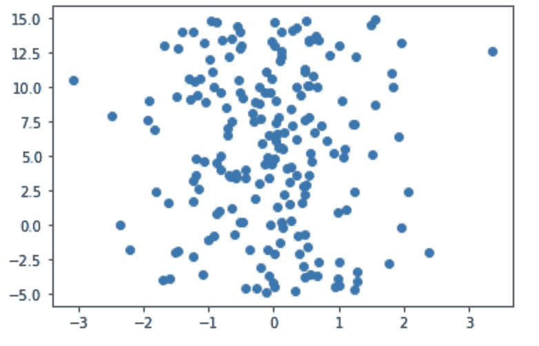

作者图片

老实说，我无法从这张图片中得出任何结论！这些点上似乎没有任何图案。那么，我们要测试一下吗？

```
H0 = homocedasticity
H1 != homocedasticityalpha = 0.05
```

让我们为此使用 *statsmodels.stats* 库！

```
print(sm.diagnostics.het_goldfeldquandt(residual_lr, y_pred))Test: 1.0206718127917291
p-value: 0.45956295321355667
```

我们不能因为α< p 值而拒绝零假设，因此我们不能否认同方差的存在！

咻！我们的模型确认并通过了所有的假设！你很可能在想“我们现在可以走了吗？模式太神奇了！”。如果你想利用模型来分析变量，你可以放松一下。你可以明天开始检查，看看是否能从中得到什么。如果你想利用这个模型来做预测，我们只是成功了一半！

现在是时候评估我们模型的可推广性了！如您所见，我们的模型在盯着测试数据方面做得很好。但是有多好呢？我们如何评估我们的模型？使用度量标准！

对此有多种测量方法。其中之一是 R 平方，通常称为决定系数。R2 是一种度量，它表示模型可以解释多少数据变化。换句话说，这个度量计算回归模型可能预测的方差的比例，因此向我们显示实际度量与我们的模型有多“接近”。它表示响应变量中可由预测变量或解释变量解释的可变性的比例。

它的 R 平方值从 0 到 1 不等，0 表示最差的估计值，1 表示最好的估计值。它通常用百分比表示。例如，R2 = 73 %表明模型可以解释我们数据中 73 %的波动性，而剩余的 27%理论上是剩余方差。

有可能出现负的 R 平方吗？是的，当你的模型有能力比所有 Y 值的均值更差的时候。

R2 公式到底是什么？让我们再看一遍我们的 RSS 公式。我们会根据它来改变它。我们有 RSS 中残差的平方和。然而，我们希望计算残差的总平方和。

在 RSS 中，我们取 Y 的每个观察值和估计值之间的差，或者 Y，对其求平方，并添加结果。在 TSS 中，我们计算 Y 值和 Y 平方平均值之间的差值。也就是说:

> TSS = sum ( ( valuesX — meanY))

R2 基本上是:

> 1 — (RSS / TSS)

```
rss = get_rss(y_pred, y_test)
rst = rst_metric(y_test)print(f'The R2 of the model is {get_r2(rss, rst)[0]*100}%.')
```

> 该模型的 R2 达到了 97.177738738677

这意味着，我们的模型能够解释近 97.18 %的数据！该模型似乎可以推广到新的数据！

r 平方也可以通过平方皮尔逊系数来计算:

```
print(0.98478235 ** 2)# 0.969796276871522
```

你想知道如果你取平均值，R 的平方是多少吗？我们一起来看看吧！让我们做一个和 Y 一样大的列表，但是用 Y 的平均值代替。

```
plt.figure(figsize=(8,6))
plt.scatter(X_test, y_test,  color='blue')
plt.plot(X_test, lst, color='red', linewidth=2)
plt.title("Linear Regression Demonstration", size=15)plt.show()
```

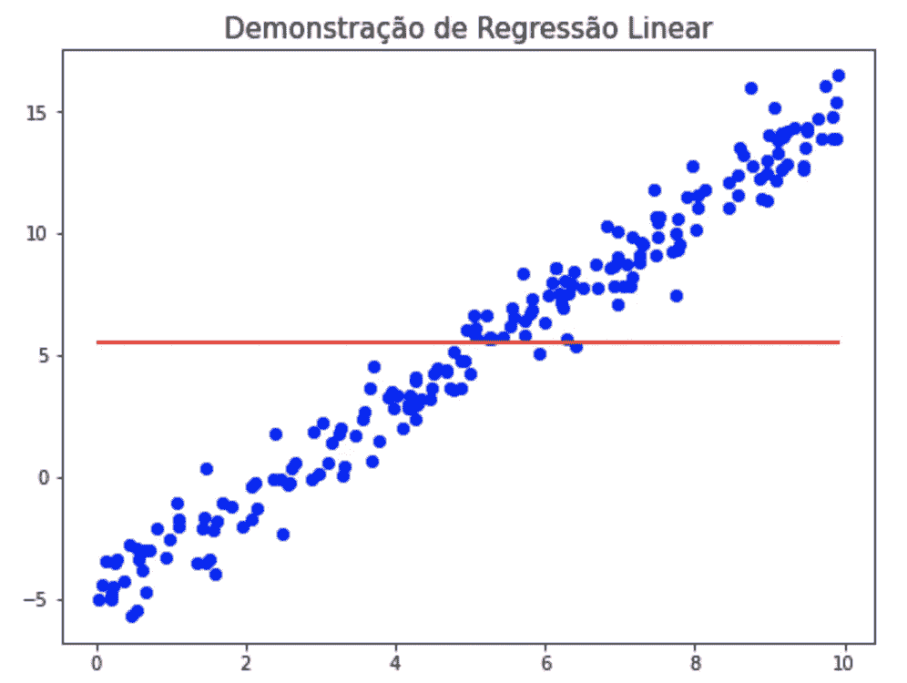

现在，让我们来计算 R 的平方:

```
rst = tss_metric(y_test)rss = get_rss(lst, y_test)print(f'The R2 of the model is {get_r2(rss, rst)[0]*100}%.')
```

> 模型的 R2 为 0.0%。

还记得我说过 R 的平方可以小于 0 吗？RST 以上的 RSS 越大，R 的平方就越低。

然而，问题依然存在。估计线性回归的另一种方法是什么？好吧，我会迅速找到一个合理的策略。

这背后的解释如下。我们先挑 100 个截距和 100 个斜率值，然后测试 10000 个线性回归，比较一下，挑 RSS 最小的组合。我们开始吧！

这里我们运行 10，000 次回归。我们要不要计算得到最小的 RSS？

```
min_index = rss_list.index(np.min(rss_list))print(f'The lowest RSS is: {np.min(rss_list)} with index {min_index}.')# The lowest RSS is: 190.52186974065032 with index 4552.
```

与使用 OLS 相比，我们使用这种变通方法得到的 RSS 要小一些！用这个指数在测试数据上画出我们的回归线。

```
plt.figure(figsize=(8,6))plt.scatter(X_test, y_test,  color='blue')plt.plot(X_test, linear_reg[min_index], color='red', linewidth=2)plt.title("Linear Regression Demonstration", size=15)plt.show()
```

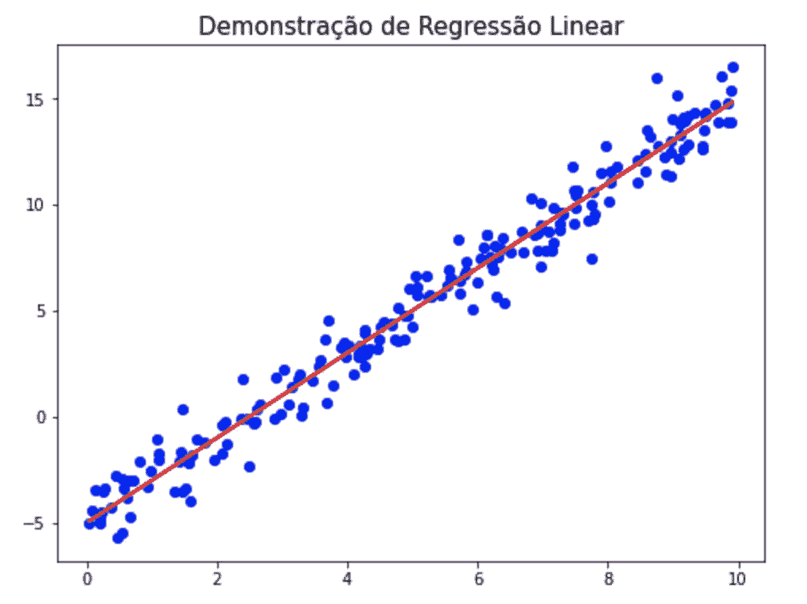

作者图片

R 的平方呢？

```
rst = tss_metric(y_test)rss = get_rss(linear_reg[min_index], y_test)print(f'The R2 of the model is {get_r2(rss, rst)[0]*100}%.')
# The R2 of the model is 97.18512940329813%.
```

正如你所看到的，这种差异可以忽略不计，几乎不存在。而使用 MMQ 方法我们得到 97.175%，这里我们得到 97.185%。

到此，我们将结束我们的文章！我试图通过理解五六行代码背后的东西来解决创建线性回归的最重要的方面，这些代码足以完成我们在这里讨论的所有事情。

剩下的问题是:是否需要检查所有这些？有没有另一种方法可以在不经历所有这些的情况下获得一致的结果？我现在想做的就是完成 Kaggle 的巨大线性回归。我真的有必要这样做吗？这是一场激烈的辩论！[这里可以找到一些水花](https://qastack.com.br/stats/130775/why-do-we-care-so-much-about-normally-distributed-error-terms-and-homoskedastic)。但请记住，作为一名数据科学家，你必须解决问题，并向你的同行展示你的发现。

当你处理真实数据的时候，不会像这里的那些可爱，而是需要解决问题！

参考资料:

**homscedastidade——应用统计中心**。https://estatistica.pt/homoscedasticidade/>[。Acesso em: 24 套。2021.](https://estatistica.pt/homoscedasticidade/)

‌ **测试正态分布和方差分布**。disponível em:<[https://Bio statistics-uem . github . io/Bio/aula 8/test _ normalidade _ homocedastidade . html](https://biostatistics-uem.github.io/Bio/aula8/teste_normalidade_homocedasticidade.html)>。Acesso em: 24 套。2021.

‌HOW，你能给一个只懂均值的人解释一下协方差吗？你将如何向只懂均值的人解释协方差？disponível em:<[https://stats . stack exchange . com/questions/18058/how-would-you-explain-co variance-to someone-someone-who-understand-only-the-mean](https://stats.stackexchange.com/questions/18058/how-would-you-explain-covariance-to-someone-who-understands-only-the-mean)>。Acesso em: 24 套。2021.

‌DAMACENO，l .**entendendo regresso linear:as suposis por tras de tudo！**disponível em:<[https://medium . com/@ lauradamaceno/entendendo-regression % C3 % A3o-linear-as-suposi % C3 % A7 % C3 % B5es-por-tr % C3 % A1s-de-tudo-d0e 29004 C7 f 8](https://medium.com/@lauradamaceno/entendendo-regress%C3%A3o-linear-as-suposi%C3%A7%C3%B5es-por-tr%C3%A1s-de-tudo-d0e29004c7f8)>。Acesso em: 24 套。2021.

‌SHRUTIMECHLEARN.**逐步假设—线性回归**。可在以下网址查阅:<[【https://www . kag gle . com/shruteimechlar/分步假设线性回归】](https://www.kaggle.com/shrutimechlearn/step-by-step-assumptions-linear-regression) >。访问时间:9 月 24 日。2021.

蒂托。**scikit-学习还是状态模式？评估我的回归模型**。可在以下网址查阅:<[【https://nathaliatito . medium . com/scikit-learn-or-state models-asserting-my-return model % C3 % a3 % a3-3o-F4 c04 b361 fa 7】>。访问时间:9 月 24 日。2021.](https://nathaliatito.medium.com/scikit-learn-ou-statsmodels-avaliando-meu-modelo-de-regress%C3%A3o-f4c04b361fa7)

**使用 Python 的多行回归**。可于:<[https://ichi . pro/pt/return au-multiline-using-python-75787662189](https://ichi.pro/pt/regressao-multilinear-usando-python-75578758662189)>查阅。访问时间:9 月 24 日。2021.

米兰达修女。 **19 线性回归|基本生物统计**。可查阅:<[【http://www . lamp . uerj . br/db/_ book/regret % C3 % a3 % a3-o-linear . html # straight](http://www.lampada.uerj.br/arquivosdb/_book/regress%C3%A3o-linear.html#eqReta)>。访问时间:9 月 24 日。2021.