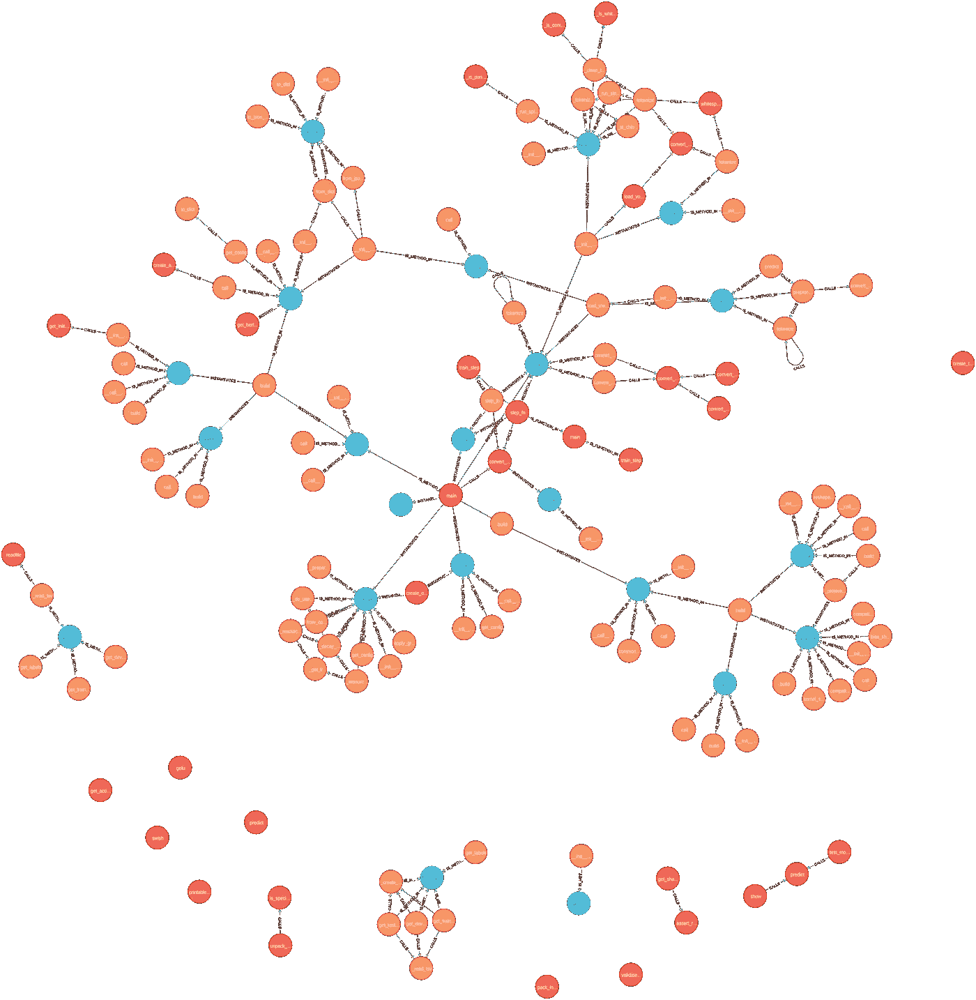
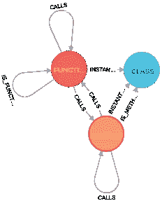
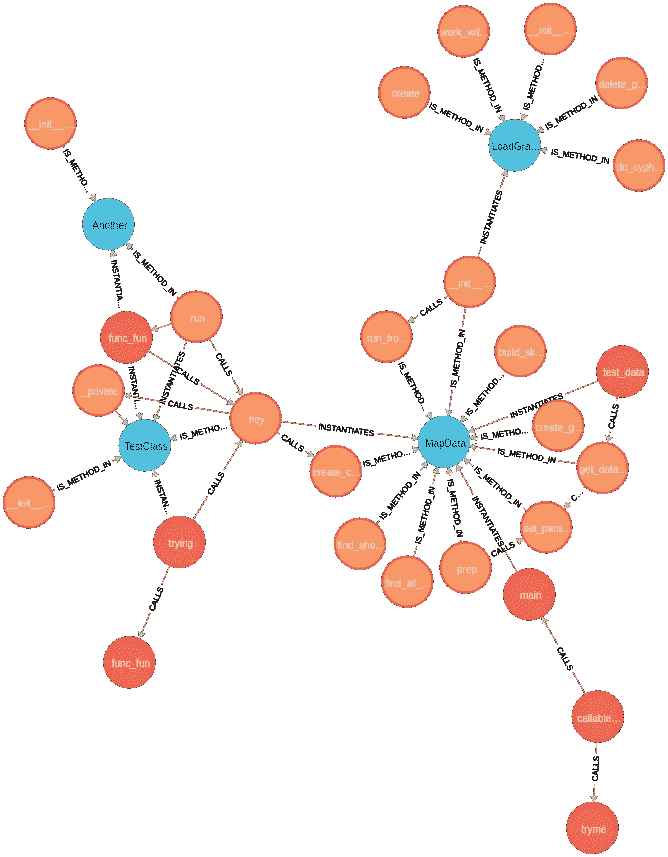
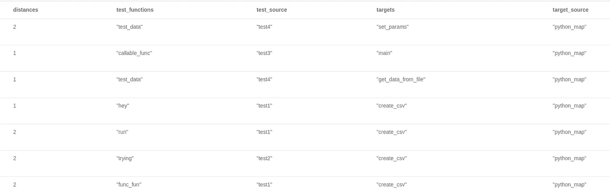
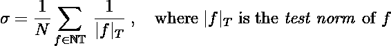
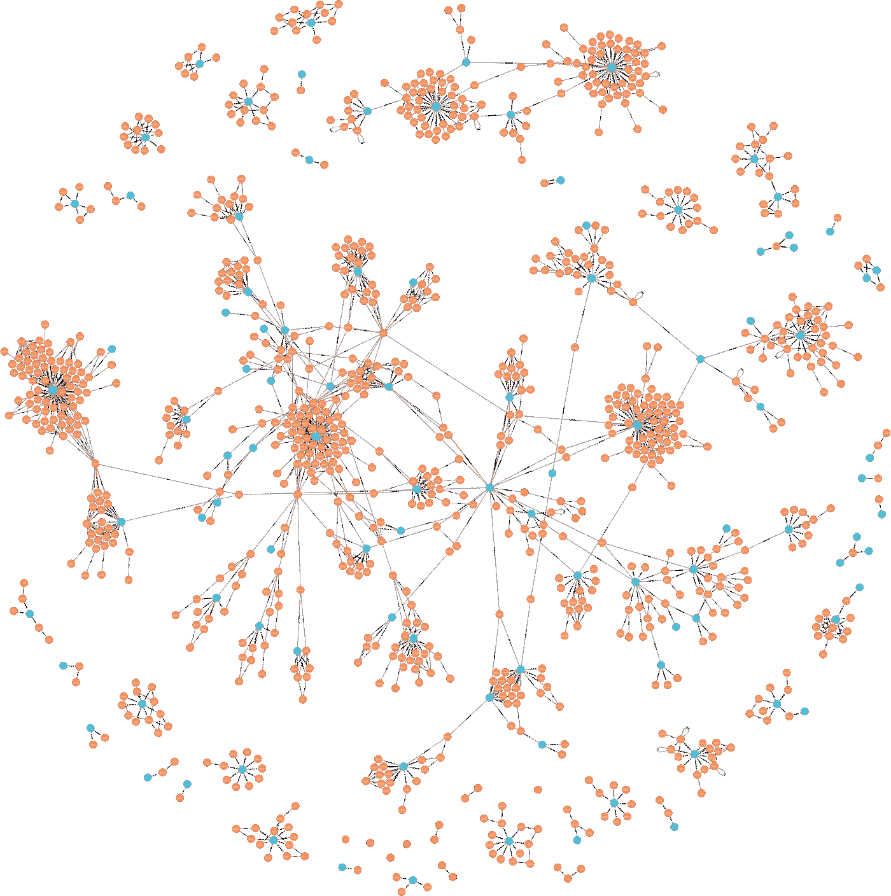

# 使用图表技术构建 Python 项目的地图-可视化您的代码

> 原文：<https://towardsdatascience.com/building-a-map-of-your-python-project-using-graph-technology-visualize-your-code-6764e81f3500?source=collection_archive---------5----------------------->

## 使用 Neo4j 计算安全分数——您的代码有多安全？



作者图片

作为一名数学家和工作数据科学家，我着迷于编程语言、机器学习、数据，当然还有数学。

这些技术、艺术和工具当然对社会非常重要，当你阅读这篇文章时，它们正在改变我们的生活，但另一种新兴技术正在成长。而且增长很快！

这是一项基于我在大学学习的数学领域的技术，也是第一次被发现(或发明..？我们下次再谈吧，好吗？伟大的莱昂哈德·欧拉给了他一个挑战，当时没有人知道如何解决。

这个挑战是关于一个潜在的形状或结构，以相关事物的形式存在——关系。

欧拉需要一种工具来研究关系和结构，在这种关系和结构中，某些物体之间的距离并不重要，重要的是关系本身。

他需要并发现了现在被称为数学图的东西(或简称为*图*)。

这就是图论和拓扑学的诞生。

快进 286 年…

# 发现高层结构

不久前，我在一个包含数百个 Python 类、方法和函数的存储库中从事一个相对较大的项目(工作中),所有这些类、方法和函数都通过共享数据和相互调用来相互通信。

我在一个子文件夹中工作，其中包含了旨在解决大项目中一个子问题的代码，然后我突然想到:

> 如果能够可视化我在大画面中的位置，以及所有不同的对象是如何通过相互之间的调用和数据传递连接起来的，这不是很好吗？

那会是什么样子？

在几个晚上和(17 杯浓咖啡)里，我设法构建了一个 Python 程序，它将您的代码作为节点和关系以对象和调用、作用域和实例化的形式解析到 Neo4j 图形数据库中。

上图是通过这个 Python 映射项目解析我的一个 NLP 项目(人类语言上使用的机器学习)的结果。

对于不知道什么是图形数据库的人来说，让我们暂停一下这个故事。

首先，图是一个数学对象。它由所谓的节点和边组成。在 Neo 术语中，这些边被称为关系，这很合适，因为这正是它们所代表的——两个节点之间的某种关系。

这种图的一个经典例子是像脸书这样的社交网络，其中节点代表人，关系代表人与人之间的友谊。

然后，图形数据库存储这样的图形，以便您可以探索隐藏在大量路径中的模式。

我们应该记住的一件非常重要的事情是，在图形数据库中，节点以及关系都存储在数据库中。这意味着某些查询比在关系数据库中连接大量的表要快得多。

为了更清楚地说明我们在这里构建的是什么样的图形，我将勾画出它的结构。

我们指定 Python 项目的根文件夹。

图中的节点表示我们的项目/存储库中的文件对象。特别是函数、类和方法。这些节点有一些属性，比如它们在哪个文件中定义，如果它们有一个父节点(方法有类作为父节点，函数可以在其他函数中定义，等等。).

对于关系，我们有调用、实例化、显示方法属于哪个类的关系，等等。



作者图片

这个想法是，我们希望能够跟踪代码中的调用和依赖关系。

所以我手里拿着一个新的可视化工具——不是像 Matplotlib 这样的可视化数据的工具，而是可视化代码本身的结构。

乍一看，除了一个有趣的新方法来为“赢得”项目的办公室制作令人敬畏的海报之外，我没有想太多。

然而，在与我的一个同事(碰巧也是一个数学/图形数据库极客)讨论了它为许多不同的可能工具铺平了道路之后，我很快意识到这不仅仅是一个可视化工具。

# 测试和安全

当然，你可以看到代码中的依赖关系，这当然很好，它甚至可以帮助你发现一两个 bug，或者仅仅通过查看就可以优化代码，但是真正的力量来自于对嵌套代码结构的揭示。

例如，除非你真的很紧张，并且已经将你的代码分成小的可测试单元，然后在进行更大的集成测试之前，在(所谓的)单元测试中一个接一个地进行测试，否则你可能不容易回答这样的问题

*   你的代码测试到什么程度了？也就是说，哪些功能是隐式测试的，而不是显式测试的，反之亦然？
*   有没有不再被使用或者没有被测试的功能？
*   哪些函数被隐式调用得最多？

> 坚持住卡斯帕。首先，隐式调用是什么意思？

嗯，当我调用一个函数(或者一个方法，生成器等等。)该函数可能调用另一个函数，依此类推。这些被其他函数调用的函数被隐式地调用*。第一个函数被显式地称为*或直接称为*。***

> ***好吧…为什么这很重要？***

***因为，如果一个函数被很多不同的函数多次(隐式)调用，有一个细微的 bug，那么，首先，这个 bug 在某个时刻发生的概率比每次只被同一个函数调用一次的概率要大，其次，依赖那个函数的函数越多，一个潜在的 bug 对整个系统/程序造成的损害就越大。***

***事实证明，图是解决这类问题的完美设备。我们甚至可以用一种更微妙的方式来解决它们，通过使用图形算法，用分数的方式列出函数、方法和类的重要性。***

# ***解决方案***

***在能够使用 Python 中的 neo4j 之前，我们需要安装 neo4j 桌面环境并执行一个***

```
***pip install neo4j***
```

***让我们构建一个能够从 Python 与 Neo4j 通信的类。***

***现在，我们可以通过如下方式在另一个类中轻松构建一个图形加载器***

```
***self.loader = LoadGraphData("Kasper", "strong_pw_123", "bolt://localhost:7687")***
```

***让我们来看看我的一个爱好项目，由我上面描述的映射算法映射出来的。***

******

***作者图片***

***在这个项目中，蓝色节点是类，橙色节点是方法，红色节点是函数。***

***请注意，这些代码中有一些是测试这个 graph 项目的伪代码，当然是使用了正确的 Python 语法。***

***我们想知道测试了哪些函数，测试的隐含程度如何，即从最近的测试函数到给定的非测试函数有多少(嵌套)调用？***

***嗯，我们有图表。现在我们需要查询图形数据库。***

***看看下面的 Cypher 查询，它实现了测试和函数之间的最短路径算法，并与图片进行比较。***

***请注意，我们假设测试函数是这样的对象，它们或者在一个名称以“test”开头的文件中，或者在一个类中，或者在一个名称以“test”开头的函数中，或者仅仅是名称以“test”开头的函数、方法或类(对于类来说，它当然应该以“test”开头)。***

***乍一看，这种假设似乎有些牵强，但是我不认为我曾经在 Python 文件中编写过以“test”开头的测试函数，更不用说函数名本身几乎总是以“test”开头。***

> ***如果您有一个以“test”开头的文件，我假设该文件中的所有函数和方法都是测试函数。***

***cypher 查询的输出如下表所示:***

******

***作者图片***

***嗯…如果我们能在熊猫的数据框架里找到那张桌子，那当然很好…***

***让我们这样做:***

***我们将上面的 cypher 查询作为字符串(使用三重引号)存储在变量 *query* 中。然后在一个选择的函数或方法中，你可以像这样做***

```
**loader = self.loader
records = loader.work_with_data(query)
df = pd.DataFrame(records, columns=["distances", "test_functions", "test_source", "targets", "target_source"])**
```

**然后，您将在 DataFrame 对象中获得该表，然后就可以使用它了。**

**找到所有非测试函数可能会派上用场，所以让我们构建它。**

**在继续之前，我们应该定义我们所说的安全分数的含义。**

> **对于给定的函数 *f* ，我们将 *f* 的*测试范数*定义为图中最近的测试函数与*f*之间的距离**

*   **按照惯例，所有测试函数的测试范数都是 0。**
*   **如果一个函数被一个测试函数调用，范数是 1，**
*   **如果一个函数(未被任何测试函数调用)被另一个被测试函数调用的函数调用，则范数为 2，以此类推。**
*   **如果一个非测试函数没有从测试函数到其自身的路径，那么测试范数是*无穷大。***

**现在让我们定义整个项目的安全分数σ。设 *NT* 为非测试函数集合，设 N = |NT|。然后我们定义**

****

**注意到**

*   **如果项目中的所有函数都被直接测试，也就是说，如果所有函数的测试标准都是 1，那么σ = 1**
*   **如果没有一个函数被测试过，既不是直接测试也不是隐式测试(通过其他函数)，那么σ就是空和，按照惯例是 0。**

**因此，0 < σ < 1，越接近 1，代码就越安全，越容易测试。**

**这个公式背后的思想是，一个给定的函数离测试越远，它的测试就越弱。然而，我假设对图中更远处的函数进行了“平均”弱测试。但这当然只是一个定义。我们总能改变这一点。例如，由许多不同的测试函数调用的函数可能比只由一个函数调用的函数测试得更好，而我们在这个版本的项目中根本没有考虑这一点。不过它可能会有更高的版本。**

**让我们实现这一点。**

**这是可行的，对于上面的项目，我们得到了大约 0.2 的分数，但是我们需要记住，只有当你在文件名或者你用来测试你的代码的对象的开头有“test”这个词时，这才是可行的。**

**我将把构建这个映射他/她自己的 Python 作为一个练习留给读者，因为我不被允许开放这个项目的源代码。但是，我会给你一些提示，告诉你如何自己构建这个。**

*   **我有一个主类，当我逐行遍历文件时，它跟踪并存储节点和关系。**
*   **当迭代时，我们跟踪我们在范围中的位置。我们在一个班级里吗？，一个函数？等。**
*   **如果分别有对另一个函数或类的调用或实例化，我们存储对象并创建关系**
*   **如果当前行包含定义，那么我存储对象和父对象(如果有的话)，例如方法和类。然后我以 IS_METHOD_IN，IS_FUNCTION_IN 的形式存储关系。**

**所以基本上它是关于编码一个 python 语法解析器。**

**让我告诉你，这比你一开始想的要复杂得多。**

**我们需要跟踪其他文件的导入和调用，同时构建一个文件爬虫，因为您不知道存储库有多深。我们存储的每个对象都有一个创建它的源文件，我们需要将它存储为节点的属性，因为如果两个对象在两个不同的文件中被称为相同的，我们需要小心，不要在创建图形时将它们合并到同一个对象中。**

**当我看完所有的。py 文件，我从存储的数据中创建了一些 CSV 文件，我使用上面定义的 LoadGraphData 类通过 LOAD CSV 查询将这些文件从 Python 加载到 Neo4j 中。**

# **已知项目的地图**

**这是一个你可能听说过的项目的地图。**

****美汤****

****

**作者图片**

**这是一张很好的地图，展示了美丽的汤里发生了什么。注意大的集群是如何连接的。**

**虽然这段代码还不完美，但我相信它在未来会变得非常有用。我目前正在开发一个更稳定的版本，它也考虑到了从 python 打开文件的问题。**

**如果你想了解更多关于这个项目的信息，你可以在 LinkedIn 上找到我。请随意和我聊一两个问题。**

**<https://www.linkedin.com/in/kasper-m%C3%BCller-96ba95169/> **