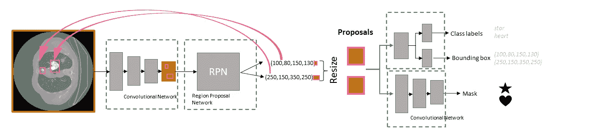
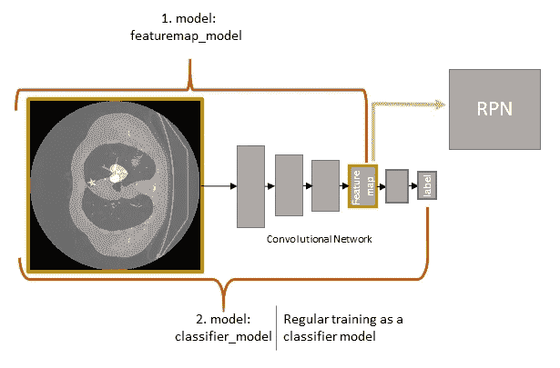
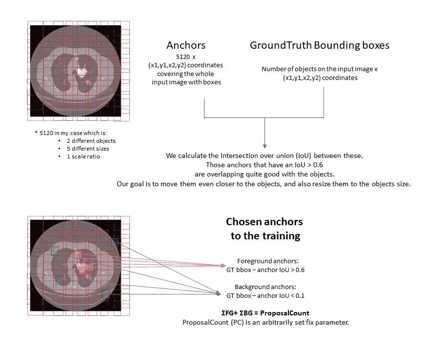
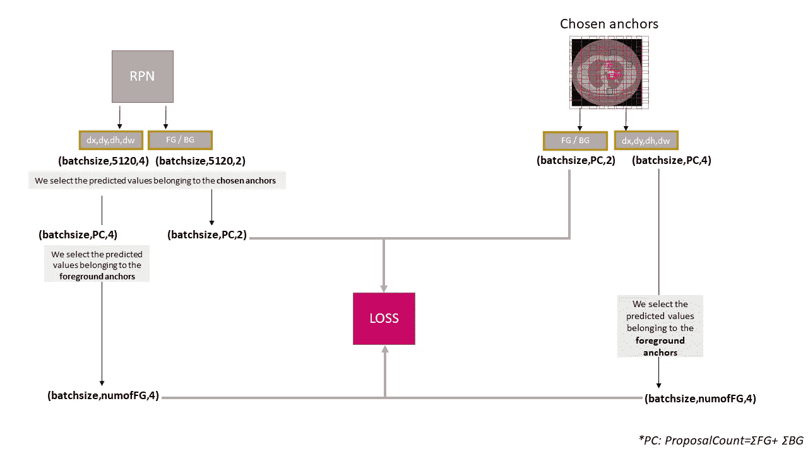
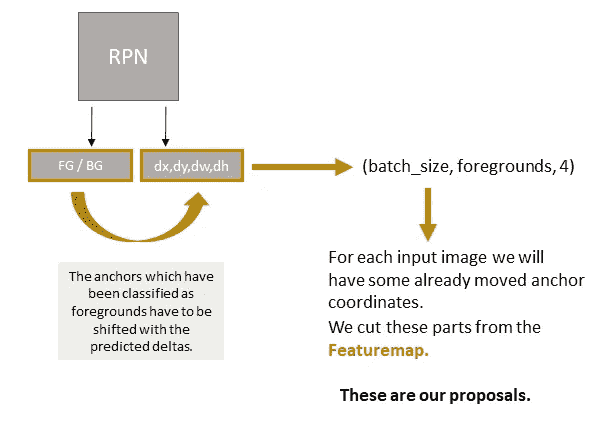

# 在 TensorFlow 和 Keras 中从头开始构建一个面具 R-CNN

> 原文：<https://towardsdatascience.com/building-a-mask-r-cnn-from-scratch-in-tensorflow-and-keras-c49c72acc272?source=collection_archive---------2----------------------->

## 讲解如何建立一个基本的面具 R-CNN，以学习为目的，没有喧嚣。

如果你曾经想在 TensorFlow 中从头实现一个 Mask R-CNN，你很可能找到了 [Matterport 的实现](https://github.com/matterport/Mask_RCNN/tree/master/mrcnn)。这是一个伟大的，如果你只想*使用*一个面具 R-CNN。然而，由于它非常健壮和复杂，很难彻底理解它的每一点。更大的问题是，它不能运行新版本的 TensorFlow。

如果你有机会使用 PyTorch 实现，最常用的是 [Detectron2](https://github.com/facebookresearch/detectron2) ，它也很难理解，因为它很复杂。

从所有关于 Mask R-CNN 如何工作的描述来看，实现起来似乎总是非常容易，但不知为何你还是找不到很多实现。

本文的目的是理解 R-CNN 掩码的基础，以及如何实现它。(假人用口罩 R-CNN？)因此，我的实现缺少了原始实现的一些重要部分，因为这主要是为了理解 R-CNN 是如何构建的。

**在我的实现中，基础模型不是特征金字塔网络(FPN)，ROI Align 也没有实现。*

为了训练和测试，我从 [LIDC-IDRI](https://wiki.cancerimagingarchive.net/display/Public/LIDC-IDRI) 公共肺部 CT 扫描数据集生成了一个玩具数据集，目标是分割非常(可笑？)简单的形状。为此，我放置了不同大小的心脏，并开始进行 CT 扫描，这些是我的面罩 R-CNN 必须找到、分类和分割的对象。

这就是 R-CNN 完整的面具的样子。绿色虚线方框标记了不同的神经网络。因此，整个模型由 4 个神经网络模型组成。图片作者。

1。第一步，要有骨干模型。这是一个简单的分类器模型。在我的例子中，它是一个多类标签分类器，在 matterport 的例子中，它是一个带有 ResNet101 主干的预训练 FPN。当训练掩模 R-CNN 时，我们永远不会使用这个网络的预测，我们只需要一个内层**特征图**。在分类器网络内部生成的那些特征地图将成为我们的**区域提议网络(RPN)的输入。**

我们的分类器是从输入到标签的 keras 模型，但是我们也保存了从输入到 featuremap 的 keras 模型(featuremap_model)。在训练分类器之后，该特征映射模型将从输入图像生成特征映射。图片作者。

2。第二步是 RPN。我认为这可能是网络中最复杂的部分。RPN 需要找到感兴趣的区域(ROI)。为此，它预测了 4 个坐标，以及每个锚点的标签。什么是**主播？**

锚点是预定义的不同大小的矩形，覆盖整个输入图像。我们根据我们的对象选择锚的大小/比例。
我们将选择与我们的对象重叠的对象，RPN 的工作是移动它们以更好地重叠，并调整它们的大小以更好地适应(预测的 4 个坐标)。为此，RPN 还需要识别哪些锚代表对象，即哪些锚是前景锚，哪些锚是背景锚(预测的 2 个数字)。

选择固定数量的主播进行训练。为此，我们需要计算每个锚点和每个真实边界框之间的交集(IoU)。我们总是用相同数量的锚来训练，然而，在每个输入的情况下，前景锚的数量是不同的。(例如，如果我们在图像上有一个小对象，我们将有一个前景锚，如果我们有两个较大的对象，我们将有最大提议计数/2 个前景锚。)图片由作者提供。

因此，我们选择我们的建议计数(PC)，它告诉我们有多少 RPN 的预测将对损失函数有贡献。(请记住，RPN 预测每个主播台！)
以我的 toydataset 为例，我们的背景(BG)远远多于前景(FG)，所以我的 PC 只有 20。即使我在 CT 扫描上有一个大明星和一颗大心脏，我只有大约 10 个前景锚，我们需要一个平衡的训练。(10 FG / 10 BG)如果你有更多的多事输入图像，你的 PC 会更大。

请记住，RPN 模型预测每个锚点的增量值和 fg/bg 标签。

对于这 20 个锚，我们知道真相标签和真相增量。δ是 4 个坐标:(δx，δy，δW，δH)。前两个显示了我们需要滑动锚的中心点多少，后两个显示了我们需要改变锚的宽度和高度多少。

RPN 损失由 class_loss + boundingbox_loss 组成。PC 个预测对 class_loss 有贡献，FG 个预测对 boundingbox_loss 有贡献。

RPN 损失是 class_loss 和 bbox_loss 的总和。class_loss 是一个简单的稀疏分类交叉熵，bbox_loss 是一个光滑 L1 函数。背景锚点不会导致 bbox 丢失，因为我们只需要移动已经重叠的锚点。图片作者。

在训练期间，我们简单地使用 rpnloss 作为 classloss + deltaloss 之和。如果有必要，我们可以使用损失权重。

现在，我们选择我们预测的锚作为前景，并将其与相应的预测增量一起移动。所以我们会有 NumberOfForegrounds * 4 个坐标，这些是我们的 ROI。我们从特征图中剪切这些区域，并将它们调整到相同的大小:这些是**提议。**这些将是我们的类、boxrefinement 头和 maskhead 的输入。(这些神经网络模型需要有一个固定的输入形状，为此，我们总是可以用零填充我们的预测。)

图片作者。

因为我们最多有两个对象是输入图像，所以我们的 RPN 很有可能移动了不同的锚点来与同一个对象重叠。我们将使用非最大抑制来过滤掉高度重叠的提议，因为它们是不必要的。我们只会保留最好的。

3。最后一步是“头部”模型，这些可以并行训练。
在我们有了我们的建议之后，我们需要一个神经网络来进一步细化包围盒坐标，并且预测分类标签。因此，它不仅会预测一个区域是前景还是背景，而且如果它是前景，它会对它进行分类(在我的 toydatasets 案例中是心形或星形)。就像在 RPN 的情况下，只有前景建议会造成盒损失，并且任意固定数量的建议 classlabel 会造成类损失。

我们不仅为每个建议预测一组盒精化坐标，而是三组。三是班级人数+1 为背景。

所以在我们的例子中，我们预测每个提议的 3*4 坐标。我们将基于我们在同一网络中预测的类来选择适当的盒细化坐标。

在训练过程中，我们简单地使用 chloss 作为 classloss + deltaloss 的总和。如果有必要，我们可以使用损失权重。我们使用一个新的提议计数，因为我们对 RPN 提议使用非最大值抑制，以避免提议重叠。正因为如此，我们将只剩下很少(< 5)的前景框，我们希望有一个平衡的训练。(大约 5FG-5BG 提案)

maskhead 是一个卷积网络，末端有一个上采样层。它仅对接收到的 ROI(而不是整个图像)预测一个遮罩。

最后一个卷积层的滤波器数目等于类的数目。当检查预测掩码时，我们需要使用过滤器，对应于 classlabel。因此，如果我们的标签是:0:star，1:heart，并且我们的输入图像上有一颗心，我们将从 filter 维度中获取第一个轴。

正如我之前提到的，这些头部模型可以并行训练，但是，如果没有分类预测，你无法预测一个面具。(与预测的情况一样，您没有基础真实类标签，因此您将需要预测类标签来选择合适的掩膜。)

这就是了，我们有一个正常工作的 R-CNN。希望这篇文章有助于理解基础知识，以便您可以实现自己的，甚至是改进的 Mask R-CNN。

你可以在 https://github.com/rajkifranciska/maskrcnn-from-scratch
找到整个实现和 toydataset 生成文件

如果这篇文章有帮助，请引用我的话:

[@misc](http://twitter.com/misc) {rajki_2021，
title = {在 TensorFlow 和 Keras 中从头开始构建一个面具 R-CNN }，journal={Medium}，
author={Rajki，Franciska}，
year={2021}，month={Mar}}

[1].瓦利德·阿卜杜拉
**掩膜 R-CNN 用于 Keras 和 Tensorflow 上的物体检测和实例分割**，2017
[https://github.com/matterport/Mask_RCNN](https://github.com/matterport/Mask_RCNN)

[2.]吴雨欣，亚历山大·基里洛夫，弗朗西斯科·马萨，卢万延，罗斯·吉斯克
**侦探 2** ，2019
https://github.com/facebookresearch/detectron2

[3].阿玛托三世，SG；麦克伦南，G；比达乌，L；McNitt-Gray，MF；迈耶河；美联社里夫斯；赵，乙；阿伯勒博士；亨施克，CI；埃里克·霍夫曼；卡泽罗尼，EA；麦克马洪；范·比克，EJR；Yankelevitz，D；Biancardi，AM；淡而无味，PH；布朗，密西西比州；恩格尔曼，RM；拉德拉赫，葛；Max，D；Pais 清，DPY 罗伯茨，RY；阿肯色州史密斯；斯塔基，A；巴特拉，P；卡利久里，P；法鲁奇，阿里；Gladish，GW；裘德，CM；Munden 佩特科夫斯卡，我；、乐；施瓦茨，LH；孙达拉姆湾；多德，勒；费尼莫尔，C；Gur，D；彼得里克，N；弗莱曼，J；柯比，J；休斯湾；卡斯特利，AV；Gupte，S；萨拉姆，M；医学博士希斯；MH 库恩；Dharaiya，E；伯恩斯河；Fryd，DS；萨尔加尼科夫，M；阿南德五世；Shreter，U；Vastagh，S；克罗夫特，由；克拉克唱片公司。
【http://doi.org/10.7937/K9/TCIA.2015.LO9QL9SX】肿瘤影像存档，2015
T24