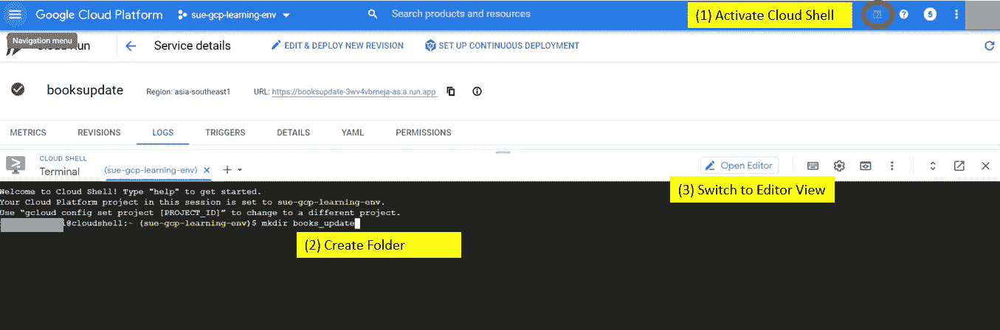
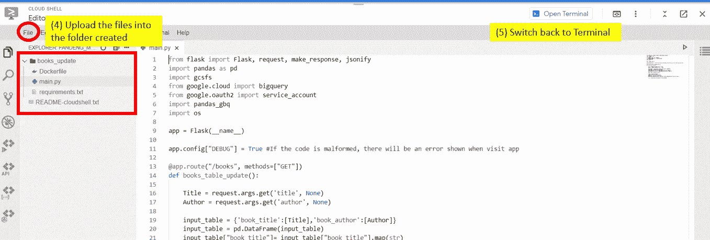
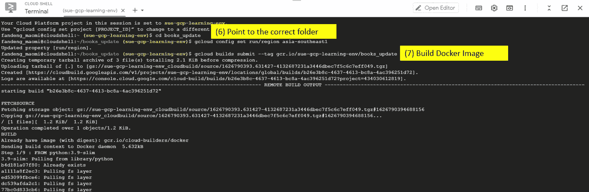
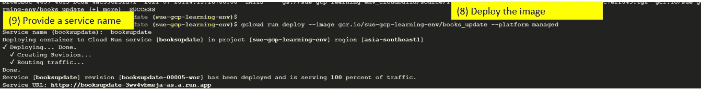
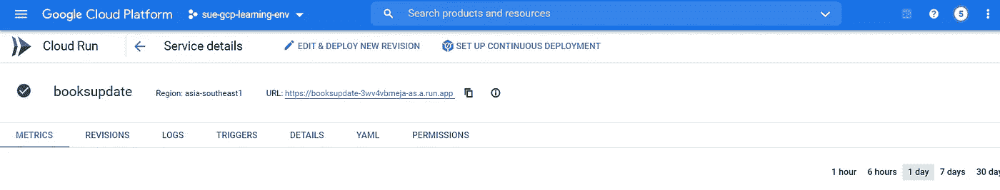
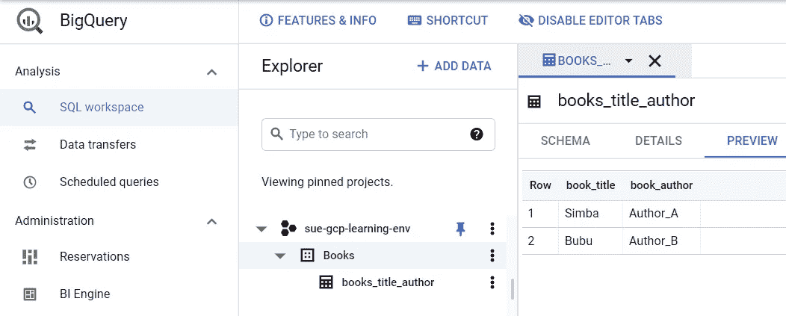
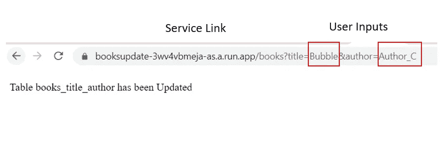
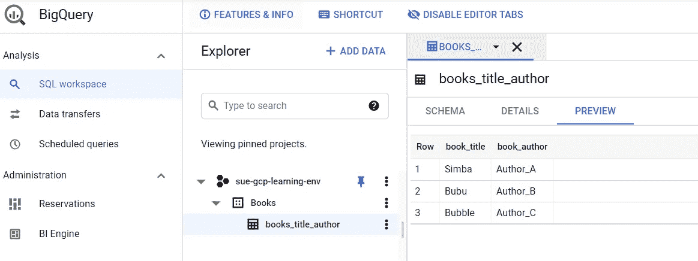

# 使用 Google Cloud Run 构建微服务

> 原文：<https://towardsdatascience.com/building-a-microservice-with-google-cloud-run-90f8df9682da?source=collection_archive---------22----------------------->

## 在 Cloud Run 上设置一个简单的 web 应用程序来更新 Big Query 中的表


照片由 [Sebastian Herrmann](https://unsplash.com/@herrherrmann) 拍摄自 [Unsplash](https://unsplash.com/?utm_source=medium&utm_medium=referral)

# **云上运行快速介绍**

Google cloud run 是一个完全托管的计算平台，用于在云上运行容器化的应用程序。Cloud run 通过基于应用流量的自动扩展功能，消除了管理所有基础架构的复杂性。

在本文中，我们将了解使用 python 和 flask 创建云运行微服务的方法，我们将把它们部署到 Docker 容器中。微服务将具有根据用户输入更新谷歌大查询表的功能。以下是将要使用的产品/服务:

*   Python 和 Flask
*   码头工人
*   谷歌云运行
*   谷歌云容器注册中心

最终结果将是一个运行在 HTTP 上的 web 应用程序，用户可以提交他们的输入，更新 Google Big Query 中的一个表。

# 我们开始吧！

本文假设您已经设置了一个 Google Cloud 帐户。

所有的脚本都可以在这里找到: [GitHub](https://github.com/iamsuelynn/Cloud-Run-Microservice-Example-1)

**(1)开发微服务所需的文件/脚本**

对于这个例子，我们将创建一个简单的应用程序，用户可以通过将输入传递到微服务链接，将书名和作者的新记录插入到一个大的查询表中。

创建云运行服务需要准备 3 个不同的文件。

*   main.py
*   requirements.txt
*   Dockerfile 文件

**文件号 1: main.py**

该文件将启动 Flask app，并包含 python 函数，该函数接收用户输入并更新到 Google Big 查询表中。

```
from flask import Flask, request, make_response, jsonify
import pandas as pd
import gcsfs
from google.cloud import bigquery
from google.oauth2 import service_account
import pandas_gbq
import osapp = Flask(__name__)app.config["DEBUG"] = True #If the code is malformed, there will be an error shown when visit app[@app](http://twitter.com/app).route("/books", methods=["GET"])
def books_table_update():

    Title = request.args.get('title', None)
    Author = request.args.get('author', None)input_table = {'book_title':[Title],'book_author':[Author]}
    input_table = pd.DataFrame(input_table)
    input_table["book_title"]= input_table["book_title"].map(str)
    input_table["book_author"]= input_table["book_author"].map(str)

    #Push table to Google Big Queryclient = bigquery.Client()
    project_id = 'sue-gcp-learning-env'
    table_id = 'Books.books_title_author'
    pandas_gbq.to_gbq(input_table, table_id, project_id=project_id, if_exists='append')

    return "Table books_title_author has been Updated"
```

**文件号 2: requirements.txt**

要求文件，以指定安装所需的库。

```
Flask
gunicorn
google-api-core
google-cloud-bigquery
pandas
pandas-gbq
gcsfs
```

**3 号文件:Dockerfile**

Dockerfile 文件指定如何创建容器:

*   从官方 python 3.9 映像构建一个容器
*   将本地代码复制到容器映像
*   在 requirements.txt 文件中安装软件包
*   在容器启动时运行 web 服务

```
# Use the official lightweight Python image.
# [https://hub.docker.com/_/python](https://hub.docker.com/_/python)
FROM python:3.9-slim# Allow statements and log messages to immediately appear in the Knative logs
ENV PYTHONUNBUFFERED True# Copy local code to the container image.
ENV APP_HOME /app
WORKDIR $APP_HOME
COPY . ./# Install production dependencies.
RUN pip install  --no-cache-dir -r requirements.txtENV PORT 8080CMD exec gunicorn --bind :$PORT --workers 1 --threads 8 --timeout 0 main:app
```

**(2)将所有 3 个文件/脚本上传到云壳编辑器**

在将文件/脚本上传到云壳编辑器之前，您需要在 Google 云控制台中激活云壳并创建一个文件夹。

```
mkdir books_update
```



在云壳中打开编辑器

右键单击新创建的文件夹或通过文件，将所有需要的文件/脚本上传到 books_update 文件夹。上传完成后，点击“打开终端”返回外壳编辑器。



将所有 3 个文件上传到创建的文件夹中

**(3)构建&部署新的 Docker 映像**

太好了！我们现在准备构建一个新的 docker 映像，它将在我们选择的区域运行。

```
gcloud config set run/region asia-southeast1gcloud builds submit --tag gcr.io/sue-gcp-learning-env/books_update
```



构建 Docker 映像的命令

构建完成后，运行下面的命令来部署新构建的映像。您需要提供云运行服务名称。当容器构建完成后，将会提供您的服务 URL。

```
gcloud run deploy --image gcr.io/sue-gcp-learning-env/books_update --platform managed
```



部署 Docker 映像并设置云运行服务名称

**(4)你的服务准备好了！**

容器构建完成后，将提供服务 URL。或者，我们可以从云运行中跟踪我们部署的服务。



云运行服务:图书更新

**(5)让我们测试一下我们的服务**

在调用服务之前，让我们检查一下调用服务时将要更新的大查询表。在这个表中，books_title_author 当前有 2 条记录，我们将通过调用我们的服务向这个表中添加一条新记录。



大查询表:books_title_author(调用服务前)

在这里，我们调用服务并传递我们想要为新记录添加的输入值。如果服务运行成功，它将返回我们指定的消息:“表 books_title_author 已更新”。



调用云运行服务并传递用户输入

让我们在 Google Big Query 中检查我们更新的表。



大查询表:books_title_author(调用服务后)

正如我们在刷新后的表中看到的，新记录是根据调用 URL 时指定的输入插入的。我们已经成功地在 Cloud Run 上创建了一个简单的 web 应用程序，它更新了 Google Big Query 中的一个表。

**结论**

通过 Google Cloud Run 部署微服务变得更加容易和方便，因为管理服务器的过程已经得到处理。只需要几个步骤，您就可以立即部署无状态微服务。下面是文章中解释的步骤的摘要:

*   准备 3 个主文件/脚本，包括(main.py、requirements.txt 和 Dockerfile)
*   将您的文件上传到 Google Cloud shell 编辑器以创建 Docker 容器。
*   部署完全构建的映像以创建完全托管的 web 应用程序。

这就是在云上创建微服务所需了解的全部内容。我希望这篇文章对那些学习使用 Google Cloud Run 创建微服务的人有用。

**参考文献**

[1][https://cloud . Google . com/run/docs/quick starts/build-and-deploy/python](https://cloud.google.com/run/docs/quickstarts/build-and-deploy/python)

[2][https://cloud . Google . com/blog/topics/developers-从业者/cloud-run-story-server less-containers](https://cloud.google.com/blog/topics/developers-practitioners/cloud-run-story-serverless-containers)

[3][https://www . kdnugges . com/2021/05/deploy-dockerized-fastapi-app-Google-cloud-platform . html](https://www.kdnuggets.com/2021/05/deploy-dockerized-fastapi-app-google-cloud-platform.html)