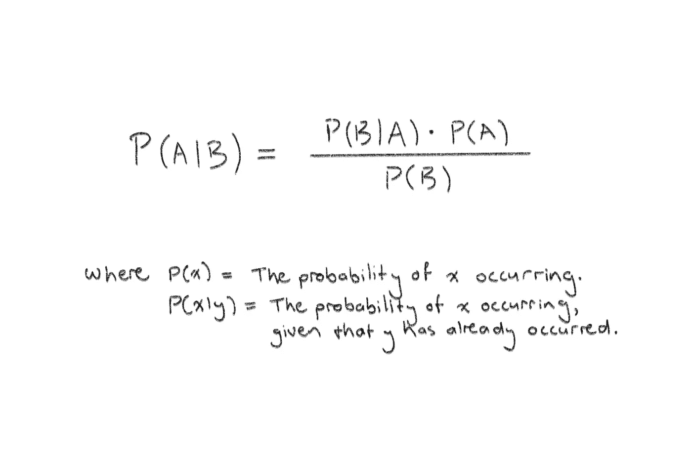
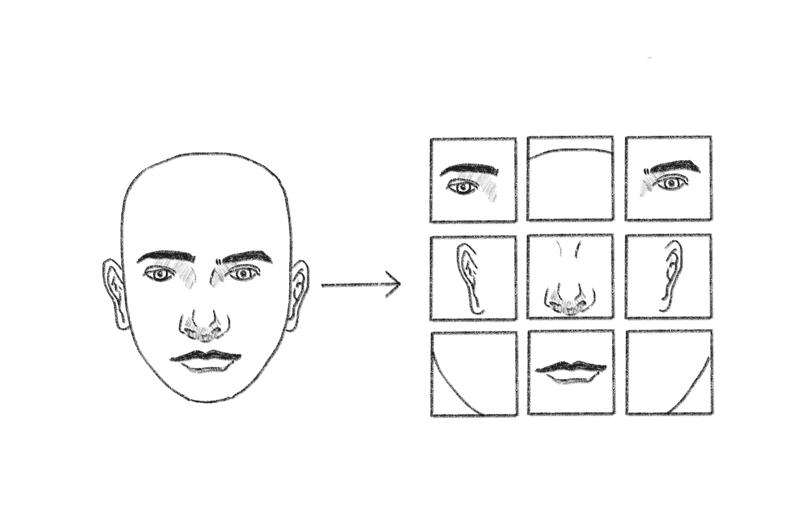

# 构建朴素贝叶斯机器学习模型对文本进行分类

> 原文：<https://towardsdatascience.com/building-a-naive-bayes-machine-learning-model-to-classify-text-71431ce20844?source=collection_archive---------8----------------------->

## 这是一个快速入门指南，帮助您使用 Python 启动并运行一个简单而高度相关的 NLP 项目


Python 中的朴素贝叶斯(所有图片由作者提供)

# 介绍

自然语言处理(NLP)是一个非常令人兴奋的领域。它位于计算机科学、语言学和人工智能的交汇点，关注人类语言和计算机之间的交互。更具体地说:它的目标是理解如何给计算机编程，以理解和解释我们的自然语言。

现在这是一个非常热门的研究领域，我很幸运能够在这个研究领域绝对前沿的大学就读。虽然作为一名卑微的本科生，我并不经常接触这种前沿工作——如果我接触了，我会理解的！

尽管如此，建立模型对自然语言进行分类还是相对简单的。这是一个很酷的练习，因为它是相关的。这是一个非常真实的 ML 应用，你可以在自己的项目中使用。



贝叶斯定理

# 朴素贝叶斯

朴素贝叶斯算法是一种更简单的监督贝叶斯网络模型，它是一种基于贝叶斯定理的概率分类器(您可能还记得高中的统计数据)。但它的简单性并不使它成为一个糟糕的选择，即使数据集不是很大(只有几千个样本)，它也可以产生高度准确的预测。

如果你真的是机器学习的新手，我建议阅读一些关于更基本算法的文章，然后回到这一篇，因为我将建立在这些文章中详细解释的概念上。

</k-means-clustering-for-beginners-ea2256154109>  

本质上，两个事件发生的条件概率是根据每个事件的条件概率计算出来的。因此，对于给定的一段文本，计算每个标签的概率，并输出具有最高概率的标签。

还有其他合适的选择，如支持向量机(SVM)，它需要更多的时间和计算资源来工作，但会产生比朴素贝叶斯更准确的预测。或者，您可以考虑基于神经网络的深度学习方法，但这将需要更多的训练数据。


米卡·鲍梅斯特在 [Unsplash](https://unsplash.com?utm_source=medium&utm_medium=referral) 上的照片

# 这个例子

这是一种方法:

1.  导入和设置数据。
2.  做一些分析以了解更多关于数据环境的信息。
3.  创建我们的因变量和自变量列表，用于训练和验证。
4.  给标签编码。
5.  从描述中提取特征。
6.  使数据符合模型。
7.  检查模型的准确性。

这个项目将演示如何根据银行交易的描述对其进行分类。我的数据集包含 12500 个样本，包括交易金额和交易类型等其他特征，您可以在模型中使用任意数量的特征，甚至可以选择一些特征来查看哪些特征对预测的影响最大，但为了简单起见，我们将只使用描述。

在我的数据集中，描述是这样的:

```
citylink
1Jul19 OYSTER
travelodge
6Jul19 RINGGO
SUNDRY DEBIT CONTACTLESS CAMDEN PARKING
stgcoach
trainline
Fin: CMT UK LTD  Cash at Transact
```

## 设置

当然，从进口开始。

1.  创建数据框架的熊猫。
2.  sci kit-了解标签编码、特征提取、建模和测量成功指标

```
import pandas as pd
from sklearn.preprocessing import LabelEncoder
from sklearn.feature_extraction.text import CountVectorizer
from sklearn import naive_bayes, metrics
```

接下来，让我们处理 csv 文件，并为模型做好准备。(当然，你可能没有处理 csv 文件，只是把你所有的数据导入到熊猫数据框架中):

```
features = pd.read_csv("bank_transaction_features.csv")
labels = pd.read_csv("bank_transaction_labels.csv")
```

我有两个数据集:一个包含要素，一个包含标注(类别)。这些是它们各自的列:

```
**bank_transaction_features:**
bank_transaction_id, bank_transaction_amount, bank_transaction_type**bank_transaction_labels:**
bank_transaction_id, bank_transaction_category, bank_transaction_dataset
```

它们有一个共同点，ID 列。因此，我将在这一列中合并它们，并删除任何具有空条目的行(在我的数据中很少，您应该计算有多少，因此删除它们对预测的影响可以忽略不计):

```
combined_df = pd.merge(left=features, right=labels)
combined_df = combined_df.dropna()
```

## 探索性分析

总是从一些探索性的数据分析开始。我的数据集有数以千计的样本，我无法通过扫描看到所有的类别。我们需要做一些简单的事情来更好地理解数据。

该数据集有一列指定样本是用于训练还是验证。这将在以后派上用场，因为我们不需要创建我们自己的训练/验证分割。但是对于探索性分析，我们可以删除该列(只从我们将创建的新 dataframe 变量中删除该列，保留包含该列的变量)。

```
explore_df = combined_df.drop(labels=['bank_transaction_dataset'], axis=1)
```

我们可以很容易地看到数据中存在哪些类别，以及每个类别中有多少个样本:

```
print(explore_df['bank_transaction_category'].value_counts())
```

结果是:

```
ACCOMMODATION_AND_MEALS    3765
TRAVEL                     3166
BANK_OR_FINANCE_CHARGES    2659
MOTOR_EXPENSES             1609
INSURANCE                  1170
Name: bank_transaction_category, dtype: int64
```

现在，让我们检查一下培训/验证分割是什么(使用仍有相关列的数据帧):

```
train_set = combined_df.loc[combined_df["bank_transaction_dataset"] == "TRAIN"]
val_set = combined_df.loc[combined_df["bank_transaction_dataset"] == "VAL"]

len_train = len(train_set)
len_val = len(val_set)
len_whole = len(explore_df)
print('Amount of training data: ', len_train)
print('Amount of validation data: ', len_val)
```

输出:

```
Amount of training data:  9891
Amount of validation data:  2478
```

这使得训练/验证的比例为 80/20，这是一个很好的比例，所以根本不需要调整。

## 分类

最后，有趣的部分。首先，创建 x 和 y 训练和验证子集。我们可以通过创建只包含相关列中数据的列表来实现这一点:

```
y_train = train_set['bank_transaction_category'].values
x_train = train_set['bank_transaction_description'].values

y_val = val_set['bank_transaction_category'].values
x_val = val_set['bank_transaction_description'].values
```

现在变得非常有趣了。需要记住的是，ML 模型不“理解”文本和单词。他们理解数字。因此，准备数据以适合模型的第一件事是对标签进行编码。这意味着，给每个标签分配一个号码。例如:

```
ACCOMMODATION_AND_MEALS    => 0
TRAVEL                     => 1
BANK_OR_FINANCE_CHARGES    => 2
MOTOR_EXPENSES             => 3
INSURANCE                  => 4
```

这是通过创建一个 *LabelEncoder* 对象并对因变量数据( *y* )使用其 *fit_transform* 函数来实现的:

```
label_encoder = LabelEncoder()
y_train = label_encoder.fit_transform(y_train)
y_test = label_encoder.fit_transform(y_val)
```

描述数据也是如此，只是这个稍微复杂一点。在一些模型中，你有一组统一的描述，并且你知道它们是什么，你可以把每一个编码成一个整数，它们就准备好了。但是在这里，每个事务描述都可能是唯一的。

解决方案是从文本中提取特征，并将这些特征转化为模型可以理解的向量。



特征抽出

虽然在技术上很复杂，但这可以简单地实现，通过使用*计数矢量器*将文本转换为令牌矩阵，并转换训练和验证独立变量( *x* ):

```
count_vector = CountVectorizer(analyzer='word', token_pattern=r'\w{1,}')
count_vector.fit(combined_df['bank_transaction_description'])

x_train_count = count_vector.transform(x_train)
x_valid_count = count_vector.transform(x_val)
```

就是这样！我们可以拟合数据、训练模型并做出预测:

```
classifier = naive_bayes.MultinomialNB()
classifier.fit(x_train_count, y_train)

predictions = classifier.predict(x_valid_count)
```

## 准确(性)

您可以使用几个指标来确定模型的工作情况。我们会用准确性。这将告诉我们模型正确预测银行交易类别的频率:

```
print(metrics.accuracy_score(predictions, y_test))
```

该模型的精确度为:

```
0.91
```

一点也不差。

# 结论

这是一个有趣的例子，因为它是有形的。例如，在移动金融跟踪应用程序中将银行交易分类是这种算法的一个非常真实的用例。我希望您对朴素贝叶斯是如何工作的，以及如何实现它对文本进行分类有了很好的理解。

如果你确实学到了一些东西，有任何问题，认为我错过了任何重要的东西，或者计划在你自己的项目中使用这个算法，请通过留下回复让我知道，我们可以讨论它。

编码快乐！

[**订阅**](https://medium.com/subscribe/@adenhaus) 📚为了不错过我的一篇新文章，如果你还不是一个中等会员，[加入](https://medium.com/@adenhaus/membership) 🚀去读我所有的，还有成千上万的其他故事！

# 资源

**Scikit Learn***sk Learn . preprocessing . label encoder*[https://Scikit-Learn . org/stable/modules/generated/sk Learn . preprocessing . label encoder . html](https://scikit-learn.org/stable/modules/generated/sklearn.preprocessing.LabelEncoder.html)

**Scikit Learn***sk Learn . feature _ extraction . text . count vectorizer*https://Scikit-Learn . org/stable/modules/generated/sk Learn . feature _ extraction . text . count vectorizer . html

**维基百科** *自然语言处理*[https://en.wikipedia.org/wiki/Natural_language_processing](https://en.wikipedia.org/wiki/Natural_language_processing)

**MonkeyLearn** *文本分类*【https://monkeylearn.com/text-classification/】T4