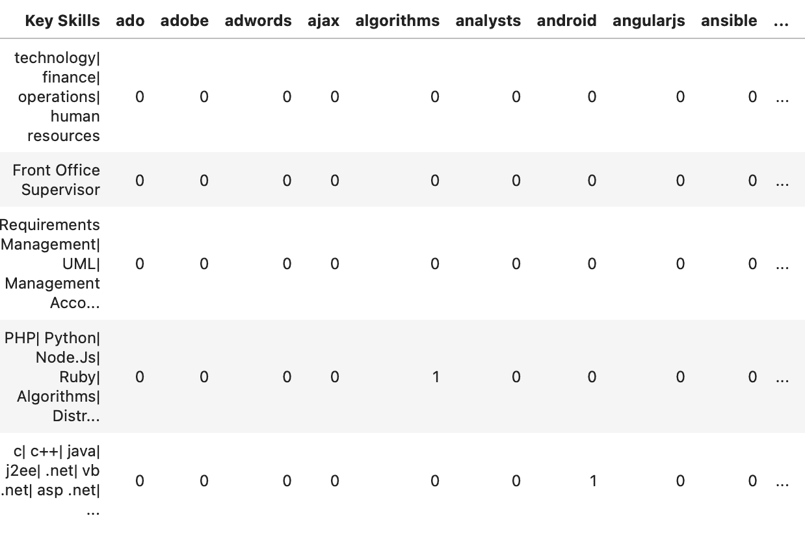
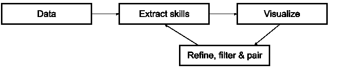
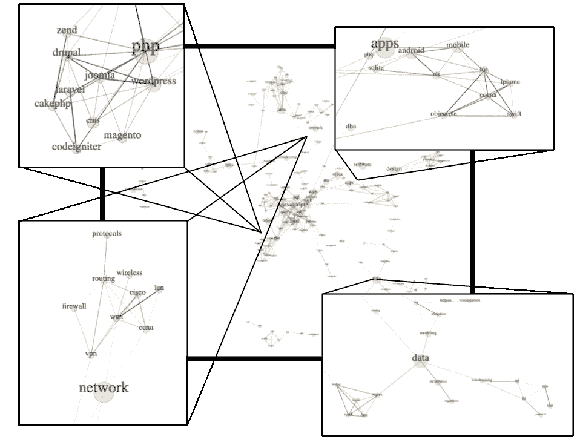
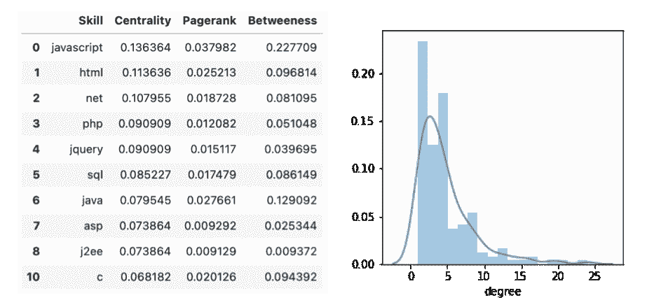

# 建立相关信息技术技能的网络

> 原文：<https://towardsdatascience.com/building-a-network-of-related-it-skills-cfc6e1827261?source=collection_archive---------26----------------------->

## 我分析了 30，000 份工作描述，构建了一个相关 IT 技能的网络图。

# 介绍

IT 职位描述提到了大量不同的框架、编程语言和其他技能。HTML 和 CSS 这样的语言显然是齐头并进的，但是有哪些不太明显的联系呢？在这个分析中，我分析了 30，000 份职位描述，以便找出专业职位的不同技能之间的关系。

我必须承认，我最初对工作描述数据集有另一个想法，但在这个过程中，进行这种网络分析似乎很酷。我仍然会完成原来的项目，但同时我想与你分享这个“信息技术技能分析”的过程。

请记住，本文仅仅描述了构建网络的过程。实际结果可以在这里找到[。](https://www.zhongtron.me/itjobs_fullscreen)

# 获取数据

从这个项目一开始，我就认为寻找数据是最困难的部分。基本上，我在搜索符合以下标准的数据集:

*   至少 10k 张唱片
*   包含职位描述的完整文本
*   所有职位描述都是针对 IT 职位的
*   最好是全英文的
*   最近(不到 3 岁)

我最初的想法是刮 Indeed.com。我很快使用 BS4 构建了一个简单的刮刀，但是在大约 1000 次请求之后，他们阻止了我。这给了我三个选择；改进刮刀以避免堵塞，刮另一个来源或寻找现成可用的数据集。我选择了后者，并很快在 Kaggle 上找到了[这个数据集](https://www.kaggle.com/promptcloud/jobs-on-naukricom/version/1)。尽管数据集不包含完整的描述，但有一列列出了所有技能，这正是我所需要的。

我下载了数据集，旋转了一个 Jupyter 笔记本，并调用了我忠实的[熊猫](https://pandas.pydata.org/) (Python 库)。

# 实体提取

## 这个概念

尽管数据集包含一个列有技能的列，但数据仍然非常粗糙。分析该列时，我们得到以下指标:

*   总技能:366528
*   绝技:6783
*   最短的技能:几乎任何单个字符
*   最长技能:*咨询对应*

当查看每项技能的出现次数时，最受欢迎的五项是:销售、管理、开发、执行和业务。考虑到所有这些信息(技能总数、拼写错误和不相关或过于普通的技能)，生成一个有限的相关技能集可能具有挑战性。在网络图中，我们使用术语实体，在这种情况下是技能。提取实体(或者在这种情况下获得一个清晰的技能列表)是生成网络数据过程的关键步骤。

创建网络图的步骤。(图片由作者提供)

## 方法

在我们的数据集中，每条记录代表一个不同的工作描述。“关键技能”列包含由竖线(|)分隔的技能列表，例如:

*“分析| SQL| MS Office|审计|金融服务| Oracle|数据挖掘|业务运营|资产管理|监控”。*

将竖条上的技能分开后，我们有了如上所述的 6783 个独特技能的长列表。现在，让我们试着把这个长长的列表简化成更小、更简洁、更有用、更相关的技能。

首先，我试图通过将所有内容转换成小写并删除所有前导和尾随空格来尽可能避免明显的重复。这应该确保例如“javascript”和“JavaScript”不被视为独立的技能，而仅仅是大写的原因。

一旦完成，我过滤掉这些技能，只显示那些出现至少 50 次的技能。这使得独特技能的总数下降到 2079。

为了进一步过滤，我使用了一个 Python 库来指示一个单词是否在英语词典中。大多数技术都有“CSS”或“PHP”这样的名字，在英语中几乎没有任何意义。然而，其他一些语言和工具确实在字典中占有一席之地，如“python”或“azure ”,所以对于剩余的单词，需要进行一些手动审查。

在完成这个人机交互的审查和筛选过程后，我有了一个大约 400 项与 IT 工作相关的技能的列表。

# 将这些点连接起来

好了，现在我有了要使用的技能列表和完整的数据集，是时候把这些点连接起来了。为了统计描述中每个技能的出现次数，我使用了一个叫做虚拟表的东西。基本上，它是一个表，其中你的列只有 0/1 值，表示一个真或假的位置。第一列(或索引)包含工作描述，而每一列代表一项技能。如果技能存在，单元值(工作描述和技能之间的交集)将为 1，否则为零。结果看起来像这样；

虚拟桌子。行:工作描述，列:技能(作者图片)

使用这个虚拟表，我创建了一个关联表。该表本质上指出了哪些列(或技能)具有相似的 0 和 1 模式。换句话说，它显示了哪些技能经常出现在同一个职位描述中。例如，如果两种技能总是出现在相同的描述中，它们在相同的记录中总是具有“1 值”,这将导致完美的关联:1。

从相关表中，我可以创建一个有 3 列的网络图表；两个用于所有技能的所有组合(例如 A 列(源))；“HTML”，col B(target)“CSS”等)和一个与这两种技能之间的相关性。我过滤了这个表，只显示相关性至少为 0.15 的技能组合(1 表示完全相关)。这是必要的，以防止他们所谓的“一团乱麻”，一个节点和边太多的网络图变得不可读。最后，我添加了一列“权重”,表示源技能在所有描述中出现的频率。权重将用于确定节点的大小(半径)。像 JavaScript 这样的流行语言出现在许多职位描述中，因此权重更大。

这张表包含了我可视化结果所需的所有信息。然而，即使数据已经准备好可视化，我们稍后还会回到这一步。网络图构建通常是一个迭代过程，在这个过程中，您使用最终结果(可视化)来细化、过滤和重新校准您的图模型。这基本上意味着你在数据和图表之间来回切换，以获得最佳结果。

实体提取的迭代过程。(图片由作者提供)

# 结果呢

## 视觉结果

在将前面步骤中的表格转换成 JSON 文件后，我构建了一个 [D3.js](https://d3js.org/) 强制定向图。哪像[这个](https://www.zhongtron.me/itjobs_fullscreen)；

部分网络图截图。(图片由作者提供)

当然这仅仅是截图的汇编，完整的互动网络图可以在[我的网站](https://www.zhongtron.me/itjobs_fullscreen)上找到，在那里你可以通过拖拽来缩放和移动节点。

节点的大小代表数据中的总出现次数，而边的厚度代表相关性的强度。换句话说，用粗边连接的两个大节点意味着这两种技能出现了很多次，并且经常一起出现。

## 技术细节

对于那些更熟悉开发网络图的人，我列出了一些关键指标:

*   节点:177
*   边缘:415
*   平均聚类系数:0.48
*   传递性:0.48
*   派系数量:152

中心性、Pagerank、Between 和 degree 分布。这张表是按照中心性排列的前 10 名。(图片由作者提供)

表格和直方图中显示的所有信息仅仅是网络图中显示内容的汇总版本。例如，中心性表示每个节点(或技能)相对于整个网络有多少条边(连接)。

Pagerank 和 betweenness 是相似的，但是更高级的度量标准。如果你想了解更多关于这些(和其他)网络指标的信息，你可以在[维基百科](https://en.wikipedia.org/wiki/Centrality)或其他许多免费在线资源上找到。

## 洞察力

网络图清楚地显示了由 IT 中常见角色(如数据、设计、系统、前端等)定义的不同集群。该图表还显示了集群之间的关键连接器。如果你想进入一个新的领域，这可能会很有帮助，因为关键的连接器技能提供了一个与两个领域都相关的良好起点。

开始他们的计算机科学或编码之旅的人也可以识别哪些技能可能是在他们最感兴趣的领域获得个人成长的良好开端。

虽然这张图表没有提供任何有待发现的突破性见解，但它似乎提供了一种非常直观和容易理解的方式来查看 it 招聘前景。

# 进一步研究和改进

## 更多数据

这适用于我几乎所有的项目，无论是专业的还是个人的。很少有更多的数据对模型、指标、可视化或其他数据应用程序没有好处的情况。虽然我很高兴发现这个数据集有 30k 条结构良好的记录，但如果能有更多就更好了。另一种可能性也可以是使用提取的实体并将它们应用于其他数据集。这相当简单，因为构建技能列表最需要干净的数据。

## 时间序列

我经常感兴趣的另一个观点是时间序列。对于这个项目来说，看到不同的 it 技能和它们的重要性是如何演变的将是特别令人着迷的。在多年的时间里，你可能会看到某些新技能是如何融合和扩展的，而其他技能会像我们银河系中的黑矮星一样慢慢萎缩和消亡。

## 无监督聚类

对于大多数职位描述来说，把它们归类到特定的职位群中并不困难。例如，大多数需要机器学习技能的工作最有可能被贴上数据科学或者数据工程的标签。这些集群通常是显而易见的，也是众所周知的，但以一种无人监管的方式发现集群将会很有趣。这意味着我们将所有数据输入机器，看看它是否能为我们找到特定的(重复出现的)配置文件。

## 高级实体配对

最后，我觉得在实体配对过程中可以做很多改进。我在个人项目上投入的时间和精力是有限的，我可能在开发的这个特定部分走了太多捷径。实体配对是复杂的，需要大量的手工修改和特定领域的知识。有无数的框架、语言和专业，其中许多我都不熟悉。我可能删除了相关的或者忽略了它们的配对。在实体提取和配对上花费更多的时间肯定会改进这个模型。

# 技术堆栈

Python (Pandas，Numpy，NLTK 和 RegEx)，JavaScript (D3.js)，HTML 和 CSS。

关于我:我叫布鲁诺，是一名数据科学顾问。如果你想看看我做的其他东西，比如咕哝说唱探测器，一定要看看我的个人资料。或者通过我的网站与我联系:[*https://www . zhongtron . me*](https://www.zhongtron.me/)