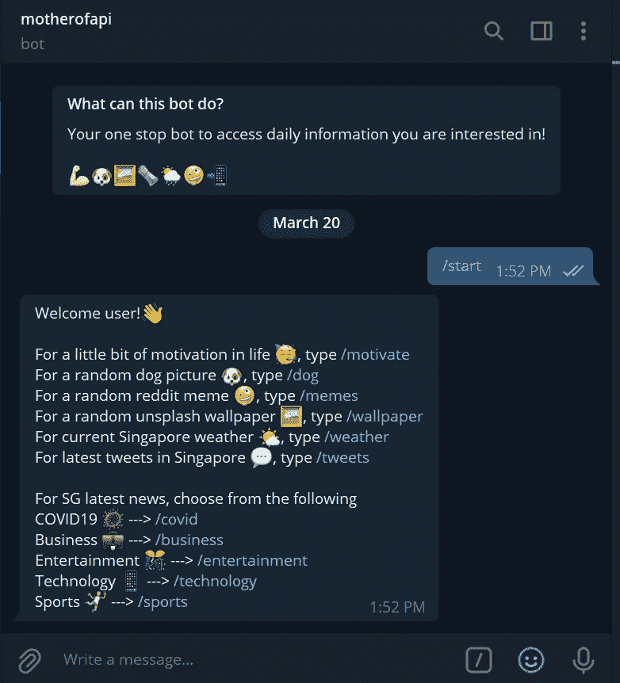
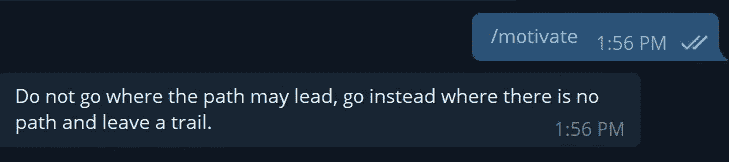
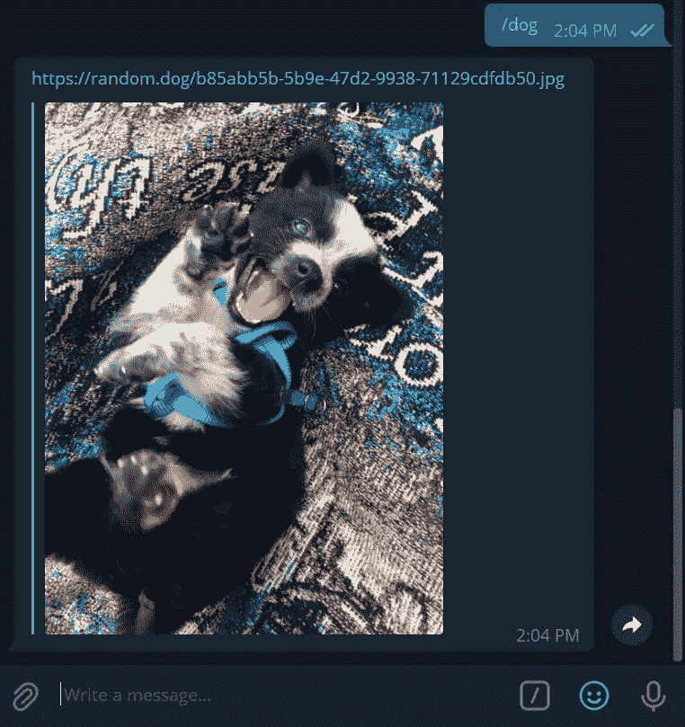
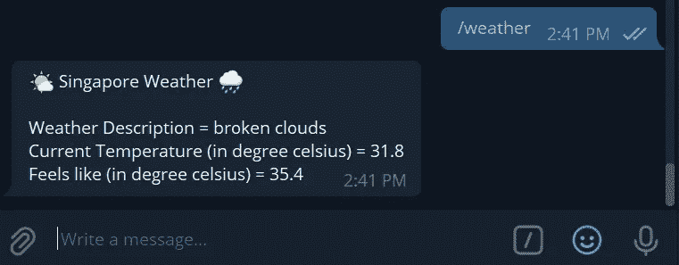

# 用 Python 在 Telegram 上构建一站式 API 调用程序

> 原文：<https://towardsdatascience.com/building-a-one-stop-api-caller-on-telegram-with-python-f8ff845d5985?source=collection_archive---------17----------------------->

## 在电报机器人上检索最新的天气、新闻、推文和一丝快乐



图片由作者提供— motherofapi 电报机器人

在我之前的[文章](https://medium.com/nerd-for-tech/building-a-telegram-bot-for-a-love-confession-65a2064a1688)中，我写了我如何利用电报机器人进行爱的告白。这个想法实际上是在我构建我今天要写的这个 bot(如上面的截图所示)时产生的，它是一个一站式门户，集成了来自公共可用资源的多个应用程序编程接口(API)调用来检索信息。以下是我在这个机器人中包含的 API 列表，我将解释我是如何设法集成到我的电报机器人中的:

1.  **可引用的*(/激励)***——用于随机激励引用
2.  **random . dog*****(/dog)***—为一张随机的狗狗图片/gif
3.  **reddit*(/memes)***—来自 Reddit 的随机 memes
4.  **unsplash*(/壁纸)*** —从 Unsplash 中随机选择壁纸
5.  **openweathermap*****(/weather)***——新加坡今天的天气
6.  **推特 *(/tweets)*** —与用户输入相关的最新推文
7.  **newsapi*(/news)***——新加坡今日最新消息

在 BotFather 上创建 Telegram bot、将其托管在 Heroku 服务器上的步骤，以及如何通过 Python 在 Telegram Bot 上构建命令处理程序，本文都不会提及。如果你有兴趣，可以参考我以前的[文章](https://medium.com/nerd-for-tech/building-a-telegram-bot-for-a-love-confession-65a2064a1688)或者去谷歌一下！从一开始就自己动手做东西绝对是一件有趣又充实的事情。

# /motivate 命令

励志名言是我经常听到的，有时候当我需要一些额外的动力来度过一天时，我会浏览 Instagram 或脸书等社交媒体平台来寻找它们。谢天谢地，这样的 API 是存在的，而且它来自 [quotable](https://api.quotable.io/random) 。如果你点击链接，一个随机的引用将以 JSON 格式出现，这是一个非常好的结构化的数据返回方式。

```
# motivational quote
def motivate(update, context):
    quote = requests.request(url='[https://api.quotable.io/random',method='get'](https://api.quotable.io/random',method='get'))
    update.message.reply_text(quote.json()['content'])
```

这方面的 Python 代码非常简单，其中创建了一个命令`motivate`,然后该命令将对 quotable API 进行请求调用。在此之后，我们的机器人将只返回返回结果的*内容*部分中的内容，这将在电报上向用户显示报价。



作者图片—/激励命令

# /dog 命令

在最初阶段，当我对用 Python 构建一个电报机器人非常好奇时，我遇到了这个 API。这个 [API](https://random.dog/) 会在你调用它的时候返回一个随机的狗图片或者 gif，好消息是我们也可以得到 JSON 格式的结果。

```
# dog pics
def dog(update, context):
    contents = requests.get('[https://random.dog/woof.json').json()](https://random.dog/woof.json').json())
    update.message.reply_text(contents['url'])
```

代码非常类似于`motivate`,其中我们创建了一个命令`dog`,它将在被请求时调用 random.dog API，并以 URL 的形式返回图像/gif。然后，我们继续在 Telegram 上将 URL 返回给用户，这将直接在 Telegram 上显示图像/GIF。



图片作者—/狗命令

# /memes 命令

模因现在真的很受欢迎，谢天谢地流行论坛网站 Reddit 有这样一个 API。这个命令不像前两个命令那么简单，因为我们需要在 [Reddit](https://www.reddit.com/wiki/api) 上创建一个帐户，以便能够使用它的 API，其中包含一些认证信息(即 *client_id、client_secret、password、user_agent、username* )。

```
# memes
def memes(update, context):
    reddit = praw.Reddit(client_id='...',
                     client_secret='...', 
                     password='...',
                     user_agent='...',
                     username='...')
    subreddit = reddit.subreddit('memes;)
    meme = subreddit.random()
    update.message.reply_text(meme.url)
```

你可以参考上面关于如何设置帐户的链接，我在这里使用的 Python 库模块是 ***praw*** *，*你可以在这里找到文档。一旦我们用个人密钥设置了认证，我们就可以使用`reddit.subreddit('memes')`生成一个随机的 meme URL，当用户执行`memes`命令时，我们将返回这个 URL。


图片作者— /memes command

# /wallpaper 命令

我相信 Medium 上的大多数作者都会熟悉平台 **Unsplash** ，它为我们提供了非常好的图片，供我们在文章中使用。我很高兴知道他们也有一个可供用户提出这种请求的 API。对于这个 API，您还需要在 [Unsplash](https://unsplash.com/developers) 上创建一个开发者帐户，您将获得一个 *client_id* 来包含在您的代码中。

```
# unsplash wallpaper
def wallpaper(update, context):
    url = '[https://api.unsplash.com/photos/random/?client_id=...'](https://api.unsplash.com/photos/random/?client_id=ZNEwrJqYtbXb1jHagKCfRVTnOe6d2rk2ACCN5d3P2HM')
    response = requests.get(url)
    wall_pic = response.json()['urls']['regular']
    update.message.reply_text(wall_pic)
```

使用 *client_id* ，API 将返回 JSON 格式的结果，其中我们将只提取*URL*和*常规*维度(当用户调用`wallpaper`命令时，您也可以返回 *raw、full、regular、small* 或 *thumb* )。


作者图片—/壁纸命令

# /天气命令

我记得当我在墨尔本学习时，每天早上出门前查看天气是必不可少的一步，因为那里的天气波动很大。谢天谢地，新加坡的天气波动不是很大，但是当你出门的时候，知道天气还是很好的。 *Openweathermap* API 是我在我的机器人中想要天气信息时的首选，它还包含其他信息，如道路风险、紫外线指数和空气污染指数。你需要为这个 API 创建一个开发者账户，在[这里](https://openweathermap.org/api)，你会得到一个 *api_key。*

```
# weather
api_key = "..."
base_url = "[http://api.openweathermap.org/data/2.5/weather](http://api.openweathermap.org/data/2.5/weather)?"
complete_url = base_url + "appid=" + api_key + "&q=" + "singapore" 
response = requests.get(complete_url) 
x = response.json() 
current_temperature = x['main']['temp']-273.15
feels_like = x['main']['feels_like']-273.15
weather_description = x['weather'][0]['description']
def weather(update, context):
    weather_stats = "\U0001F324 Singapore Weather \U0001F327" + "\n\nWeather Description = " + str(weather_description) + \
      "\nCurrent Temperature (in degree celsius) = " + str(round(current_temperature,1)) + \
      "\nFeels like (in degree celsius) = " + str(round(feels_like,1))
    update.message.reply_text(weather_stats)
```

因为我住在新加坡，所以我在请求中包含了 s *ingapore* 作为请求的一部分，当用户调用`weather`命令时，我将返回当前的温度、现在的感觉以及天气描述。注意 API 返回的温度是华氏温度，这解释了为什么需要减去 273.15 来得到摄氏度。还完成了一些文本处理和格式化步骤，以便将结果返回给用户，如下所示。



图片作者—/天气命令

# /tweets 命令

我敢肯定，大多数数据科学爱好者都玩过 Twitter API，自然语言处理将在推文上完成，并可能导致[情感分析](/twitter-text-analysis-in-r-ed7b81ecdb9a)。我的想法是让用户能够键入他们感兴趣的任何关键词，机器人将提取与输入的关键词相关的最新推文。我发现这在股票投资的时候(比如搜索*“比特币】*)或者有兴趣了解身边发生的事情的时候(比如搜索*“裕廊东方】**)特别有用。*

```
# twitter    
def tweets(update, context):
    update.message.reply_text(text='What Twitter topics are you interested in?')
def tweets_reply(update, context):
    user_input = update.message.text
    consumer_key= '...'
    consumer_secret= '...'
    access_token= '...'
    access_token_secret= '...'
    twitter = Twitter(auth = OAuth(access_token, access_token_secret, consumer_key, consumer_secret))
    latitude = 1.3521    
    longitude = 103.8198    
    max_range = 20
    query_search = user_input + "-filter:retweets"
    query = twitter.search.tweets(q = query_search, geocode = "%f,%f,%dkm" % (latitude, longitude, max_range), lang='en',count=3)
    answer = f'\U0001F4F1 Showing latest 3 tweets in SG for: {user_input}'
    update.message.reply_text(answer)
    update.message.reply_text(query['statuses'][0]['text'])
    update.message.reply_text(query['statuses'][1]['text'])
    update.message.reply_text(query['statuses'][2]['text'])
```

这个命令的代码比较长，它包含两个函数，一个是提示用户输入搜索词，另一个是内部调用 Twitter API，并将最近的 3 条相关推文返回给用户。像往常一样，需要一个[开发者](https://developer.twitter.com/en/docs/twitter-api)账户来获取*消费者密钥、消费者秘密、访问令牌、访问令牌秘密*。在获得 *search_term 后，*机器人将调用 Twitter API，并继续搜索新加坡最近的 3 条推文(即，我已经设置了*纬度*和*经度*)。然后,`tweets`命令会将最近的 3 条 tweets 返回给用户。


图片由作者提供— /tweets 命令，输入“比特币”

# /news 命令

最后一个命令将通过调用 *newsapi* API 为用户检索最新的新闻。注意，我没有将这个命令命名为`news`，而是分成了 5 个不同的命令`covid`、`technology`、`business`、`sports`、`entertainment`，因为 API 允许我根据类别发出请求。你还需要在[这里](https://newsapi.org/register)注册一个开发者账户来获得 *api_key。*

```
# business news
newsapi = NewsApiClient(api_key='...')
business_news = newsapi.get_top_headlines(category='business', language='en', country='sg', page_size=3)
def business(update, context):
    business1 = list(business_news.values())[2][0]['title'] + '\n\n' + list(business_news.values())[2][0]['url']
    business2 = list(business_news.values())[2][1]['title'] + '\n\n' + list(business_news.values())[2][1]['url']
    business3 = list(business_news.values())[2][2]['title'] + '\n\n' + list(business_news.values())[2][2]['url']
    update.message.reply_text(business1)
    update.message.reply_text(business2)
    update.message.reply_text(business3)
```

我在 API 命令中列出了根据所选的不同类别检索最新的 3 条新加坡新闻。对于上面的代码，运行`business`命令将返回预览和来自新加坡的最新 3 条商业相关新闻的 URL 链接。


图片作者—/商业命令

# 结尾注释

有大量其他 API 可供开发人员免费使用，我一定会在这个机器人上添加更多命令，这样它就可以真正成为用户访问日常信息的一站式门户。这个机器人对每个人都是公开的，你可以在 Telegram 上找到 [**motherofapi**](http://t.me/motherofapi_bot) 来开始使用这个机器人。请注意，由于这个 bot 托管在 Heroku 平台上，当您运行它时，它可能需要 15 秒钟才能启动。希望你喜欢这篇文章以及我的机器人，并通过评论这篇文章向我推荐你希望在这个机器人中看到的可能的想法/API，干杯！:D

[](https://www.buymeacoffee.com/tankahwang)