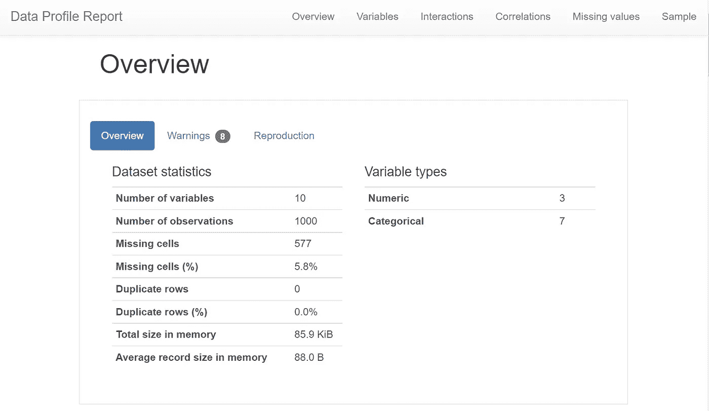
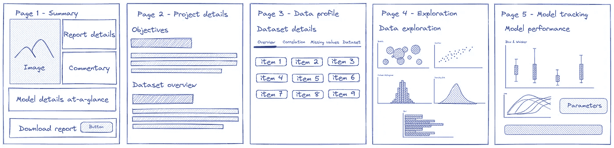
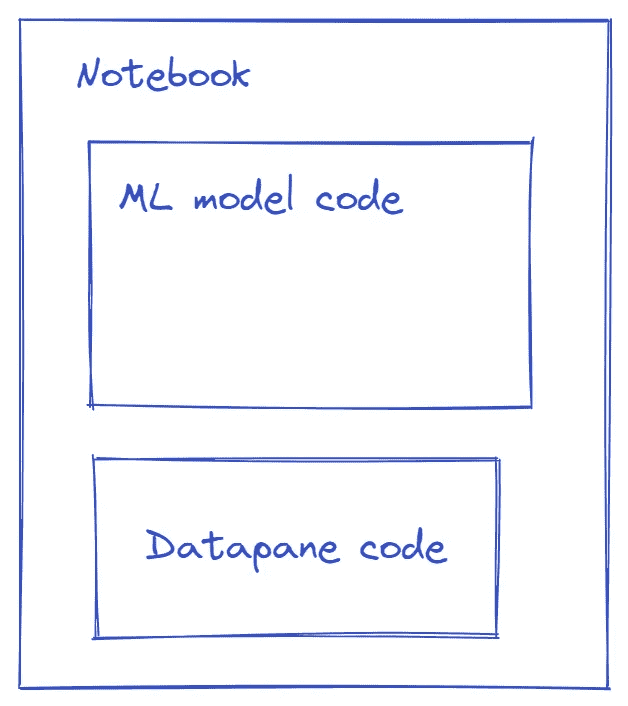

# 建立信用风险模型的可视化模型监控系统

> 原文：<https://towardsdatascience.com/building-a-pipeline-monitoring-system-for-credit-risk-models-db55f9a49f7e?source=collection_archive---------19----------------------->

## 在本教程中，我们将从头开始使用 ML 构建一个信用风险模型，并使用一个使用 Datapane 的可视化跟踪系统来监控它。

纽约公共图书馆拍摄于 [Unsplash](https://unsplash.com?utm_source=medium&utm_medium=referral)

想买新房？有可能你需要从银行贷款，这将涉及信用风险评估。

> 什么是信用风险？[信用风险](https://www.yodlee.com/data-analytics/credit-risk-models/what-is-credit-risk-modeling-and-analysis)是指借款人因未能支付所需款项而违约的可能性。风险是金融机构和其他贷方贷款模式的固有部分。

# 介绍

信贷风险建模是贷款人确定贷款偿还可能性的最有效方法。贷方使用历史数据，如支付历史、当前债务水平和信用历史的平均长度，来预测消费者未来拖欠贷款的可能性。在本教程中，我们将从头开始开发一个信用风险机器学习模型，并构建一个数据面板报告来监控和跟踪管道。

## 为什么需要模型监控？

我们希望确保该模型仍然可以基于新的客户数据准确预测违约者，因为人口构成可能会随着时间的推移而变化。让我们假设我们使用 2000 年至 2018 年的数据建立了一个信用风险模型——这是一个强大的数据集，因为它涵盖了很长一段时间以及像 2008 年金融危机这样的中断期。该模型在 2019 年之前表现良好，但不能确定它在 2020 年或 2021 年仍然有用——只要想想世界因 COVID 而改变了多少。监控系统有助于识别随时间的变化，以便我们可以在必要时调整我们的模型。

我们将在本教程中介绍模型开发的基础，我们的主要焦点将是使用 Datapane 创建跟踪系统。详细的代码可以在 Github 上找到[。](https://github.com/shoumikgoswami/ML-pipeline)

*免责声明:本文是与 Datapane 合作撰写的，我是 datapane 团队的一名社区布道者。*

# 利用机器学习建立信用风险模型

## **步骤 1 —初步分析**

在本教程中，我们将使用来自 Kaggle 的[德国信用风险分类数据集](https://www.kaggle.com/kabure/german-credit-data-with-risk)。该数据集包含 1000 个条目，具有 Hofmann 教授准备的 20 个类别/符号属性。在这个数据集中，每个条目代表一个从银行贷款的人。根据属性集，每个人被划分为好的或坏的信用风险。

来源:图片由作者创作

一旦数据加载完毕，我们将使用 [Pandas Profiling](https://github.com/pandas-profiling/pandas-profiling) 自动生成一份包含数据集基本信息的报告，如描述性统计、缺失值、相关性等。虽然通常的方法是生成一个 HTML 报告，但是我们将使用 JSON extract 来标识我们的 Datapane 报告所需的变量。

## 步骤 2-为报告创建数据可视化绘图

完成初步分析后，我们需要创建几个图来进行数据探索。这些图背后的想法是突出任何数据差异或现有数据的差异，这些数据是模型训练的基础。一旦创建了图，我们需要确保将它们存储在变量中，然后可以直接在我们的报告中使用。

我们为此创造了几个情节，你可以参考笔记本上的代码。

## 步骤 3 —预处理数据

一旦我们很好地理解了数据及其隐藏的特征，我们现在将着手建立我们的信用风险模型。但在此之前，我们将做一些基本的预处理步骤，以确保我们的数据得到很好的净化，我们可以建立一个体面的模型。

> 由于数据处理涉及大量数据转换，建议在报告中添加前后图像，以确保转换正常工作。

我们可以删除不需要的变量，并将数据集分成训练集和测试集。

## 步骤 4-训练多个模型以找到最佳模型

现在我们的数据已经准备好了，我们将训练我们的模型，根据已经标记的数据来预测一个人是否有信用风险(“Risk_bad”)。我们保留 25%的训练数据用于测试目的。

我们需要训练多个模型来找到表现最好的一个。为了快速做到这一点，我们将所有的模型添加到一个循环中，然后根据它们的回忆分数对它们进行评估。

我们以这样的情节结束-

基于此，我们将选择高斯 NB 作为我们的首选模型，因为它具有最高的准确性。

## 步骤 5——建立信用风险模型

我们将使用高斯 NB 算法来构建我们的模型。你可以在这里阅读更多关于这个[的内容。](https://scikit-learn.org/stable/modules/generated/sklearn.naive_bayes.GaussianNB.html)

我们得到了 70.53%的准确率，这对于一个简单的模型来说是相当不错的。我们来评价一下分类矩阵。

我们得到了 68%的精确度和 65%的召回分数，以及 66%的 F1 分数。虽然分数不是最佳的，但我们总是可以提高。如果你对提高模型性能感兴趣，你可以在这里查看笔记本。

我们还将绘制 ROC 曲线，并将其保存为图。这些视觉元素将作为报告的一部分添加进来。

现在我们已经完成了创建信用风险模型的基本步骤，让我们设计并构建 Datapane 报告，它将作为一个监控系统来跟踪数据和模型如何随时间变化。

# 使用 Datapane 设计和构建可视化模型监控系统

## 步骤 1 —设计数据面板报告

要构建一份全面且涵盖 MLOps 清单大部分方面的报告，重要的是首先设计报告，然后在此基础上构建。我们会把报告写得非常简单，只有 5 页纸-

来源:图片由作者创作

*   **Summary page** —该页面将提供每个迭代的变更的高级视图，例如报告更新日期、更新注释(供数据团队向报告添加关于变更的注释)、基本模型属性以及下载报告的链接。
*   **项目详情** —该页面将提供关于项目、相关数据集和数据属性的简要说明。当与可能不了解项目完整细节的风险承担者共享报告时，这很有帮助。
*   **数据概要** —该页面将提供数据概要元素，例如数据的不同特征、相关性、缺失变量，以及在需要时访问整个数据集的方法。
*   **探索** —该页面将展示分析的数据可视化元素。分析过程中创建的所有图和可视元素都可以在此处分组和显示。
*   **模型跟踪** —这将是最后一页，提供关于所用模型、其性能参数和评估矩阵的信息。

## 步骤 2——在 Datapane 中构建报告页面

为了构建数据面板报告，我们将遵循一个 3 步流程

*   定义页面的单个元素。
*   定义包含所有元素的页面。
*   将页面添加到报表中。

> 如果您是 datapane 的新手，请查看这里的指南[开始使用。](https://docs.datapane.com/tut-getting-started)

例如，为了构建摘要页面，首先，我们定义文本块、图像块和 BigNumbers 块。

我们还将从我们的配置文件报告中提取值，并为它创建另一个块。

## 步骤 3-创建数据面板报告

接下来，我们将所有这些块添加到页面中。

最后，我们将所有页面添加到报告中。

这种结构增加了整个过程的简单性和模块化！类似地，定义所有页面并将它们添加到报告中。

## 步骤 4——将报告发布到 Datapane

一旦[创建了报告](https://docs.datapane.com/reports/tut-creating-a-report#creating-a-report)并且[预览了它](https://docs.datapane.com/reports/tut-creating-a-report#previewing-your-report) , [将报告](https://docs.datapane.com/reports/publishing-and-sharing#publish-your-report)发布到数据面板。最后你应该会有[这个](https://datapane.com/u/shoumik/reports/machine-learning-tracking-and-monitoring-system-using-datapane/)这样的东西。

## 步骤 5 —将数据面板代码添加到笔记本中

成功发布报告后，添加代码文件作为笔记本/脚本文件的一部分。

来源:图片由作者创作

因此，无论笔记本或脚本何时运行，报告都会得到更新，并反映可以根据需要与利益相关者共享的更改。

# 将数据面板报告集成到您的 ML 管道中

一旦您对 Datapane 报告感到满意，您就可以将笔记本作为数据管道的一部分来运行。有几种方法可以做到这一点:

*   每次想要更新模型时，请手动运行笔记本
*   从您的主 Python 笔记本创建一个 Datapane 脚本
*   根据新数据定期重新培训的模型的工作
*   [气流](https://airflow.apache.org/)用于更复杂的 ML 管道

# 结论

机器学习允许我们创造全新的产品和能力，这是通过传统的软件开发不可能实现的。然而，这些模型仍然可能以独特和不可预测的方式失败。

有了监控系统，团队可以实时跟踪模型并评估它们的性能。它还可以帮助识别基础数据中不断变化的模式和新的流入，以便在必要时重新训练模型。

使用 Datapane 这样的开源工具，而不是复杂的 MLOps 平台，可以非常容易地构建这个监控系统。它不仅是可视化的，而且可以通过电子邮件/Slack 共享，这样所有的利益相关者都可以及时了解最新情况，从而做出业务决策。