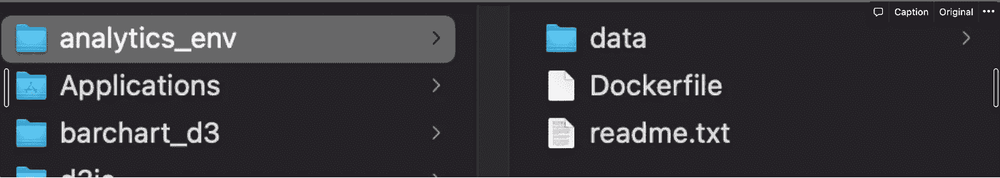

# 使用 Docker (2021)构建可移植的数据科学环境

> 原文：<https://towardsdatascience.com/building-a-portable-data-science-environment-using-docker-2021-6d533fe2b86a?source=collection_archive---------19----------------------->

## 一个 Docker 驱动的虚拟环境，供初学者随时随地使用


图 1 —对接过程(原始)

在过去的一年中，我不得不三次更换我的工作笔记本电脑，并且在错误的地方设置新的开发机器总是一件痛苦的事情。

我最终决定尝试一下 Docker，并发现它非常有用。

然而，学习 Docker 是一个挑战，因为不完整的资源分散在互联网上。我不想成为 Docker 大师，我只需要知道足够多的信息来避免依赖性问题，并根据我的需要构建+复制我的工作环境。

我使用 Docker 作为数据科学和分析工作的首选环境。我很少被要求制作我的作品，但是，如果你需要的话，Docker (+ Compose)是一个很好的方法。

# 目录(单击导航)

[**目标**](#02f6)[**计划**](#d3c8)
1/ Docker 先决条件
2/项目需求
[**构建**](#b9df)
3/编写 Dockerfile
4/从 Dockerfile 构建映像
5/从映像创建容器
6/在存储(卷)上
[**使用**](#385b)

# > >目标

在本演练结束时，您应该拥有一个设备齐全的数据科学/分析环境，它:

*   **可移植的**——通过简单的拉取请求(类似 Git)可在任何机器上访问
*   **隔离/受控** -安装的依赖关系被冻结，没有更新/升级问题
*   **可复制的** -通过简单的“docker 运行”创建一个副本(或更改它)命令
*   类似协作的 Git(超出范围)

这样的环境适合于原型开发、EDA 和探索库等等。

**注意:如果你不熟悉 Docker 的基础知识，可以参考我个人用过的资源:**

</how-docker-can-help-you-become-a-more-effective-data-scientist-7fc048ef91d5>  </docker-for-data-science-a-step-by-step-guide-1e5f7f3baf8e>  

# > >计划

# 1/ Docker 先决条件

要构建 Docker 容器，您的机器上需要 Docker。

前往 Docker 网站下载 Docker。按照这里[的步骤](https://docs.docker.com/docker-for-mac/install/)在 Mac、Linux 或 Windows 上设置它。这是一个简单的 GUI 步骤序列，应该不会给你带来任何问题。

在 [DockerHub](https://hub.docker.com/) 上注册，就能把你的图片推送到你的存储库。这将允许您在任何机器上下载映像，并准备好您的便携环境。

新，登录您的 DockerHub 帐户:

*   启动您的终端并输入以下命令。出现提示时，输入密码。

```
docker login -u [USERNAME] 
# Dockerhub username
```


*   通过运行官方的 hello-world 示例来测试 Docker 设置。

```
% docker pull hello-world .       # pull the example image% docker images -a               # list all available images% docker run hello-world        # create a container from the image
```


如果能看到“Docker 的你好！”在您的终端上，您已经有了一个正确安装的 Docker。如果不能，再尝试安装 Docker。

# 2/项目要求

# 我们在建造什么？

1.  **一个 Python 环境**
2.  **常用软件包** — Pandas、PySpark、TensorFlow、Plotly、Matplotlib、NumPy
3.  **冻结**包—避免依赖性问题
4.  **Jupyter 笔记本** —通过浏览器提供的首选 IDE
5.  **存储** —虚拟存储应该是持久的，并且必须与我的本地存储绑定(以便于轻松添加新文件和数据库)

# 码头工作流程

Docker 的工作原理，简而言之:

1.  **docker file**——你为你想要的那种环境(容器)创建蓝图。
2.  **图像**——你从 Dockerfile 文件中构建一个图像。
3.  容器 -你从图片中创建一个容器。你所有的工作都会在这里完成。您可以根据需要启动和停止这个“虚拟机”。
4.  **上传(和下载)到云**——把它推送到 DockerHub，这样你就可以在任何地方下载和使用它。


集装箱化的过程

# 项目结构

1.  我将创建一个名为“analytics_env”的任意文件/项目结构。
2.  添加一个“数据”文件夹。您可以将数据添加到系统上的这个文件夹中，并在您的容器中访问它，反之亦然。
3.  将创建一个没有扩展名的“Dockerfile”。我们将在这里书写我们的虚拟环境蓝图。
4.  存储任何上下文信息的“readme.txt”。

注意:不要浪费时间在本地系统上寻找 Docker 映像和容器。Docker 的 UI 仪表板(在步骤 1 中安装)在访问和管理它方面更加方便。



项目文件夹结构

您可以手动创建它，或者使用您的终端/IDE 来创建它。

# > >构建

# 3/编写 Dockerfile 文件

一旦创建了项目结构“analytics_env ”,就可以打开 IDE 并导航到它的目录。接下来，我们可以打开“Dockerfile”并定义虚拟环境的蓝图。

```
FROM python LABEL maintainer="jaethalal" 
LABEL version="1.0" 
LABEL description="docker image for data science development env" RUN pip install jupyter numpy pandas matplotlib plotly dash EXPOSE 8888  
CMD [ "jupyter", "notebook", "--ip=0.0.0.0", "--port=8888", "--no-browser", "--allow-root" ]
```


让我们将 docker 文件分解成它的组件:

1.  **FROM python-** Dockerhub 有一个准备好的带有基本环境的映像的注册表(比如我们的例子中的‘OS+Python’)。映像是分层构建的，基础层是一个操作系统发行版。您可以使用这些图像，并通过添加更多组件来修改它们。在这一步中，我们采用了基本的 Python 图像。
2.  **标签维护者，版本，描述-** 添加标签进行识别。这是一个可选但强烈推荐的步骤。
3.  **运行 pip inst…-** 一旦基本 python 映像被检索到，您运行一个 pip 命令在它上面安装所有的包。这个 pip 命令被附加到运行指令上。“运行”在映像构建时执行。因此，每当从这个 Dockerfile 文件构建映像时，所有列出的包都将被安装到 Python env。
4.  **EXPOSE 8888-** 因为 Jupyter 笔记本是通过浏览器访问的，所以你需要从你的容器向外界，也就是主机，公开一个端口(比如 8888)。
5.  **CMD[“jupyter”..-** 如果在运行容器时没有指定命令，默认情况下会执行 CMD 命令。如果你这样做，CMD 将失去优先权。因此，CMD 是设置默认指令的好方法。
    在这里，我们在 localhost:8888 上默认启动和服务 Jupyter 笔记本，只要容器运行。

我们完了！继续保存 Dockerfile 文件。

蓝图已经准备好了，现在唯一剩下要做的就是“造”。

# 4/从 Dockerfile 文件构建映像

我们将使用以下命令从 Dockerfile 文件构建一个映像:

```
% docker build -t prototype_env_image . # 'prototype_envm_image' is the name I've given to the image.                       # You can give it any name                      
# Do not miss the period(.) at the end of the command, it specifies the directory where your dockerfile is located
```

当您运行该命令时，需要一分钟时间。python 映像将被下载，docker 文件中列出的包将被安装在它上面。


让我们看看该命令的各个组成部分:

**docker-** 所有 docker 命令前面都有关键字“docker”
**build-**表示您正在从 docker 文件
**prototype _ env _ image-**中构建一个图像；用户自定义
**。-** 表示您正在从当前目录中的 Dockerfile 文件构建一个映像

要查看所有已构建图像的列表，您可以:

```
docker images -a                  # list all available docker images
```


这是我手头所有 Docker 图片的列表。您可以在列表顶部找到我们的“analytics_env_image”。

现在让我们进入最后一步。我们将从刚刚构建的 Docker 映像“analytics_env_image”中旋转出一个容器。

# 5/从图像创建容器

我们将把我们的容器命名为“analytics_env_c1”。

要从图像创建容器，请使用:

```
docker run \
--name analytics_env_c1 \
-v /Users/apple/analytics_env:/analytics_env \
-w /analytics_env \
-p 8888:8888 \
analytics_env_image
```

这是一个单独的命令，为了清楚起见，使用了“\”操作符将其分成多行。


当您运行该命令时，您会看到类似这样的内容。底部的 URL 表示您的容器已经创建并且正在运行。您也可以在命令中用“create”替换“run ”,它只会创建一个容器，而不会运行它。然后您可以使用“docker start”在以后运行它。

**有效，运行=创建+启动**

您只需在默认浏览器中“按住 ctrl 键并单击”最后一个链接，就可以重定向到 Jupyter 笔记本，也可以复制并粘贴它。

但是首先，让我们一步一步地构建这个命令的最后一个庞然大物:

```
# create a container from the image "analytics_env_image" 
**docker run analytics_env_image** # use --name to give the container a name= "analytics_env_c1" 
**docker run \
--name analytics_env_c1 \
analytics_env_image** # use -v to bind your local directory "/Users/apple/analytics_env" with a directory inside the container "/analytics_env" 
**docker run \**
**--name analytics_env_c1 \
-v /Users/apple/analytics_env:/analytics_env \
analytics_env_image ** # use -w to set the "/analytics_env" inside the container as the working directory 
**docker run \
--name analytics_env_c1 \
-v /Users/apple/analytics_env:/analytics_env \
-w /analytics_env \
analytics_env_image ** # use -p to assign the local machine port 8888 (unassigned; user-defined) to the container port 8888 (assigned to Jupyter Notebook) **docker run \**
**--name analytics_env_c1 \
-v /Users/apple/analytics_env:/analytics_env \
-w /analytics_env \
-p 8888:8888 \
analytics_env_image**
```

注意:每当需要使用冒号(:)操作符时，请记住它会将' **left:right** 映射为' **host_machine:docker'** 。

# 6/侧栏:存储上

我们有两种存储选项—卷和绑定装载。卷由 Docker 隐式管理，与主机的物理存储无关。绑定装载使共享存储成为可能。它使 docker 使用指定的目录作为其主要存储。

正如我们在需求部分讨论的那样，我们的存储需要:

1.  **持久** —当容器关闭时，数据不会消失
2.  **绑定** —添加到主机存储的文件应该反映在容器内部，写入容器存储的数据应该可以被本地主机访问

绑定安装是提供给我们 2。这就是我们在“docker run …”命令中使用“-v”(—volume)标记来装载主机存储并将其与“analytics_env_c1”的存储绑定的原因。

# > >使用

# 7/从容器运行 Jupyter 笔记本

当你点击链接或访问“localhost:8888”时，你会发现你的 Jupyter 笔记本正在运行。


然而，有一个复杂的问题。下次您尝试运行容器并访问此 Jupyter 笔记本时，您将无法登录，除非您使用以下任一方法为笔记本设置密码:

1.  Jupyter 配置文件
2.  一次性密码设置

我们将采用第二种更简单的解决方案——“一次性密码设置”。遵循以下步骤:

1.  在 Jupyter 笔记本的右上角，点击“注销”
2.  在下一页，点击“登录页面”
3.  这里，你会看到这一页


*   回到您的终端/IDE，从 Jupyter 笔记本重定向链接复制令牌


*   粘贴令牌并输入您喜欢的任何密码。我先说“赛克”。


*   点击“登录并设置新密码”。您将登录。下次运行该容器并访问该笔记本时，屏幕顶部会要求您输入密码(检查步骤 3 中的图像)。
*   继续创建一个随机数据帧，并将其作为 CSV 导出到“/data”文件夹中，以测试您的存储设置。


*   即使您是在容器中完成的，您也可以在本地系统中看到它。


# 8/在 Docker 中移动

*   **停止运行容器**:说你累了，今天的工作做完了。你想关掉这个容器然后去睡一觉。有两种方法可以做到:

1.  只需回到终端/IDE，然后按“ctrl+c”。
2.  您可以打开一个新的终端并键入

```
docker stop analytics_env_c1
```

*   **(重新)启动一个容器**:下次您决定参与这个项目时，打开您的终端并键入:

```
docker start analytics_env_c1 # or docker restart analytics_env_c1

# These commands will not spit out the link for jupyter nb like the last time 
# but you can still visit localhost:8888 and you'll find it running
```

*   **列出所有的容器和图片**:你可能会忘记你工作过的容器的名字。因此，您可以使用以下命令列出所有容器:

```
# list all containers
docker ps -a# list active containers
docker ps# list all images
docker images -a
```

*   **删除容器和图像**:您可能想要删除容器或图像。您可以使用:

```
# delete all dangling containers (dangling - containers without a base image)
docker container prune# delete all dangling images (dangling - no containers related to the image)
docker image prune# To avoid caching RUN command while installing packages in the Dockerfile
# Caches prevent docker from fetching updated packages
RUN pip install pandas, numpy --no-cache# To avoid loading previous cache while building images
docker build --no-cache -t helloapp:v2 .
```

*   检查容器/图像:如果你觉得勇敢，你可以使用下面的命令来检查容器或图像。它将向您显示所有的配置细节和有问题的映像/容器的状态。

```
# inspect the image
% docker inspect analytics_env_image#Inspect the container
% docker inspect analytics_env_c1
```


# 9/将 Docker 映像推送到云存储库— DockerHub

像 GitHub 一样，你可以在 DockerHub 上保存你的 Docker 图片，并在你需要的时候调用它。我们把“analytics_env_image”推送到 DockerHub。

*   登录 DockerHub
*   创建一个存储库“portable_analytics_env”
*   打开你的终端
*   导航到项目根位置(docker 文件所在的位置)
*   使用标记 username/repo_name 构建 Dockerfile 文件(再次是)

```
# build the image with the tag 'username/repo_name'
docker build -t jeathalal/portable_analytics_env .# push the image to dockerhub
docker push jeathalal/portable_analytics_env
```


# 10/在新系统上使用 Docker

比方说，你的 MacBook 在一个晴朗的日子停止工作，你不得不买一台新的。理想情况下，您希望能够访问您在早期机器上拥有的相同环境。你花了几周时间配置和设计它。

还好你推给了 DockerHub。我们将从我的存储库中提取之前推送的图像。

安装 Docker 并登录到您的 DockerHub 帐户，如上面的[第 1 节](#0fe3)所示。就像我们在 hello-world 示例中所做的那样，简单地提取先前上传的文件。

```
% docker pull jaethalal/ds_env
```


# **大概就是这样！如果你愿意，请在评论中留下任何问题或反馈！**