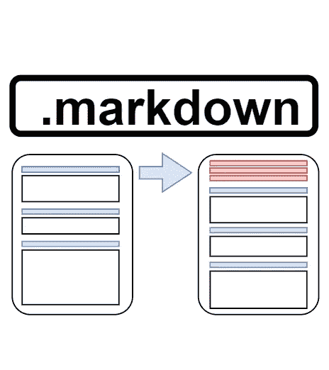

# 构建 Python CLI 工具从 Markdown 文件中提取 TOC

> 原文：<https://towardsdatascience.com/building-a-python-cli-tool-to-extract-the-toc-from-markdown-files-ab5a7b9d07f2?source=collection_archive---------12----------------------->

## 通过自动化枯燥的任务来学习—第 1 部分

为降价文件创建目录—由作者创建的图像。

不久前，我在 markdown 上为我公司的 DevGuide 写了很多文章——我们用 Hugo 来构建它作为一个内部网站——并对创建和修改目录(TOC)这一非常重复、非常无聊的任务感到恼火。每当我更改标题、引入新的子章节或删除其他章节时，我都必须一次又一次地手动编辑目录。在回顾和编辑了几篇文章之后，我终于厌倦了寻找工具和“易于使用”但可配置的选项。我对它的缺乏感到惊讶。

所以我决定编写自己的最小 CLI 工具，从 markdown 文件中自动提取目录(TOC)。在本文中，我将介绍实现所需的需求、设计决策和核心功能。当然，这个项目是开源的，任何人都可以扩展它。

# **需求和初步想法**

由于 TOC 通常被放在减价文件的不同位置，所以默认情况下没有必要将其插入文件的第一行。例如[杰基尔](https://jekyllrb.com/docs/front-matter/)和[雨果](https://gohugo.io/content-management/front-matter/)都要求降价文件的前几行包含他们各自的封面。

一般来说，编辑文件本身并不是一个好主意。事情偶尔会出错。理想情况下，我们希望最终决定权(插入 TOC)掌握在自己手中。只有当我们能够准确地定义决策参数和最佳结果时，我们才能够自动化决策——在这种情况下，这将是章节标题的语法内容和“感觉”。难以自动化。

总之，这意味着 TOC 应该

*   返回到控制台检查结果并启用复制粘贴(这需要是默认设置)，
*   可选地放置在剪贴板中，
*   可选地被复制到文件的第一行，
*   可选地放置在单独的文件中。

此外，我们应该允许用户通过对包含的标题级别设置自定义限制来限制 TOC 的深度。有些人喜欢三个标题层次的目录，有些人只喜欢看主要的。

# **格式注意事项**

关于 TOC 本身列举的实际格式，章节的可点击链接应该是首选。也许这只是我的懒惰，但是如果 TOC 不能被点击，我不能跳转到我感兴趣的章节，那么创建一个表格 OC 内容又有什么意义呢？这意味着我们需要以下输出格式之一:

第一个选项更常用:

GitLab 风格的目录链接降价。

或者 HTML 锚的第二个选项:

目录链接的 HTML 锚。

第二种选择需要在现有的降价文件中插入和格式化锚点，并在降价文件中引入 HTML。这两件事都很难论证——我也不是特别喜欢。

它们也与上面的需求相冲突，因为我们不需要将 TOC 直接插入到文件中，尤其是不需要到处都有多个分离的锚线。请记住，我们的目标是一个小而易用的解决方案，这个决定显然有利于第一种格式。

# **核心功能**

在明确了最初的设计决策和我们自己设定的需求之后，让我们来看看需要的功能。一般来说，我们有以下步骤:

1.  读取文件
2.  清理文件
3.  识别标题
4.  格式化标题
5.  创建目录
6.  输出目录

我们开始吧。

## 读取文件

我们在这里不需要做什么特别的事情，我们只需要读取文件并根据换行符将它分成单独的行。

正在读取文件。

旁注:与使用`readlines()`相比，我更喜欢上面的语法，因为`readlines()`返回的行带有一个结束换行符，稍后必须对其进行清理。我们也可以一次将整个文件加载到内存中，因为降价文件很少有千兆字节的数据。

## 清理文件

在提取文件头之前，我们需要从文件内容中删除所有代码块及其内容。Python(以及其他编程语言)可以将有效的 hashtags 作为一行中的前导字符(例如，作为注释)，这将与我们的头检测相冲突。由于这是一个简单的转换步骤，我们可以为它编写一个快速函数。

该函数接收一个行列表，过滤掉所有代码块并返回过滤后的列表。

## **识别标题行**

在 markdown 中有两种创建标题的方法

*   在标题标题前面的同一行中使用一定数量的标签(`#` ) *的常见选项*
*   或者，*在下面的下一行中，*为 1 级标题添加任意数量的等号(`=`)或连字符(`-`)作为 2 级标题。

第二种选择的明显缺点(除了难看之外)是语法将我们限制在两个级别的头。到目前为止，我也很幸运地在我参与的项目中没有看到第二种形式。然而，为了确保完整的功能，让我们包括两种格式的识别方法。

检测标题行的常见类型的逻辑非常简单:我们可以使用 regex 模式将一行标识为标题行:`r"^#+\ .*$"`(前导标签，后跟空格，然后是任何可能的字符)。

对于其他类型的标题，我们只需检查该行是否以等号(regex: `r"^=+ *$"`)或连字符(regex: `r"^-+ *$"`)开头，并且直到行尾除了空格之外没有任何其他字符。如果是这样，我们添加*前面的*行作为标题。为了下一步省事，我们还会统一头格式。

识别标题行并过滤掉其他行。

示例转换:

过滤非标题行的转换示例。

## **格式化标题**

识别标题后，我们需要确定它们的级别，并为目录本身创建格式化的行。

从 [GitLab 文档](https://docs.gitlab.com/ee/user/markdown.html#header-ids-and-links)中，我们可以了解如何格式化 TOC 中常用的 markdown 链接:

1.  所有文本都转换成小写。
2.  所有非单词文本(如标点符号或 HTML)都将被删除。
3.  所有空格都转换为连字符。
4.  一行中的两个或更多连字符被转换为一个。
5.  如果已经生成了具有相同 ID 的报头，则附加一个唯一的递增数字，从 1 开始。

下面的函数将涵盖这些规则中的大部分——无可否认，在一些边缘情况下，链接会失败，但对于 95%的情况，我们是好的。完美是令人钦佩的，但寻找边缘案例和实现解决方案所需的时间在目前是不值得的。当我们(或其他潜在的未来用户)确实遇到需要考虑的边缘情况时，我们总是可以轻松地扩展我的代码。

格式化标题和创建可点击的链接。

示例转换:

示例转换。

## 创建目录

对于目录本身，我们必须对标题和子标题进行格式化和编号。如果下一个标题的级别高于前一个，我们还需要重置编号。

将 TOC 中的每一行组装成一个字符串包括(按顺序):

*   副标题可能的缩进，
*   标题编号，
*   标题文本和
*   标题的链接。

我们还可以引入一个名为`level_limit`的变量来限制 TOC 的深度。

创建内容行的实际表格。

示例转换:

从准备好的数据创建 TOC 行的示例。

## 结合目前为止的工作

我们现在已经实现了核心功能，很快就可以开始研究将它转换成 CLI 包的必要条件以及如何输出结果。

核心功能。

## 输出目录

根据所需的结果，我们将 TOC 复制到剪贴板，将其插入 md 文件或写入一个新文件。这主要是标准实践的东西，也许除了为我们的新 TOC 文件找到一个合适的文件名。

将目录写入不同的通道。

# 创建 CLI 功能

为了能够从命令行调用带有可配置参数的包，我们使用了 [argparse](https://docs.python.org/3/library/argparse.html) 模块。

记住我们的要求，我们希望用户:

*   指定文件名(必需的参数)
*   能够将目录复制到剪贴板(可选参数`--copy`)
*   能够将目录插入文件(可选参数`--insert`)
*   能够将目录保存到一个单独的文件中(可选参数`--save`)
*   能够限制 TOC 的深度(可选参数`--levels <number-of-levels>`)

在创建了带有名称和描述的`ArgumentParser`之后，我们必须单独添加每个参数:

为 CLI 创建参数。

查看存储库文件中的全部参数[。](https://github.com/CribberSix/markdown-toc-extract/blob/main/extracttoc/extracttoc.py)

之后，访问参数/变量就像下面这样简单:

最棒的是，我们自动包含了`--help`参数背后的功能。这里的输出是:

# **打包、发布和访问**

因为我们也希望能够在我们曾经接触过的任何其他计算机上安装它(并且也让其他用户可以使用它)，我们可以创建一个简单的`setup.py`文件，打包代码并将其发布在 [pypi](https://pypi.org/project/extracttoc/) 上。打包 CLI 工具与任何其他 python 打包过程并无不同。

如果你对`setup.py`和如何打包代码感兴趣，看看吧

*   [存储库中的文件](https://github.com/CribberSix/markdown-toc-extract)，或
*   [在官方文件](https://packaging.python.org/tutorials/packaging-projects/)中，或
*   [在像 geeksforgeeks](https://www.geeksforgeeks.org/packaging-and-publishing-python-code) 这样的教程上，或者
*   像詹姆斯·布里格斯在[媒体上发表的文章。](/how-to-package-your-python-code-df5a7739ab2e)

快速旁注:为了测试你的打包软件，而不必把它上传到 pypi，然后通过 pip 安装，你可以简单地使用`pip install .`直接从你的`setup.py`文件所在的本地目录安装它(是的，这是一个点——表示当前目录)。

完成这一步后，世界各地的每个人都可以使用`pip install extracttoc`安装 CLI 工具了！

# **用途**

下面是该工具如何从命令行工作的几个具体使用示例:

# ***关闭思想***

一般来说，编写软件使自己的生活变得更容易是很好的编码实践。然而，创建开源包(帮助其他人解决同样的问题)会迫使你写出高质量的好代码，这些代码可以被其他人理解并在 T21 的基础上扩展。在你认为没有人会阅读的代码中，你可能没有考虑高优先级的事情(比如不仅仅命名你的迭代变量`x`...)在考虑其他人将如何与代码交互时，突然变得更加重要。编写开源代码无疑会受到其他人的批评，这让我们关注风格和开发最佳实践——这让我们成为更好的程序员。

如果你觉得有空的话——试试[包](https://pypi.org/project/extracttoc/),或者看看 [github](https://github.com/CribberSix/markdown-toc-extract) 上的源代码，如果你想看完整的话！

创建一个 CLI 工具对我来说是新的，但在我的工具箱里是一个非常方便的技能。我确信我将来会再次使用它。

一如既往，我们永远学不完。了解有关…的更多信息

*   [Markdown 基本语法](https://www.markdownguide.org/basic-syntax)
*   [降价 GitLab 口味](https://docs.gitlab.com/ee/user/markdown.html)
*   [Python 的 argparse 模块](https://docs.python.org/3/library/argparse.html)
*   [Stackoverflow 关于代码质量的想法](https://stackoverflow.blog/2021/10/18/code-quality-a-concern-for-businesses-bottom-lines-and-empathetic-programmers/)
*   [包装项目的 Python 文档](https://packaging.python.org/tutorials/packaging-projects/)
*   [geeksforgeeks 的打包教程](https://www.geeksforgeeks.org/packaging-and-publishing-python-code/)
*   [詹姆斯·布里格斯关于包装的文章](/how-to-package-your-python-code-df5a7739ab2e)
*   [用 jekyll 建立网站](https://jekyllrb.com/)
*   [用 hugo 建网站](https://gohugo.io/)

在 [Medium](https://medium.com/@cribbersix) 上关注我，获取更多关于数据工程工具以及软件和个人发展的文章！