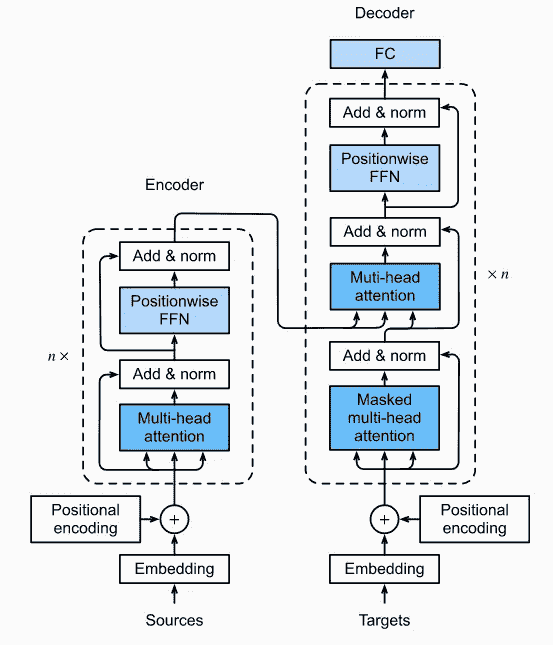
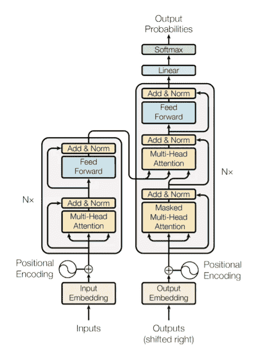
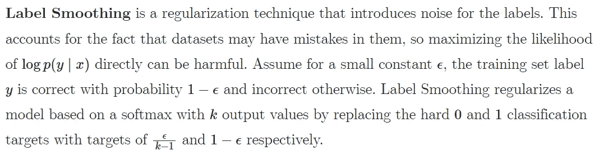

# 构建 Python 代码生成器

> 原文：<https://towardsdatascience.com/building-a-python-code-generator-4b476eec5804?source=collection_archive---------10----------------------->

## 使用转换器将英语问题语句转换成 Python 代码

NLP 技术可以用来生成实际的代码吗？我们离一个用 AI 写软件的世界还有多远？

在这篇博客中，我尝试构建一个 python 代码生成器，它可以将简单的英语问题语句转换成相应的 python 代码。


图 1:生成 python 代码的转换器。😉(原始图像来自 [unsplash](https://unsplash.com/photos/liAwyJ64wHE)

我们通过把它作为一个**序列到序列(Seq2Seq)** 的学习问题来处理这个问题。在这里，我们的英语句子将是我们的*输入或 SRC* 序列，我们的 Python 代码将是我们的*输出或 TRG* 序列。

在过去的几年里，变压器已经成为解决 Seq2Seq 问题的主导架构。大多数当今的 SoA 模型，如 BERT 或 GPT-3，都在内部使用转换器。我们今天所知的变形金刚是由谷歌在他们的 [**“注意力是你所需要的一切”**](https://arxiv.org/abs/1706.03762) 论文中首次介绍的。我们在博客中讨论的“英语到 Python”模型也在本文中找到了它的动机。

在我们开始解决问题之前，让我们先简要回顾一下变压器。

# **变形金刚**



图 2:变形金刚(图片来自 [d2l.ai](https://d2l.ai/chapter_attention-mechanisms/transformer.html) )

变压器可以从三个方面来理解:

1.  将输入序列编码成状态表示向量的编码器。
2.  一种关注机制，使我们的 Transformer 模型能够关注顺序输入流的正确方面。这在编码器和解码器中重复使用，以帮助它们将输入数据置于上下文中。
3.  解码器，对状态表示向量进行解码，以生成目标输出序列。

在我之前的 [**博客**](https://ai.plainenglish.io/lets-pay-attention-to-transformers-a1c2dc566dbd) 中，我已经详细解释了这些组件中的每一个，并附有代码演练。

现在让我们看看如何将数据输入到转换器中。

# 了解培训数据

我们将使用定制的 [**数据集**](https://drive.google.com/file/d/1rHb0FQ5z5ZpaY2HpyFGY6CeyDG0kTLoO/view) 由[**AI(TSAI)**](https://theschoolof.ai/)**学院策划来训练我们的模型。这个数据集包含大约 5000 个数据点，其中每个数据点包含一个英文问题语句及其对应的 Python 代码。可以关注我的 [**项目回购**](https://github.com/divyam96/English-to-Python-Converter) 了解如何解析数据。**

****样本数据点:****

***英文语句:“*写一个将两个数相加的函数*”***

***Python 代码:***

```
def add_two_numbers (num1 ,num2 ):
    sum =num1 +num2 
    return sum
```

**这里的"*英文语句*"是我们的输入或 SRC 序列，而" *Python 代码*"是我们的输出或用于训练的 TRG 序列。**

# **将数据符号化**

**我们的输入(SRC)和输出(TRG)序列以单个字符串的形式存在，需要进一步标记才能发送到 transformer 模型中。**

**为了标记输入(SRC)序列，我们使用了[**空间**](https://spacy.io/api/tokenizer) 。这在 PyTorch 的[torch text . data . field](https://torchtext.readthedocs.io/en/latest/data.html#torchtext.data.Field)**中默认实现。**我们将使用 torchtext.data.Field 通过 spacy 来标记我们的数据。**

```
Input = data.Field(tokenize = 'spacy',
            init_token='<sos>', 
            eos_token='<eos>', 
            lower=**True**)
```

**为了对我们的输出(TRG)序列进行标记化，我们使用了基于 Python 源代码[标记化器](https://docs.python.org/3/library/tokenize.html)构建的自定义标记化器。Python 的 tokenizer 为每个标记返回几个属性。我们只提取元组形式的令牌类型和相应的字符串属性(即(token_type_int，token_string))作为最终令牌。**

***标记化输入(SRC):***

```
SRC = [' ', 'write', 'a', 'python', 'function', 'to', 'add', 'two', 'user', 'provided', 'numbers', 'and', 'return', 'the', 'sum']
```

***符号化输出(TRG):***

```
TRG = [(57, 'utf-8'), (1, 'def'), (1, 'add_two_numbers'), (53, '('), (1, 'num1'), (53, ','), (1, 'num2'), (53, ')'), (53, ':'), (4, '\n'), (5, '    '), (1, 'sum'), (53, '='), (1, 'num1'), (53, '+'), (1, 'num2'), (4, '\n'), (1, 'return'), (1, 'sum'), (4, ''), (6, ''), (0, '')]
```

# **数据扩充**

**由于我们的数据集仅包含 5000 个数据点，我们利用数据扩充来增加数据集的大小。在标记 python 代码时，我们随机屏蔽某些变量的名称(用‘var _ 1’、‘var _ 2’等),以确保我们训练的模型不仅仅关注变量的命名方式，而且实际上试图理解 python 代码的内在逻辑和语法。**

**例如，考虑下面的程序。**

```
def add_two_numbers (num1 ,num2 ):
    sum =num1 +num2 
    return sum
```

**我们可以替换上面的一些变量来创建新的数据点。以下是有效的扩充。**

**1.**

```
def add_two_numbers (var_1 ,num2 ):
    sum =var_1 +num2 
    return sum
```

**2.**

```
def add_two_numbers (num1 ,var_1 ):
   sum =num1 +var_1 
   return sum 
```

**3.**

```
def add_two_numbers (var_1 ,var_2 ):
    sum = var_1 + var_2 
    return sum
```

**在上面的例子中，我们使用随机变量替换技术将一个数据点扩展为另外 3 个数据点。**

**我们在生成 TRG 令牌时实现我们的扩充。**

**当随机选择变量来屏蔽时，我们避免关键字文字( *keyword.kwlist* )、控制结构(如下面的 *skip_list* 所示)和对象属性。我们将所有需要跳过的文字添加到 *skip_list 中。***

**我们现在使用 Pytorch 的 [torchtext.data.Field](https://torchtext.readthedocs.io/en/latest/data.html#torchtext.data.Field) **来应用我们的扩充和标记化。****

```
Output = data.Field(tokenize = augment_tokenize_python_code,
                    init_token='<sos>', 
                    eos_token='<eos>', 
                    lower=**False**)
```

**我们的测试*应用标记化后的标记化输出(TRG)* :**

```
TRG = [(57, 'utf-8'), (1, 'def'), (1, 'add_two_numbers'), (53, '('), (1, 'num1'), (53, ','), (1, 'var_1'), (53, ')'), (53, ':'), (4, '\n'), (5, '    '), (1, 'sum'), (53, '='), (1, 'num1'), (53, '+'), (1, 'var_1'), (4, '\n'), (1, 'return'), (1, 'sum'), (4, ''), (6, ''), (0, '')]
```

# **喂养数据**

**为了将数据输入到我们的模型中，我们首先使用 Pytorch 的[torch text . data . bucket iterator](https://torchtext.readthedocs.io/en/latest/data.html#torchtext.data.BucketIterator)创建批处理。这确保了具有相似长度的输入一起留在单个批次中，以便于训练。然后，我们将标记化输入(SRC)批次送入编码器，并在解码器中使用标记化输出(TRG)批次。我们的目标是使用编码器的标记化英语输入(SRC)来预测通过解码器的标记化 Python 输出(TRG)。然后，标记化的预测通过 Python 源代码标记化器的[取消标记化](https://docs.python.org/3/library/tokenize.html#tokenize.untokenize)函数取消标记化。**

****

**图 3:编码器的输入和解码器的输出。(图片来自[谷歌 arxiv 研究](https://arxiv.org/abs/1706.03762))**

# **损失函数**

**我们在数据集中使用了扩充来屏蔽变量文字。这意味着我们的模型可以预测特定变量的各种值，只要预测在代码中保持一致，所有这些值都是正确的。这将意味着我们的训练标签不是非常确定，因此以概率 *1- smooth_eps* 将它们视为正确，否则视为不正确将更有意义。这就是标签平滑的作用。通过添加[标签平滑](https://arxiv.org/abs/1906.02629)到[交叉熵](https://pytorch.org/docs/stable/generated/torch.nn.CrossEntropyLoss.html)中，我们确保了模型在预测一些可以通过增强来替代的变量时不会变得过于自信。**

****

**图 4:标签平滑(来源:[深度学习](https://www.deeplearningbook.org/)，Goodfellow 等人 2016)**

**现在我们所有的组件都设置好了，我们可以使用反向传播来训练我们的模型。我们将数据集分为训练数据和验证数据。我们的模型被训练，直到我们的验证损失不再进一步改善。**

**值得注意的是，与不使用标签平滑的模型相比，标签平滑会导致更高的损失值。但这是意料之中的，因为我们不打算确定我们的标签预测。对于变量尤其如此，因为只要预测在整个目标代码序列中是一致的，就可以有多个正确的选项。**

**完整的训练代码请参考我的[笔记本](https://github.com/divyam96/English-to-Python-Converter/blob/main/English_to_Python.ipynb)。**

# **样本结果**

***输入:*“程序按关键字排序字典列表”
输出:**

```
var_1 ={'Nikhil':{'roll':24 ,'marks':17 },
'Akshat':{'roll':54 ,'marks':12 },
'Akash':{'roll':15 },'marks':15 }}
sort_key ='marks'
res ='marks'
res =var_2 (test_dict .items (),key =lambda x :x [1 ][sort_key ])
print ("The sorted dictionary by marks is : "+str (res ))
```

***输入:*“列表奇数元素求和函数”
*输出*:**

```
def sum_odd_elements (l :list ):
    return sum ([i for i in l if i %2 ==1 ])
```

***输入:*程序反转一串 *输出*:**

```
var_1 ='Today is bad day'
var_1 [::-1 ]
```

**更多样本请看我的[项目回购](https://github.com/divyam96/English-to-Python-Converter)。**

**我们已经成功训练了一个模型，它能够将简单的问题陈述(英语)转换成相应的 python 代码。看起来我们离人工智能代替人类编写软件的时代不远了。软件开发人员当心！**

# **参考知识库**

**[](https://github.com/divyam96/English-to-Python-Converter) [## divyam 96/英语-Python 转换器

### 这是一个尝试使用变压器和自我关注，以便将英文描述转换成 Python 代码…

github.com](https://github.com/divyam96/English-to-Python-Converter) [](https://github.com/bentrevett/pytorch-seq2seq) [## bentrevett/pytorch-seq2seq

### 本报告包含的教程涵盖了使用…理解和实现序列到序列(seq2seq)模型

github.com](https://github.com/bentrevett/pytorch-seq2seq) 

# 参考

[1]阿斯顿·张(Aston Zhang)和扎卡里·c·利普顿(Zachary C. Lipton)以及李牧和亚历山大·j·斯莫拉(Alexander J. Smola)，[潜入深度学习](https://d2l.ai) (2020)。

[2] Ashish Vaswani，Noam Shazeer，Niki Parmar，Jakob Uszkoreit，Llion Jones，Aidan N. Gomez，Lukasz Kaiser，Illia Polosukhin，(2017)，第 31 届神经信息处理系统会议(NIPS 2017)，美国加利福尼亚州长滩

[3] Rafael Müller，Simon Kornblith，Geoffrey Hinton，[标签平滑在什么情况下有帮助？](https://arxiv.org/pdf/1906.02629.pdf) (2019)，第 33 届神经信息处理系统会议(NeurIPS 2019)，加拿大温哥华

[4]伊恩·古德费勒(Ian Goodfellow)与约舒阿·本吉奥(Yoshua Bengio)和亚伦·库维尔(Aaron Smith)，[深度学习书籍](https://www.deeplearningbook.org/) (2016)，麻省理工学院出版社。**