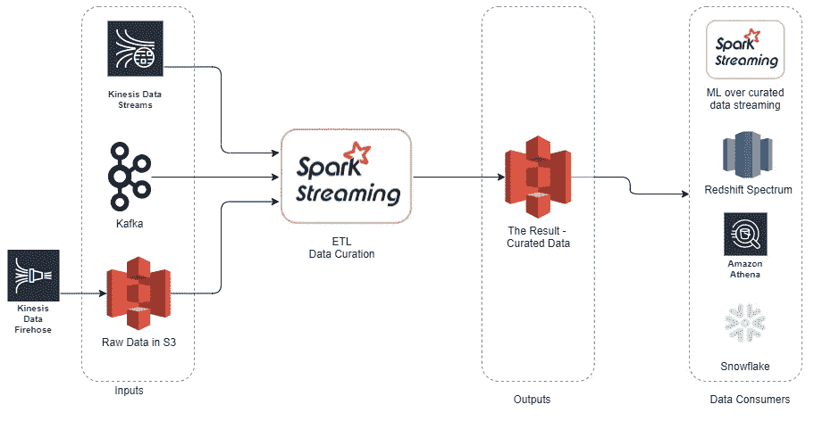
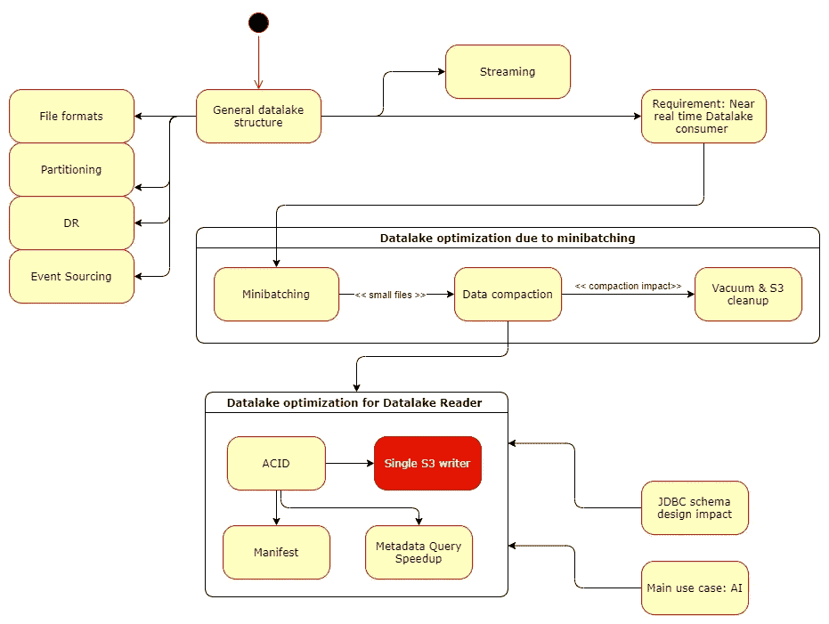
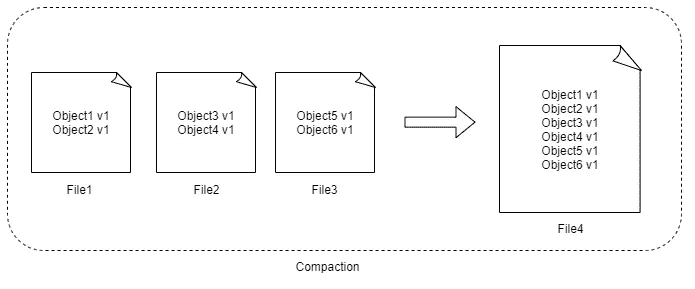
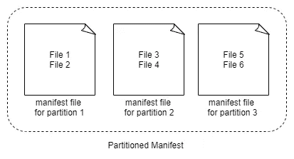

# 在 AWS 中构建真实的数据湖

> 原文：<https://towardsdatascience.com/building-a-real-life-data-lake-in-aws-ee3bc9b8bba1?source=collection_archive---------5----------------------->

## AWS 特性如何影响为 AI 构建的 ACID 数据湖解决方案的架构

有一些重要的用例、需求和架构选择会改变数据湖的构建方式。在这里，我们将关注直接来自数据湖的数据消费的好处，同时解决接近实时的人工智能推理需求。

我们将简洁地介绍一些架构选择及其含义，同时查看使用 Spark over S3 的数据工程。

**目标受众**

读者应该对 Apache Spark 和 AWS 有所了解。

**AI 推理延迟需求**

我们将专注于推理时间延迟需求以分钟/秒为单位的用例。
在这种情况下，您可以选择基于 Apache Spark 的架构作为您的流&批处理 AI 处理的公共基础。您还可以在流式处理和批处理之间共享代码，同时提高下游读取性能。
*如果这不是您的用例*，您仍然可以为您的解决方案的数据湖部分实现以下大部分内容。

# 体系结构

作者图片

请注意，您不必准备好所有选项。例如，一个人可以选择完全放弃 Kinesis/Kafka，而仅仅依靠消防软管。
由于我们关注的是基于人工智能的用例，业务级聚合数据湖层超出了本次讨论的范围。此外，我们将关注可以结构化的数据。

# 视觉议程

作者图片

# 基础

## 你真的有大数据，需要数据湖吗？

这篇文章讨论大数据。在去之前，请确定你是否拥有/期望拥有大数据。如果没有，就不要去那里。

300GBs 不是“大数据”。

## 通用数据湖结构

数据应该被划分成适当数量的分区。数据保存在大文件中，通常约为 128MB-1GB。维护大数据的二级索引通常成本过高。

此外，通用解决方案集成了 Hive Metastore(即 AWS Glue Catalog)用于 EDA/BI 目的。数据通常来自 Kinesis/Kafka 等流媒体源或 S3 着陆区，后者本身通常是 Kinesis Firehose 的目标。

## 如何跟踪已经处理过的输入数据

Spark 结构化流已经包含`.option("checkpointLocation", checkpoint_path)`。它跟踪所有的偏移，不管你的输入:卡夫卡/MSK，S3 着陆区，Kinesis 等。

这是基本选项，请阅读下面更高级的选项。

## 为什么我应该使用分区？

在大多数情况下，数据湖消费者，ala you AI 应用程序，将只需要读取数据的子集。当数据被分区时，Spark 等查询工具可以利用分区消除，因此只需要扫描一部分数据。

注意，这对于低基数分区键 ala 数据到达月份很有效。对于其他用例，人们不得不求助于对原始分区键的某种散列/装箱试探法，或者利用诸如 [Z 排序](https://docs.databricks.com/delta/optimizations/file-mgmt.html#z-ordering-multi-dimensional-clustering)之类的解决方案。

## 如何定义分区中文件的数量

当数据湖消费者读取数据时，将扫描分区中的所有文件，至少是读取元数据。分区中的文件数量应该是扫描分区的活动 Spark 任务数量的几倍。
也就是说，如果你的分区有 30 个文件，但你的执行程序数乘以每个执行程序的内核数是 130，一般情况下每个执行程序有 100 个内核不做任何事情，你要为此付出代价，包括现金和查询性能。

其他调配的服务也是如此，如雪花集群大小或红移插槽。

## 如何定义数据格式

因为所有文件至少都要扫描元数据，所以最好使用支持压缩拼花和一些非分栏格式的 S3 选择。因此，您希望您的数据湖有压缩拼花文件，这是由 S3 支持的。

在本文的后面，我们将介绍推荐的使用 Parquet 的数据湖框架。

# 近实时人工智能推理的含义

## 微批处理中的数据摄取

如果需要接近实时的人工智能推理，那么为您的用例使用正确的火花`.trigger()`将数据流入数据湖是很重要的。

这个简单的要求可能会产生如下所述的重大后果。

## 微批量摄取影响—数据压缩

微批处理中的数据摄取可能会产生许多更小的文件。
为了提供每个分区可预测的查询时间，我们应该:

*   创建具有相似数据大小的分区
*   确保将小文件中的数据移动到更大的大约 128MB 的文件中。这个过程称为压缩。

压缩过程提高了下游读取吞吐量，尤其是在对象存储(即 S3)方面。

请注意，一些数据湖根本不实现压缩，因为这会增加复杂性，并可能给系统带来额外的延迟。在这种情况下，必须格外小心它们的文件大小和 ETL 流。

作者图片

## 数据压缩实现策略

*   依赖商业实现，如[数据块](https://databricks.com/product/delta-lake-on-databricks)
*   对记录大小可预测的文件使用`.option("maxRecordsPerFile", ...)`。请注意，对于嵌套数据，只考虑顶层行。
*   使用`aws s3 ls` AWS API 对应物评估总分区大小。`repartition*()` / `partitionBy()`用所需的文件号为 Spark &配置单元分区设置正确的数量。
*   仅对文件最近发生更改的分区执行上述操作。每次压缩所有分区会耗费太多的时间和开销—请参见下面的详细信息。

## 清单文件

当数据被压缩时，新的 Parquet 文件出现在分区中。消费 Spark/红移/雪花查询应该读取哪些文件？我们绝对需要添加一个元数据。有两种方法可以解决这个问题:

*   保存一个分区清单文件，其中的内容列出了每个分区中的最新文件
*   使用自动更新这些内容框架。稍后将详细介绍。

否则，我们的工作将是读取陈旧数据或陈旧和最新的数据在一起！

作者图片

# 酸性框架

ACID 框架支持以下功能:

*   自动数据压缩(仅在商业版本中有一些)
*   通过附加元数据缩短查询时间。
*   分区清单文件的自动生成
*   对数据湖消费者的 ACID 保证(有些限制适用，见下文)

选项包括:

*   三角洲湖
*   商业数据块版本—具有开源版本中没有的缓存和 Z 顺序性能改进
*   阿帕奇胡迪——两种操作模式
*   Apache Iceberg —大约在 2020 年底，Iceberg 不支持来自精选数据的流。

请注意，一些功能，如 Delta Catalog，需要 Spark 3.0.0+,因此只能在 EMR 中使用，而不能在 Glue 中使用。在撰写本文时，AWS Glue 不支持 spark 3.0.0+。

## S3 对火花驱动器数量的限制

由于 S3 不支持原子重命名这一事实，对于

*   [三角洲湖](https://github.com/delta-io/delta/issues/564)
*   [胡迪](https://github.com/apache/hudi/issues/2330)
*   [冰山](https://github.com/apache/iceberg/issues/1912)我们实际上只能使用单个火花驱动器**在任何给定时间向数据湖写入**。

这也意味着在 Spark 之外使用这些框架[对于只读访问来说是非常可靠的。](https://github.com/delta-io/connectors/wiki/Delta-Standalone-Reader)

## 单火花驱动器的含义

S3 限制火花驱动器数量的必然结果:来自几个不同来源的消耗，例如平行的 Kinesis & S3 着陆区必须发生在一个火花驱动器上！即使你没有连接这些火花流之间的数据，也是如此。毕竟，他们正在更新 S3 上相同的元数据位置。

实现这一点的方法可以是:

*   在单个会话中使用 Apache Livy(我自己没有试过)或者
*   使用`.trigger(once=True)`运行 EMR 流步骤
*   `.union()`不同的火花流，一次写入

## 数据压缩影响—文件清空

压缩过程和通常的任何数据更新都会创建过时的文件。为了不占用空间/使 S3 列表开销过大，必须将它们移除。除非您使用的是 Databricks commercial Delta lake，否则需要计划和调用此过程。

## S3 灾难恢复

最好保留生成的 S3 存储桶的版本，因为它将允许出于灾难恢复目的的跨区域存储桶复制。

## S3 清理

必须设置旧版本文件的 S3 生命周期规则来清理对象存储。真空是不够的，它只会导致 S3 删除标记。

# (计划或理论的)纲要

## 模式合并

数据模式在现实生活模式中发展。为了支持向模式中引入新列，在 spark 中使用`.option("mergeSchema","true")`。

## 活动采购

假设您的数据可以追溯更新。什么是正确的解决方案？

*   就地更新数据。保存相同数据的单个副本。
*   引入数据的另一个版本。

大多数基于人工智能的应用程序发布被执行的推理。购买股票，向客户发送电子邮件等。这是一个与业务相关的标准，指导利用事件源，以便人工智能推理可以追溯到推理时可用的数据谱系。

## JDBC —对嵌套数据模式设计的影响

有时，我们希望在我们的细粒度数据上启用 BI，也就是说，不是在业务级聚合上。

有时真实世界的数据是嵌套的。请注意，许多 JDBC 工具(如红移光谱)不允许以直接的方式返回嵌套数据。在这种情况下，在将数据保存到数据湖之前使用`.explode()`会更有效。根据您的数据，这可能是唯一的选择。

# S3 访问—附加选项

## 快速新文件列表—S3—SQS

即使当使用更大的文件时，spark 结构化流也必须列出所有文件，这在大数据湖中可能是很多的。Spark 的 [S3-SQS](https://github.com/qubole/s3-sqs-connector) 连接器可以通过保持一个队列监听来自 S3 的新对象通知来改善这一点。

## S3 从 VPC 内部访问

为了通过 AWS 网络而不是互联网访问数据湖，使用 S3 [VPC 端点](https://docs.aws.amazon.com/AmazonS3/latest/userguide/privatelink-interface-endpoints.html)。这主要是作为一个安全特征的好处。有时，VPC 端点可以提高性能，但这必须根据地区/使用案例进行测试。

## 初始 ETL 的着陆区考虑因素

如果您使用的 S3 登陆区有数百万个小文件，则需要将它们导入到策划数据湖中，以便所有历史数据都适合查询。S3 文件列表有很大的开销。列出一百万个文件需要 5 分钟以上的时间。此外，这不应该用 Spark 结构化流来完成，因为驱动程序内存会变得 OOM。Spark 结构化流并不意味着要列出数百万个文件。对于这个用例，最好将文件列在一个本地文件中，然后用 Spark 批处理来分配导入工作，这样每个任务都可以获得它将读取和转换的文件名的一个子集。

# 摘要

我们已经在接近实时的人工智能推理场景中介绍了数据湖的基础知识。介绍了高级 ACID 框架，以及它们对 S3 的限制。还提出了基本的模式考虑，以及 S3 列出的加速选项。

我希望这可以作为 AWS 中大多数数据湖解决方案的蓝图。

感谢您坚持到本文结束——请告诉我您的想法！也可以通过 [LinkedIn](https://www.linkedin.com/in/borislitvak/) 联系我。