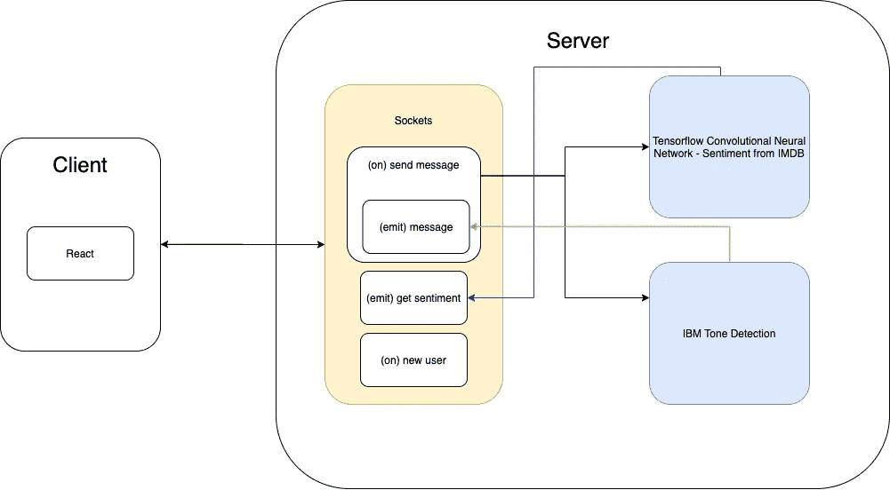
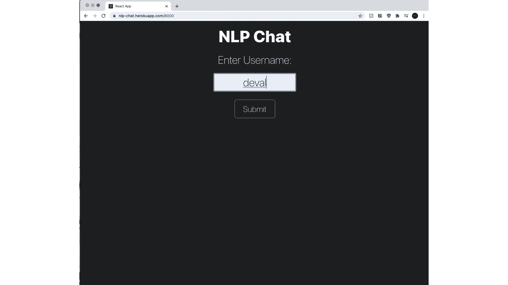

# 构建具有 NLP 功能的实时聊天应用程序

> 原文：<https://towardsdatascience.com/building-a-real-time-chat-application-with-nlp-super-powers-ce800e19cb2b?source=collection_archive---------25----------------------->

## 一款使用 TensorFlow JS 深度学习 API，IBM Cloud，Node 的带有情绪分析和语气检测的聊天 App。JS、Web Sockets 和 React


沃洛季米尔·赫里先科在 [Unsplash](https://unsplash.com?utm_source=medium&utm_medium=referral) 上的照片

在一个人工智能(AI)和机器学习(ML)模型被用来获取实时信息以不断改善客户体验的世界中，我希望发现 ML 在试图理解人类对话时可以证明有多有效，甚至尝试构建我们自己的定制应用程序来实现这项技术。

## 实践中的对话式机器学习

世界正在迅速适应使用人工智能驱动的应用程序来协助人类的日常工作。Siri 和 Alexa 由基于自然语言处理(NLP)的 ML 模型驱动，这些模型不断训练和迭代，听起来更自然，并通过理解复杂的人类对话提供更多价值。更不用说，谷歌最新的对话技术， [LaMDA](https://blog.google/technology/ai/lamda/) 。LaMDA 被训练成能够打断更大块的人类对话，并理解多个单词或短语如何相互关联，以获得更多关于输入文本的上下文，特别是针对人类对话。然后，它能够动态地生成一个自然的、类似人类的响应。以下来自谷歌的 AI 博文， [*LaMDA:我们突破性的对话技术*](https://blog.google/technology/ai/lamda/) ，其中简要描述了 LaMDA 所基于的深度学习技术:

> [1] LaMDA 的谈话技巧是多年来练就的。像最近的许多语言模型一样，包括 BERT 和 GPT-3，它建立在 [Transformer](https://ai.googleblog.com/2017/08/transformer-novel-neural-network.html) 之上，这是谷歌研究院在 2017 年发明并开源的神经网络架构

这项技术令人印象深刻，并迅速证明了它在我们日常生活中的价值，从为我们预订房间到消除对人力呼叫中心的需求。

## 机器学习的挑战

然而，并不是所有的彩虹和阳光，在训练和集成 ML 模型到生产应用的过程中，会有许多挑战。我们如何测试这些模型？我们如何开发可靠的模型？我们如何确保 ML 模型中的偏差得到最佳缓解？我们可以多容易地构建使用这些模型的可扩展应用程序？这些都是大规模开发 ML 解决方案时需要考虑的问题。

# 让我们建立自己的应用程序！

在本文中，我们将构建一个定制的全栈应用程序，该应用程序利用 [Google 的 TensorFlow](https://www.tensorflow.org/tutorials/keras/text_classification_with_hub) 和 [IBM 的云机器学习即服务(MLaaS)平台](https://www.ibm.com/cloud/watson-natural-language-understanding)来发现工程师如何使用基于云的工具开发可维护、可靠和可扩展的全栈 ML 解决方案。

**我们将构建的应用程序是一个实时聊天应用程序，能够检测用户消息的语气。**正如你所想象的，这方面的用例可以跨越很大的范围，从理解客户与客户服务聊天的交互到理解一个生产人工智能聊天机器人的表现如何。

## 体系结构



在高层次上，这是应用程序的架构。

高级应用程序架构包括利用 React 和 TypeScript 来构建我们的自定义用户界面。使用节点。JS 和套接字。IO 库，支持最终用户和应用服务器之间的实时双向网络通信。自插座。IO 允许我们进行基于事件的通信，我们可以根据终端用户主机发送的消息异步地对 ML 服务进行网络调用。

## 后端

至于 ML 服务，我们可以向 IBM 基于云的音调检测模型发出 HTTP 请求(包含在有效负载中发送的聊天消息的内容)。来自 IBM web 服务的响应将是一个 JSON 对象，其中包含模型对该消息进行分类的一组音调，例如

```
[“Joy”, “Positive”, “Happy”]
```

异步地，我们的节点。JS web 服务可以向 TensorFlow 的情感 API 发出请求。TensorFlow 的 ML 模型是一种基于卷积神经网络的深度学习架构，它已经在由 IBMD 电影评论组成的 50，000 个带标签的数据点上进行训练，能够预测新引入的输入文本的情感。我们将通过 TensorFlow 的预训练模型发送每条新聊天消息，以获得整个聊天对话的平均情绪得分。

基于事件的功能，根据新的聊天消息运行 ML 服务。

在上面的要点中，您可以看到，在客户端发送新消息时，服务器将调用两个函数，getTone 和 updateSentiment，同时将聊天消息的文本值传递给这些函数。

为对 IBM Cloud Tone Analyzer API 进行 API 调用而创建的 getTone 函数。

创建的更新情感函数使用输入的聊天消息文本运行 TensorFlow ML 模型，以计算平均情感。

使用 TensorFlow JS 框架的预测函数。

上面的预测函数在 update perspective 中调用。该函数通过使用网络获取来加载 TensorFlow 预训练模型，预处理输入的数据，并使用该模型来评估情感得分。这一切都在后台进行，与处理其他后端任务并行。

## 前端

使用 Socket IO 客户端库与服务器代码进行双向连接的用户界面。

在上面的代码中，我们构建了一个功能性的 React 组件来处理客户端与聊天应用程序的交互。因为我们使用的是功能组件，所以我们可以访问 React 钩子，比如 useState 和 useEffect。**消息**状态保存当前用户输入文本的值。**消息**状态保存所有已发送消息的数组。您可以在 useEffect 中看到到 Socket 服务器的连接，每次重新呈现/加载组件时都会调用它。当从服务器发出新消息时，会触发事件，以便 UI 接收新消息并将其呈现给所有在线用户实例。

用户界面的 sendMessage 函数，用于构建要发送给套接字服务器的 messageObject。

从 sendMessage 函数发出的 messageObject 将到达服务器，服务器将解析出 messageObject.body(用户发送的聊天消息的实际值),并通过之前构建的 ML web 服务处理数据。然后，它将构建并返回一个新的对象，该对象包含从 ML 模型的输出中获取的消息、用户名和消息的语气。

客户端 JSX 代码呈现消息并解析出消息发送者的用户名、消息的语气，当然还有消息体。

而最后的结果……**TADA！**



我们在本文中构建的应用程序的演示。每个聊天气泡包含给定消息的语气标签。(来源:作者)

## 完整源代码

要查看完整代码，请访问 Github 资源库:

<https://github.com/devalparikh/NLP_Chat_App>  

## 结论

通过构建这个概念验证项目，我希望展示开发一个定制应用程序是多么无缝，它可以通过利用基于云的 Web 服务来集成机器学习工具和技术，从而实现可伸缩性和可维护性。通过使用 IBM 的云服务和谷歌的 TensorFlow 预训练情绪模型，我们能够建立一个聊天应用程序，可以对每条聊天消息的语气以及对话的整体情绪进行分类。

## **参考文献**

[1] E. Collins，Z. Ghahramani， [LaMDA:我们突破性的对话技术](https://blog.google/technology/ai/lamda/) (2021)，https://blog.google/technology/ai