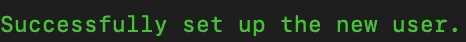
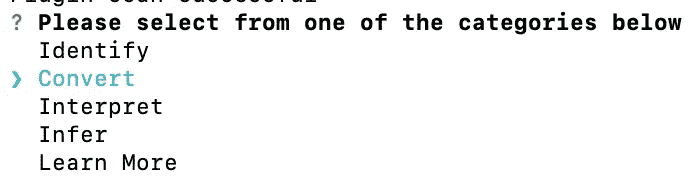
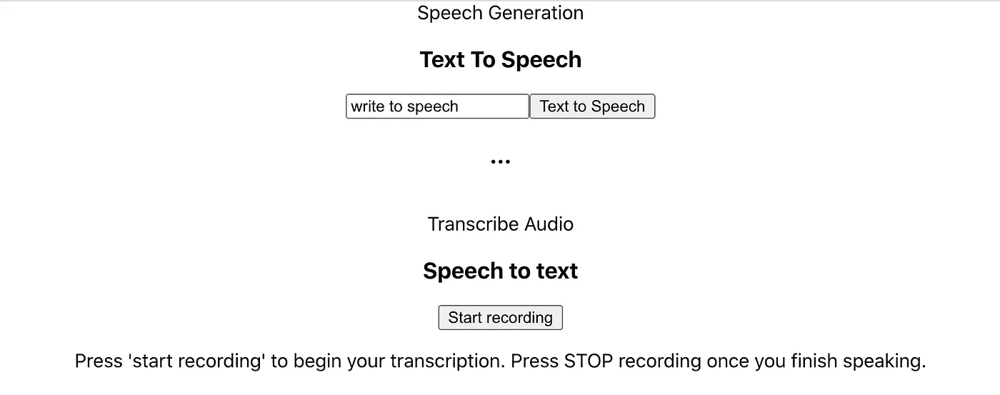

# 构建实时语音到文本反应应用程序

> 原文：<https://towardsdatascience.com/building-a-real-time-speech-to-text-react-application-using-aws-amplify-8befac6aca2c?source=collection_archive---------17----------------------->

## 使用 AWS Amplify 为 ML/AI 应用供电的演示

图片来自 [Unsplash](https://unsplash.com/photos/1HCb2gPk3ik)

亚马逊网络服务(AWS)正在不断扩展其在应用开发、机器学习/人工智能和物联网等各个领域的产品。它的一些服务甚至在更高的层次上融合了不同的领域。 [AWS Amplify](https://aws.amazon.com/amplify/) 是一项服务，它提供了使用流行框架(如 React)构建移动/网络应用的能力。最近，Amplify 集成了各种**高级 ML 服务**，如转录、翻译、理解和重新识别，使开发人员能够轻松地用人工智能驱动他们的应用程序。对于本文，我们将构建一个 React 应用程序，展示 Amplify 通过与 AWS Transcribe 集成提供的**语音转文本**功能。

**注意:**对于刚接触 AWS 的人来说，如果你想继续学习，请确保在下面的 [**链接**](https://aws.amazon.com/console/) 中注册账户。然而，要完全理解这篇文章，你需要一些初步的 AWS 知识。我还将提供一个我们将使用的服务列表，以及更深入的定义。如果您已经熟悉了这些服务，可以直接跳到代码演示。

# 目录

1.  AWS 服务
2.  设置 AWS 放大器
3.  安装人工智能服务/预测资源
4.  构建语音转文本应用程序
5.  整个代码和结论

# 1.AWS 服务

[**AWS Amplify**](https://aws.amazon.com/amplify/) :帮助你构建基于 AWS 的 web 和移动应用。支持 React、Angular、Vue 等各种 web 框架，以及 Android、iOS 等移动平台。

[**AWS 转录**](https://aws.amazon.com/transcribe/) : Auto-AI 服务，允许没有 ML 经验的开发者在后端集成语音到文本的功能。

[**身份访问和管理(IAM)**](https://aws.amazon.com/iam/) :允许您通过权限和角色管理对 AWS 服务的访问。我们将为我们的 Amplify 用户创建一个与各种 AWS 服务合作的角色。

# 2.设置 AWS 放大器

在我们探索应用程序的 ML 方面之前，我们需要一个传统的 React 应用程序启动并运行。幸运的是，AWS 通过一个叫做 [Amplify CLI](https://docs.amplify.aws/cli) 的东西让使用 Amplify 变得简单。CLI 将作为我们进入 AWS 的主要界面，并管理我们在应用程序中使用的服务/资源。我们将很快浏览一下具体的安装命令，但是如果你想自己浏览文档进行设置，这里有[链接](https://docs.amplify.aws/start/q/integration/react)。在安装 CLI 之前，确保您已经安装了 Node.js、npm 和 git，我们将在本教程的后面使用所有这些。要安装 Amplify CLI，请根据您的机器使用以下命令。

放大 CLI 安装

接下来，我们需要用我们特定的 AWS 帐户配置 CLI。为此，您需要创建一个 [IAM 用户](https://docs.aws.amazon.com/IAM/latest/UserGuide/id_users.html)，它代表使用该帐户的人。为此，运行以下命令，指定您所在的地区，创建用户名，并确保保存/输入 AWS 提供的**访问密钥 ID** 和**秘密访问密钥**，以将 CLI 连接到您的 AWS 帐户。

用 AWS 连接 Amplify CLI

填写完以下所有问题后，您应该会在您的**命令行**中看到如下**所示的图像，以确保您的 CLI 已正确连接到您的帐户。**

作者截图

既然已经正确设置了命令行，我们就可以开始创建 React 应用程序了。

创建和启动 React 应用程序

随着传统 React 应用程序的运行，我们现在需要初始化 Amplify，这样我们就可以创建我们的后端来与 ML 服务(如转录)进行交互。

初始化放大器

Amplify init 命令将创建一个 CloudFormation 模板(作为代码的基础设施),以便为 AWS 上的应用程序**供应和部署**所有**资源**。

# 3.安装人工智能服务/预测资源

现在我们已经用 Amplify 库设置了一般的 React 应用程序，我们可以添加 Amplify 提供的 [**预测**](https://docs.amplify.aws/lib/predictions/getting-started/q/platform/ios) 特性。该类别具有各种功能和扩展，您可以添加从图像检测、转录、翻译到情感分析的内容。要添加语音到文本和文本到语音功能，运行以下命令并选择**转换**以选择这两个 ML 选项。

向 React 应用程序添加预测类别

作者截图

选择转换后，您将获得一个选项来添加转录和文本到语音功能。确保对这两个选项重复该过程，或者如果您愿意，进行翻译。对于转录，您将被要求填写一个**源语言**(我们的应用程序为美国英语)，对于文本到语音，您将填写一个**说话者声音**和源语言。最后，让 [Cognito](https://aws.amazon.com/cognito/) 为您的认证应用提供动力，您应该准备好了。要提供您已下载的新预测功能，请在 CLI 中运行 **amplify push** 来更新您在云中的资源。

# 4.构建语音转文本应用程序

随着预测资源的准备就绪，现在只需调整 app.js 代码来包含这些功能。我将使用这个[链接](https://docs.amplify.aws/lib/predictions/sample/q/platform/js)提供的放大预测文档的例子。请随意跟随或调整代码，无论如何我都不是一个伟大的 ReactJS 开发人员，我只是想展示他们提供的代码作为开始的例子。要使用转录，我们需要先添加一个麦克风功能，所以请确保安装以下库。

添加麦克风进行转录

接下来，我们想要添加我们将在应用程序中使用的适当的库。

用于导入放大预测的库

接下来，我们需要添加转录功能，这将调用 AWS 转录。录制开始后，转录将开始，并转换为我们的源语言，在这种情况下是英语。

转录功能

接下来，我们需要添加语音到文本的功能来完成我们的应用程序。

文本到语音功能

现在我们在 app.js 文件中有了这两个函数，我们需要正确地返回这两个组件，这样我们就可以看到 ML 在前端工作。

返回 ML 组件

启动 React 应用程序后，我们有了一个全功能的项目，具有转录和文本到语音的功能，您可以根据自己的意愿进行调整和配置！

前端由 ML 提供动力(作者截图)

# 6.代码/信用和结论

这个项目的完整代码可以在这个[链接](https://github.com/RamVegiraju/AmplifyTranscription)中找到。源代码的所有功劳归于他们提供的实际 **AWS Amplify 示例**，我提取并配置了我的转录和文本到语音功能所需的部分。

看到 Auto-AI 已经走了多远，以及在几乎没有理论上的 ML 经验的情况下将 ML/AI 整合到您的应用程序中是多么容易，这令人惊讶。如果你试图用 ML 来驱动你的应用程序，并且**没有什么经验**或者**没有时间**来构建一个定制模型，我绝对推荐你使用这个特性。AWS 中还有各种其他的高级人工智能服务，我希望在接下来的文章中讨论。与此同时，如果你想开始了解如何在 AWS 上构建自己的定制模型，请点击这里查看我的文章。我希望这篇文章对任何试图将 ML 集成到他们的应用程序中的人或者从总体上了解更多 AWS 的人有用。请随时在 [Linkedln](https://www.linkedin.com/in/ram-vegiraju-81272b162/) 上与我联系，或者在 [Medium](https://ram-vegiraju.medium.com/) 上关注我，了解我的更多写作内容。分享任何想法或反馈，谢谢阅读！