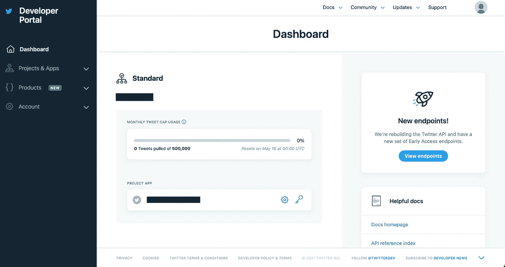
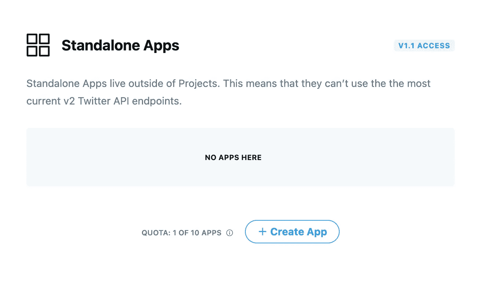

# 构建一个实时的 Twitter 机器人，可以回复媒体

> 原文：<https://towardsdatascience.com/building-a-real-time-twitter-bot-that-replies-with-media-e353fff1c395?source=collection_archive---------13----------------------->

## 构建一个实时 Twitter bot，使用 Node.js 上传媒体作为对特定标签的所有 tweets 的回复。


由[亚历山大·沙托夫](https://unsplash.com/@alexbemore?utm_source=medium&utm_medium=referral)在 [Unsplash](https://unsplash.com?utm_source=medium&utm_medium=referral) 上拍摄的照片

源代码:[https://github.com/pguduguntla/twitter-bot-reply-media](https://github.com/pguduguntla/twitter-bot-reply-media)

Twitter 使得构建能够与推文、用户和分析工具交互的机器人变得非常容易，这些工具可以从平台上获取有用的见解。

我想开发一个简单的实时 Twitter 机器人，它可以主动过滤所有包含特定标签的推文，并通过视频/图像直接回复推文。

在本教程中，我将介绍如何设置和构建一个简单的 Twitter 机器人来搜索带有标签`#FilterMe`的推文。如果这条推文包含一些媒体，那么我们的机器人将回复一个视频，如果它没有附加任何媒体，我们的机器人将回复一条类似于`Oops, looks like you didn’t provide a media file!`的消息。所以，让我们开始吧！

# 1.创建 Twitter 开发者账户

为了访问 Twitter 的 API，我们需要首先创建一个开发者帐户。你需要创建一个 Twitter 账户(如果你还没有的话),这个账户可以用来发帖。如果您不希望您的机器人与您的个人帐户相关联，[以您的机器人的名字创建一个新的 Twitter](https://twitter.com/i/flow/signup) 帐户。

然后，你需要通过他们的网站[这里](https://developer.twitter.com/en/apply-for-access)申请一个开发者账户。该应用程序会要求您提供一系列详细信息，包括您的联系信息、使用 Twitter API 的原因以及编程经验水平。表单非常标准，但是当被问及您希望使用 API 构建什么类型的项目时，请确保提供足够的信息。您的回答越全面，审批过程就越快。

一旦您完成了审批流程(可能需要 24 小时)，您将可以访问您自己的个人开发者门户，如下所示。如你所见，我已经创建了一个应用程序，但我将向你展示如何创建你自己的应用程序。



转到左侧导航栏上的项目和应用部分。转到*概述*，您应该能够创建一个项目或一个应用程序。项目允许您使用 Twitter 的最新 v2 API，该 API 仍在生产中，因此对于像这样的简单项目，我建议通过单击“创建应用程序”按钮创建一个独立的应用程序。



单击创建应用程序后，系统会要求您在收到 API 密钥之前命名应用程序。

请确保将您的 API 密钥存储在安全的位置，因为这些密钥将用于验证我们的帐户。我们几乎完成了设置！我们只需要再获得一些访问令牌密钥，我们也需要这些密钥来验证我们的帐户。点击左侧导航栏上的应用名称，即可进入应用设置页面。点击*密钥和令牌*，并点击*生成*访问令牌和访问令牌密码。

深呼吸…我们完成了设置。现在到了有趣的部分！让我们用一些代码来弄脏我们的手。

# 2.设置我们的 Node.js 项目

在编写任何代码之前，让我们设置 Node.js 项目。如果你还没有 Node.js，你需要安装它。你可以在这里找到如何操作的说明[。](https://nodejs.org/en/download/)

一旦你完成了，开始创建并进入你的项目文件夹。转到存储项目的目录，运行以下命令:

```
mkdir twitter-bot
cd twitter-bot
```

为了将其初始化为 Node.js 项目运行

```
npm init
```

在初始化项目之前，将要求您命名项目并接受所有提示。这将生成一个 package.json 文件，该文件跟踪您的项目细节和所使用的包。

现在，我们将创建三个文件。

```
touch bot.js
touch config.js
touch .env
```

首先，`bot.js`它将存储我们的 Twitter 机器人的主要源代码。文件`config.js`将存储几个帮助方法，这些方法将帮助我们与 API 交互并简化我们在`bot.js`中的代码。

`.env`文件将把我们的 API 键存储为全局变量。在您的`.env`文件中添加以下代码。替换上面您自己的 API 键获得的“X”。

```
API_KEY=XXXXXXXXXXXXXXXX
SECRET_KEY=XXXXXXXXXXXXXXXX
ACCESS_TOKEN=XXXXXXXXXXXXXXXX
ACCESS_TOKEN_SECRET=XXXXXXXXXXXXXXXX
```

最后，让我们在项目中安装一些模块，帮助我们导航 Twitter API 和存储 API 键。

```
npm install twitter dotenv bluebird --save
```

twitter 包是一个第三方模块，它使得 Node.js 用户与 Twitter API 的交互更加容易。Dotenv 允许我们加载全局变量(比如我们的 API 键),将它们与我们的项目代码分开。蓝鸟允许我们处理 API 请求承诺。

# 3.通过标签实时过滤推文

让我们首先在您最喜欢的文本编辑器中打开我们的`config.js`文件。添加以下代码，用 Twitter API 定义我们的身份验证。

在上面的代码中，我们导入了 Twitter 和 dotenv 包。在 *auth* 方法中，我们从我们的。环境文件。然后，我们用 secret 对象定义一个新的 Twitter 客户端，并返回该客户端。最后，我们导出 auth 方法，以便可以在 bot.js 中访问它。

在我们的 bot.js 文件中，我们有以下代码:

我们从导入配置文件中定义的 auth 函数开始。然后，我们通过调用 auth 函数来定义我们的 Twitter 客户端。然后，我们使用客户端的 stream()函数来跟踪所有带有文本“#FilterMe”的公共 tweets。我们将一个回调函数传递给接受流对象的 stream()。当实时流检测到 tweet 时，它运行另一个包含 tweet 对象的回调函数。该对象包含关于 tweet 和发布它的用户的详细信息。

现在我们已经收到了一条推文，我们需要检查这条推文是否附有媒体，如果有，就用视频回复！

# 4.上传媒体至 Tweet 回复

到目前为止，我们能够创建一个 Twitter 客户端，可以实时传输推文，并识别符合特定标准的推文。现在，我们必须与一些媒体一起发布对这条推文的回复。

首先，让我们将一个视频添加到项目文件夹的子目录中。/示例-媒体。确保你的视频是 mp4 格式的。

使用 Twitter API，上传和访问媒体有 3 个步骤:

1.  **初始化媒体上传:**在 Twitter 的后端为我们的视频文件分配空间。为该空间检索一个`mediaId`。
2.  **添加媒体文件:**用`mediaId`将我们的文件数据添加到 Twitter 后端。
3.  **完成上传**:一旦我们上传到文件，我们需要完成上传以确保上传已经安全完成。
4.  **发布媒体对一条推文的回复:**发布对原推文的回复，并附上部分文字和我们上传的视频。

我们将在 config.js 文件中添加方法来完成上述步骤。将以下代码添加到文件中:

您需要更新您的导入语句以包含这些模块:

```
const fs = require('fs');
const Promise = require('bluebird')
```

您还需要更新文件底部的 module.exports 以包含 postReplyWithMedia:

```
module.exports = { auth, postReplyWithMedia, postReply };
```

让我们仔细分析上面的代码，看看每个函数在做什么。

`initializeMediaUpload`方法接受一个 Twitter 客户端和一个文件的文件路径。在这个函数中，我们定义了视频格式和文件的大小。然后，我们调用 twitter 客户端上的 *media/upload* 端点来为一个 mp4 视频文件分配空间，该文件的大小与我们的视频相同。initialize 返回一个 Promise 对象，当它被实现时，包含 Twitter 数据库中我们的视频的 mediaId。

`appendFileChunk`方法接受一个客户机、mediaId 和一个上传文件的路径。这个方法在完成`initializeMediaUpload`时运行，因此，我们得到一个 mediaId tho，我们将实际的文件数据附加到 Twitter 的后端。我们使用`fs.readFileSync(pathToFile)`从文件中提取数据，并将其存储在 mediaData 中。再次，我们用命令“APPEND”调用*媒体/上传*端点，并传递我们的文件。返回一个包含我们的 mediaId 的承诺。

最后，`finalizeUploadMethod`接受一个客户端和 mediaId，并再次调用 *media/upload* 来确保我们的文件上传成功。然后，它返回一个带有 mediaId 的承诺。

函数`postReplyWithMedia`是将从 bot.js 中调用的函数。它接受客户端、mediaFilePath 和 replyTweet，reply Tweet 是我们要回复的 tweet 对象。在这个方法中，我们初始化我们的媒体上传，附加我们的媒体文件，并在发布我们的回复之前完成上传。我们构建了一个`statusObj`，它将我们的回复消息存储在*状态*中，将 tweet Id 存储在 *in_reply_to_status_id* 中，将我们视频的 mediaId 存储在 *media_ids 中。*然后，我们使用*status/update*端点发布我们的状态，我们在回调中接收我们新发布的 tweet。

函数`postReply`获取客户端、消息和 tweet，并以与上述函数类似的方式发布回复。

快好了！现在我们只需要导入并调用 bot.js 中的 postReplyWithMedia 和 postReply 方法。

在我们的 bot.js 文件中，我们只需要添加一个 if 语句来检查原始 tweet 是否包含媒体。我们可以通过检查 tweet 对象是否有 media_url 键来做到这一点。最终的 bot.js 文件应该如下所示:

我们走吧！您应该能够通过运行以下命令来运行您的 bot:

```
node bot.js
```

尝试自己或让朋友用标签“#FilterMe”来发布你的机器人，看看你的帐户是否会发布帖子。这可能需要一秒钟的时间，但是如果你按照这些步骤去做，应该会成功！

# 5.后续步骤

恭喜你。你创建了一个可以实时用视频回复推文的 Twitter 机器人。然而，我们的应用程序目前在本地运行。如果您希望将应用程序部署到云上，可以考虑将项目托管在 Heroku 或 AWS 上。这里有一个很好的免费教程，可以让你在 Heroku 上快速部署你的机器人。

我希望你学到了新的东西！如果您有任何反馈或问题，请随时告诉我。一如既往的感谢阅读！:))

源代码:[https://github.com/pguduguntla/twitter-bot-reply-media](https://github.com/pguduguntla/twitter-bot-reply-media)

编码快乐！