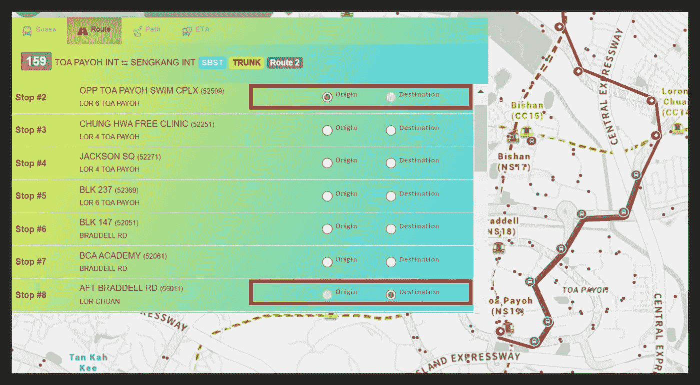
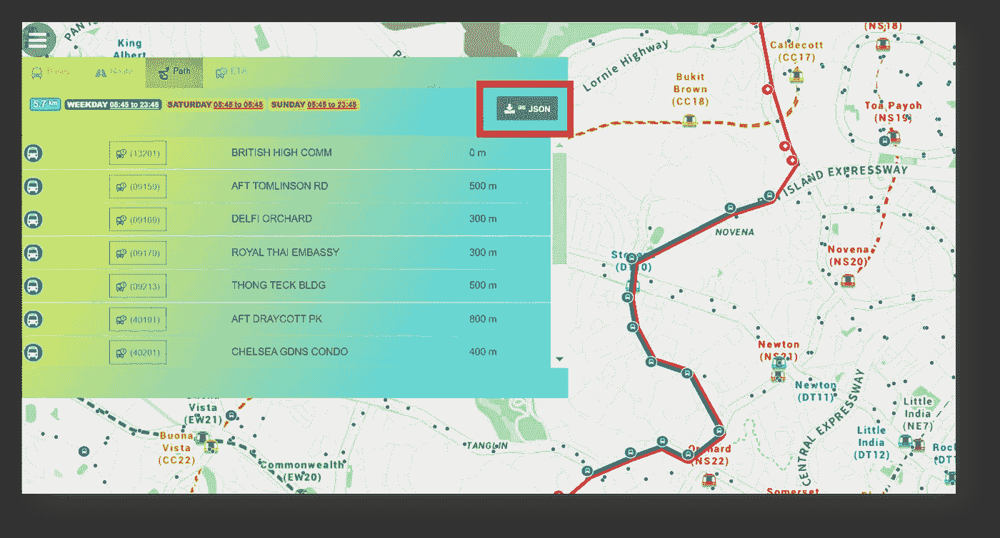
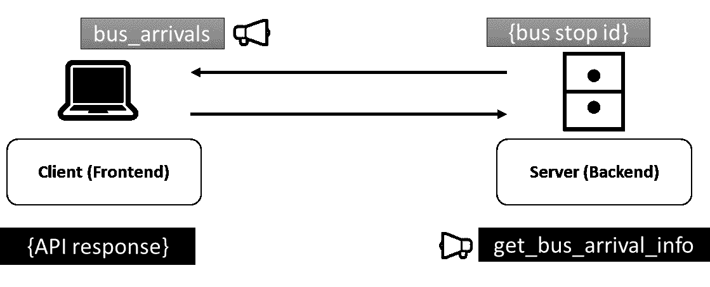
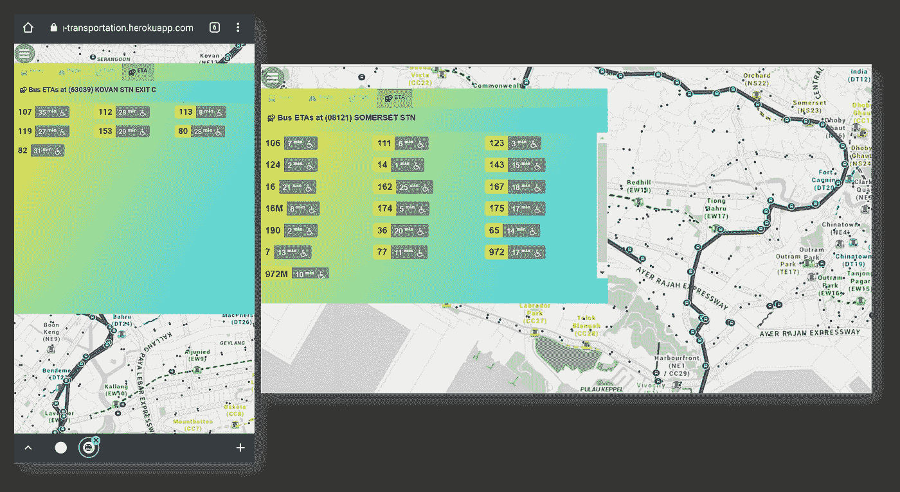

# 用 Socket.io 库在 NodeJS Express 中构建实时 web app

> 原文：<https://towardsdatascience.com/building-a-real-time-web-app-in-nodejs-express-with-socket-io-library-d9b50aded6e6?source=collection_archive---------6----------------------->

## 服务器+客户端代码实现来检索公交车到达时间

## 用例:我的公交路线可视化网站

为了更深入地了解公共交通通勤者的出行模式，几个月前我接受了一项任务，对一系列公共汽车出行进行出行链分析。虽然我最初在[建立了一个公交路线可视化网站](https://sg-transportation.glitch.me/)，其唯一目的是基于所选的特定始发地-目的地配对导出定制公交路线数据:



作者截图|显示支持选择始发地和目的地公交车站的网站功能



作者截图|选择的始发地公交线路数据可以在 web app 上导出

后来我决定进一步探索和利用[数据提供商](https://datamall.lta.gov.sg/content/datamall/en/dynamic-data.html#Public%20Transport)的公共 API，其中包括返回**任何特定公交车站的实时公交到达时间。简而言之，我很好奇 API 在它的实时响应中还包括哪些数据字段🤔**

虽然有其他库能够在 web 应用程序中集成实时数据流，但我实现 [Socket.io](https://socket.io/) 的主要原因是因为它不仅提供了在服务器+客户端之间建立 Web socket 双向连接的功能，而且两个服务器&客户端代码实现都是用 JavaScript **编写的，因此在编写应用程序的后端和前端代码时，无需在两种语言之间来回切换。**

# **socket . io 的服务器端实现**

首先，在 Express NodeJS web 应用程序中，代码的服务器端通常指的是**app.js/server.js 文件**，即初始化 Express.js 实例的 web 应用程序的入口点。通过`npm install socket.io`安装 NodeJS Socket.io 库后，服务器端代码实现如下:

## 因此，在上面的代码片段中应该注意几个关键点:

**1。**库 socket.io 通过以下方式导入:

```
const socketio=require("socket.io")
```

**2。**默认情况下，任何 web socket 实例都有名称空间`disconnect`——如果实例已经与前端断开连接*(通常是由于与其 web 服务器断开连接)*

**3。**定制名称空间`bus_arrivals`和`get_bus_arrivals_info`将随后对应于来自客户端的完全相同的名称空间 **(KIV)** ，使得在存在多个套接字通道的情况下，web 套接字实例将能够基于名称空间来识别将哪些消息发送到哪些通道。

**4*。**在从 Express NodeJS 库中创建了 **app** 实例之后，包装了 **app** 实例的**服务器**实例通过以下方式进行初始化:

```
const server = http.createServer(app)
```

⚠这一点非常重要，因为**应用**和**服务器**实例具有完全独立的功能。当 web 应用程序的内容由**应用程序**实例提供服务时，实际的 web 套接字连接实际上是在**服务器**实例上运行的，其表示为:

```
const io = socketio(server)
```

# Socket.io 的客户端实现

从上述实现的第 3 点继续，回想一下命名空间`bus_arrivals`和`get_bus_arrivals_info`是为 2 个 web 套接字通道指定的:



作者插图|服务器通过套接字通道**【bus _ arrivals】**从客户端接收请求，以了解服务器应该检索哪个汽车站信息。然后，服务器继续进行 API 调用，以检索该特定汽车站的汽车到达信息。最后，API 响应通过 web socket 通道**【get _ bus _ arrival _ info】**返回到前端进行渲染

要初始化 web 套接字的客户端实例，必须包含用于 [socket.io](https://socket.io/docs/v3/client-installation/index.html) 的 JavaScript 浏览器库:

```
<script type="text/javascript" src="js/socket.io.js"></script>
```

在实现 Socket.io 的以下代码片段嵌入浏览器的 JavaScript 内容之前:

## ⚠请注意，服务器端安装的 NPM Socket.io 包和浏览器端导入的 JavaScript 库版本必须兼容。在我的 [web 应用](https://sg-transportation.glitch.me/)中，我使用过的 Socket.io 库的版本有:

*   服务器端 NPM 包: **socket.io v4.1.3**
*   客户端 JavaScript 库: **Socket。IO 版本 4.1.3**

有关确定您已安装的 NPM 包是否与您在浏览器上导入的 JavaScript 库兼容的更多信息，请参考 [Socket.io 的官方网站](https://socket.io/)。

最后，在决定了应该显示公交车到站信息的哪些数据字段之后，我决定实现以下布局:



作者截图|左图是从 android 设备上看到的，右图是从平板电脑屏幕上看到的。

这就对了。巴士 ETAs 现在将每 10 秒重新渲染一次*(可以定制)*以反映最新的更新！🤩

**参考消息:完整的源代码请点击**[**my GitHub repo**](https://github.com/incubated-geek-cc/sg-transportation)**。web 应用程序当前部署在:**[https://sg-transportation.glitch.me/](https://sg-transportation.glitch.me/)

希望上面在 NodeJS 中实现 [Socket.io](https://socket.io/) 的例子对您有用，非常感谢您的阅读！❤:如果你想阅读我即将发表的应对工作挑战的文章(包括人和技术问题)，请跟随我！会非常感激😀

<https://geek-cc.medium.com/membership> 