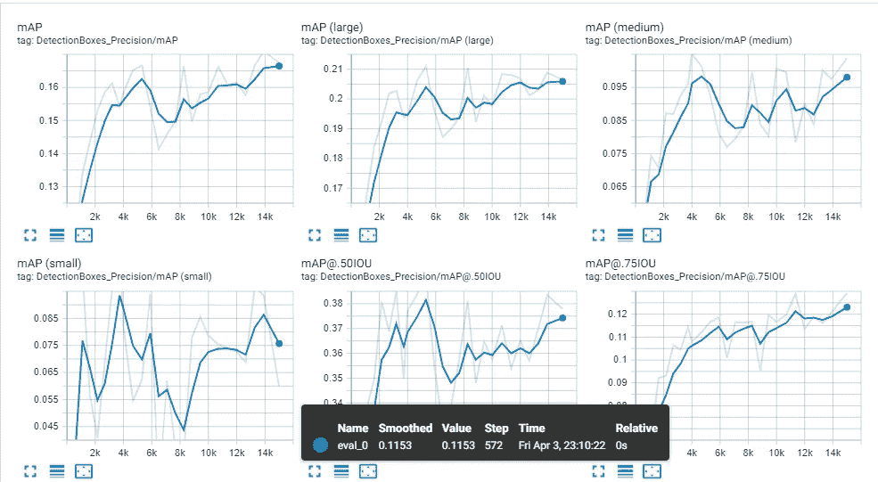

# 利用机器学习和计算机视觉构建实时坑洞检测系统

> 原文：<https://towardsdatascience.com/building-a-realtime-pothole-detection-system-using-machine-learning-and-computer-vision-2e5fb2e5e746?source=collection_archive---------13----------------------->

图 1:安装在行驶车辆上的摄像头检测到的坑洞截图。坑洞用具有检测置信度的矩形区域标记(图片由作者提供)

坑洼是由于道路的磨损和风化形成的。它们不仅给市民带来不适，还会因交通事故而导致死亡。美国记录了每年超过 2000 起由于路面坑洼和恶劣路况造成的致命事故。

本文描述了一种建立实时检测系统的方法。

这种检测系统有许多使用案例。例如，市政当局可以检测和定位坑洞，并评估其大小，以便他们可以计划维修。安装在行驶车辆上的摄像头可以实时检测坑洼，帮助司机避开坑洼。

在很高的层次上，步骤如下:

1.  数据采集和准备
2.  模型训练和评估
3.  实时检测的模型部署

## **1。数据准备**

我们需要有监督的机器学习模型的标记图像。我们从互联网上收集了 1000 张坑洞图像，并使用图像注释工具对它们进行了标记。有一些很好的图像标记工具——包括商业的和开源的。我们用的是微软的 VoTT。这是开源的，麻省理工学院许可的，可以在 https://github.com/microsoft/VoTT 的[的 github 上获得。](https://github.com/microsoft/VoTT)

图 2:使用 VoTT 标记的坑洞图像(图片由作者提供)

如图 2 所示，我们在 VoTT 中加载了图像，并标记了一个标签，例如 pothole。要了解如何使用 VoTT 进行注释，请查看 GitHub 站点上的官方文档。

VoTT 允许以不同的格式导出带注释的图像。我们以名为 TFRecord 的 TensorFlow 兼容格式导出图像。

训练集:我们通常将 80%的标记图像作为训练集。将所有训练 TFRecords 存储在一个目录中，比如说 pothole_training。

测试集:剩余的 20%的标记图像被留出作为测试集。我们将它们存储在一个单独的目录中，比如说 pothole_test。

## 机器学习模型训练

在将所有图像标记并分成训练集和测试集之后，我们准备好训练我们的模型。我们将使用单镜头多框检测或 SSD 算法来训练对象检测模型。我们选择 SSD 而不是其他对象检测模型，因为与 RCNN 或其变体等其他算法相比，它提供了合理的准确性和更快的速度。YOLO 也提供了很大的准确性和速度，但在这篇文章中，我们坚持固态硬盘。SSD 的另一个优势是它可以检测图像中更小的对象。

我们使用动量人工智能来训练模型。这允许我们训练模型并迭代建模过程，而无需编写一行代码。Momentum SSD 运行在 TensorFlow 执行引擎之上，并提供了一个可扩展的平台来在 CPU 和 GPU 上运行培训。当然，你可以写 TensorFlow 来训练你的模型。

使用其直观的用户界面，很容易在 Momentum 上配置和训练 SSD。

如下图 3 所示，单击“训练新模型”按钮，选择“SSD 对象检测”复选框，填写表格(出于演示目的，可操作的元素以黄色突出显示)。

图 Momentum AI 的 SSD 型号配置页面截图(图片由作者提供)

一些值得注意的配置项目:

training_data_dir:这是包含用于训练的 TFRecord 文件的目录

test_data_dir:这是包含用于测试的 TFRecords 的目录。

label_map_file:这是从 VoTT 导出 TFRecords 时生成的文件。

network_config:从头开始训练模型是一项非常耗时的计算密集型任务。Momentum 提供了使用以下预训练检查点执行迁移学习的选项:

*ResNet50/RetinaNet50，输入尺寸 640 x640
resnet 50/retina net 50，输入尺寸 1024 x1024
resnet 101/retina net 101，输入尺寸 640 x640
resnet 101/retina net 101，输入尺寸 1024 x1024
resnet 152/retina net 152，输入尺寸 640 x640
resnet 152/retina net 151*

在运行模型之前，我们需要将 TFRecords(训练集和测试集以及 label_map_file)上传到 Momentum。您可以使用 Momentum 的“数据管理”工具将文件上传到相应的目录中(如下图 4 所示)

图 4: Momentum 截图显示使用数据管理工具上传 TFRecords(图片由作者提供)

使用 Momentum 的用户界面运行模型。为此，从左侧菜单中展开 My Models，单击您刚刚配置的 Pothole 模型，然后单击“Run”按钮(在下面的图 5 中突出显示为黄色以进行演示)。

图 5: Momentum 截图——运行 SSD 模型。屏幕还显示了评估和部署模型的按钮(图片由作者提供)。

图 5 显示了“Run”按钮，单击该按钮将触发培训任务。模型完全训练好还需要一段时间。模型所需的时间取决于标记数据的数量、输入图像大小、批次大小和机器的整体容量。

动量在张量流上执行训练。它还允许在安装了 TensorFlow with GPU 的远程服务器/集群上运行模型。

## 监控模型执行

在训练进行的同时，我们可以通过启动 TensorBoard 来监控模型性能。下图 6 显示了 Tensorboard 屏幕，显示了训练期间的各种模型损失。

图 Tensorboard 上显示的训练损失(图片由作者提供)

当模型被完全训练并且损失被最小化时(如在 Tensorboard 上观察到的)，你可以在动量上部署模型。或者，您可以下载 TensorFlow 兼容模型并编写自定义代码来执行坑洞检测。

## 实时坑洞检测的样本输出

下面的视频显示了一辆以每小时 50 英里的速度行驶的汽车上安装的摄像头对坑洞的检测。这个视频是由乔治梅森大学的一群研究生开发的最终产品，作为 Accure 赞助的他们的顶点项目的一部分。

Momentum 是一个企业人工智能平台，可以免费用于学习和教育目的。你可以在 https://impulse.accure.ai/register/注册一个免费账户。

坑洞探测是 Accure 赞助的顶点项目，我有机会监督和指导乔治梅森大学的研究生团队。