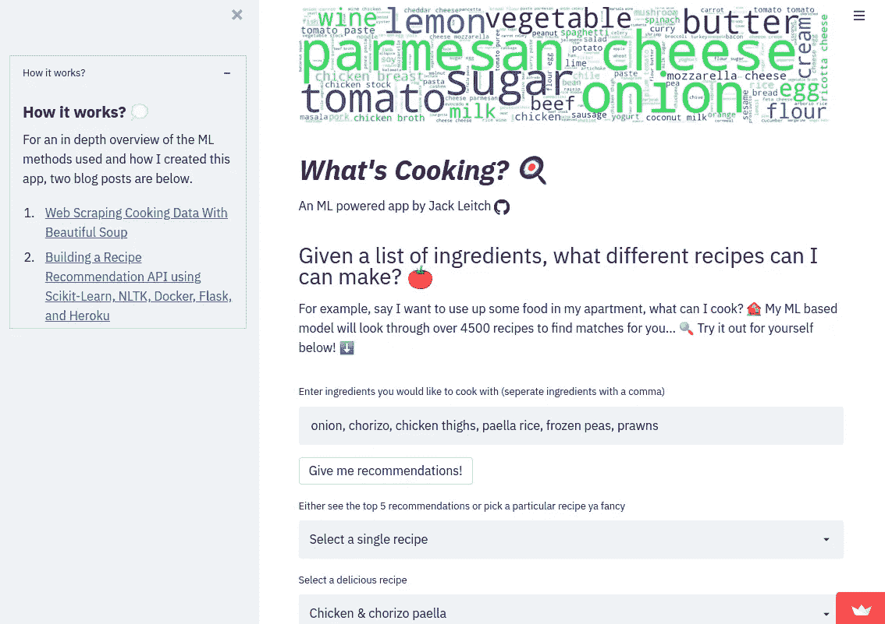
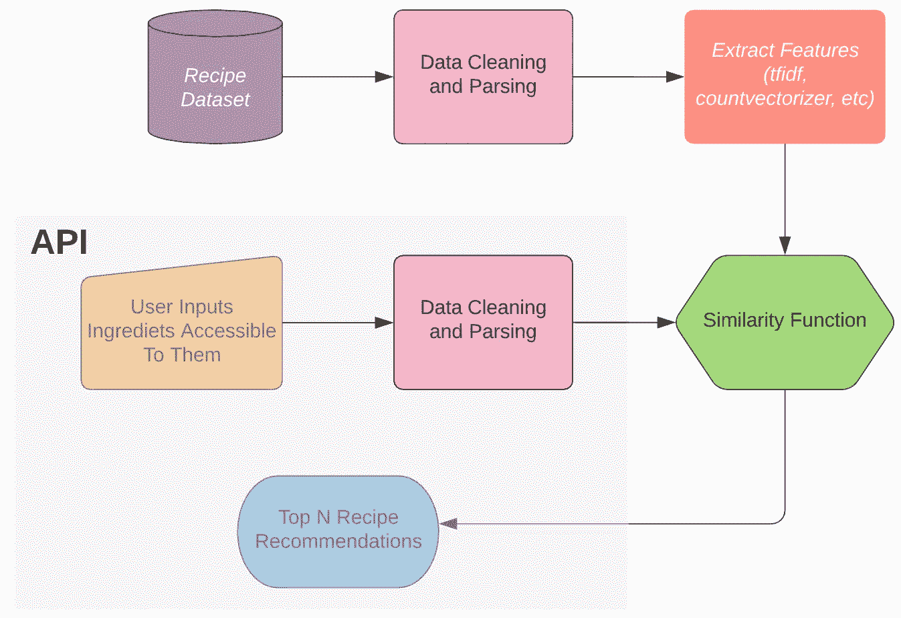
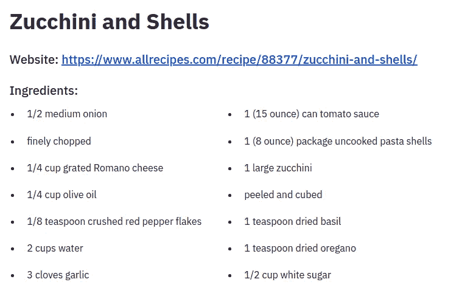

# 建立食谱推荐系统

> 原文：<https://towardsdatascience.com/building-a-recipe-recommendation-system-297c229dda7b?source=collection_archive---------4----------------------->

## 使用 Word2Vec、Scikit-Learn 和 Streamlit

艾拉·奥尔森在 [Unsplash](https://unsplash.com?utm_source=medium&utm_medium=referral) 上拍摄的照片

首先，如果你想玩完成的应用程序。可以在这里:[https://share . streamlit . io/jackmleitch/what scooking-deployment/streamlit . py](https://share.streamlit.io/jackmleitch/whatscooking-deployment/streamlit.py)。

作者图片

在之前的一篇博文([使用 Scikit-Learn、NLTK、Docker、Flask 和 Heroku](/building-a-recipe-recommendation-api-using-scikit-learn-nltk-docker-flask-and-heroku-bfc6c4bdd2d4) 构建食谱推荐 API)中，我写了我是如何着手构建食谱推荐系统的。总结一下:我首先清理并解析了每个食谱的配料(例如，1 个洋葱丁变成了洋葱)，接下来我使用 TF-IDF 对每个食谱配料列表进行了编码。在这里，我应用了一个相似性函数来找出已知 **食谱**的**配料和终端用户给出的**配料之间的相似性。**最后，根据相似度得分，我们可以得到最受推荐的食谱。**

作者图片

然而，在使用我的新 API 一段时间后，我想在两个方面进行改进:

1.  有时推荐中的成分与输入成分不一致，所以我需要一些更好的嵌入。
2.  Flask API 需要一个很好的改造。

输入 Gensim 的 Word2Vec 和 Streamlit。

# 成分的预处理和解析

为了理解手头的任务，让我们看一个例子。杰米·奥利弗[网站](https://www.jamieoliver.com/recipes/pasta-recipes/gennaro-s-classic-spaghetti-carbonara/)上的美味“Gennaro 的经典意面烤面条”食谱要求配料:

*   3 个大鸡蛋黄
*   40 克帕尔马干酪，外加上菜
*   1 块 150 克的高福利咸肉
*   200 克干意大利面
*   1 瓣大蒜
*   特级初榨橄榄油

这里有很多冗余信息；例如，重量和度量不会给菜谱的矢量编码增加价值。如果有什么不同的话，那就是区分不同的食谱变得更加困难。所以我们需要摆脱这些。快速的谷歌搜索把我带到了维基百科的一个页面，包含了一个标准烹饪标准的列表，比如丁香、克、茶匙等等。在我的 ingredient parser 中删除所有这些单词效果非常好。

我们还想从我们的配料中去除停用词。在自然语言处理中,“停用词”指的是一种语言中最常见的词。例如，句子“学习什么是停用词”变成了“学习停用词”。NLTK 为我们提供了一种移除(大部分)这些单词的简单方法。

配料中还有其他对我们没用的词——这些是食谱中很常见的词。例如，油被用在大多数食谱中，并且在食谱之间提供很少或没有区别的能力。此外，大多数人家里都有石油，所以每次使用 API 时都必须编写石油既麻烦又没有意义。有一些先进的 NLP 技术，例如使用[条件随机场](https://open.blogs.nytimes.com/2015/04/09/extracting-structured-data-from-recipes-using-conditional-random-fields/)(一种统计建模)，可以计算出一个词是一个成分的概率，而不是围绕成分词的度量、纹理或另一种类型的词。但是，简单地删除最常见的单词似乎非常有效，所以我这样做了。奥卡姆剃刀和所有这些……为了得到最常见的单词，我们可以做以下事情:

然而，我们还有最后一个障碍要克服。当我们试图将这些“垃圾”单词从我们的成分列表中删除时，当同一单词有不同的变体时会发生什么呢？如果我们想删除每一次出现的单词“pound ”,但菜谱成分却说“pounds ”,会发生什么情况？幸运的是，有一个非常简单的解决方法:词汇化和词干化。词干化和词元化都产生词根形式的词尾变化——区别在于词干可能不是一个实际的词，而词元是一个实际的语言词。虽然词汇化通常较慢，但我选择使用这种技术，因为我知道其中的成分将是实际的单词，这对调试和可视化很有用(使用词干化的结果实际上是相同的)。当用户向 API 提供成分时，我们也对这些单词进行词汇化，因为词汇化的单词是具有相应向量的单词。

我们可以将所有这些放在一个函数`ingredient_parser`中，以及其他一些标准的预处理:去掉标点符号，去掉重音符号，将所有内容都变成小写，去掉 Unicode。

当分析“Gennaro ' s classic spaghetti carbonara”的配料时，我们得到了:蛋黄、帕尔马干酪、培根、意大利面、大蒜。太好了，这太棒了！使用`df.apply` when 可以轻松解析每个菜谱的配料。

# 使用 Word2Vec 的单词嵌入

Word2Vec 是一个产生单词嵌入的 2 层神经网络。它接受一个文本语料库作为输入(单个文档的集合)，并将每个单词映射到欧几里得空间中的一个向量。最终目标是拥有一个能够捕捉单词之间的**分布相似性**的文本表示。也就是说，经常出现在相似上下文中的单词被映射到由较短欧几里德距离(L2 范数)分隔的向量。

在食谱成分的上下文中，Word2vec 允许我捕捉经常一起使用的食谱成分之间的相似之处。例如，制作比萨饼时常用的马苏里拉奶酪与其他奶酪和比萨饼相关的配料最相似。

我选择使用 Word2Vec 的连续单词包(CBOW)变体。CBOW 试图学习一种语言模型，该模型试图预测滑动窗口中的中心单词。由于 Word2Vec 试图根据单词的环境来预测单词，因此按字母顺序对成分进行排序至关重要。如果我没有根据一致的标准对配料进行排序，那么模型会将不同顺序的配料解释为具有不同的上下文。

选择的超参数如下:

*   size=100，这是指嵌入的维数。通过尝试 50、100、150，我选定了 100，看看哪个表现最好。
*   sg = 0，这将创建一个 CBOW 模型，而不是 SkipGram 模型。
*   workers = 8，我拥有的 CPU 数量。
*   window = 6，这是预测中心单词的滑动窗口的大小。选择 6 是因为它是每个文档(成分列表)的平均长度。
*   min_count = 1，在训练发生之前，低于 min_count 频率的字被丢弃。选择 1 是因为我希望所有的成分都有嵌入。

Word2Vec 训练代码如下。我使用了流行的 python 库 Gensim。

# 文档嵌入

为了构建食谱推荐，我需要将每个文档(每个成分列表)表示为一个嵌入。这让我可以计算相应的相似性。那么，我们如何使用我们的单词嵌入来计算整个成分列表的代表向量呢？我尝试了两种不同的方法:一种简单，另一种稍微复杂一些。为此，我跟着这个优秀的[教程](http://nadbordrozd.github.io/blog/2016/05/20/text-classification-with-word2vec/)。

## 平均单词嵌入

这就是它在 tin 上所说的，它直接对每个文档中的所有单词嵌入进行平均。代码改编自[这里](http://nadbordrozd.github.io/blog/2016/05/20/text-classification-with-word2vec/)和[这里](/nlp-performance-of-different-word-embeddings-on-text-classification-de648c6262b)。

## 使用 TF-IDF 来聚合嵌入

这里我们做的和上面一样，但是我们做的是加权平均，并使用逆文档频率(IDF)来缩放每个向量。IDF 衡量一个术语在整个语料库中的重要性。IDF 将对语料库中非常常见的术语(在我们的例子中，如橄榄油、大蒜、黄油等)进行加权。)和衡量罕见的条款。这对我们是有用的，因为它将给予我们更好的区分食谱的能力，因为按比例缩小的配料将是用户倾向于不作为推荐系统的输入给出的配料。

# 推荐系统

该应用程序仅包含文本数据，并且没有可用的评级类型，**因此我们不能使用**矩阵分解方法，例如基于 SVD 和相关系数的方法。

我们使用基于内容的过滤，这使我们能够根据用户提供的属性(成分)向人们推荐食谱。为了度量文档之间的相似性，我使用了**余弦相似度**。我也尝试使用空间和 KNN，但余弦相似性在性能(和易用性)方面胜出。

数学上，余弦相似性度量两个向量之间角度的余弦。从数学角度来看，这与相同向量的内积相同，都归一化为长度为 1。用余弦相似度，角度越小，余弦相似度越高:所以我们在努力最大化这个分数。

值得注意的是，没有评估模型性能的具体方法，所以我必须手动评估这些建议。老实说，这实际上非常有趣…我还发现了一大堆新食谱！令人欣慰的是，当我们放入配料时(当然是在它们被解析之前！)对于我们最爱的 Gennaro 经典意面 carbonara，我们得到了正确的推荐，得分为 1。

现在，我冰箱/橱柜里的几样东西是:番茄酱，意大利面，西葫芦，洋葱，奶酪我们新建立的推荐系统建议我们做:

作者图片

我觉得不错——最好开始做饭吧！正如我们所看到的，这份食谱中我没有输入的所有成分都是非常常见的家居用品。

# 使用 Streamlit 创建应用程序

最后，我使用 Streamlit 创建并部署了一个应用程序。它非常容易制作，文档也非常容易理解。这个应用程序的代码可以在我的 [Github](https://github.com/jackmleitch/whatscooking-deployment) 上找到。

作者图片

感谢阅读，我希望你喜欢它。这里有一些你可能感兴趣的我的其他故事…

</organizing-machine-learning-projects-e4f86f9fdd9c>  </automating-mundane-web-based-tasks-with-selenium-and-heroku-715a2f1ec35e> 