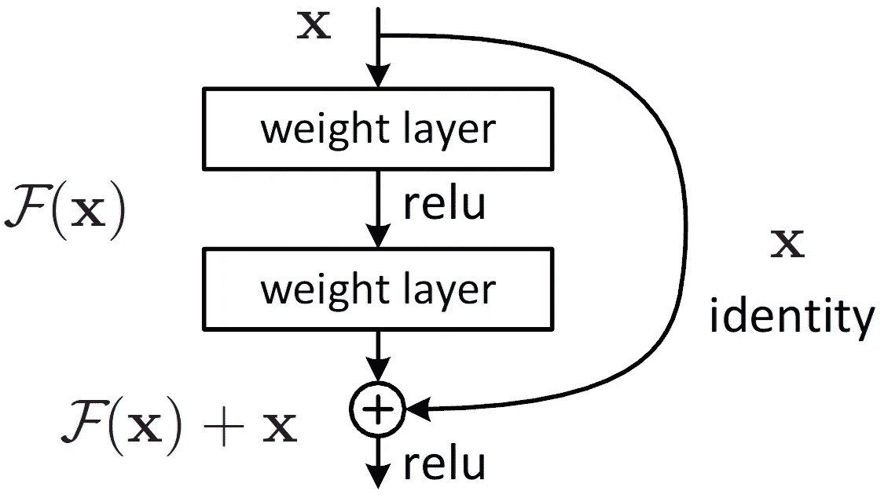

# 用 PyTorch 构建剩余网络

> 原文：<https://towardsdatascience.com/building-a-residual-network-with-pytorch-df2f6937053b?source=collection_archive---------17----------------------->

## 当网络变得非常深的时候

图片来自 Unsplash。

自动驾驶、人脸检测和许多计算机应用的成功都归功于深度神经网络。然而，许多人可能没有意识到，计算机视觉进步的繁荣是由于一种特定类型的架构:残余网络。事实上，导致这个人工智能主导世界的最先进的结果只有在残余块的发明下才成为可能——这是一个简单而优雅的概念，导致了创建真正“深度”网络的飞跃。

本文深入研究了残差网络背后的直觉和 PyTorch 中的实现，以训练 ResNets 执行图像分类任务。

# 在变‘深’之前，退化问题是什么？

理论上，具有更多变量的更深的网络对于近似困难的任务(例如图像理解)是更好的函数。然而，经验测试表明，传统的深度网络更难训练，表现甚至比浅网络更差。我们称之为*退化*问题。

这种现象是不直观的，因为假设我们有两个相同层数的网络，第二个网络在前面增加了 *x* 层，最坏的情况应该是第一个 *x* 层输出与原始输入相同的映射，因此具有相同的性能。

据推测，较差的性能是由于与原始输入的相同映射在过程中被遗忘，因此在 21 世纪初，网络(如 VGG-16)最多只有 10-20 层。

# **残留架构**

残差网络是一种简单直接的方法，通过创建一种称为跳过连接的快捷方式来馈送原始输入，并在网络的几个堆叠层之后将其与输出特征相结合，从而解决上述*退化*问题。

图一。一个简单的剩余块。来源:[https://arxiv.org/abs/1512.03385](https://arxiv.org/abs/1512.03385)

形式上，如图 1 所示。，给定堆叠层的输入为 *x* ，网络层为函数 *F* ，输出 *y* 如下:

当 *F(x)* 和 *x* 的尺寸不匹配时，可以简单地在跳接过程中进行线性投影来改变 *x* 的尺寸。

我们将上面的整个管道称为一个剩余块，我们可以有多个剩余块来构建一个更深的网络，而没有原来的*退化*问题。

# 计算环境

## 图书馆

整个程序是通过 PyTorch 库(包括 torchvision)构建的。以下代码导入所有库:

## 资料组

为了展示残差网络的能力，我们在两个数据集上进行测试:更简单的 [MNIST](https://gas.graviti.com/dataset/hellodataset/MNIST/?utm_medium=0828Taying_2) 数据集，包括 6 万张从 0 到 9 的手写数字图像，以及更复杂的 [CIFAR-10](https://gas.graviti.com/dataset/graviti/CIFAR10?utm_medium=0828Taying_2) 数据集。

通常在测试过程中，人们可能会引用多个数据集，无论是出于研究目的还是为了查看哪个模型更通用。因此，当所有数据集被组织到一个平台中时，这是非常方便的。幸运的是，一家名为 [Graviti](https://graviti.com?utm_medium=0828Taying_2) 的年轻初创公司提出在其平台上托管许多臭名昭著的数据集。人们可以简单地直接下载它们来执行进一步的训练和测试。

## 硬件要求

最好在 GPU 上训练神经网络，因为它们可以显著提高训练速度。但是，如果只有 CPU 可用，您仍然可以测试程序。在我们的例子中，一个更简单的基于残差块的网络(只有几个网络)应该可以在两种类型的设备上运行，而更复杂的模型(如 ResNet-152)将更适合在 GPU 上运行。要让您的程序自己决定硬件，只需使用以下代码:

# 构建剩余块

本节提供 PyTorch 教程，介绍在输入和输出维数相同的卷积神经网络上可以创建的最简单类型的残差块。

人们可以使用 PyTorch *nn 来创建它。模块*如下:

# 使用预先存在的 ResNet 模型

一些利用剩余架构的网络已经在像 ImageNet 这样的大数据集下被证明是成功的。Torchvision 提供了网络的检查点和体系结构，如在其库中预构建的 ResNet-34、ResNet-50 和 ResNet-152。人们可以通过以下方式简单地检索他们的模型:

但是，如果要将网络微调到非 ImageNet 的数据集，则更新 ResNet 的最终图层非常重要，因为最终的独热向量等于数据集的类数。

# 结果

我们对我们的网络进行了 50 个历元的训练，对于 ResNet-34 和 ResNet-152，我们可以在 MNIST 数据集上轻松实现约 99%的准确率，在 CIFAR-10 数据集上轻松实现 90%的准确率。

基于何等人的原始论文的结果，我们还可以看到，残差架构在 ImageNet 数据集上的性能明显优于和具有相同层数但没有残差架构的网络。

*这些结果可以直接从论文* [*这里*](https://arxiv.org/abs/1512.03385) *中检索出来。*

# 结论

由何等人创建的剩余结构可以说是近年来计算机视觉神经网络发展中最伟大的发明之一。今天几乎所有的网络，甚至是卷积网络之外的网络，都有类似于更好更深的网络的概念。

这种简单而优雅的方法创造了无数的可能性，推动了机器对人类世界理解的前沿。

*感谢您坚持到现在*🙏*！* *我会在计算机视觉/深度学习的不同领域发布更多内容。一定要看看我关于计算机视觉方法的其他文章！如果你对 Graviti 平台感兴趣，也可以随时加入* [*不和谐*](https://discord.gg/sF9zQTbB) *频道！*