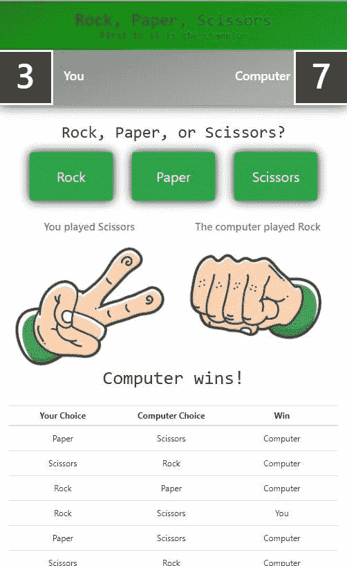
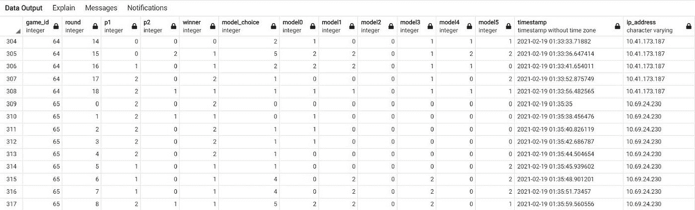
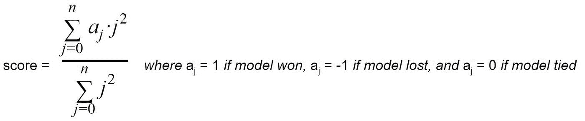
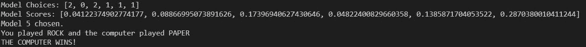
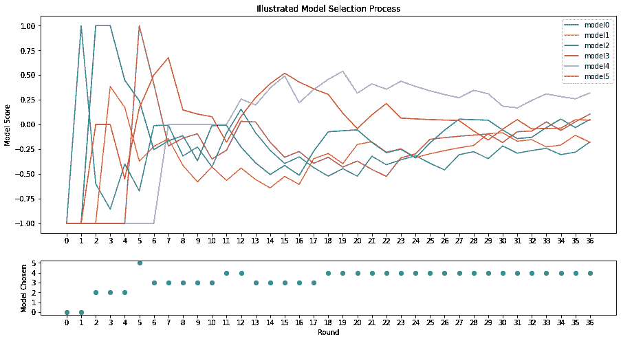
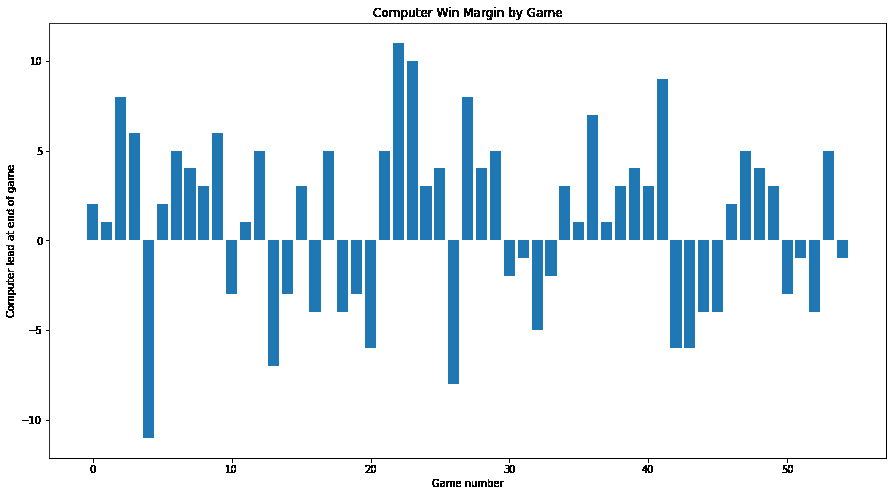
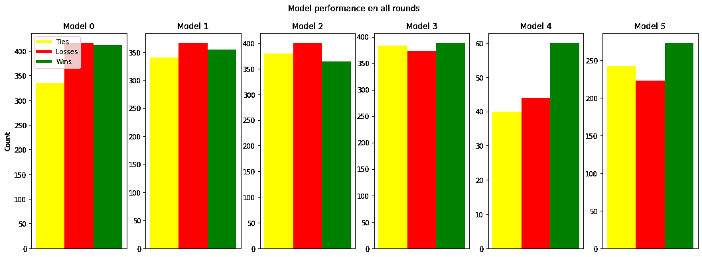
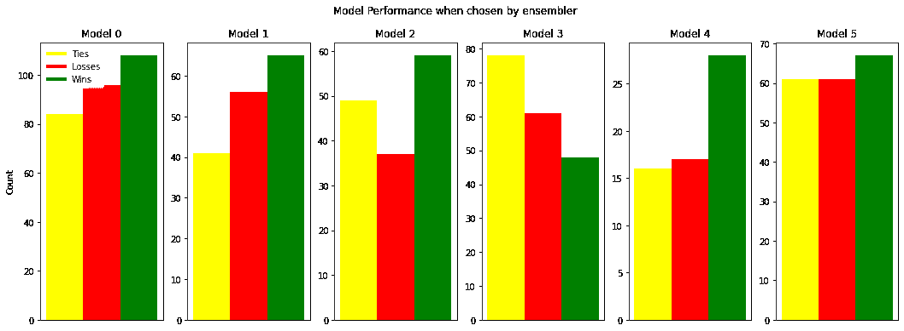

# 建造石头剪刀布人工智能

> 原文：<https://towardsdatascience.com/building-a-rock-paper-scissors-ai-948ec424132f?source=collection_archive---------13----------------------->

## 如何集成六个模型来预测和避免可预测性

在本文中，我将向您介绍我构建一个完整的 Python Flask 人工智能项目的过程，该项目能够使用一个定制的评分系统集成六个模型(基于简单逻辑的、决策树、神经网络),在游戏级别和 AWS RDS Cloud SQL 数据库中存储的历史数据上训练，在 60%以上的时间里击败人类用户。

[在这里玩游戏](https://rps-ai-game.herokuapp.com/)

点击这里观看我关于[项目的视频介绍，或者按以下章节跳转到视频](https://youtu.be/uB5MhvgGKH0)

# 概观

[视频剪辑此处](https://youtu.be/uB5MhvgGKH0?t=188)

石头剪子布引起了我对一个人工智能项目的注意，因为从表面上看，它似乎不可能在游戏中获得优势。如今，很容易假设计算机可以在国际象棋中击败你，因为它可以利用其所有的计算能力来看到所有可能的结果，并选择对它有利的结果。另一方面，石头剪刀布通常被用来代替掷硬币来解决争端，因为赢家似乎是随机的。不过，我的理论是**人类实际上不能做出随机的决定**，如果人工智能能够学习理解人类在一系列比赛过程中做出选择的方式，即使人类试图随机行事，那么人工智能在猜测球员决定方面的准确率将大大超过 33%。

应用程序中的每个“游戏”都由一系列“回合”组成，玩家和人工智能分别在石头、布或剪刀之间做出选择，并确定获胜者。当玩家或电脑赢得指定回合数时，游戏结束。我的目标是看看我是否能让人工智能足够了解人类行为，从而赢得 55%以上的游戏。

# 第一次迭代

[视频剪辑此处](https://youtu.be/uB5MhvgGKH0?t=345)

我一开始只是简单地对我能想到的人类做决定的不同方式进行硬编码:一遍又一遍地选择同样的事情，按照一种模式进行选择，或者尝试做出他们已经有一段时间没有使用过的选择。我建立了模型，如果玩家使用这些方法中的任何一种，这些模型将预测玩家的下一个选择，然后使用基于逻辑的标准，根据前几轮的记录，尝试并决定哪个模型适合玩家的行为。这是项目的第一阶段，在 Jupyter 笔记本上运行，最初玩得很好。然而，它会很容易落入某些模式，并且可以被精明的玩家可靠地欺骗。

在这一点上，我意识到我可以做很多改进，并兴奋地将这个项目具体化。我做了一个 Flask webapp，并把它放在了 T2 的 Heroku 上，这样我就可以和朋友们分享了。然后，我在 AWS 上建立了一个**云数据库，以捕捉每次播放的数据，因为我知道这些数据可以给我建立更复杂模型的能力。**

我开始分析我的模型的性能并调整它们。我还用一个新的集成系统替换了简单的基于逻辑的模型选择过程，我将在下面进行更详细的介绍。我使用自举 HTML 创建了一个手机友好应用程序，改进了设计以获得更吸引人的用户体验，然后在社交媒体上发布了链接，供我的朋友和家人玩并提供见解。有了这些数据，我开始实现**机器学习模型**以及**基于逻辑的**模型，我将在下面更详细地介绍这些模型。此时，随着应用范围的扩大，进度变慢了，我必须解决包依赖、数据质量、后端和模型导出问题。然而，我继续迭代更新应用程序的功能，以响应我正在进行的数据分析和我继续改进它的新想法。这些天，当我和人工智能比赛时，即使知道它如何工作的一切，我也很难打败它。

# 人工智能如何工作

## 数据

数据在游戏过程中被记录下来，并保存在一个本地 SQLAlchemy 表中，该表每轮都传递给模型，以帮助它们做出相应的决策。它包括除 game_id 和 ip_address 之外的所有上述列。在每场比赛结束时，数据被发送到 AWS 云托管的数据库，并附加上这两列，可以访问这些数据来评估模型性能和训练 ML 模型。

## 组装

[视频剪辑此处](https://youtu.be/uB5MhvgGKH0?t=682)

每一轮，computer_choice 函数选择哪个模型作为 AI 在下一轮的选择。这是通过给定当前游戏记录对每个模型的性能评分来完成的。

这个评分系统是二次的，以便优先考虑最近的模型性能，使其对玩家可能使用的策略做出响应。首先，这允许模型克服玩家可能使用的简单模式，例如不断地玩相同的选择或以重复的模式切换选择。其次，它确保了相同的模型不会不断重复，这将允许玩家弄清楚它是如何工作的，并击败它。如果玩家真的想出了一个模型，它会输，并很快获得一个负分，这是因为二次评分优先考虑最近几轮。最后，它允许更准确地预测玩家思维的模型被更频繁地使用。下面是一轮比赛中后端的一个例子:

## 天真的模型

[视频剪辑此处](https://youtu.be/uB5MhvgGKH0?t=1029)

每个模型都采用不同的方法来理解玩家将如何做出下一个选择。前四个模型对玩家做出选择的方式做出了非常具体的假设，因此只适用于玩家以给定方式行动的情况。

*   **模式 0** :选择输给或击败玩家先前选择的选项。基于玩家将继续不重复或重复先前选择的假设。
*   **模式一**:基于过去三轮的向量选择。基于玩家将使用某种模式(例如石头，布，剪刀，石头，布，剪刀，等等。)
*   模式 2 :选择击败玩家最近最常选择的选项。基于一个假设，一个玩家有一个他们一直在做的选择。
*   **模式 3** :选择击败玩家最近最少选择的选项。基于玩家会尝试玩他们有一段时间没玩过的游戏的假设。

随着 ensembler 被构建为支持在最近几轮中准确预测的模型，如果人类玩家重复他们的假设所基于的行为足够多次，这些模型最终将在分数上上升，成为计算机选择中的决定性模型。

## 机器学习模型

最后两个模型更加复杂，一个是决策树，另一个是神经网络，都是在与人工智能比赛的历史数据集上训练的。这些模型需要更长的时间才能进入人工智能的决策过程，因为它们需要分别看到至少 7 轮和 5 轮球员数据，才能作为输入输入到它们的 ML 模型中。这些模型不仅知道玩家在前几轮的选择，还知道计算机的选择，谁是赢家，人工智能用来做出选择的模型，以及每个模型在前几轮的选择。

*   **模型 4** :使用基于历史数据训练的腌 scikit-learn 神经网络模型，根据前 7 轮的数据预测并击败玩家的下一个选择。
*   **模型 5** :使用基于历史数据训练的腌制 scikit-learn 决策树模型，根据前 5 轮的数据预测并击败玩家的下一个选择。

使用天真的模型开始游戏有助于解决冷启动问题，在这种情况下，AI 对它正在开始新游戏的玩家一无所知。(随机数生成器的唯一用途是在第一轮，因为有必要使人工智能不完全可预测，否则随机数在这个应用程序的构建中是完全避免的。)因此，最初的人工智能通过其基于逻辑的模型尽最大努力，直到它在多个回合中更好地理解玩家，并可以打开其更智能的模型。请参见下图，了解在一场有记录的比赛中，模特是如何根据他们的得分被选出的。

## 集成模型选择可视化

[视频剪辑此处](https://youtu.be/uB5MhvgGKH0?t=1426)

此图像旨在说明一个示例游戏的模型选择过程，而不是代表单个模型的一般功效。

# 统计数字

[视频剪辑此处](https://youtu.be/uB5MhvgGKH0?t=1544)

我的目标是让人工智能赢得超过 55%的时间。目前，人工智能的胜率为 61.8%。

为了分析模型的表现，我们将查看两个数据集:一个显示模型在每轮中的选择结果与玩家在该轮中实际选择的结果，另一个显示模型在玩家选择该模型的轮中的实际表现。从下面可以看出，所有回合中表现最好的模型(根据赢/输比率判断)是模型 4，它做出了 203 次赢的选择和 168 次输的选择。第二好的是模型 5 的决策树模型，它已经做出了 273 次获胜的选择和 223 次失败的选择。注意:这些模型分数仅针对模型的最近迭代计算，因此模型 4 的神经网络的总计数较低。

只看集合者选择模型的回合，表现最好的模型也是神经网络模型 4，28 胜 16 负，紧随其后的是模型 2，59 胜 37 负。可以看出，天真的模型 0-2 在被选择时比在所有轮次中具有更高的赢/输比率，这意味着总体来说，整体选择了正确的时间来播放模型。比较这两个图，集成者似乎特别有效地使用模型 2，而当集成者选择模型 3 时，模型 3 实际上经历了低得多的赢/输比率，这意味着它没有在正确的时间被选择。

# 外卖食品

这个人工智能之所以能够超越我的预期，是因为它有两个重要的特征。首先，当玩家陷入简单模式时，它能够用其天真的模型击败他们，当他们可能遵循更复杂但仍然可测量的决策过程时，它能够用其复杂的模型击败他们。其次，它本身很难预测。作为编写它的人，我仍然无法预测当我与它对弈时它会做出什么选择；尤其是在引入机器学习模型之后，这一事实变成了现实。尽管事实上在第一轮后它的决策没有任何随机性，但它仍然远远超出了玩家计算 AI 会选择什么的能力。

为这种人工智能提供动力的模型集合是一个框架示例，可用于实时人工智能决策，其中数据相互之间具有弱相关性，并且最新趋势需要优先于整个数据集的平均值。

# 未来想法:

改进人工智能的一些想法:

*   举办竞赛，为培训和验证新想法建立更大的数据集
*   根据给定的分数，使用模型选择的加权平均值来测试集成器
*   将玩家行为分类(例如算计、冒险、随机等。)然后将 ML 模型训练到每个聚类
*   在集成器上构建一个元层，通过强化学习学习制定多轮策略

另一种可能性是将应用程序变成一个平台，数据科学家或学生可以在这个平台上竞争构建游戏人工智能，并试图击败同龄人的人工智能，并在排行榜上排名上升。

希望我在构建这个项目中使用的方法可以为您自己的 ML 项目提供一些灵感，如果您想查看我的任何源代码，请查看该项目的 [GitHub repo](https://github.com/alfischer33/rps-ai) 。

[在这里玩游戏](https://rps-ai-game.herokuapp.com/)

*本文使用的所有图片均由作者创作并拥有*