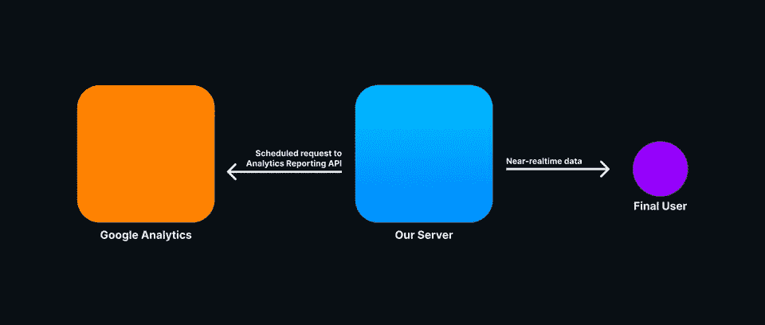
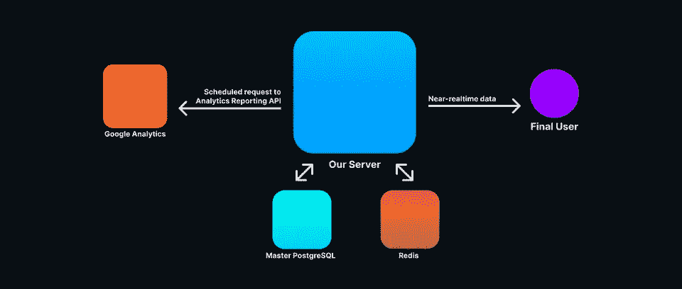

# 构建可扩展的高性能大数据系统

> 原文：<https://towardsdatascience.com/building-a-scalable-and-high-performances-big-data-system-221c6b6893eb?source=collection_archive---------16----------------------->

## 关于选择合适的工具来构建可扩展的大数据分析系统


Robynne Hu 在 [Unsplash](https://unsplash.com/) 上的照片

前一段时间，我有机会从事一个令人着迷的项目。我们需要一种方法来公开关于 Google Analytics 数据的 REST APIs，但是免费的 Google Analytics 版本存在一些大问题。

首先，保留期。在撰写本文时，Google Analytics(免费计划)的保留期为 26 个月。当然，你可以延长保存期，但它也有一些缺点([在这里阅读更多](https://www.datadrivenu.com/data-retention-controls-google-analytics/))。

另一个巨大的问题是，谷歌分析报告 API 的免费计划每天每个项目有 50.000 个请求和每秒 10 个查询的限制(每个 IP 地址，[来源于此](https://developers.google.com/analytics/devguides/reporting/mcf/v3/limits-quotas))。

这些问题使得使用报告 API 作为向 Google Analytics 发出请求的标准方式变得不可能，因为它不会在我们达到离散数量的用户时立即扩展。

因此，我们需要一种方法来将这些数据存储在我们的服务器中，并在我们需要时随时提供，没有任何速率和/或保留限制。

# 我们的限制

我们仍然希望使用谷歌分析作为我们的主要分析系统。过去一年我们一直在使用它，它拥有我们改善用户体验所需的一切。我们只需要做尽可能简单的事情，将这些数据暴露给 Next.js 前端。

因此，我们需要一个简单的计划作业，它调用 Google Analytics，对结果数据进行规范化，并将其存储在我们的服务器上，以便稍后将它们作为聚合数据公开:



需要记住的一点是，我们希望我们的数据尽可能的新鲜。这意味着计划的作业、数据规范化过程和数据库批量更新操作必须尽可能快。

# 数据标准化

在过去的几个月里，我们改变了 webapp 的一些资源的 URL 结构。这意味着我们需要增加对传统 URL 的支持，例如:

旧 URL:

```
https://www.example.com/users/AJH829SKLJ29/john-doe

                              ^ old ID
```

新 URL:

```
https://www.exampke.com/users/john-doe-0cc175b9c0f1

                                       ^ new ID
```

正如您所看到的，我们向客户端公开了一个 ID，但是它已经随着时间的推移而发生了变化。因此，在将旧 ID 插入数据库之前，我们还需要将其转换为新 ID。

我们还需要对数据执行其他转换，但这不需要访问我们的主数据库(PostgreSQL DB)。

# 构建概念证明

我们已经开始用 Node.js (TypeScript)作为主要的脚本语言，用 CouchDB 作为主要的数据库来构建一个概念证明。我们很快意识到需要添加 Redis 作为缓存层，因为调用数据库将旧 ID 转换成新 ID 非常耗时。它对缓存我们的 REST API 响应也很有帮助。

我们最初的基础设施是这样的:



关于我们第一次概念验证的一些想法:

1.  Node.js 非常适合原型化，但是即使使用 TypeScript，它似乎仍然不是密集数据操作的正确选择。**免责声明:这是我的个人观点。我仍然喜欢 Node.js，我在日常工作中使用它，但我们真的想为这项工作选择正确的工具**。
2.  为了使我们的查询更有效，我们使用 map/reduce 编程模型写下了一些 CouchDB 视图。虽然它使我们的查询非常高效，但写下非常优化的 map/reduce 查询需要一些经验和技能…我们开始非常想念 SQL。
3.  这个解决方案在垂直方向上可以很好地扩展(为我们的服务器增加更多的能力)，但是在水平方向上可以扩展(为我们的集群增加更多的节点)吗？我对 CouchDB 没有怀疑，但是 Node.js 服务器和它的内存缓存(被密集使用)呢？
4.  Node.js 性能够吗？我的意思是，Node.js 的性能绝对出色，但数据规范化过程似乎需要很长时间。为了提高它的性能，我们最终重构了部分代码库，删除了一些高阶函数以支持更命令式的模式，降低了我们的生产力和软件的可维护性。

# 改变方法

在测试环境中运行该系统一段时间后，我们开始发现我们在概念验证中做出的架构决策中的一些问题。CouchDB 仍然是一个很棒的数据库，但我们意识到，也许我们没有编写非常优化的查询所需的技能和知识。对于这样一个小团队来说，编写 map/reduce 视图变得非常痛苦，他们需要花更多的时间来寻找正确的 StackOverflow 答案，而不是编写实际的代码。我们也没有利用任何最受欢迎的 CouchDB 特性(数据同步、REST APIs 等等)。也就是说，也许 CouchDB 不是我们问题的最佳解决方案。

我们遇到的另一个问题是 Node.js 服务器的性能。让我们研究以下场景:

1.  Node.js 调用谷歌分析报告 API
2.  报告 API 在大约`0.8`秒后响应数千条记录
3.  对于每个报告行(实际上是一个对象数组)，我们需要解析数据并调用 Redis/PostgreSQL 将旧的 id 转换成新的 id。
4.  将规范化的数据插入 CouchDB。如果数据已经存在，我们需要获取它的 CouchDB `_rev` ID，并使用它来更新数据，而不是插入数据。
5.  将数据插入 CouchDB 后，我们需要执行一个 CouchDB 查询来更新 PostgreSQL 数据库中的一些数据。

整个过程需要 4 秒左右才能完成，时间很多。我们需要解决所有这些问题，这些问题可以概括为:

1.  提高数据规范化过程的性能
2.  使用我们的 NoSQL 数据库提高开发人员的生产力
3.  去掉所有命令式和低级的类型脚本，写出更好的单元测试和更易维护的软件。

在研究了不同的技术(Go、Python、Cassandra、MongoDB)之后，我们最终得出了一个想法，即我们的软件应该遵守一些重要的规则:

1.  它必须水平缩放
2.  它必须用高级语言编写
3.  我们应该能够轻松地生成单元测试和文档
4.  如果 Google APIs 需要`0.8s`来响应，那么规范化并在大约`200ms`处插入数据会很棒，这样整个过程将需要`1s`来完成。
5.  调用 Redis 是可以的，但是如果有一个分布式内存缓存机制来避免调用外部服务来缓存旧 id 和新 ID 之间的关系，那就太棒了。

最终，我们想出了几种技术来帮助我们实现上述目标:长生不老药+卡桑德拉。

# 为什么是仙丹

Elixir 是一种函数式编程语言，可以编译成 Erlang 字节码。事实上，它运行在著名的 BEAM 虚拟机上，该虚拟机以其可靠性和性能而闻名:

“AXD301 实现了九个九的可靠性(是的，你没看错，99.9999999%)。让我们把它放在上下文中:5 个 9 被认为是好的(5.2 分钟的停机时间/年)。7 个 9 几乎无法实现…但我们做到了 9 个。这是为什么呢？没有共享状态，加上复杂的错误恢复模型。”(乔·阿姆斯特朗，Erlang 编程语言的作者)

一个著名的框架，如 Scala 的 Akka，从 Erlang 的 actor 模型中获得了巨大的灵感来构建大规模可伸缩和弹性的软件。

多亏了长生不老药，我们实际上可以解决我们之前提到的所有问题。

## 1)它必须水平缩放

长生不老药很快。非常非常快。即使有些功能执行起来要多花一点时间，仙丹代码也很容易并发运行。事实上，Erlang 和 Elixir 在语言本身中内置了一些并发原语。

让我们举一个非常琐碎的例子:

如你所见，我们定义了一个名为`Example`的模块，用一个名为`factorial`的方法返回其参数的总和。如果语法让你想起 Ruby...这是因为长生不老药是由前 Ruby On Rails 团队成员 José Valim 发明的！

顺便说一下，我们能够异步生成`factorial`函数(甚至在不同的机器上！)通过键入:

```
iex> spawn(Example, :factorial, [10])
#PID<0.114.0>
```

如您所见，它返回了衍生进程的`#PID`(进程 ID)...请注意，我有意使用了“进程”一词来代替线程！

“Erlang VM 中的进程是轻量级的，可以跨所有 CPU 运行。虽然它们看起来像本机线程，但它们更简单，而且在一个 Elixir 应用程序中有数千个并发进程并不少见”( [source](https://elixirschool.com/en/lessons/advanced/concurrency/) )

## 2)它必须用高级语言编写

Elixir 就像 Erlang、Java、PHP、Ruby 一样，是一种高级的、垃圾收集的编程语言。它提供了许多有用的结构和高阶函数，在编写复杂算法时非常有用。

再一次，让我们举一个简单的例子来编写一个 C++快速排序(摘自[https://www.softwaretestinghelp.com/quick-sort](https://www.softwaretestinghelp.com/quick-sort)):

以下是用 Elixir 编写的相同算法:

表演呢？嗯，C++更快，对此我并不感到惊讶！但是长生不老药足够快来证明它的用途。

高级语言提高了开发人员的生产力，我们需要找到合适的语言来处理大量的数据。仙丹似乎是那种工作的正确选择！

Elixir 还引入了大量的语法糖，真正帮助我们编写简洁明了的代码。仅以管道运营商为例:

或者匿名函数的简写:

函数会返回布尔值吗？用`?`字符就可以显式了！

一旦你习惯了这些句法糖，你就再也回不来了。

## 3)我们应该能够轻松地生成单元测试和文档

这大概是仙丹最牛逼的地方之一。事实上，Elixir 将文档和测试视为一等公民。假设我需要为上面的`factorial`函数写一些文档:

如你所见，我们正在编写一些看起来像 Javadoc/JSDoc 之类的注释。但与 Java 和 JavaScript 不同，这些注释是 Elixir 语言本身的一部分，我们可以使用 Elixir 团队自己制作的 [ex_doc](https://github.com/elixir-lang/ex_doc) 包轻松生成文档！ex_doc 的另一个优点是它本身支持 markdown，因此您可以像在 repo 中编写 markdown 文件一样编写文档！

但是最好的还在后面。如您所见，我们正在文档中编写一个代码示例:

该代码示例将作为单元测试套件的一部分运行，因此您一定会编写出实际上按预期运行的文档！

## 4)加快数据规范化进程

正如我们之前说过的，长生不老药本身真的真的很快。但是由于它的并发能力，我们能够轻松地并发运行代码，将我们的数据视为一个流。

今天我们用了很多琐碎的例子，所以这里还有一个。假设我们有一个`100000`个整数的列表，我们想把每个整数乘以`3`，过滤掉所有的奇数，把列表中所有剩余的数相加。

还不习惯`&`的速记吗？下面是扩展的匿名函数表单:

顺便问一下，我们应该怎样把它转换成一个流呢？用`Stream`关键字代替`Enum`(可枚举)！

`Stream`模块支持惰性操作。这意味着一个函数只有在绝对必要时才会被求值。如果您正在处理大量数据，这将非常有用！

此外，为了提高数据规范化的性能，我们已经改变了我们的缓存机制，但我们将在下一段看到它。

## 5)告别雷迪斯

我知道，Redis 很棒。说真的，这可能是最漂亮的工程之一…但是感谢 Erlang VM，我们不需要它。

事实上，Erlang 的开源发行版附带了开放电信平台(OTP ),它是 Elixir 和 Erlang 可以本地调用的模块和工具的优秀集合。

*   Erlang VM 本身(称为 BEAM)
*   Erlang 编译器
*   静态分析工具(透析器)
*   Yecc(一个 LALR-1 解析器生成器，类似于 YACC)
*   leex(Erlang 的词法分析器生成器)
*   观察者(跟踪和调查分布式系统的工具)
*   Mnesia(分布式事务数据库)
*   ETS(一个分布式、键值、内存数据库)

和许多其他有益的、经过战斗考验的模块。

您可以将 BEAM 视为一个操作系统，它允许您使用其内置的工具，如数据库、编译器、词法分析器、HTTP/WebSocket 接口(是的，BEAM 本机支持它们)等等。

顺便说一下，我们想专注于 ETS。如前所述，Erlang 术语存储(ETS)是“Erlang 内置术语存储 BIFs 的一个接口。这些提供了在 Erlang 运行时系统中存储大量数据的能力，并提供了对数据的恒定访问时间。”([来源](https://erlang.org/doc/man/ets.html))。

ETS 可以很容易地用作内置缓存机制(让我们看一个使用 Erlang 内置 int REPL 的例子):

```
1> T = ets:new(t,[ordered_set]), ets:insert(T, {"555-1234", "John Smith"}).
true

2> ets:match(T,{[$5,$5,$5,$- |'$1'],'$2'}).
[["1234","John Smith"]]
```

我现在不会深入探究 Erlang 语法，但是我可以向您保证，使用 ETS 用 Elixir 构建一个缓存层非常简单。

是否要将缓存层设为分布式？嗯，Mnesia 实际上包装了 ETS 和 DETS(磁盘 Erlang 术语存储，基本上是 ETS 的磁盘持久性版本)，向我们的缓存添加了一个分布式事务层！

想更详细的看看 ETS/Mnesia 和 Redis 的区别？这里有一篇关于这个的精彩文章:[https://rollout.io/blog/elixir-ets-vs-redis](https://rollout.io/blog/elixir-ets-vs-redis)。

# 数据存储

正如本文开头所说，我们已经使用 CouchDB 作为主数据存储开始了我们的第一次概念验证。虽然它工作得很好，但我们觉得它不是我们团队的最佳解决方案。我们过去有过一些使用 Cassandra 的经验，它的 CQL 查询语言让我们重拾编写类似 SQL 的查询的乐趣。

这不是我们选择卡珊德拉的唯一原因。事实上，我们存储数据的时间间隔是一天，但是我们每隔几秒钟就更新一次数据，以保持数据尽可能的新鲜。使用 CouchDB，为了更新数据，我们需要进行一个查询来检查数据是否已经存在，获取它的`_rev` id，然后生成一个`update`查询。技术上不难，但是浪费很多时间。使用 Cassandra，我们可以生成一个`insert`查询，如果数据已经存在，它将更新它。此外，经过一些基准测试后，Cassandra 的插入似乎比 CouchDB 的要快一点(当然，对于我们正在处理的数据来说)。

另一件我们想了很多的事情是…“我们真的需要 CouchDB 吗”？我的意思是，它拥有我们需要的一切(大数据存储能力、大规模高性能)…但这是正确的选择吗？

*   我们用的是它内置的 REST APIs 吗？号码
*   我们在使用它强大的同步功能吗？号码
*   我们需要一个无模式数据库吗？号码

那么我们需要什么？

*   水平可伸缩数据库。卡桑德拉·✅
*   没有单点故障。卡桑德拉·✅
*   多数据中心复制。卡桑德拉·✅
*   非无模式数据库。卡桑德拉·✅
*   类似 SQL 的语法是一个优势。卡桑德拉·✅
*   map/reduce 是加分项。卡桑德拉·✅

因此，选择似乎很明显！在你问之前:是的，CouchDB 是用 Erlang 写的。遗憾的是，它没有任何本地 Erlang 驱动程序，所以我们在连接到其他数据库时有相同的延迟。

另一个明智的问题是:“你为什么不直接用 Mnesia”？嗯，这是个好问题。当然，我们可以使用 Mnesia……也许将来我们会这样做！对于记忆来说，也有一个 Ecto (Elixir ORM)连接器，但我们需要更多的调查，如果这是我们的正确选择。

# REST APIs 和 GraphQL 层

我想谈的最后一件事是我们如何处理 REST APIs。在过去的几年中，许多 web 框架诞生了，其中大部分真的改变了生活。

毫无疑问，Ruby on Rails 是最受欢迎的框架之一。我甚至无法说出所有使用(或曾经使用)RoR 作为 web 框架来快速有效地启动服务的初创公司:Twitter、GitHub 和 Basecamp 只是其中的一部分。

Elixir 有自己的 MVC 框架，叫做 Phoenix，它源于 Ruby on Rails，但是它改进了它的性能、可维护性等等。我个人从来没有听说过一个 Elixir Phoenix 开发者抱怨这个框架。

如上所述，Erlang VM 已经支持 HTTP、WebSockets 和 PubSub，但是拥有 MVC 框架将真正帮助我们更容易地编写关键任务，例如请求授权。

鉴于 GraphQL 完全支持这个项目前端，我们还可以用神奇的灵丹妙药苦艾酒:[https://github.com/absinthe-graphql/absinthe](https://github.com/absinthe-graphql/absinthe)来添加对该查询语言的支持。

# 关于那个建筑的一些想法

我个人大约在四年前爱上了仙丹。虽然它还不是一种广泛使用的语言，但我确信在未来几年它会越来越受欢迎。

那是因为互联网场景变化很大，传统技术不够用。看看 Scala 就知道了:我为什么要添加大量的库和框架来添加 Erlang VM 中已经内置的东西，比如 actor 模型？当然，actor 模型很方便，可以解决许多问题，但不是以最初构建 JVM 的方式。

如果我已经有了 Mnesia 和 ETS，为什么还要添加 Redis(这也很棒)作为缓存层呢？如果在 BEAM 中已经有了我需要的所有东西，为什么还要添加 Ejabberd、RabbitMQ 或 Kafka 呢？如果 BEAM 给了我 Yecc 和 Leex，使编译 Erlang 字节码并将其集成到我的应用程序中成为可能，我为什么要用 C/Java/Go/Rust/whatever 编写特定于领域的语言呢？

Erlang 编程语言是在 80 年代诞生的。它仍然在解决现代网络开发的大量问题。

我们只是触及了这个令人敬畏的系统的表面，我可以向您保证，一旦您阅读了为什么 Erlang 能够真正解决您的问题，您将永远不会忘记它。