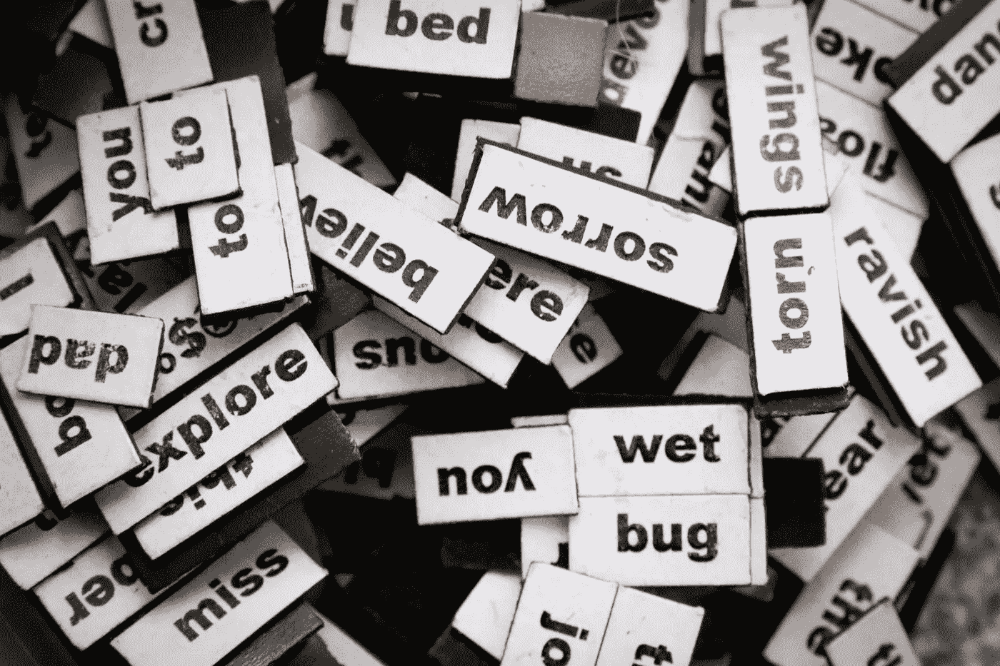
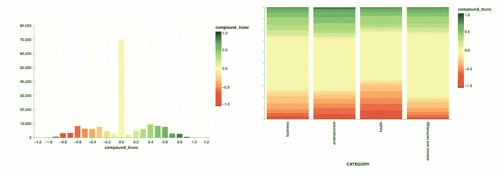

# 使用 NLTK 和 Altair 构建情感分析报告

> 原文：<https://towardsdatascience.com/building-a-sentiment-analysis-interactive-report-using-nltk-and-altair-83cb9fcb36fe?source=collection_archive---------8----------------------->

## 使用 UCI 新闻数据集，我们将计算新闻标题的积极度，将结果可视化，并将它们打包成一个交互式报告



格伦·卡丽在 [Unsplash](https://unsplash.com/photos/oHoBIbDj7lo) 拍摄的照片

*(免责声明:我在 Datapane 担任产品经理)*

数据分析通常从**结构化数据**开始，即已经存储为数字、日期、类别等。然而，如果您使用适当的技术，非结构化数据可以产生重要的见解。在本教程中，我们将对文本数据集进行情感分析，以计算积极/消极情感，并将结果转化为交互式报告。

# 运行情感分析

假设我们是一名为新闻公司工作的数据科学家，我们试图找出我们的新闻标题与行业相比有多“积极”。我们先从 [UCI 新闻聚合数据集](https://www.kaggle.com/uciml/news-aggregator-dataset) ( [CC0:公共领域](https://creativecommons.org/publicdomain/zero/1.0/))【1】开始，它是 2014 年不同出版物的新闻标题集合。这是一个有趣的数据集，因为它有来自各种出版商的文章，并包含有用的元数据。

下载并清理数据后，我们得到以下结果:


作者图片

我们有 8 列和大约 400k 行。我们将使用“标题”进行实际的情感分析，并按照“出版商”、“类别”和“时间戳”对结果进行分组。

## **分类标题**

通过开源的魔力，我们可以在我们的分析中使用其他人来之不易的知识——在这种情况下，一个来自流行的 [NLTK](https://www.nltk.org/index.html) 库的名为 Vader 情绪强度分析器的预训练模型。

为了建立这个模型，作者收集了一个常用词的列表，然后要求一组人类测试人员根据化合价(即积极或消极)和强度(即 T21)对每个词进行评级。正如[原文](http://comp.social.gatech.edu/papers/icwsm14.vader.hutto.pdf)所说:

> (在剔除不相关的词之后)这给我们留下了超过 7500 个词汇特征，这些特征具有有效的效价分数，表明了情绪极性(积极/消极)，以及从-4 到+4 的情绪强度。比如“还好”这个词的正化合价是 0.9，“好”是 1.9，“很棒”是 3.1，而“可怕”是–2.5，皱眉的表情符号“:(“是–2.2，“烂”和“sux”都是–1.5。

为了对一段文本进行分类，该模型计算每个单词的价分数，应用一些语法规则，例如区分“伟大”和“不伟大”，然后总结结果。

有趣的是，与机器学习方法相比，这种简单的基于词典的方法具有相同或更好的准确性，并且速度更快。让我们看看它是如何工作的！

在这段代码中，我们导入库，对数据集中的每个标题进行分类，然后将结果追加到原始数据帧中。我们增加了 4 个新栏目:

*   **pos** :正分组件
*   **neu** :中性分数分量
*   **阴性**:负分成分
*   **复合**:三个得分成分的总和

作为一项健康检查，让我们用熊猫`idxmax`来看看文中最积极、中立和消极的标题:

```
negative = df.iloc[df.neg.idxmax()]
neutral = df.iloc[df.neu.idxmax()]
positive = df.iloc[df.pos.idxmax()]print(f'Most negative: {negative.TITLE} ({negative.PUBLISHER})')
print(f'Most neutral: {neutral.TITLE} ({neutral.PUBLISHER})')
print(f'Most positive: {positive.TITLE} ({positive.PUBLISHER})')
```

运行该代码会产生以下结果:

```
Most negative: I hate cancer (Las Vegas Review-Journal \(blog\))
Most neutral: Fed's Charles Plosser sees high bar for change in pace of tapering (Livemint)
Most positive: THANK HEAVENS (Daily Beast)
```

很公平——“谢天谢地”比“我讨厌癌症”要积极得多！

# 可视化结果

我们的分数分布是什么样的？让我们使用交互式绘图库 [Altair](https://altair-viz.github.io/index.html) 以几种方式来形象化这一点:

这里我们展示了总体分布的直方图，以及按类别分组的 100%堆积条形图。运行该代码，我们得到以下结果:



作者图片

看起来大多数标题都是中性的，健康类的负面文章比其他类别多。

为了更深入地了解我们的模型如何对文章进行分类，我们可以再创建两个图表，一个显示模型如何对特定标题进行分类的示例，另一个显示我们最大的出版商在一段时间内的平均情绪得分:

这就是 Altair 的声明性语法真正出彩的地方——我们只需更改几个关键字，例如将`mark_bar`改为`mark_point`,就会得到完全不同但仍然有意义的结果:

通过创建交互式可视化，您可以让查看者直接浏览数据。如果他们能够深入到原始数据点，他们将更有可能相信你的总体结论。

看一下出版商排行榜，似乎《赫芬顿邮报》一直更消极，而 RTT 更积极。嗯，看起来他们有不同的编辑策略…

# 创建报告

最后一步是将结果打包成交互式报告。作为数据科学家，我们经常忘记**有效地传达我们的结果**。我经常犯这样的错误:花几个小时分析数据来回答某人的问题，然后发来一张只有一行解释的图表截图。我的观众不理解结果，可能不会用它们来做决定。

规则 1——永远假设看你作品的人没有背景，需要从头开始理解。花额外的时间和精力写下你工作的**背景和含义**总是值得的。

在本教程中，我们将使用一个名为 [**Datapane**](https://datapane.com/) 的库，从这些交互式可视化中创建一个可共享的报告。为此，我们首先需要在 Datapane 上创建一个帐户，将图表包装在 Datapane 块中，然后上传报告。

我们用 Markdown 格式写下大量的文本来给出上下文，穿插着我们实际的情节和数据。您可以在此处看到嵌入的交互式可视化图表:

这是一份最小的报告，你可以与利益相关者(你的老板，你的母亲等)分享，以显示整个媒体领域的整体情绪。从这里，你可以探索跨时间、行业和出版商的比较，目的是为你的组织如何改进提出建议。

# 结论

我们可以通过三点来总结我们在本教程中学到的内容:

1.  使用**情感分析**从非结构化文本中提取价值
2.  在像 Altair 这样的**交互式库**中构建图表，这样你的浏览者可以自己探索数据，强化你的总体结论
3.  花额外的时间和精力将你的结果写在**报告中，并附上背景**

现在去抓住他们！

[1]利奇曼，M. (2013 年)。http://archive.ics.uci.edu/ml 的 UCI 机器学习库。加州欧文:加州大学信息与计算机科学学院。