# 使用 Yelp 评论和 ML 集成方法构建情感分析模型

> 原文：<https://towardsdatascience.com/building-a-sentiment-analysis-model-using-yelp-reviews-and-ml-ensemble-methods-80e45db6d0c7?source=collection_archive---------4----------------------->

## **三星级评审和四星级评审的实际区别是什么？自然语言处理有答案！**


图片由[亿万富翁](https://unsplash.com/@abillion)在 [Unsplash](https://unsplash.com/) 上拍摄

如果你曾经通读过 Yelp 评论，你可能会注意到评论者之间有很多不一致的地方。一些评论说这种食物“改变生活”，但只留下三颗星，而另一些评论说这种食物“还行”，只留下五颗星。五星评估系统是有缺陷的，因为没有一个明确的方法来定义五星和四星。然而，如果我们忽略明星的数量，而是通读实际的评论，我们应该更好地了解 Yelp 评论者实际上在说什么。这听起来像是更多的工作，但是通过使用 Python 的自然语言工具包，我们可以让我们的代码做所有的艰苦工作。

**第 1 部分:获取 Yelp 评论**

你可以用几种不同的方法来做这件事。

*   很少有 Kaggle 数据集像[这个](https://www.kaggle.com/yelp-dataset/yelp-dataset?select=yelp_academic_dataset_business.json)一样有大量内容，但可能没有最新的评论。
*   还有一些其他的独立数据集，比如来自拥抱脸的[这个](https://huggingface.co/datasets/yelp_review_full)。人们使用 Yelp 评论进行分析已经很多年了，有很多这样的资源可以帮助你开始。
*   在我看来，最好的选择是直接从源头获取评论。Yelp 有一个[公共数据集，包含超过 800 万条评论](https://www.yelp.com/dataset)，全部存储在一个 JSON 文件中。你应该能够在一个简单的格式中找到各种各样的评论，旧的和新的。

**第二部分:清理和准备情绪分析**

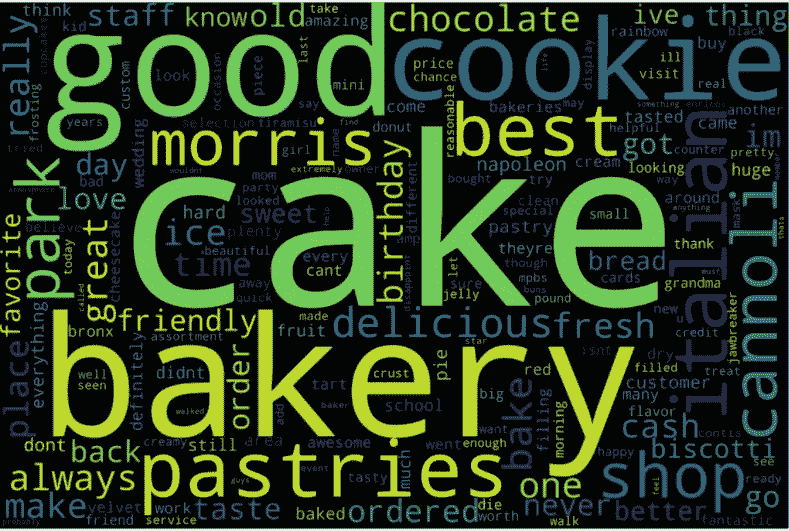

作者图片

当处理基于文本的数据时，减少单词和字符的数量是有益的，这样你的代码就不用花几个小时来运行。我们希望这样做的同时仍然保留重要的词，这些词的意思是“好”或“坏”，让我们了解评论者的感受。像‘the’，‘or’和‘is’这样的词，也被称为[停用词](https://en.wikipedia.org/wiki/Stop_word)，并不是很重要。没有理由浪费时间和处理能力去处理这些停用词，所以最好是删除它们。Python 的自然语言工具包使这一过程变得简单:

```
**from** **nltk.corpus** **import** stopwords
**from** **nltk.tokenize** **import** word_tokenize

example_sent = """This is a sample sentence,
                  showing off the stop words filtration."""

stop_words = set(stopwords.words('english'))

word_tokens = word_tokenize(example_sent)

filtered_sentence = [w **for** w **in** word_tokens **if** **not** w.lower() **in** stop_words]

filtered_sentence = []

**for** w **in** word_tokens:
    **if** w **not** **in** stop_words:
        filtered_sentence.append(w)

print(word_tokens)
print(filtered_sentence)
```

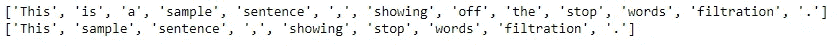

作者图片

你还会注意到我在一些变量中使用了单词“token”。这意味着我把一个句子分解成一系列单词，这个过程被称为标记化。

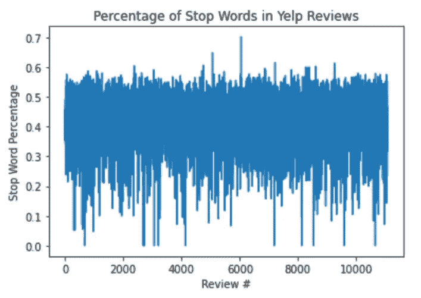

图片 bt 作者

你可以在这里看到 Yelp 评论平均有 40-45%的停用词。摆脱他们会节省我们很多时间！

现在我们已经过滤掉了停用词，让我们尝试使用一个叫做[词干](https://en.wikipedia.org/wiki/Stemming)的过程来简化数据集。词干化是将所有形式的单词还原为基本形式的过程。如果你有“非常”、“最棒”和“更棒”这样的词，这些词都会被简化为“很棒”，以便于分组和处理。Python 的自然语言工具包又一次让这个过程变得非常简单:

```
**import** **nltk**
**from** **nltk.stem.snowball** **import** SnowballStemmer

snowBallStemmer = SnowballStemmer("english")

sentence = yelp_data_unpacked[40]
wordList = nltk.word_tokenize(sentence)

stemWords = [snowBallStemmer.stem(word) **for** word **in** wordList]

stemmed = ' '.join(stemWords)
print(sentence)
print('')
print(stemmed)
```

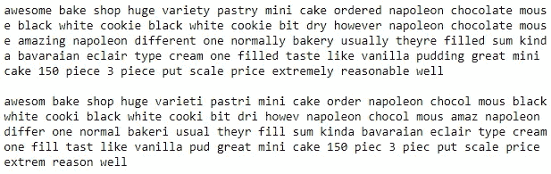

作者图片

看起来变化不大，但是如果我们将这些句子标记化并组合在一起，那么唯一的键值对将会更少。

在项目的这一点上，我们已经清理了数据并准备好进行处理。在我们开始建立分类模型之前，我们必须决定如何对它进行分类。

**第 3 部分:分类和超参数**

在本文的开头，我说过我想通过分析每个评论中的实际内容来改进 Yelp 的五星评级系统。因此，我不是根据星级将评论分为五组，而是根据情绪将它们分为四组。这些组是“阴性”、“轻微阴性”、“轻微阳性”和“阳性”。为了整理我对训练数据集的评论，我使用了 [Textblob 的极性得分](https://planspace.org/20150607-textblob_sentiment/)作为基线。

```
**from** **textblob** **import** TextBlobyelp_data_s['Polarity'] =
yelp_data_s['Stemmed'].apply(**lambda** x: TextBlob(x).sentiment[0])sentiment = []
**for** i **in** range(len(yelp_data_s)):
    **if** yelp_data_s['Polarity'][i] >= 0.4:
        sentiment.append('Positive')
    **if** yelp_data_s['Polarity'][i] > 0.2 **and** yelp_data_s['Polarity'][i] < 0.4:
        sentiment.append('Slightly Positive')
    **if** yelp_data_s['Polarity'][i] <= 0.2 **and** yelp_data_s['Polarity'][i] > 0:
        sentiment.append('Slightly Negative')
    **if** yelp_data_s['Polarity'][i] < 0:
        sentiment.append('Negative')yelp_data_s['sentiment'] = sentiment
```

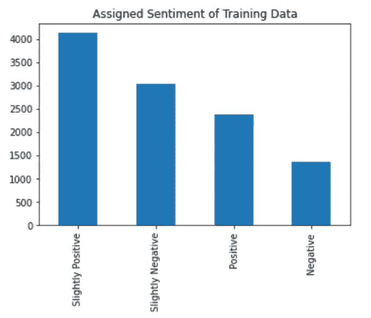

作者图片

不过，我想不仅仅使用这个分数来构建我们的模型，所以我决定看看其他一些特性。


作者图片

对于第二个图表，我使用[这个正面情绪词列表](https://gist.github.com/mkulakowski2/4289437)来确定什么是“正面词”。

现在我有了一个好主意，知道在构建模型时应该寻找什么样的特征。实际选择模型之前的最后一步是通过使用[术语频率逆文档频率](https://en.wikipedia.org/wiki/Tf%E2%80%93idf#:~:text=In%20information%20retrieval%2C%20tf%E2%80%93idf,in%20a%20collection%20or%20corpus.&text=tf%E2%80%93idf%20is%20one%20of,popular%20term%2Dweighting%20schemes%20today.)矩阵(TFIDF)来查看每个评论中的内容

简单来说，这是一种在评论中寻找最独特、最有冲击力的词的方法。术语频率只是告诉您该单词出现的频率，但是一旦添加了逆文档频率参数，您还可以分析该单词在整个数据集中出现的频率。分析这些独特的词很重要，因为它们比每个评论者使用的常用词能告诉你更多。

为了创建训练数据集，我将这些列用作我的列:

*   名字:只是餐馆的名字
*   评论:Yelp 上写的完整评论
*   Polarity:text blob 极性得分
*   正面单词 P:正面单词的百分比
*   情感:指定的情感分数
*   TFIDF:每个唯一的单词是一个列，其频率作为其值列出，在这个数据集中会有很多列(这就是为什么我们首先删除停用词并阻止我们的评论)

```
**from** **sklearn.feature_extraction.text** **import** TfidfVectorizertext = yelp_data_s['Stemmed:Sentence']
Tvectorizer = TfidfVectorizer()
Tvectorizer.fit(text)
Tvector = Tvectorizer.transform(text)voc = Tvectorizer.vocabulary_
df = pd.DataFrame(Tvector.toarray(),columns=voc)

col_name1 ='Name'
col_name2 = 'Review'
col_name3 = 'Polarity'
col_name4 = 'Sentiment'
col_name5 = 'Positive_Words_P'

col1 = yelp_data_s['Name']
col2 = yelp_data_s['Review']
col3 = yelp_data_s['Polarity']
col4 = yelp_data_s['sentiment']
col5 = yelp_data_s['Positive_Words_P']

df.insert(0,col_name1,col1)
df.insert(1,col_name2,col2)
df.insert(2,col_name3,col3)
df.insert(3,col_name4,col4)
df.insert(4,col_name5,col5)
```

使用这个训练数据集和一个简单的逻辑回归模型来测试它，我得到了 67%准确率的基线分数。我知道我可以通过调整一些超参数来改善这一点，所以我再次查看了 TFIDF 矩阵。

*   **最小词频:**虽然查看真正独特的单词很重要，但它可能有助于过度拟合，以提高我们正在处理的单词的阈值。我测试了同一个模型，但是增加了最小词频的超参数，看看它是如何影响准确度的。

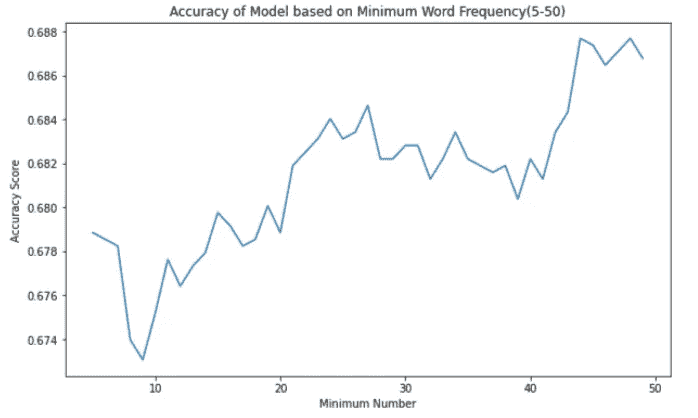

作者图片

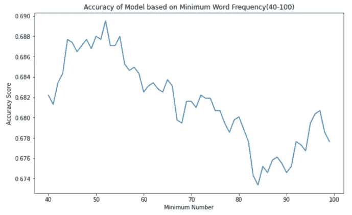

作者图片

*   **n grams 总数:**这基本上告诉我们数据是如何被一个字一个字地处理的。如果您将 ngrams 设置为 1，则单词将会像“this”、“is”、“not”、“lame”等那样逐一处理。如果您将 ngrams 设置为 2，您可以处理单词对，例如“this is”、“is not”、“not lame”。您可能会看到这将如何影响准确性，当 ngrams 设置为 1 时，模型只会看到“蹩脚”并将其作为负值处理，而当 ngrams 设置为 2 时，模型会看到“不蹩脚”并将其作为正值处理。这反映在这张精度图上:

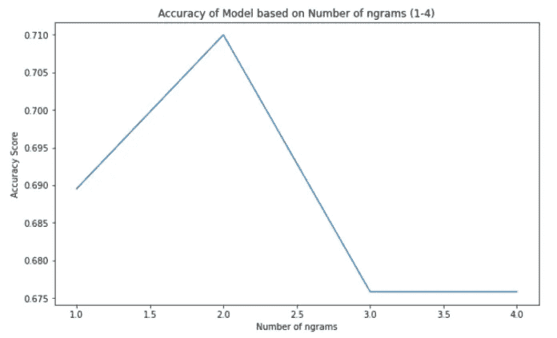

有了这两个超参数，我们将基线准确率提高到了 71%！这可能看起来不多，但当我们开始使用其他模型时，知道我们有最佳的超参数是很重要的。

**第四部分:选型**

最后，是选择模型的时间。对于这个项目，我想尝试许多不同的分类模型，整个过程如下所示:

*   选择模型类型
*   定义一个管道，使用 Gridsearch 找到最佳参数
*   保存模型，这样我们就不必多次运行它
*   加载模型并运行准确度和 f1 分数
*   对其他模型重复该过程

我还想将我的模型选择分成两部分，前四部分将分析数字成分(阳性词百分比、极性得分等)。)并且最后两个将分析 TFIDF 矩阵。以下是每个型号的表现:

*   **Logistic 回归:** F1 值为 71%，lr__C: 0.1

```
**from** **sklearn.linear_model** **import** LogisticRegression
**from** **sklearn.model_selection** **import** GridSearchCV
**from** **sklearn.metrics** **import** make_scorer, accuracy_score, f1_score
**from** **sklearn.model_selection** **import** train_test_split
**from** **sklearn.pipeline** **import** Pipeline
**from** **sklearn.preprocessing** **import** StandardScalersteps = [('scaler', StandardScaler()), ('lr', LogisticRegression(solver = 'lbfgs'))] 
pipeline = Pipeline(steps)
parameters = {'lr__C':[0.01, 0.1, 1, 10, 100]}

clf = GridSearchCV(pipeline, parameters, cv = 10, scoring="accuracy") 
clf.fit(X_train, y_train)
clf.best_params_
```

*   **随机森林:** F1 值为 66%，最大特征:“sqrt”，n 估计值:50

```
**from** **sklearn.ensemble** **import** RandomForestClassifiersteps = [('scaler', StandardScaler()), ('rf', RandomForestClassifier())] 
pipeline = Pipeline(steps)parameters = {'rf__n_estimators':[10 , 20, 30, 40, 50], 'rf__max_features':['auto','sqrt']}
clf = GridSearchCV(pipeline, parameters, cv = 10, scoring="accuracy") 
clf.fit(X_train, y_train)
clf.best_params_
```

*   **支持向量分类(SVC):** F1 得分为 70%，svc__C: 0.01

```
**from** **sklearn.svm** **import** SVC

steps = [('scaler', StandardScaler()), ('svc', SVC(probability=**False**,kernel='linear',gamma='auto'))] 
pipeline = Pipeline(steps) parameters = {'svc__C':[0.01, 0.1, 1]}
clf = GridSearchCV(pipeline, parameters, cv = 3, scoring="accuracy") 
clf.fit(X_train, y_train)

clf.best_params_
```

*   **梯度增强分类器:** F1 值为 72%，学习率为 0.15，n 估计量为 500

```
**from** **sklearn.ensemble** **import** GradientBoostingClassifier

steps = [('scaler', StandardScaler()), ('gbc', GradientBoostingClassifier(max_features='sqrt'))] 
pipeline = Pipeline(steps) parameters = {'gbc__n_estimators':[10, 50, 100, 200, 500], 'gbc__learning_rate': [0.05, 0.1, 0.15, 0.2, 0.25]}
clf = GridSearchCV(pipeline, parameters, cv = 10, scoring="accuracy") 
clf.fit(X_train, y_train)

steps = [('scaler', StandardScaler()), ('gbc', GradientBoostingClassifier(learning_rate = 0.15, max_features = 'sqrt', n_estimators = 500))]  clf = Pipeline(steps)  clf.fit(X_train, y_train)
```

*   **带 TFIDF 的朴素贝叶斯:** F1 分数为 64%，alpha: 1，min_df: 10

```
**from** **sklearn.feature_extraction.text** **import** TfidfVectorizer
**from** **sklearn.naive_bayes** **import** MultinomialNB

steps = [('vec', TfidfVectorizer(stop_words = 'english', ngram_range = (1, 2))), ('nb', MultinomialNB())] 
pipeline = Pipeline(steps) parameters = {'vec__min_df':[0.01, 0.1, 1, 10, 100], 'nb__alpha':[0.01, 0.1, 1, 10, 100]}
clf = GridSearchCV(pipeline, parameters, cv = 10, scoring="accuracy") 
clf.fit(X_train, y_train)

clf.best_params_
```

*   【TFIDF 梯度增强分类器: F1 值为 57%，学习率为 0.25

```
steps = [('vec', TfidfVectorizer(stop_words = 'english', ngram_range = (1, 2))), 
         ('gbc', GradientBoostingClassifier(max_features='sqrt',n_estimators=500))] 
pipeline = Pipeline(steps) parameters = {'gbc__learning_rate': [0.05, 0.1, 0.15, 0.2, 0.25]}
clf = GridSearchCV(pipeline, parameters, cv = 3, scoring="accuracy") 
clf.fit(X_train, y_train)

clf.best_params_
```

不幸的是，这些模型的分数都在 60-70%之间，不是最好的。有一种方法可以从最好的模型中提取性能并组合它们来改善结果，这就是所谓的[集成方法](https://www.toptal.com/machine-learning/ensemble-methods-machine-learning#:~:text=Ensemble%20methods%20are%20techniques%20that,winning%20solutions%20used%20ensemble%20methods.)。对于这个项目，我采用了性能最好的基于文本的模型(带 TFIDF 的朴素贝叶斯)及其性能作为性能最好的数值模型(梯度增强分类器)的一个特征。这部分有很多步骤，但代码看起来像这样:

```
# define train/test split X = yelp_data.Review # word tokens
y = yelp_data.Sentiment # assigned sentiment
indices = yelp_data.index

X_train, X_test, y_train, y_test, i_train, i_test = train_test_split(X, y, indices, train_size = 0.8, random_state = 7)# define Naive Bayes TFIDF modelsteps = [('vec', TfidfVectorizer(ngram_range = (1, 2))), ('nb', MultinomialNB())] 
pipeline = Pipeline(steps)
parameters = {'vec__min_df':10, 'nb__alpha':0.1}
clf = GridSearchCV(pipeline, parameters, cv = 10, scoring="accuracy") 
clf.fit(X_train, y_train)# turn model scores into feature in dataframe (prediction probability)Xtrain_proba = pd.DataFrame(clf.predict_proba(X_train), index = i_train) Xtest_proba = pd.DataFrame(clf.predict_proba(X_test), index = i_test)# define new train/test splitX = yelp_data.iloc[0:,4:] # first four columns are text, review, positive word percentage, and polarity
y = yelp_data.Sentiment # assigned sentiment
indices = yelp_data.index

X_train, X_test, y_train, y_test, itrain, itest = train_test_split(X,y,indices,train_size=0.8,random_state=7)# Adding prediction probabilityXtrain_combined = pd.merge(X_train, Xtrain_proba, left_index=**True**, right_index=**True**) Xtest_combined = pd.merge(X_test, Xtest_proba, left_index=**True**, right_index=**True**)# define Gradient Boosted Classifiersteps = [('scaler', StandardScaler()), ('gbc', GradientBoostingClassifier(max_features='sqrt'))] 
pipeline = Pipeline(steps) parameters = {'gbc__n_estimators':[10, 50, 100, 200, 500], 'gbc__learning_rate': [0.05, 0.1, 0.15, 0.2, 0.25]}
clf = GridSearchCV(pipeline, parameters, cv = 10, scoring="accuracy") 
clf.fit(X_train, y_train)# with best featuressteps = [('scaler', StandardScaler()), ('gbc', GradientBoostingClassifier(learning_rate = 0.2, max_features = 'sqrt', n_estimators = 500))] 
clf = Pipeline(steps) 
clf.fit(X_train, y_train)
```

最后，通过这种堆叠模式，我们的 F1 得分提高了 92%！为了向您展示这有多准确，让我们来看看原始逻辑回归的混淆矩阵(准确率为 71%):

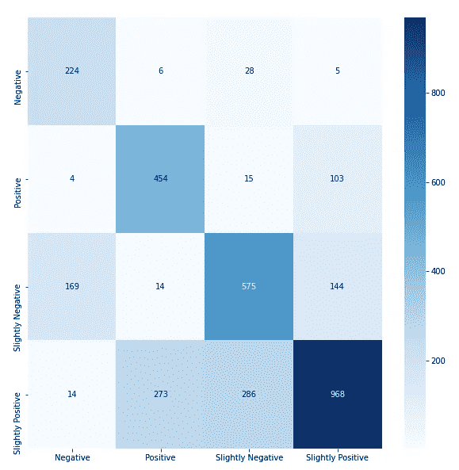

作者图片

对比我们的堆叠模型的混淆矩阵(准确率 92%):

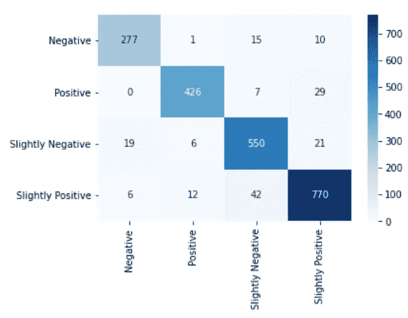

作者图片

如你所见，集合方法对我们的准确性有巨大的影响。定义所有这些模型并将两者结合在一起可能需要一些额外的时间，但对于 21%的准确性提升，我认为这是值得的。我强烈推荐阅读更多关于集成方法的内容，这对你从事的几乎任何机器学习项目都会很有帮助！

**第 5 部分:结果**

现在让我们来测试我们的模型。我去 Yelp 上找了一家意大利餐厅的随机三星级评论。三星级的评论并不能真正告诉你评论者的感受，我也不想阅读整个评论，所以我让模型做所有的工作。

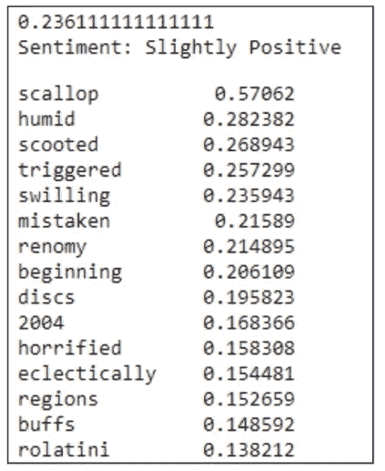

作者图片

从这个简单的输出中，我可以更好地了解评论者对这家意大利餐厅的感受。情感下面的单词和数字显示了对分数影响最大的 15 个单词，这些单词通常是独特的，接近于情感单词，如“好”或“坏”。从这个结果，我知道这个评论家有一个稍微正面的体验，扇贝可能真的很好。我也知道这个地方可能有点潮湿，这位评论家被餐厅里的一些东西吓坏了。如果我是这家餐厅的老板，我真的会从中受益，因为我可以看到哪些词有助于积极的评论，哪些词有助于消极的评论。

自然语言处理有着广泛的用途，Yelp 评论只是我们可以用来建立情感分析模型的许多基于文本的数据形式之一。我从构建这个模型中学到了很多，类似这样的东西将是对使用 Python 进行 NLP 的很好的介绍。如果你有兴趣了解更多，我强烈建议你通读科尔·霍华德、汉尼斯·哈普克和霍布森·莱恩所著的《自然语言处理实践》一书。

我希望这个项目演练能启发您创建自己的情感分析模型或研究集成方法！感谢您的阅读！

完整项目:【https://github.com/Bench-amblee/yelp_sentiment_analysis 