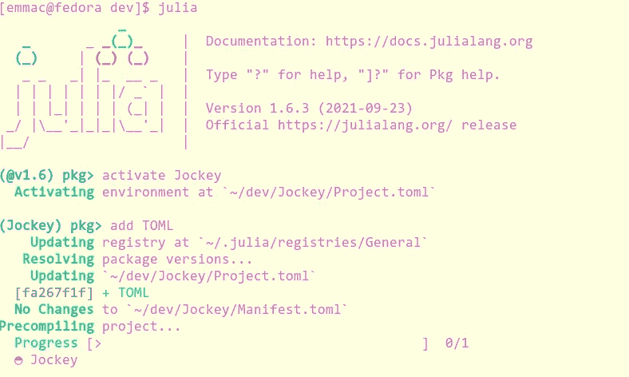
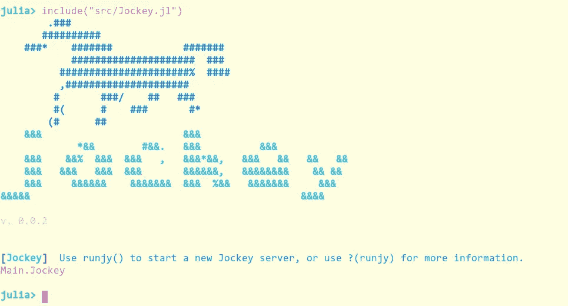
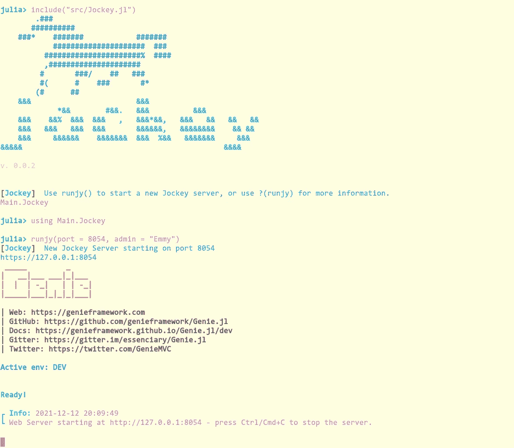
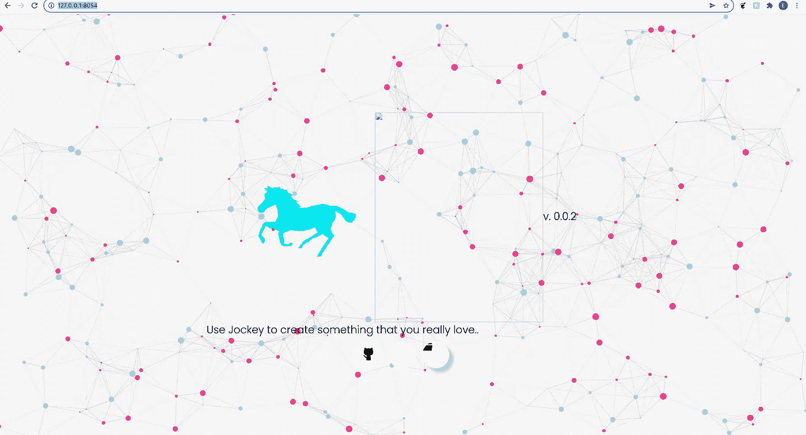

# 为我的笔记本电脑服务器构建服务器设置配置

> 原文：<https://towardsdatascience.com/building-a-server-settings-configuration-for-my-notebook-server-b0a7258e50f3?source=collection_archive---------36----------------------->

## Jockey.jl

## 使用 Jockey.jl 创建服务器配置


(图片由 [Unsplash](http://Unsplash.com) 上的[openclipbart](https://pixabay.com/images/id-156765/)

# 介绍

最近，我开始为 Julia 开发一个新的 Julia 包，名为 Jockey.jl. Jockey.jl 将会有很多工作，它由一个通用的、基于 Julia 的虚拟会话服务器组成，该服务器将调用返回到 JavaScript 会话中。这种方法的酷之处在于，它允许我使用一些非常棒的 Julian 方法来处理数据，并使用 JSON 作为这两种方法和接口之间的中间媒介。考虑到这一点，Julia 方面的东西仍然需要各种各样的补充，比如身份验证、基于会话的用户帐户、数据格式化(用于保存和加载文件)。)

为了方便创建这些东西，接下来可能需要创建的一个东西是服务器设置。我们不能忘记这些将在一揽子计划的其余部分发挥多大的作用。然而，在此之前，这个存储库中缺少一样东西，它阻止路由器服务于开发中的登录页面。

# 资产问题

在我们开始构建这个超级酷的配置文件之前，我需要给 Jockey 环境添加一个新的依赖项和一个图标。出于某种原因，精灵要求我们有一个窗口。ico 文件，所以我将使用 get a .ico 文件并把它粘贴在那里。我认为这是我们需要承认的关于精灵的事情。像这样的事情破坏我们的应用程序是很奇怪的，但是不管有多奇怪——确实是这样。

还有一件事，如果你想在 Github 上查看，你可以在这里:

<https://github.com/ChifiSource/Jockey.jl>  

# 设置类型

为了创建新的设置，我们要做的第一件事是在一个新的部分中创建新的设置类型。

```
mutable struct JSettings
  mode::Symbol
  Host::Connection
end
mutable struct HostInfo
  server_port::Int64
  server_host::String
  admin_name::String
  admin_password::String
end
```

这两种新的类型只是作为包的容器，最终用来操作一切。我将在这篇文章旁边适当地记录所有这些，以便重申这些都做了什么。HostInfo 结构保存服务器的核心信息。请注意，所有这些都是在服务器启动时处理的，而且还保存在默认的配置文件中。

# 会议

现在，在一个新的会话文件中，我将创建另一个名为 session 的类型:

```
mutable struct JSession
  ID::Int64
  auth::Int64
  KeyBindings::Dict
  Enabled Extensions::Dict
  username::String
  settings::JSettingsend
```

现在，我们启动服务器的第一个目标是将所有的服务器参数(定义为关键字参数)组装成适当的类型。我将在主要骑师文件中为这两个人添加必要的内容，

```
include("ServerController/Session.jl")
include("ServerController/Settings.jl")
```

现在我们正在使用的下一个方法是 runjy()。这是使用关键字参数来控制服务器核心启动的主函数。让我们看一下相应的 doc-string，每当我们测试这段代码时，我们很快就会在终端中看到它:

```
"""
Usage Functions
### runjy()
The runjy() server begins a Genie server hosting a new Jockey notebook server.
Ultimately, this is the foundation where one will configure server settings and
decide what sort of system they want to run jockey with. The core server settings
are controllable through the key-word arguments to this function.
##### Key-word arguments
- host = 127.0.0.1
IP address one wishes to host this connection on.
- port = 8000
Port which the server should run on.
- mode = :user
Available mode options are :user, :admin, :headless. Admin mode will grant access
 to a user account system, and Jockey authentication systems. Headless mode will
 begin a worker process, which can be further managed using the management
   interface.
- pwd = 123
Password for use at administrator login screen. **You can ignore this if not in
  admin mode!**
"""
```

所有这些参数都已经在这个函数中提供了，我们只需要将它们放入相应的类型中，然后在环境中定义这些类型——为返回做好准备。这是我们当前的功能:

```
function runjy(;port = 8000, host = "127.0.0.1",
  mode = :user,
  pwd = 123,
  admin = "admin")
  JockeyPoll("New Jockey Server starting on port ", port)
  run(`./bin/server`)
end
```

经过一点修改后，我修改了会话以包含一个完整的标识符类型。

```
mutable struct JSession
  ID::Identifier
  KeyBindings::Dict
  Enabled Extensions::Dict
  username::String
end
mutable struct Identifier
  id::Int64
  auth::Int64
  username::Int64
  status::Int64
end
```

回到 runjy()函数，我将添加一些新的调用来构造 HostInfo 和全局设置。

```
function runjy(;port = 8000, host = "127.0.0.1",
  mode = :user,
  pwd = 123,
  admin = "admin")
  HI = HostInfo(port, host, admin, pwd)
  global jsettings = JSettings(mode, HI)
```

最后，我们需要创建的最后一个组件是会话。

```
global jsession = JSession(Id, KB, ext, username)
```

这些在这个环境中被全局定义是有原因的。

# 汤姆

现在我们已经有了引入新功能的基本方法，我们将使用 TOML.jl 包创建一些基本的 TOML 配置文件。让我们寻找我们的环境并添加这个包。



(图片由作者提供)

这当然就像用 Pkg REPL 激活骑师环境，然后添加 TOML 一样简单。我们将从这个库中使用的主要函数是 parse。我们首先将数据放入字典，然后输出到一个新的 TOML 文件。这当然会回到 runjy()函数中:

```
function runjy(;port = 8000, host = "127.0.0.1",
  mode = :user,
  pwd = "123",
  admin = "admin")
  HI = HostInfo(port, host, admin, pwd)
  global settings = JSettings(mode, HI)
  setting_dict = Dict("port" => string(port), "host" => host,
  "admin" => admin, "mode" => string(mode))
  open("config/env/settings.toml", "w") do io
           TOML.print(io, setting_dict)
         endJockeyPoll(string("New Jockey Server starting on port ", port))
  run(`./bin/server`)
end
```

我们的最后一步是编辑环境源文件，这将允许我们非常容易地从加载的配置中更改 IP。

```
server_sett = TOML.parsefile("config/env/settings.toml")
port = server_sett["port"]
host = server_sett["host"]
print(string("https://", host, ":", port))
```

然后我们只需在我们的设置常量中替换它:

```
const config = Settings(
  server_port                     = parse(Int64, port),
  server_host                     = host,
  log_level                       = Logging.Info,
  log_to_file                     = false,
  server_handle_static_files      = true,
  path_build                      = "build",
  format_julia_builds             = true,
  format_html_output              = true
)
```

现在，经过一些小的调试和调整，我们有了基本的服务器设置加载器，有了一个可以修改的可保存文件。这些设置中有很多不是针对初始连接的，将会在管理面板中提供。

# 结论

好消息是设置加载部分现在有了一个基础版，让我们现在回到 REPL 来看看我们的工作。

```
([@v1](http://twitter.com/v1).6) pkg> activate Jockey
  Activating environment at `~/dev/Jockey/Project.toml`shell> cd Jockey
/home/emmac/dev/Jockeyinclude("src/Jockey.jl")
```



(图片由作者提供)

现在我们可以完全按照上面说的去做，我也要用

```
using Jockey
```

对于最终用户来说，他们不需要采购环境或进行这些种类的包含。他们只需要做

```
using Jockey
```

让我们使用 runjy()启动一个服务器。或者，我们可以跑？(runjy)为了了解关于此功能的更多信息:

```
julia> runjy(port = 8054, admin = "Emmy")
[Jockey]  New Jockey Server starting on port 8054
```

精灵现在将启动，然后砰！我们有一台服务器在运行！



(图片由作者提供)

现在如果我们去

```
[http://127.0.0.1:8054/](http://127.0.0.1:8054/)
```

我们可以看到骑师登陆页面:



(图片由作者提供)

有一个图像丢失，按钮图标不直，因为还有工作要做，但让我们看看设置文件:

```
admin = "Emmy"
host = "127.0.0.1"
mode = "user"
port = "8054"
```

现在我们有一个简单的方法来访问服务器配置和其他设置——比如扩展，我们可以将它们加载到一个子目录中。未来将包含会话的第一个实现，并为管理会话创建一个后端。另一个重要部分实际上是为会话创建前端部分。有一些很酷的功能，我肯定希望在这方面增加。

感谢您阅读我的文章，我希望这看我的骑师代码很酷！