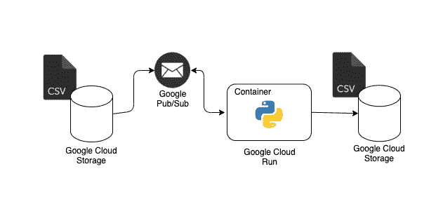
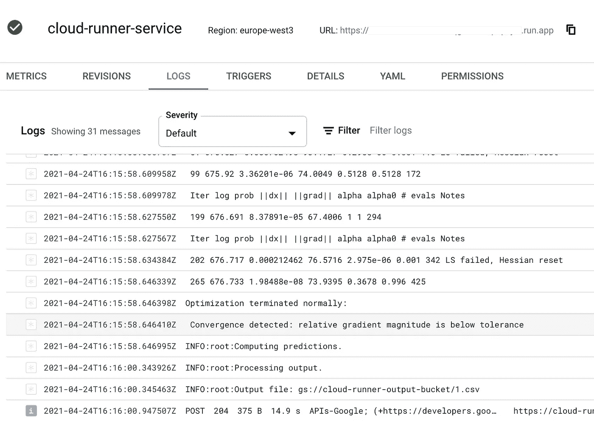
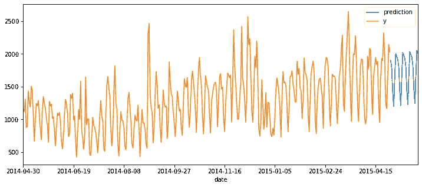
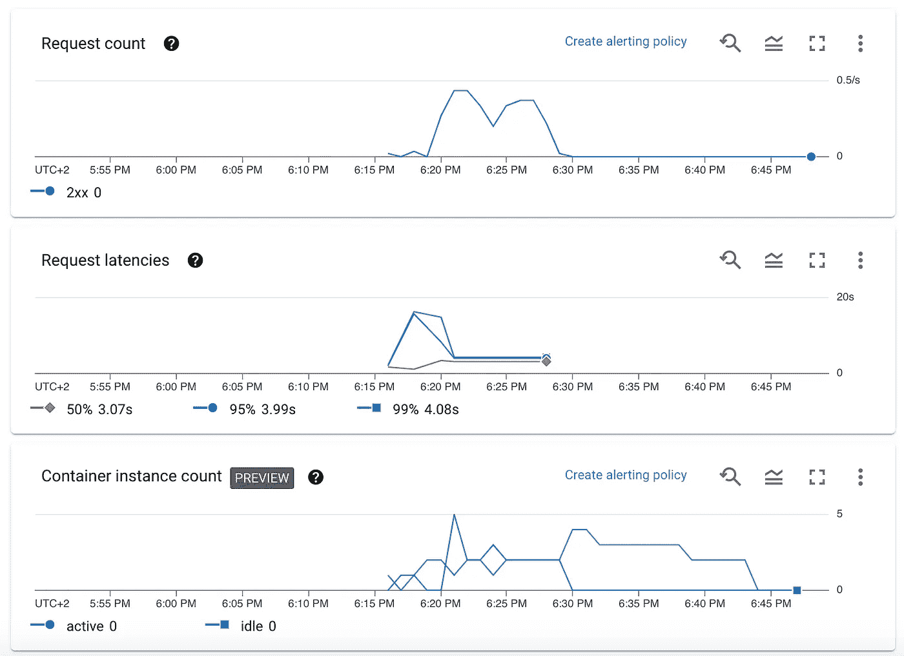
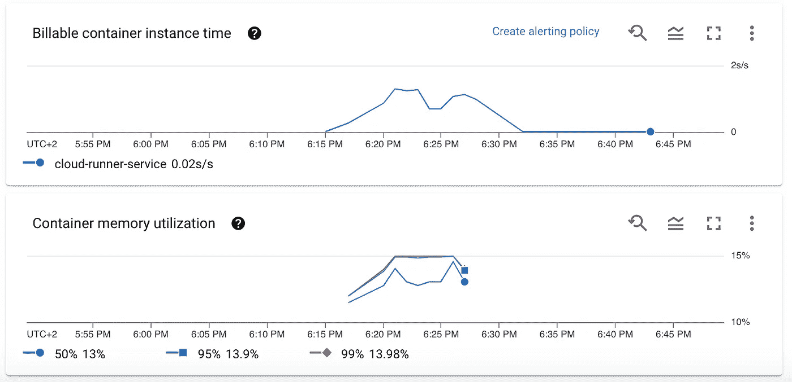

# 使用 Google Cloud Run、Pub/Sub、云存储和 Terraform 构建无服务器、容器化的批量预测模型

> 原文：<https://towardsdatascience.com/building-a-serverless-containerized-batch-prediction-model-using-google-cloud-run-and-terraform-82c97ab17515?source=collection_archive---------11----------------------->

这篇文章的目标是建立一个无服务器的基础设施，用代码管理，以异步方式服务于机器学习模型或任何其他轻量级计算的批量预测:Google Cloud Run 服务将通过 pub/sub 消息主题侦听云存储桶中的新文件，触发计算过程并将结果数据放入另一个桶中。你可以在 [GitHub](https://github.com/stelsemeyer/gcp-cloud-runner-tf) 上找到完整代码。该服务将像以下一样简单:

```
# upload data
gsutil cp dataset.csv gs://input-bucket/dataset.csv# wait a few seconds.. and download predictions
gsutil cp gs://output-bucket/dataset.csv predictions.csv
```



架构概述—作者使用 [draw.io](http://draw.io) 制作的图像

正如在[上一篇](https://blog.telsemeyer.com/2021/01/10/building-a-serverless-containerized-machine-learning-model-api-using-terraform-aws-lambda-api-gateway-and/)中，我们将利用 Terraform 来管理我们的基础设施，包括 Google Cloud Run、Storage 和 Pub/Sub。此外，我们将使用一个简单的时间序列预测脚本作为例子，我们将实际上在飞行中训练，因为拟合时间很短。一般来说，Cloud Run 并不适合执行长时间运行的任务(由于服务超时，稍后会详细介绍)，但非常适合以异步方式运行小脚本。

或者，我们可以从预训练的机器学习模型中计算批量预测，该模型从外部存储中加载或从外部 API 提供，例如对图像或文档进行分类。我们也可以运行一个简单的脚本来生成一些图。

我们将利用以下服务:

*   Google Cloud Run 是一种在无服务器基础设施上运行可调用容器的服务。
*   [Google Pub/Sub](https://cloud.google.com/pubsub/architecture) 是一种异步消息服务，允许消息的发送者和接收者分离。
*   [谷歌云存储](https://cloud.google.com/storage)是一种存储对象的服务。
*   [Terraform](https://www.terraform.io/) 是一款基础设施即代码软件。
*   [facebook prophet](https://facebook.github.io/prophet/) 是一个时间序列预测包。

# 先决条件

我们用`Terraform v0.14.0`和`gcloud`(这里:`Google Cloud SDK 319.0.0, alpha 2020.11.13, beta 2020.11.13, bq 2.0.62, core 2020.11.13, gsutil 4.55`)。

我们需要向谷歌认证，以建立使用 Terraform 的基础设施。我们将使用交互式工作流程:

```
gcloud auth application-default login
```

一旦我们通过认证，我们就可以开始地形化，并使用`gsutil`与谷歌云存储交互，以测试我们的基础设施。在生产环境中，我们应该为 Terraform 创建一个[服务帐户。](https://registry.terraform.io/providers/hashicorp/google/latest/docs/guides/getting_started#adding-credentials)

# 创建容器化模型

让我们构建一个非常简单的容器化工作流。我们将使用`prophet`来生成时间序列预测。正如已经提到的，我们实际上将动态地拟合模型并产生批量预测，而不存储实际的模型。这是可行的，因为模型的拟合时间相当低。或者，我们可以使用一个预先训练好的模型，或者是一个外部服务，或者是从外部存储中提取一个简单的模型工件。当模型训练在计算上很昂贵并且将在其他地方完成时，这尤其有用。

我们的模型由以下文件组成，我们将它们放在`app`子文件夹中:

*   `model.py`:实际型号代码，包括 fit 和批量预测。
*   `main.py`:云运行器处理程序，一个处理请求的 Flask 端点
*   `Dockerfile`:app 容器的 Dockerfile
*   `build.sh`:构建容器的简单脚本
*   `push.sh`:将容器推送到 GCR 的简单脚本

`model.py`将包含使用`fbprophet.Prophet`进行拟合和预测的功能:

处理程序`main.py`将使用`Flask`处理请求并将其转发给我们的模型:

我们将使用以下`python:3.8`基本映像将所有这些内容放入 Docker:

```
FROM python:3.8# Allow statements and log messages to immediately appear in the Cloud Run logs
ENV PYTHONUNBUFFERED TrueCOPY requirements.txt .
RUN pip install -r requirements.txtENV APP_HOME /app
WORKDIR $APP_HOME
COPY model.py main.py ./CMD exec gunicorn --bind :$PORT --workers 1 --threads 1 --timeout 0 main:app
```

`build.sh`如下图所示:

```
#!/bin/bash# if required: gcloud auth configure-docker
docker build -t cloud-runner .
```

最后的`push.sh`:

```
#!/bin/bashdocker tag cloud-runner $IMAGE_URI
docker push $IMAGE_URI
```

# 创造我们的基础设施。

我们现在可以规划我们的基础设施。正确组织的 Terraform 代码可以在 [GitHub 库](https://github.com/stelsemeyer/gcp-cloud-runner-tf/tree/main/terraform)中找到。

我们必须规划以下服务:

*   云运行服务处理来自输入桶的文件
*   云存储通知监听输入桶中的新文件
*   云存储通知的发布/订阅主题
*   向云存储通知主题订阅云运行服务的发布/订阅
*   云运行要使用的应用程序容器

围绕这一点，我们需要定义一些服务帐户和 IAM。

我们从`variables.tf`开始:

下面的地形代码将被放入`main.tf`。我们需要定义`provider`和项目相关的资源。

此外，GCS 桶:

让我们来看看云运行服务。因为只有当映像在 GCR 上可用时，才能构建云运行服务，所以我们将使用`null_resource`来构建映像，并使其成为依赖项。

最后是存储通知和发布/订阅基础架构:

我们现在可以使用我们的设置脚本:`setup.sh`来构建我们的基础设施。这将

*   构建一次容器，使其在缓存中可用
*   初始化并应用地形

如果你想先看到计划，运行`terraform plan`而不是`terraform apply`。

```
#!/bin/bash# build container once to enable caching
(cd app && 
    ./build.sh)# init and apply terraform
(cd terraform && 
    terraform init && 
    terraform apply)
```

我们将被提示`billing_account_name`和`user`。或者，我们可以准备一个`terraform.tfvars`文件，并在那里添加值:

```
billing_account_name = ...
user                 = ...
```

在要求我们确认`terraform apply`之前，我们应该会看到类似下面的输出(被截断):

```
[+] Building 0.8s (10/10) FINISHED                                                                                                                                                        
 => [internal] load build definition from Dockerfile  
...Terraform has been successfully initialized!
...Plan: 15 to add, 0 to change, 0 to destroy.Changes to Outputs:
  + image_uri     = (known after apply)
  + input_bucket  = "cloud-runner-input-bucket"
  + output_bucket = "cloud-runner-output-bucket"
  + project_id    = (known after apply)
  + service_name  = "cloud-runner-service"Do you want to perform these actions?
  Terraform will perform the actions described above.
  Only 'yes' will be accepted to approve.
```

创建资源大约需要 3 到 5 分钟，这也取决于可用的上传带宽，因为我们需要将图像上传到注册表。完成后，我们应该会看到以下输出(被截断):

```
random_id.id: Creating...
random_id.id: Creation complete after 0s [id=zg0]
google_project.project: Creating...
google_project.project: Still creating... [10s elapsed]
google_project.project: Still creating... [20s elapsed]
google_project.project: Still creating... [30s elapsed]
google_project.project: Creation complete after 35s [id=projects/cloud-runner-ce0d]
data.google_storage_project_service_account.gcs_account: Reading.
...google_cloud_run_service_iam_member.iam_member: Creation complete after 16s [id=v1/projects/cloud-runner-ce0d/locations/europe-west3/services/cloud-runner-service/roles/run.invoker/serviceAccount:[cloud-runner-service-account@cloud-runner-ce0d.iam.gserviceaccount.com](mailto:cloud-runner-service-account@cloud-runner-ce0d.iam.gserviceaccount.com)]
google_project_iam_binding.project: Still creating... [10s elapsed]
google_project_iam_binding.project: Still creating... [20s elapsed]
google_project_iam_binding.project: Creation complete after 22s [id=cloud-runner-ce0d/roles/iam.serviceAccountTokenCreator]Apply complete! Resources: 15 added, 0 changed, 0 destroyed.Outputs:image_uri = "gcr.io/cloud-runner-ce0d/cloud-runner:latest"
input_bucket = "cloud-runner-input-bucket"
output_bucket = "cloud-runner-output-bucket"
project_id = "cloud-runner-ce0d"
service_name = "cloud-runner-service"
```

当我们想要测试我们的服务时，这些输出会很有用。例如，我们可以如下获取输入存储桶名称:`terraform output -json | jq -r .input_bucket.value`

# 测试基础设施

由于我们的原型包含 facebook 的 prophet 包的一个非常简单的实现，让我们在一个小数据集上运行一个时间序列预测，这个数据集是 [hyndsight 数据集](https://rdrr.io/cran/fpp2/man/hyndsight.html)。它包含了从 2014 年 4 月 30 日到 2015 年 4 月 29 日，Rob J. Hyndman 博客的每日浏览量。Rob J. Hyndman 是许多流行的 R 预测包(包括[预测](https://github.com/robjhyndman/forecast))的作者，也是许多书籍和研究论文的作者和预测专家。数据集中的时间序列显示了显著的周模式和上升趋势，我们将在下面看到。

我们可以使用`gsutil`将测试文件`app/data/hyndsight.csv`上传到 GCS。我们将从`terraform output`中获取输入和输出桶名，并使用`jq`提取它们:

```
INPUT_BUCKET=$(cd terraform && terraform output -json | jq -r .input_bucket.value)
OUTPUT_BUCKET=$(cd terraform && terraform output -json | jq -r .output_bucket.value)gsutil cp app/data/hyndsight.csv gs://${INPUT_BUCKET}/hyndsight.csv
```

我们可以使用`gsutil -q stat gs://${OUTPUT_BUCKET}/hyndsight.csv`来检查文件，它应该在 10 到 20 秒后出现。我们可以在云运行控制台中查看日志:



谷歌云运行日志的用户界面——图片由作者制作

一旦文件在那里，我们就可以得到我们的预测。

```
gsutil cp gs://${OUTPUT_BUCKET}/hyndsight.csv app/data/hyndsight_forecast.csv
```

并使用 python 绘制它:

```
import pandas as pdactual = pd.read_csv("app/data/hyndsight.csv")
forecast = pd.read_csv("app/data/hyndsight_forecast.csv")data = pd.concat([actual, forecast])data.plot(x="date", figsize=(12,5))
```



hyndsight 时间序列和预测图—图片由作者制作

如果我们多次发送上述请求，我们可以激励 Cloud Run 启动更多实例。

```
INPUT_BUCKET=$(cd terraform && terraform output -json | jq -r .input_bucket.value)for i in {1..100}
do
    echo "Copying: $i"
    gsutil -q cp gs://${INPUT_BUCKET}/hyndsight gs://${INPUT_BUCKET}/dataset_${i}.csv
done
```

我们可以检查每秒的请求数、每个请求的延迟(我们模型的运行时间)、实例数:



Google 云运行指标的用户界面—图片由作者完成

此外，我们看到容器的内存使用非常低(对于我们的数据集来说)，所以如果我们希望输入数据看起来相似，我们可能会使用较小的实例。



Google 云运行指标的用户界面，第 2 部分——图片由作者完成

# 更新容器

要用新的最新版本手动更新容器，我们可以使用`deploy.sh`脚本。我们需要重建和推送映像，更新云运行服务以获取和转移流量。

```
# get project id, image output and service name from terraform output
PROJECT_ID=$(cd terraform && terraform output -json | jq -r .project_id.value)
IMAGE_URI=$(cd terraform && terraform output -json | jq -r .image_uri.value)
SERVICE_NAME=$(cd terraform && terraform output -json | jq -r .service_name.value)# build and push image
(cd app && 
    ./build.sh && 
    IMAGE_URI=$IMAGE_URI ./push.sh)# update image
gcloud --project $PROJECT_ID \
    run services update $SERVICE_NAME \
    --image $IMAGE_URI \
    --platform managed \
    --region europe-west3# send traffic to latest
gcloud --project $PROJECT_ID \
    run services update-traffic $SERVICE_NAME \
    --platform managed \
    --region europe-west3 \
    --to-latest
```

# 破坏基础设施

我们可以使用`_destroy.sh`来清空桶并摧毁通过地形创造的资源。

```
# get bucket names from terraform output
INPUT_BUCKET=$(cd terraform && terraform output -json | jq -r .input_bucket.value)
OUTPUT_BUCKET=$(cd terraform && terraform output -json | jq -r .output_bucket.value)gsutil rm "gs://${INPUT_BUCKET}/**"
gsutil rm "gs://${OUTPUT_BUCKET}/**"(cd terraform && 
    terraform state rm "google_project_iam_member.project_owner" &&
    terraform destroy)
```

我们应该会看到类似下面的输出:

```
...
google_service_account.service_account: Destruction complete after 1s
google_storage_bucket.storage_output_bucket: Destruction complete after 1s
google_pubsub_topic.pubsub_topic: Destruction complete after 2s
google_project_service.cloud_run_service: Still destroying... [id=cloud-runner-ce0d/run.googleapis.com, 10s elapsed]
google_project_service.cloud_run_service: Destruction complete after 13s
google_project.project: Destroying... [id=projects/cloud-runner-ce0d]
google_project.project: Destruction complete after 3s
random_id.id: Destroying... [id=KM8]
random_id.id: Destruction complete after 0sDestroy complete! Resources: 14 destroyed.
```

# 更多备注

谷歌服务有一些限制(截至 2021 年 4 月 24 日)。例如，最大超时[为 15 分钟，谷歌发布/订阅的最大确认时间](https://cloud.google.com/run/docs/configuring/request-timeout)[为 10 分钟。这使得它对于更耗时的任务毫无用处。您可以使用](https://github.com/googleapis/google-cloud-go/issues/608)[更大的资源](https://cloud.google.com/run/docs/configuring/cpu#yaml)来加快处理时间，尽管我们可以提供的内存也是有限的。我们的脚本一次只能处理一个请求，因此我们将容器的并发性设置为 1。我们可以通过在容器中使用更多的线程来加速这个过程，并允许一些并行化。

在任何情况下，Cloud Run 通过使用多个容器来本机处理多个请求。并行云运行容器的最大数量也是[可配置的](https://cloud.google.com/run/docs/configuring/max-instances)，默认设置为 1000(！).

我们应该上传某种包含标识符的清单，输入数据的路径，输出数据的预期路径，而不是直接上传数据到存储桶。这将使集成到其他服务变得更加容易。此外，我们还可以向模型传递参数。确保总是使用两个不同的桶进行输入和输出，否则当输出文件存储在输入桶中时会出现连续的循环。

此外，这个项目的一些方面是以非常天真的方式设计的，需要在生产环境中重新审视:云运行映像的版本控制，其中应该使用正确的版本标签。云运行有一个将流量转移到不同版本的机制。

最后，您必须考虑这种设置的成本。上述设置和少量测试运行在自由层内(截至 2021 年 4 月 24 日)。成本与始终可用的最小容器数量、容器资源、请求数量和每个请求的运行时间成比例。你可以使用[成本计算器](https://cloud.google.com/products/calculator)来估算预期成本。如果你要求集装箱一直在那里，或者需要更多的资源，成本就会大幅上升。

# 结论

将无服务器架构与 Terraform 结合使用，我们可以生成简单的端到端机器学习服务，同时通过代码保持对基础架构的可见性和控制。就个人而言，与使用云控制台和 ui 相比，我更喜欢用代码管理基础设施。在过去，这经常是我使用无服务器基础设施的一个障碍，因为 Terraform 模块经常落后。

如果你使用 Cloud Run，你会得到一些必须的和现成的特性:请求和资源的监控、日志、升级。使用发布/订阅将确保正确处理重试和死信。在需要更通用的设置的情况下，例如没有发布/订阅集成，可以考虑云函数而不是云运行，因为它们在调用部分允许更大的灵活性。

容器化允许我们隔离机器学习代码，并在需要时适当地维护包的依赖性。如果我们将处理程序代码保持在最少，我们就可以仔细测试映像，并确保我们的开发环境非常接近生产基础设施。与此同时，我们并不局限于谷歌技术；理论上，我们可以使用任何其他队列或消息系统，将处理程序部署到我们自己的基础设施中。

然而，我们不能掩盖这样一个事实，我们正在使用专有软件，它满足一些一般的需求，而不是我们的确切用例的需求。我们只能配置服务允许我们做的事情，在我们的情况下，我们不得不接受云运行和发布/订阅的一些限制，例如关于超时、最大运行时间和资源。

*最初发表于*[*【https://blog.telsemeyer.com】*](https://blog.telsemeyer.com/2021/04/24/building-a-serverless-containerized-batch-prediction-model-using-google-cloud-run-pub-sub-cloud-storage-and-terraform/)*。*