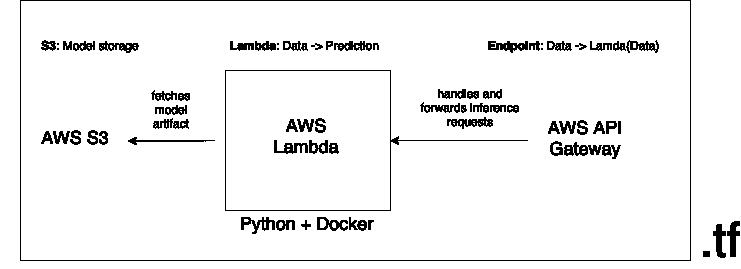

# 使用 AWS Lambda & API Gateway 和 Terraform 构建无服务器、容器化的机器学习模型 API

> 原文：<https://towardsdatascience.com/building-a-serverless-containerized-machine-learning-model-api-using-aws-lambda-api-gateway-and-a73a091ff82e?source=collection_archive---------31----------------------->

## Dockerized Lambdas

这篇文章的目标是建立一个无服务器的基础设施，用代码管理，通过 Rest API 提供容器化的机器学习模型的预测，简单如:

```
$ curl \
$  -X POST \
$  --header "Content-Type: application/json" \
$  --data '{"sepal_length": 5.9, "sepal_width": 3, "petal_length": 5.1, "petal_width": 1.8}' \
$  [https://my-api.execute-api.eu-central-1.amazonaws.com/predict/](https://my-endpoint-id.execute-api.eu-central-1.amazonaws.com/predict/){"prediction": {"label": "virginica", "probability": 0.9997}}
```

我们将利用 Terraform 来管理我们的基础设施，包括 AWS ECR、S3、Lambda 和 API Gateway。我们将利用 AWS Lambda 来运行模型代码，实际上是在一个容器中，这是一个[非常新的特性](https://aws.amazon.com/blogs/aws/new-for-aws-lambda-container-image-support/)。我们将使用 AWS API Gateway 通过 Rest API 为模型提供服务。模型人工制品本身将生活在 S3。你可以在这里找到完整的代码。



架构图——作者使用 [draw.io](http://draw.io) 绘制的图像

# 先决条件

我们用`Terraform v0.14.0`和`aws-cli/1.18.206 Python/3.7.9 Darwin/19.6.0 botocore/1.19.46`。

我们需要向 AWS 认证，以:

*   使用 Terraform 设置基础设施。
*   训练模型并在 S3 存储生成的模型工件
*   使用 AWS CLI 测试基础设施(此处: )

可以使用名为`lambda-model`的配置文件在[凭证文件](https://docs.aws.amazon.com/cli/latest/userguide/cli-configure-files.html)即`~/.aws/credentials`中设置 AWS 凭证:

```
[lambda-model]
aws_access_key_id=...
aws_secret_access_key=...
region=eu-central-1
```

这将允许我们告诉 Terraform 以及 AWS CLI 使用哪个凭证。Lambda 函数本身将使用角色进行身份验证，因此不需要显式凭证。

此外，我们需要定义区域、桶名和一些其他变量，这些也在 Terraform 变量中定义，我们将在后面看到:

```
export AWS_REGION=$(aws --profile lambda-model configure get region)
export BUCKET_NAME="my-lambda-model-bucket"
export LAMBDA_FUNCTION_NAME="my-lambda-model-function"
export API_NAME="my-lambda-model-api"
export IMAGE_NAME="my-lambda-model"
export IMAGE_TAG="latest"
```

# 创建容器化模型

让我们在`iris`数据集上构建一个非常简单的容器化模型。我们将定义:

*   `model.py`:实际型号代码
*   `utils.py`:实用功能
*   `train.py`:触发模型训练的脚本
*   `test.py`:生成预测的脚本(用于测试目的)
*   `app.py`:Lambda 处理器

为了存储模型工件并为模型训练加载数据，我们将定义几个助手函数来与 S3 通信，并从一个`utils.py`内的公共端点加载带有训练数据的文件:

此外，我们的模型需要一个包装类:

*   用外部数据训练它
*   保持状态并保存和加载模型工件
*   传递有效负载以进行推理

这将在`model.py`中定义:

为了在没有实际 Lambda 基础设施的情况下进行训练和预测，我们还将设置两个脚本，一个`train.py`和一个`predict.py`。训练脚本可以非常简单，我们也可以将其他数据源传递给`train`方法。

```
from model import ModelWrapper model_wrapper = ModelWrapper() 
model_wrapper.train()
```

一个简单的`predict.py`将预测打印到控制台:

```
import json
import sysfrom model import ModelWrapper model_wrapper = ModelWrapper()
model_wrapper.load_model()data = json.loads(sys.argv[1])
print(f"Data: {data}")prediction = model_wrapper.predict(data=data)
print(f"Prediction: {prediction}")
```

最后，我们需要处理程序将数据传递给模型包装器。这就是 Lambda 函数将调用的内容。我们将保持它非常简洁，处理程序将简单地将请求传递给包装器，并将返回的预测转换成 API 网关期望的[输出格式](https://docs.aws.amazon.com/apigateway/latest/developerguide/set-up-lambda-proxy-integrations.html#api-gateway-simple-proxy-for-lambda-output-format):

我们将把所有这些放入 Docker(更确切地说是一个`Dockerfile`)中，并使用 AWS Lambda [基础映像](https://docs.aws.amazon.com/lambda/latest/dg/images-create.html):

```
FROM public.ecr.aws/lambda/python:3.8COPY requirements.txt .
RUN pip install -r requirements.txtCOPY app.py utils.py model.py train.py predict.py ./CMD ["app.handler"]
```

# 创建 ECR 和 S3 资源

现在让我们通过 Terraform 定义 ECR 存储库和 S3 存储桶。正确组织的 Terraform 代码可以在 [GitHub repo](https://github.com/stelsemeyer/lambda-model/tree/main/terraform) 中找到。

我们将一些配置(`variables`和`locals`)和 AWS 定义为`provider`。或者，变量也可以从[环境](https://www.terraform.io/docs/configuration/variables.html#environment-variables)中加载。

此外，S3 和 ECR 知识库:

让我们创建我们的 S3 存储桶和 ECR 存储库:

```
(cd terraform &&  \
  terraform apply \
  -target=aws_ecr_repository.lambda_model_repository \
  -target=aws_s3_bucket.lambda_model_bucket)
```

# 建立和推广 docker 形象

我们现在可以构建 docker 映像并将其推送到 repo(或者，这可以在 Terraform 中的`null_resource` `provisioner`中完成)。我们导出注册表 ID 来构建我们想要推送图像的图像 URI:

```
export REGISTRY_ID=$(aws ecr \
  --profile lambda-model \
  describe-repositories \
  --query 'repositories[?repositoryName == `'$IMAGE_NAME'`].registryId' \
  --output text)
export IMAGE_URI=${REGISTRY_ID}.dkr.ecr.${AWS_REGION}.amazonaws.com/${IMAGE_NAME}# ecr login
$(aws --profile lambda-model \
  ecr get-login \
  --region $AWS_REGION \
  --registry-ids $REGISTRY_ID \
  --no-include-email)
```

现在，构建和推动就像:

```
(cd app && \
  docker build -t $IMAGE_URI . && \
  docker push $IMAGE_URI:$IMAGE_TAG)
```

# 训练模型

现在让我们使用新创建的 docker 容器的`train.py`入口点来训练我们的模型:

```
docker run \
  -v ~/.aws:/root/.aws \
  -e AWS_PROFILE=lambda-model \
  -e BUCKET_NAME=$BUCKET_NAME \
  --entrypoint=python \
  $IMAGE_URI:$IMAGE_TAG \
  train.py
# Loading data.
# Creating model.
# Fitting model with 150 datapoints.
# Saving model.
```

# 测试模型

使用`predict.py`入口点，我们还可以用一些数据对其进行测试:

```
docker run \
  -v ~/.aws:/root/.aws \
  -e AWS_PROFILE=lambda-model \
  -e BUCKET_NAME=$BUCKET_NAME \
  --entrypoint=python \
  $IMAGE_URI:$IMAGE_TAG \
  predict.py \
  '{"sepal_length": 5.1, "sepal_width": 3.5, "petal_length": 1.4, "petal_width": 0.2}'
# Loading model.
# Data: {'sepal_length': 5.1, 'sepal_width': 3.5, 'petal_length': 1.4, 'petal_width': 0.2}
# Prediction: ('setosa', 0.9999555689374946)
```

# 使用 Terraform 规划我们的主要基础设施

我们现在可以计划基础设施的推理部分，即[λ&API 网关设置](https://learn.hashicorp.com/tutorials/terraform/lambda-api-gateway):

*   Lambda 函数，包括访问 S3 和生成日志的角色和策略，
*   API 网关，包括必要的权限和设置。

我们现在可以再次使用 Terraform CLI 应用它，这大约需要一分钟。

```
(cd terraform && terraform apply)
```

# 测试基础设施

为了测试 Lambda 函数，我们可以使用 AWS CLI 调用它，并将响应存储到`response.json`:

```
aws --profile lambda-model \
  lambda \
  invoke \
  --function-name $LAMBDA_FUNCTION_NAME \
  --payload '{"body": {"sepal_length": 5.9, "sepal_width": 3, "petal_length": 5.1, "petal_width": 1.8}}' \
  response.json
# {
#     "StatusCode": 200,
#     "ExecutedVersion": "$LATEST"
# }
```

`response.json`将看起来像这样:

```
{
    "statusCode": 200,
    "body": "{\"prediction\": {\"label\": \"virginica\", \"probability\": 0.9997}}",
    "isBase64Encoded": false
}
```

我们也可以使用`curl`或 python 来测试我们的 API。我们需要首先找到我们的端点 URL，例如再次使用 AWS CLI 或 Terraform 输出。

```
export ENDPOINT_ID=$(aws \
  --profile lambda-model \
  apigateway \
  get-rest-apis \
  --query 'items[?name == `'$API_NAME'`].id' \
  --output text)
export ENDPOINT_URL=[https://${ENDPOINT_ID}.execute-api.${AWS_REGION}.amazonaws.com/predict](https://${ENDPOINT_ID}.execute-api.${AWS_REGION}.amazonaws.com/predict)curl \
  -X POST \
  --header "Content-Type: application/json" \
  --data '{"sepal_length": 5.9, "sepal_width": 3, "petal_length": 5.1, "petal_width": 1.8}' \
  $ENDPOINT_URL
# {"prediction": {"label": "virginica", "probability": 0.9997}}
```

或者，我们可以用 python 发送 POST 请求:

```
import requests
import os endpoint_url = os.environ['ENDPOINT_URL']
data = {"sepal_length": 5.9, "sepal_width": 3, "petal_length": 5.1, "petal_width": 1.8}req = requests.post(endpoint_url, json=data)
req.json()
```

# 更多备注

要更新容器映像，我们可以再次使用 CLI:

```
aws --profile lambda-model \
  lambda \
  update-function-code \
  --function-name $LAMBDA_FUNCTION_NAME \
  --image-uri $IMAGE_URI:$IMAGE_TAG
```

如果我们想要移除我们的基础架构，我们必须先清空我们的存储桶，之后我们可以销毁我们的资源:

```
aws s3 --profile lambda-model rm s3://${BUCKET_NAME}/model.pkl
(cd terraform && terraform destroy)
```

# 结论

有了容器化 Lambdas 的新功能，将机器学习模型部署到 AWS 无服务器领域变得更加容易。有许多 AWS 替代品(ECS、Fargate、Sagemaker)，但是 Lambda 提供了许多现成的工具，例如基于请求的日志记录和监控，并且它允许轻松地进行快速原型开发。然而，它也有一些缺点，例如请求延迟开销和使用不完全可定制的专有云服务。

另一个好处是，容器化允许我们隔离机器学习代码，并适当地维护包的依赖性。如果我们将处理程序代码保持在最低限度，我们就可以仔细测试映像，并确保我们的开发环境非常接近生产基础设施。同时，我们不会被 AWS 技术所束缚——我们可以非常容易地用我们自己的 web 框架替换处理程序，并将其部署到 Kubernetes。

最后，我们可以通过远程运行培训(例如使用 ECS)、添加版本控制和 CloudWatch 警报来改进我们的模型基础设施。如果需要，我们可以添加一个过程来保持 Lambda 的温度，因为冷启动需要几秒钟。我们还应该向端点添加身份验证。

*原载于*<https://blog.telsemeyer.com/2021/01/10/building-a-serverless-containerized-machine-learning-model-api-using-terraform-aws-lambda-api-gateway-and/>**。**