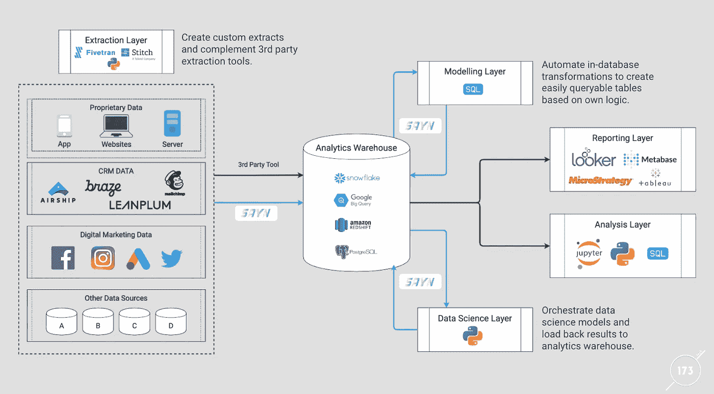

# 用 SAYN 构建简单的 ETL

> 原文：<https://towardsdatascience.com/building-a-simple-etl-with-sayn-e08c415b5ea0?source=collection_archive---------25----------------------->

## 通过一个简单的将笑话翻译成 Yodish 的 ETL 示例来了解 SAYN。

几个月前，我写了一篇[文章来介绍 SAYN](/introducing-sayn-a-simple-yet-powerful-data-processing-framework-ce1c89af0e47)——我们的开源数据处理框架，针对简单性和灵活性进行了调整。在这篇文章中，我想让你更深入地了解一下 [SAYN](https://github.com/173TECH/sayn) 是如何工作的，我们目前如何在 ETL / ELT 过程中使用它，以及它的好处。此外，我们将通过一个示例 SAYN 项目来模拟 ETL 过程，并在这个过程中学习一点 Yodish(Yoda 的语言)!

## SAYN:ETL 过程的简单性和灵活性

我们创建 SAYN 是因为现有解决方案面临以下挑战:

*   轻量级设置(如缝合+ DBT)让您快速入门。然而，它们缺乏 Python 支持，如果您需要的比第三方提取器所能提供的更多(例如，缺少数据源)，或者如果您想要集成数据科学模型，这可能会成为问题。
*   更高级的设置(例如气流)为您提供了充分的灵活性，但是设置和维护所需的技术专业知识(由于需要大量的服务)对于没有很多数据工程师的团队来说是一个挑战。

这形成了 SAYN 设计的理念:**易于部署、运行和维护，同时支持分析流程的充分灵活性**。并进一步转化为以下核心特征:

*   SAYN 有向无环图(DAG)是在 YAML 编写的，使分析团队的任何成员都可以轻松地为管道做出贡献——无论他们是否知道 Python。
*   通过使用 Jinja 模板和参数，YAML 任务定义和任务代码都可以变成动态的。
*   所有 SAYN 任务都通过`sayn run`命令执行。这意味着部署可以简单地通过服务器上的单个 cron 作业(例如 EC2)或使用无服务器选项(例如 GCP 云运行)来完成。因此，您可以在几分钟内部署 SAYN，因为您不需要设置和维护大量的服务！
*   现成的 SQL 转换任务，以便您可以轻松地将其添加到第三方提取工具之上。
*   Python 任务，这意味着您可以在必要时轻松高效地将自定义摘要和/或数据科学模型集成到您的工作流中。
*   自动将数据从数据库复制到您的仓库。
*   还有更多的来了！

我们已经在超过数百个任务的多个 ETL 上使用了 SAYN，效果非常好！由于其特性，它使您能够在构建分析工作流时选择最佳选项，同时保持整体基础架构的维护极其简单。下图显示了我们如何部署 SAYN 基础设施:



使用 SAYN 部署分析基础架构

现在你已经对 SAYN 有了一个很好的概述，让我们来看一个用 SAYN 构建的非常简单的 ETL，这样你就可以感受一下这个框架是如何工作的。

## 使用 SAYN 的简单 ETL

我们将通过一个简单的 ETL 项目引导您使用 SAYN。你可以在 Github [这里](https://github.com/173TECH/sayn_project_example_simple_etl)找到这个项目，并使用命令下载它:

```
**git clone https://github.com/173TECH/sayn_project_example_simple_etl.git**
```

这个项目实现的 ETL 操作如下:

1.  从一个 API 收集笑话，然后用另一个 API 翻译成 Yodish。
2.  在这些原始数据上创建一些数据模型(SQL 转换)。

这两个 API 都是免费的，不需要 API 密钥，所以您可以直接运行项目。但是，每个 API 都有配额(Yoda translation API 限制在每小时 5 次调用),所以您应该避免每小时多次运行提取任务。在运行项目之前，您应该:

*   将 **settings_sample.yaml** 文件重命名为 **settings.yaml** 。
*   从项目文件夹的根目录安装它的依赖项(`sayn`和`requests`包)和`pip install -r requirements.txt`。

**项目结构概述**

SAYN 项目由以下部分组成:

*   project.yaml:定义 SAYN 项目。**它由项目的所有合作者共享**。
*   settings.yaml:定义个人用户的设置。**它对于每个协作者来说都是唯一的**，并且永远不应该被推送到 git，因为它将包含凭证。
*   任务:存储任务文件的文件夹。每个文件被视为一个任务组。
*   python:存储 python 任务脚本的文件夹。
*   sql:存储 sql 和 autosql 任务的 SQL 文件的文件夹。
*   logs:写入 SAYN 日志的文件夹。
*   compile:存储已编译的 SQL 查询的文件夹。在执行之前，SAYN 使用 Jinja 根据项目和设置中定义的参数值编译 SQL 查询。

为了简单起见，我们在这个项目中使用一个 SQLite 数据库。您可以使用 [DB Browser for SQLite](https://sqlitebrowser.org/dl/) 来轻松查看创建的表格内容。

该项目由三项任务组成:

*   用于数据提取和加载的 Python 任务。
*   计算笑话统计数据的 Autosql 任务。
*   Autosql 任务来比较笑话的长度。

你可以简单地从项目的根目录用命令`sayn run`运行项目(更多关于所有可用命令的细节[在这里](https://173tech.github.io/sayn/cli/))。执行此操作时，您应该会看到以下情况:


示例 SAYN 运行

接下来的部分将一步一步解释当你这样做的时候会发生什么。

**数据提取(python 任务)**

我们流程的第一步是数据提取和加载。这是由名为**extract _ 笑话 _ 翻译**的 Python 任务完成的。

这个任务在我们的 **base.yaml** 任务文件中定义如下:

```
extract_jokes_translated:
      type: python
      class: extract_jokes_translated.ExtractJokesTranslated
      # those parameters will be accessible in the task
      parameters:
        n_jokes: 5
        translation_type: yoda
      tags:
        - extract
```

任务执行的代码在**python/extract _ 笑话 _translated.py** 文件中定义:

```
# list of free apis
    # https://apipheny.io/free-api/
    import requests
    import json
    import time

    from sayn import PythonTask

    class ExtractJokesTranslated(PythonTask):
        def setup(self):
            self.dst_table = self.parameters["user_prefix"] + "logs_jokes_translated"
            self.n_jokes = self.parameters["n_jokes"]
            self.translation_type = self.parameters["translation_type"]
            self.table_full_refresh = self.run_arguments["full_load"]

            self.url_joke = "https://official-joke-api.appspot.com/random_joke"
            self.url_translation = f"https://api.funtranslations.com/translate/{self.translation_type}.json"

            return self.success()

        def run(self):
            jokes = []

            # get jokes
            self.debug(f"Extracting {str(self.n_jokes)} jokes.")
            for i in range(self.n_jokes):
                r = requests.get(self.url_joke)

                if r.status_code != 200:
                    self.debug("Request not successful!")
                    continue

                content = json.loads(r.content.decode("utf-8"))
                # self.debug(content)

                joke = {
                    "id": content["id"],
                    "type": content["type"],
                    "text": content["setup"] + " | " + content["punchline"]
                }

                jokes.append(joke)

            # get joke translations
            # ATTENTION: the translation API has very low levels of free requests (~5 per hour)
            # re-running the task multiple times might not return the translations and load those as null
            self.debug(f"Translating {len(jokes)} jokes.")
            for j in jokes:
                r = requests.post(self.url_translation, data={"text": j["text"]})

                if r.status_code != 200:
                    self.debug("Request not successful!")
                    continue

                content = json.loads(r.content.decode("utf-8"))
                # self.debug(content)

                j.update({
                    "text_translated": content["contents"]["translated"],
                    "translation_type": self.translation_type
                })

            # load data to database
            self.debug(f"Loading {len(jokes)} jokes translated to DB.")
            db = self.default_db
            db.load_data(self.dst_table, jokes, replace=self.table_full_refresh)

            return self.success()
```

以下是 Python 任务如何与 SAYN 一起工作:

*   任务在 YAML 中用类型 **python** 定义，然后指定需要运行的类。
*   类本身是在 **python** 文件夹中的**extract _ 笑话 _translated.py** 文件中定义的。该类继承自 **sayn。PythonTask** 对象。该类应该定义一个**运行**方法(也可以定义一个**设置**方法，尽管这不是强制性的)。运行和设置(如果已定义)方法需要返回一个状态: **self.success()** 或 **self.fail()** 。
*   在任务 YAML 定义中，我们定义了一些参数，使我们能够使代码动态化；这些参数通过**自身参数**在设置阶段使用。
*   此外，我们还在项目上定义了一个 **user_prefix** 参数。这首先在 **project.yaml** (项目的默认值)中定义，然后在 **settings.yaml** 中默认使用的 **dev** 配置文件中覆盖。这个参数允许我们在测试期间避免来自多个项目用户的表冲突。虽然在这个项目中没有实现，但是参数也可以用来轻松地区分开发和生产环境(例如，通过基于执行时使用的概要文件分配不同的模式值)。
*   最后，我们使用 PythonTask 对象的 **run_arguments** 属性的 **full_refresh** 值来控制任务是否应该强制表的完全刷新。除非将 **-f** 标志添加到命令中，否则这将评估为假。

**数据建模(autosql 任务)**

我们流程的第二步是加载数据的建模。这是通过两个 autosql 任务完成的。这些任务通过将 SELECT 语句转换为表或视图来自动化转换过程。

**f _ 笑话 _ 统计**

该任务在 **base.yaml** 中定义如下:

```
f_jokes_stats:
       type: autosql
       file_name: f_jokes_stats.sql
       materialisation: table
       destination:
         table: "{{user_prefix}}f_jokes_stats"
       parents:
         - extract_jokes_translated
       tags:
         - models
```

这是定义 autosql 任务的最“冗长”的方式。下一个例子展示了如何显著减少这种情况。该任务执行以下 SQL 代码:

```
SELECT j.id AS joke_id
         , j.type AS joke_type
         , j.text
         , j.text_translated
         , j.translation_type
         , LENGTH(j.text) AS text_length
         , LENGTH(j.text_translated) AS text_translated_length
         , CASE WHEN LENGTH(j.text_translated) > LENGTH(j.text) THEN 1 ELSE 0 END flag_text_translated_length_longerFROM {{user_prefix}}logs_jokes_translated j
```

下面是 autosql 任务如何与 SAYN 一起工作:

*   该任务在 YAML 被定义为类型 **autosql** 。
*   它需要指定以下属性:文件名、物化(表、视图或增量)和目的地。
*   在这个例子中，我们利用了 **user_prefix** 参数来使表名动态化。
*   我们定义任务的父子关系。在这种情况下，任务依赖于提取任务**extract _ 笑话 _ 翻译**的完成。
*   我们还将标签 **models** 添加到这个任务中，这样我们就可以在需要的时候使用 **sayn run -t tag:models** 命令来执行所有的模型。
*   该任务指向 **sql** 文件夹中的**f _ 笑话 _ 统计数据. sql** 文件。

**f _ 笑话 _ 长度 _ 比较**

该任务在 **base.yaml** 中定义如下:

```
f_jokes_length_comparison:
      preset: models
      parents:
        - f_jokes_stats
```

为了这个任务。我们利用 SAYN 的**预置**特性，这使我们能够定义共享相似配置的多个任务(这个概念类似于继承)。**型号**预置在 **base.yaml** 中定义如下:

```
presets:
      models:
        type: autosql
        file_name: "{{task.name}}.sql"
        materialisation: table
        destination:
          table: "{{user_prefix}}{{task.name}}"
        tags:
          - models
```

因此，该任务将预置**型号**的所有属性。我们只需要直接在任务上定义一个父级。

**运行项目**

您可以使用命令 **sayn run** 运行项目。这将在 SQLite 数据库中创建三个表(每个任务一个表):

*   Python 任务创建的表包含我们的日志(和 Yodish 翻译！).
*   由任务**f _ skins _ stats**创建的表对数据进行建模，并添加一些关于笑话在每种语言中的字符长度的统计数据。
*   由**f _ skins _ length _ comparison**创建的表格给出了每种笑话类型中，翻译笑话比英语笑话长的次数比例。看来 Yodish 普遍比英语长！(尽管这可能会根据您从随机笑话 API 中获取的数据而改变)。

一旦您运行了一次项目，使用 **sayn run -x tag:extract** 命令来避免重新运行提取任务(因为使用的两个 API 都有配额)。

## 了解更多

那都是乡亲们！本文向您快速介绍了 SAYN 项目是如何工作的。您可以在我们的[文档](https://173tech.github.io/sayn/)中找到关于 SAYN 的更多详细信息，包括:

*   SAYN 的核心概念和其他可用任务的细节(包括我们在这里没有涉及的复制任务)。
*   更多充实的[教程](https://173tech.github.io/sayn/tutorials/tutorial_part1/)将让你更深入地了解 SAYN 的所有核心概念。

如果您对 SAYN 或整个项目有任何具体问题，您可以通过 sayn@173tech.com[联系我们。快点说！](mailto:sayn@173tech.com)

— — — —

*这个故事最初发表于:*[*https://www.173tech.com/insights/sayn-simple-etl-example/*](https://www.173tech.com/insights/sayn-simple-etl-example/)*。*