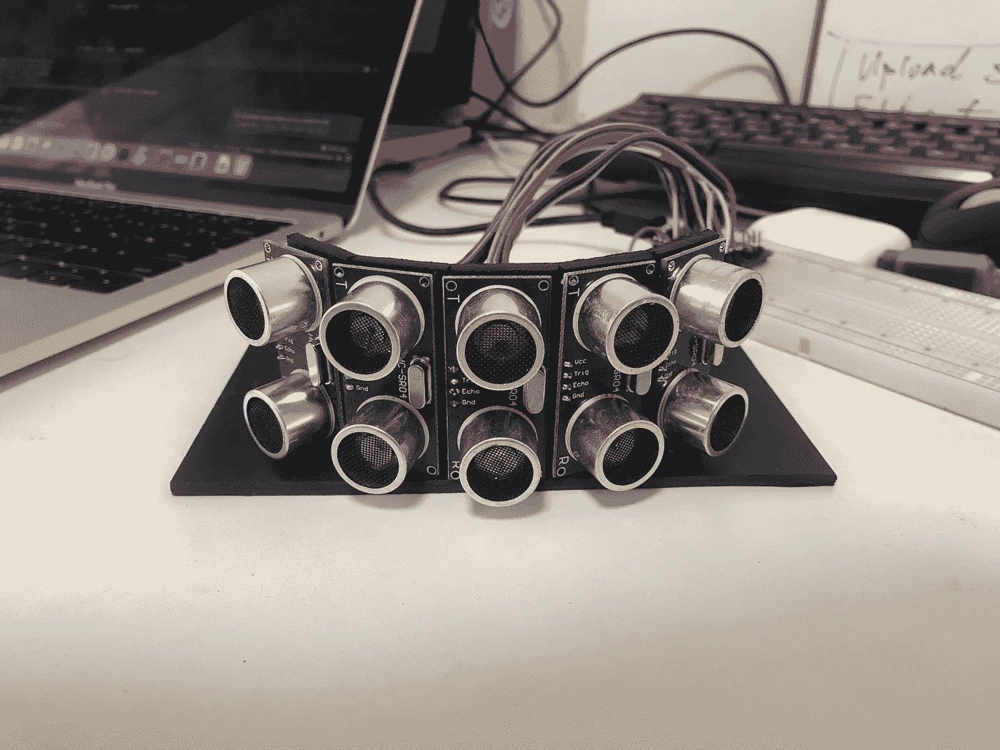
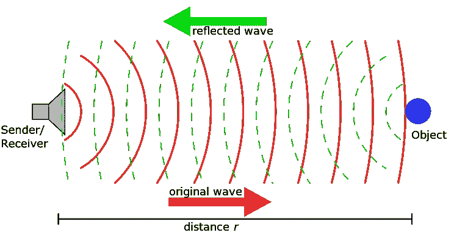
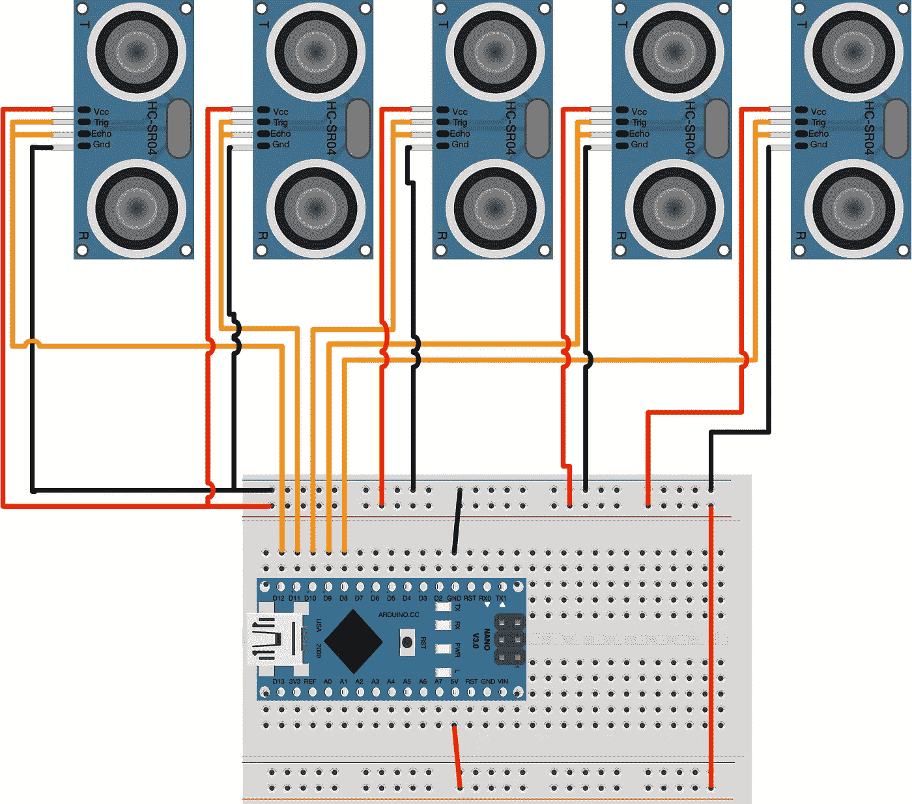

# 用 Arduino 和 Python 构建声纳传感器阵列

> 原文：<https://towardsdatascience.com/building-a-sonar-sensor-array-with-arduino-and-python-c5b4cf30b945?source=collection_archive---------3----------------------->

## [实践教程](https://towardsdatascience.com/tagged/hands-on-tutorials)

## 使用多个低成本超声波传感器估计固体物体的距离和位置。



基于广泛供应的 HC-SR04 传感器的传感器阵列。作者照片

在这篇文章中，我们将从零开始建立一个基于廉价和流行的 HC-SR04 传感器的声纳阵列。我们将使用 Arduino 微控制器来驱动和读取传感器，并使用串行通信与主机通信。[这是整个项目的工作代码](https://github.com/Veilkrand/UltrasoundSensorArray)，不过我建议你按照文章中的步骤来理解它是如何工作的，并根据你的需要进行定制。

HC-SR04 是一款非常受欢迎的超声波传感器，通常用于业余爱好电子产品，构建用于避障或物体检测的廉价距离传感器。它有一个超声波发射器和接收器，用于测量超声波信号在固体物体上反弹的飞行时间。



声纳原理。图片由【Schorsch 博士

如果在 20 摄氏度的室温下，声速大约为 343 米/秒。到物体的距离是超声波从发射器到接收器所需时间的一半:

> 距离= 343 /(时间/2)

然而，HC-SR04 传感器非常不准确，会给你一个非常粗略和嘈杂的距离估计。温度和湿度等环境因素会影响超声波的速度，固体物体的材料和入射角也会影响距离估计。我们稍后会了解到，有一些方法可以提高原始读数，但一般来说，超声波传感器只能作为避免近距离碰撞或探测低距离分辨率固体物体的最后手段。但是它们不是好的导航或距离估计传感器。为此，我们可以使用更昂贵的传感器，如激光雷达或激光测距仪。

我想用这个声纳阵列来探测我的 Raspberry Pi 机器人 [Rover4Wd](https://github.com/Veilkrand/simplePiRover) 前方附近的障碍物(这个项目会在另一篇文章中介绍)。传感器的有效探测角度约为 15 度，因此为了覆盖机器人前方的更大区域，我想使用总共 5 个弧形传感器:


安装在机器人 Rover4WD 前面的声纳阵列。作者图片

这种设置的好处是，我们不仅可以估计机器人前方障碍物的距离，还可以估计物体相对于机器人的位置(大致)。

HC-SR04 传感器只有四个引脚。两个为接地和+5v、 ***和*** 和 ***触发*** 引脚。要使用传感器，我们需要使用 ***触发器*** 引脚触发信号，并测量时间，直到通过 ***Echo*** 引脚接收到信号。由于我们不同时使用 Echo 和 Trigger 引脚，它们可以共享同一根电缆来连接 Arduino 数字引脚。

对于这个项目，我们将使用一个 Arduino Nano，它很小，很容易买到。还有很多非官方兼容的克隆产品，每台不到 3 美元。



声纳阵列的试验板设置。作者图片

对于这个试验板设置，我们已经将 ***Trig*** 和 ***Echo*** 引脚连接到 Arduino 中的一个数字引脚。我们将使用 D12、D11、D10、D9 和 D8 引脚来发送和接收信号。这种硬件设置仅受微控制器可用数字引脚的限制，但可以使用多路复用进一步扩展，其中一个引脚可以由多个传感器共享，但一次只能由一个传感器共享。

传统上，这将是我们需要设法逐个轮询传感器的顺序工作流:

1.  触发一个传感器
2.  收到回声
3.  使用之前步骤的持续时间计算距离
4.  使用串行端口进行测量通信
5.  处理下一个传感器

然而，我们将使用一个现成的 Arduino 库，名为 [NewPing](https://bitbucket.org/teckel12/arduino-new-ping/wiki/Home) ，它允许您 Ping 多个传感器，从而最小化传感器之间的延迟。这将有助于我们在同一时间(几乎)每秒几次测量所有 5 个传感器的距离。最终的工作流如下所示:

1.  异步触发和回应所有传感器(但按顺序)
2.  当传感器完成计算距离时
3.  当所有传感器完成当前周期时，使用串行端口传送所有传感器的读数
4.  开始新的传感器读取周期

实现非常简单，并在代码中进行了大量注释。随意看看这里的完整代码。

当所有传感器完成距离测量后，我想特别关注串行通信部分:

```
void oneSensorCycle() { // Sensor ping cycle complete, do something with the results.

  for (uint8_t i = 0; i < SONAR_NUM; i++) {

     // Sending bytes
        byte reading_high = highByte(cm[i]);
        byte reading_low = lowByte(cm[i]);
        byte packet[]={0x59,0x59,i,reading_high,reading_low};
        Serial.write(packet, sizeof(packet));
  }

}
```

最初我想通过串行使用字符串发送传感器读数，但是我意识到在项目的主机端消息会很大，很难解析。为了提高速度和降低读取延迟，我决定切换到一个简单的格式，使用一个 5 字节的消息:

**字节 1:** 字符' Y'
**字节 2:** 字符' Y'
**字节 3:** 传感器索引[0–255]
**字节 4:** 测量距离的高位字节(作为无符号整数)
**字节 5:** 测量距离的低位字节(作为无符号整数)

字节 1 和 2 只是消息头，决定当我们读取输入的串行字节时，新消息从哪里开始。这种方法与 [TF-Luna 激光雷达传感器](https://makersportal.com/blog/distance-detection-with-the-tf-luna-lidar-and-raspberry-pi)与主机通信的方式非常相似。

在主机端，我们将使用 Python 3 通过串行端口连接到 Arduino 微控制器，并尽可能快地读取传入的字节。理想的设置是在主机中使用 UART 端口，但只有串行 USB 可以完成这项工作。Python 脚本的完整代码是[这里是](https://github.com/Veilkrand/UltrasoundSensorArray/blob/master/main.py)。

有几件有趣的事情需要注意，首先，我们需要在不同的线程上读取序列，这样我们就不会在处理传感器读数或做不同事情时错过任何传入的消息:

```
def read_serial(serial, sensors): while True:

        # Read by bytes
        counter = serial.in_waiting  # count the number of bytes of the serial port
        bytes_to_read = 5
        if counter > bytes_to_read - 1:
            bytes_serial = serial.read(bytes_to_read)
            # ser.reset_input_buffer()  # reset buffer

            sensor_index, sensor_reading = read_sensor_package(bytes_serial)

            if sensor_index >= 0:
                if sensor_index not in sensors:
                    sensors[sensor_index] = SMA(2)
                if sensor_reading > 0:
                    sensors[sensor_index].append(sensor_reading)
```

其次，我们需要找到标题为“YY”的消息的开头，以开始读取传感器。由于 Arduino 控制器不会等待主机连接到串行端口，我们可能会连接并读取将被丢弃的部分消息。可能还需要一两秒钟才能与微控制器信息同步。

第三，我们用简单的移动平均来平滑测量结果，以避免一些噪声。在这种情况下，我们只使用两次测量的窗口，因为我们需要快速更新距离，以避免机器人 Rover4WD 撞到近距离障碍物。但是你可以根据你的需要把它调整到一个更大的窗口。较大的窗户更干净，但更换速度慢，较小的窗户更吵，但更换速度快。

下一步是什么？该项目已准备好集成到机器人/电子项目中。在我的例子中，我使用 Ubuntu 20.10 和 Raspberry Pi 4 中的 ROS2 来控制我的机器人 Rover4WD。对我来说，下一步将是构建一个 ROS 包，将测量结果处理为检测到的障碍物，并发布*转换*消息，这些消息将通过传感器融合整合到更大的导航框架中。

一如既往地让我知道你是否有任何问题或意见，以提高这篇文章的质量。谢谢你，继续享受你的项目！