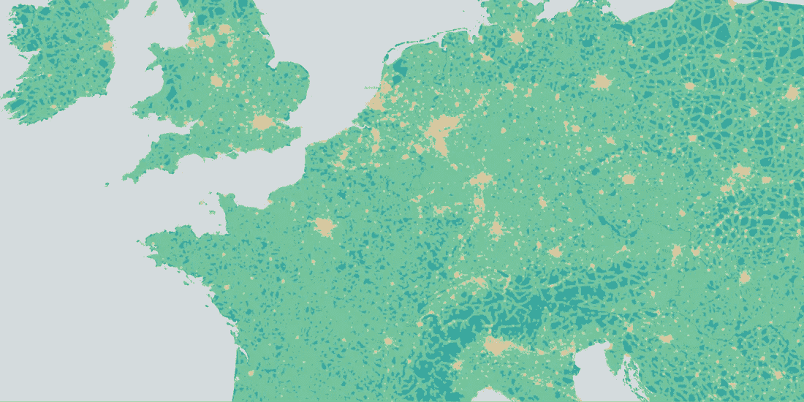
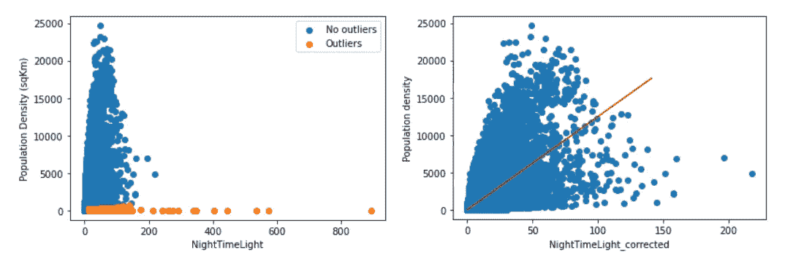
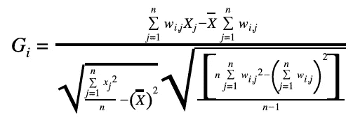
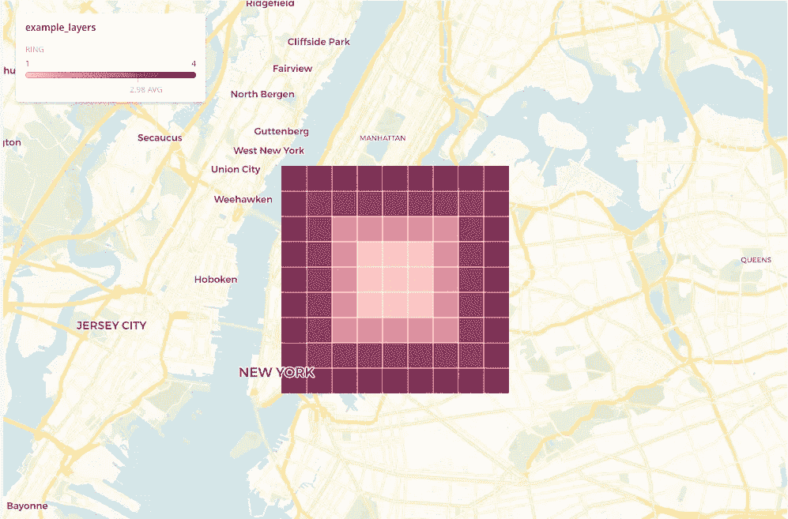
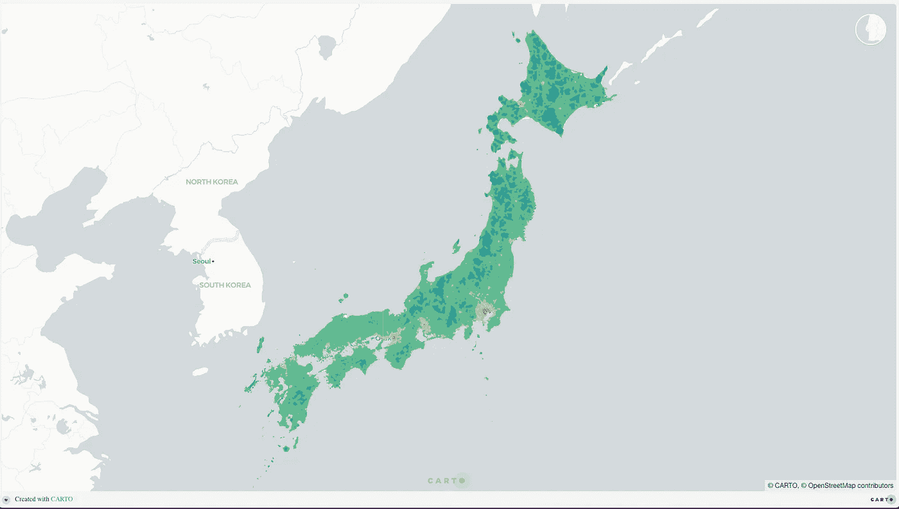
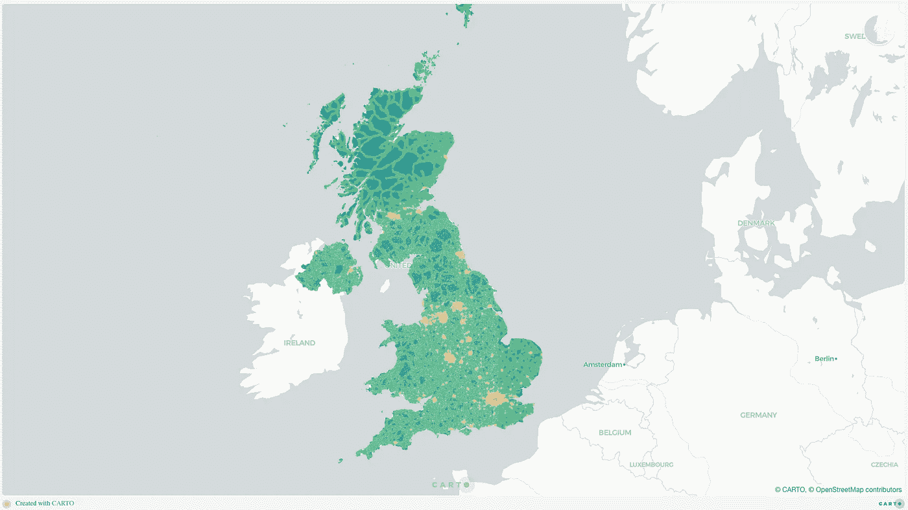
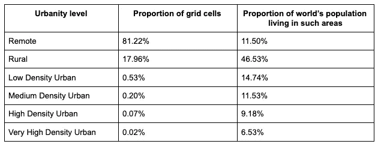
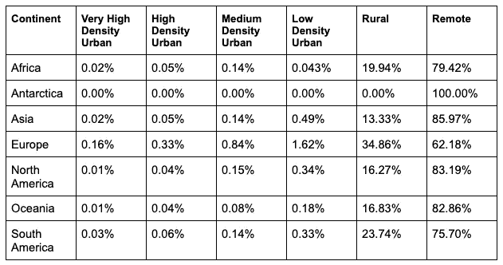
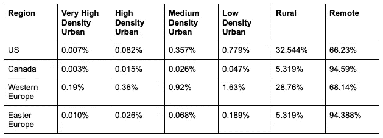
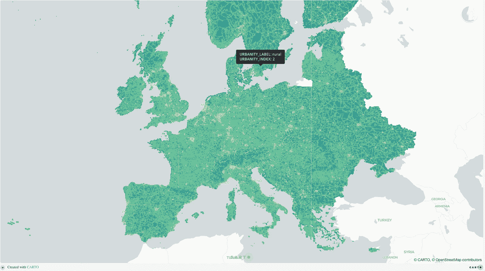

# 构建空间模型对全球城市化水平进行分类

> 原文：<https://towardsdatascience.com/building-a-spatial-model-to-classify-global-urbanity-levels-e2fb9da7252?source=collection_archive---------36----------------------->

作者图片

私营和公共部门的决策者正试图理解我们对城市地区的快速变化的使用。我们购物和旅行的方式；我们对生活空间的期望以及我们去办公室的频率(在许多情况下)已经永远改变了——衡量新冠肺炎引起的剧烈变化是否是永久性的，将是企业和政府根据消费者和公民需求制定计划的关键。

举个例子，在美国，有很多关于人们离开城市的宣传，然而(根据美国人口普查局的数据)84%的搬家者仍然住在同一个城市区域；7.5%停留在同一状态；6%的人留在排名前 50 的大都市地区，只有 0.28%的人完全离开了大都市/微型地区。那么，我们如何监测这些趋势，衡量我们在全球看到的新的和不断变化的城市化水平呢？

在这个项目中，我们设计了一个空间模型，它能够以高粒度对全球城市化水平进行分类。作为我们模型的目标地理支持，我们选择了级别 15 中的四键格网，它在赤道上有大约 1x1 公里的像元。

了解如何根据城市化类型对区域进行分类，综合一个国家的人口密度和城市基础设施(道路、灯光)如何变化的信息，在位置智能领域有多种应用。例如，这可以支持物流和快速商务公司优化其供应链运营，或帮助电信公司更好地规划其网络的部署，并根据城市化水平调整蜂窝密度。零售和 CPG 公司也可以根据其商店所在区域的类型来分析其业绩并计算其目标市场。

有几个数据集提供了只关注特定国家的城市化分类，例如由[geoly tix](https://geolytix.com/)([geoly tix GeoData Urbanity 用户指南 2020](https://drive.google.com/file/d/1KNfHDRbkEGkWuSj_mRHOIeiS5oKsBnpO/view) )和 A.Alexiou 等人开展的工作。英国的 al ( [来源](https://core.ac.uk/download/pdf/161817582.pdf))和西班牙的 unica 360([来源](https://carto.com/spatial-data-catalog/browser/dataset/u360_urbanity_20c87ad7/))。然而，试图遵循一种共同的方法在全球一级建立这种分类似乎不太常见。与我们在本项目中的目标仅在一定程度上相似的全球数据集是来自 [OpenStreetMap](https://wiki.openstreetmap.org/wiki/Key:landuse) 的土地利用分类，以及几个基于卫星的土地覆盖数据产品，如 [MODIS 土地覆盖气候建模网格(CMG)](https://lpdaac.usgs.gov/products/mcd12c1v006/) 和欧洲的 [CORINE 土地覆盖](https://land.copernicus.eu/pan-european/corine-land-cover)。

在本文中，我们将介绍我们为构建空间模型而设计的输入数据和方法，展示一些结果和关键指标。

# 输入数据

对于该模型，我们需要全球可用的高粒度数据集。这包括:

*   人口镶嵌图( [WorldPop](https://www.worldpop.org/) ):全球人口数字被投影到一个网格中，网格大小为 1x1 公里。这些数据也可以通过 [CARTO 的数据观测站](https://carto.com/spatial-data-catalog/browser/?provider=worldpop)公开获得。
*   夜间灯光([科罗拉多矿业学院](https://eogdata.mines.edu/products/vnl/)):由每月无云平均辐射网格产生的年度全球 VIIRS 夜间灯光的处理时间序列。图像分辨率为 15 角秒，赤道处约为 500x500m 米。
*   道路网络( [OpenStreetMap](https://www.openstreetmap.org/about) ): OSM 提供每个国家的主要道路网络基础设施，以及不同路段的分类。在这项研究中，我们只考虑了一级公路、二级公路、高速公路和主干道(我们发现这些道路在不同国家之间更加一致和可用)。

选择这些数据集背后的基本原理是，夜间灯光和人口数据能够区分城市化地区和农村/偏远地区。几项研究已经检验了这些特征之间的关系，结果是它们彼此非常相关。随着人口的增加，光数据的强度也增加。除了人口之外，使用夜间照明数据的原因是为了更好地覆盖城市中人口突然减少的区域(例如，城市中的大公园)。

然后，我们使用关于道路网络基础设施的数据来区分可到达的区域和孤立的区域。

按作者分类的地图

# 都市课程

对于这个项目，我们决定考虑 6 个不同的等级或城市化水平，如下所述。分类是在国家级别完成的，这使我们可以单独为每个国家运行分类模型。这是一个重要的考虑因素，主要是因为各国城市地区的结构及其对人口密度分布的影响差异很大；例如，如果我们将美国的纽约市或印度的孟买等城市地区与荷兰的阿姆斯特丹相比，它们在结构上是不同的，特别是如果我们考虑人口密度，而它们都是相应国家的城市地区。

*   第 1 类—偏远地区:没有人口或人口非常少且不容易通过主要道路网络到达的地区。
*   第 2 类——农村:人口非常少，但可以通过主要道路基础设施进入的区域。由于“1 级-偏远地区”更容易进入，因此该分类与“1 级-偏远地区”有很大不同，但该分类与土地的农业用途无关。
*   第 3 类—低密度城市:人口相对稀少的地区，中小型城镇。
*   第 4 类—中等密度城市:人口密集区和夜间灯光数据，大多数大中城市，或大城市郊区。
*   第 5 类—高密度城市:人口密集区和夜间照明数据。大城市，进口城市的中心；
*   第 6 类——非常高密度的城市:大都市地区，每个国家的主要城市的中心，人口非常密集的地区。

# 方法学

因为我们希望我们的结果数据集聚集在四键网格上，因为它是一个标准的地理支持系统；我们首先需要将输入数据集转换成该格网规范。为此，我们使用了 Google BigQuery 的 [CARTO 空间扩展中的一些四键功能。我们将 Worldpop 人口数据转换为每个四键单元的人口密度。对于夜间光线数据，我们基于不同像素和目标网格单元之间的相交区域来丰富四键网格。对于道路网络数据，我们计算每个目标像元内每种道路段的总长度。](https://carto.com/blog/enhancing-geospatial-in-bigquery-with-carto-spatial-extension/)

我们发现夜间照明数据需要进行预处理，以便为我们的用例做好准备，因为我们在电厂和河流三角洲等与人口密度无关的区域发现了一系列具有高光强度值的异常值。用于检测此类异常值的方法如下:

*   使用标准化夜间光线数据和人口密度，按照高斯混合模型(GMM) [4]进行聚类(有 8 个聚类)；
*   找出偏离高光和高种群密度基本规则的集群，我们将其标记为“离群值”；
*   从“非异常值”中建立人口密度和人口密度空间滞后的模型(即三次多项式回归)；
*   使用之前的模型对异常区域进行插值。

我们对夜间照明数据进行校正的结果示例如下:

异常值校正示例，左:原始夜间光照与人口密度，右:校正后夜间光照与人口密度

然后，一旦我们在目标地理支持系统中预处理和聚集了所有输入数据，我们就将夜间光线数据和人口密度数据结合起来，以便创建一个涵盖这两种特征的索引。然后我们用这个指数来代表“城市性”。这是使用[主成分分析(PCA)](https://en.wikipedia.org/wiki/Principal_component_analysis) 完成的，只有一个成分；因此，为每个区域创建一个“索引”。这样，对于一个区域，如果人口密度或光强度呈现高值，那么指数也将具有高值。这是基于两篇论文(“香港夜间影像与人口密度之间的关系”&”[夜间灯光数据:经济活动的良好替代措施？](https://journals.plos.org/plosone/article?id=10.1371/journal.pone.0139779)”)，其中作者陈述了夜间光数据和人口密度是相关的。

由于我们使用高分辨率格网，但我们还希望确保分类的连续性，并避免相邻区域城市化水平的剧烈变化(例如，由于相邻像元中人口密度的巨大变化)，因此我们需要一种方法来包含空间相关性。例如，我们不希望仅仅因为城市中心的公园的人口和光照强度低于相邻像元，就将其归类为乡村或低密度。

因此，在生成索引后，所有像元的盖蒂斯-Ord 统计量都是使用两层区域作为相邻像元来计算的，如下图所示。现在的目标是生成一个考虑到每个格网像元周围区域的 Z 分值。

网格中最多 4 层相邻层的图示

产生的 Z 得分用作聚类算法(即 KMeans)的输入，其中使用了 6 个不同的聚类，与我们希望作为项目结果获得的城市化水平等级的数量相同。平均人口密度最低的集群位于偏远地区，第二低的集群被归类为农村，依此类推。

下一步，我们将使用每个像元中所有道路长度的 Z 值(即 GetisOrd 统计值，如上所述)进一步对生成的偏远地区和农村地区进行聚类。这次我们用 4 层相邻像元计算 Z 值(见上图)。然后，我们将道路长度最短的聚类标记为偏远地区，其余的标记为农村地区。

在该过程的最后，我们对标签进行最后的细化，以便校正一些伪单元，这些伪单元与它们的所有第一层邻居相比具有不同的标签。对于每个像元，将检查相邻像元的标注，如果所有像元都是相同的城市化等级，但对于目标像元却不同，则目标像元的标注将更改为其周围像元的标注。

# 结果

在下面的地图中，我们展示了几个示例性国家的城市化模型的结果。值得注意的是，为了构建这些可视化，考虑到数据量，我们使用了 [CARTO 的 BigQuery Tiler](https://carto.com/blog/announcing-carto-bigquery-tiler-general-availability/) 。

作者图片

[*日本地图*](https://public.carto.com/viewer/user/public/bigquery?config=eyJpbml0aWFsVmlld1N0YXRlIjp7ImxhdGl0dWRlIjozNy40MDk1OTg2ODIyMjc4NCwibG9uZ2l0dWRlIjoxMzguMDg3Mjg5Mzc4NjU4NSwiem9vbSI6NiwicGl0Y2giOjAsImJlYXJpbmciOjAsImRyYWdSb3RhdGUiOmZhbHNlLCJ3aWR0aCI6ODY0LCJoZWlnaHQiOjc3MywiYWx0aXR1ZGUiOjEuNSwibWF4Wm9vbSI6MjAsIm1pblpvb20iOjAsIm1heFBpdGNoIjo2MCwibWluUGl0Y2giOjAsInRyYW5zaXRpb25EdXJhdGlvbiI6MCwidHJhbnNpdGlvbkludGVycnVwdGlvbiI6MX0sInZpZXdzIjpbeyJAQHR5cGUiOiJNYXBWaWV3IiwiY29udHJvbGxlciI6dHJ1ZX1dLCJsYXllcnMiOlt7IkBAdHlwZSI6IkNhcnRvQlFUaWxlckxheWVyIiwiZGF0YSI6ImNhcnRvZGItb24tZ2NwLWRhdGFzY2llbmNlLlRpbGVzZXRzX2Jsb2cuanBudXJiYW5pdHlfejE1X3RpbGVzZXRfYmxvZyIsImNyZWRlbnRpYWxzIjp7InVzZXJuYW1lIjoicHVibGljIiwiYXBpS2V5IjoiZGVmYXVsdF9wdWJsaWMifSwiZ2V0RmlsbENvbG9yIjp7IkBAZnVuY3Rpb24iOiJjb2xvckNhdGVnb3JpZXMiLCJhdHRyIjoidXJiYW5pdHkiLCJkb21haW4iOlsicmVtb3RlIiwicnVyYWwiLCJMb3dfZGVuc2l0eV91cmJhbiIsIk1lZGl1bV9kZW5zaXR5X3VyYmFuIiwiSGlnaF9kZW5zaXR5X3VyYmFuIiwiVmVyeV9IaWdoX2RlbnNpdHlfdXJiYW4iXSwiY29sb3JzIjoiVGVtcHMifSwib3BhY2l0eSI6MC44LCJwb2ludFJhZGl1c01pblBpeGVscyI6Miwic3Ryb2tlZCI6ZmFsc2UsImxpbmVXaWR0aE1pblBpeGVscyI6MC4xLCJnZXRMaW5lQ29sb3IiOlsyNTUsMjU1LDI1NV0sInBpY2thYmxlIjp0cnVlLCJiaW5hcnkiOnRydWV9XX0%3D&embed=true)

作者图片

[*西班牙的地图*](https://public.carto.com/viewer/user/public/bigquery?config=eyJpbml0aWFsVmlld1N0YXRlIjp7ImxhdGl0dWRlIjo0MC4yODk4MDgxMzcxNDI2NywibG9uZ2l0dWRlIjotMy42MzU1ODk3MzcxMDYyOTU1LCJ6b29tIjo2LCJwaXRjaCI6MCwiYmVhcmluZyI6MCwiZHJhZ1JvdGF0ZSI6ZmFsc2UsIndpZHRoIjo4NjQsImhlaWdodCI6NzczfSwidmlld3MiOlt7IkBAdHlwZSI6Ik1hcFZpZXciLCJjb250cm9sbGVyIjp0cnVlfV0sImxheWVycyI6W3siQEB0eXBlIjoiQ2FydG9CUVRpbGVyTGF5ZXIiLCJkYXRhIjoiY2FydG9kYi1vbi1nY3AtZGF0YXNjaWVuY2UuVGlsZXNldHNfYmxvZy5lc3B1cmJhbml0eV96MTVfdGlsZXNldF9ibG9nIiwiY3JlZGVudGlhbHMiOnsidXNlcm5hbWUiOiJwdWJsaWMiLCJhcGlLZXkiOiJkZWZhdWx0X3B1YmxpYyJ9LCJnZXRGaWxsQ29sb3IiOnsiQEBmdW5jdGlvbiI6ImNvbG9yQ2F0ZWdvcmllcyIsImF0dHIiOiJ1cmJhbml0eSIsImRvbWFpbiI6WyJyZW1vdGUiLCJydXJhbCIsIkxvd19kZW5zaXR5X3VyYmFuIiwiTWVkaXVtX2RlbnNpdHlfdXJiYW4iLCJIaWdoX2RlbnNpdHlfdXJiYW4iLCJWZXJ5X0hpZ2hfZGVuc2l0eV91cmJhbiJdLCJjb2xvcnMiOiJUZW1wcyJ9LCJvcGFjaXR5IjowLjgsInBvaW50UmFkaXVzTWluUGl4ZWxzIjoyLCJzdHJva2VkIjpmYWxzZSwibGluZVdpZHRoTWluUGl4ZWxzIjowLjEsImdldExpbmVDb2xvciI6WzI1NSwyNTUsMjU1XSwicGlja2FibGUiOnRydWUsImJpbmFyeSI6dHJ1ZX1dfQ%3D%3D&embed=true)

作者图片

[*英国的地图*](https://public.carto.com/viewer/user/public/bigquery?config=eyJpbml0aWFsVmlld1N0YXRlIjp7ImxhdGl0dWRlIjo1NC4zNDQ5ODA5MjIwNzIyMjQsImxvbmdpdHVkZSI6LTIuOTkxMTk1NzMxNjUwMzk5LCJ6b29tIjo1LjUsInBpdGNoIjowLCJiZWFyaW5nIjowLCJkcmFnUm90YXRlIjpmYWxzZSwid2lkdGgiOjg2NCwiaGVpZ2h0Ijo3NzN9LCJ2aWV3cyI6W3siQEB0eXBlIjoiTWFwVmlldyIsImNvbnRyb2xsZXIiOnRydWV9XSwibGF5ZXJzIjpbeyJAQHR5cGUiOiJDYXJ0b0JRVGlsZXJMYXllciIsImRhdGEiOiJjYXJ0b2RiLW9uLWdjcC1kYXRhc2NpZW5jZS5UaWxlc2V0c19ibG9nLmdicnVyYmFuaXR5X3oxNV90aWxlc2V0X2Jsb2cyIiwiY3JlZGVudGlhbHMiOnsidXNlcm5hbWUiOiJwdWJsaWMiLCJhcGlLZXkiOiJkZWZhdWx0X3B1YmxpYyJ9LCJnZXRGaWxsQ29sb3IiOnsiQEBmdW5jdGlvbiI6ImNvbG9yQ2F0ZWdvcmllcyIsImF0dHIiOiJ1cmJhbml0eSIsImRvbWFpbiI6WyJyZW1vdGUiLCJydXJhbCIsIkxvd19kZW5zaXR5X3VyYmFuIiwiTWVkaXVtX2RlbnNpdHlfdXJiYW4iLCJIaWdoX2RlbnNpdHlfdXJiYW4iLCJWZXJ5X0hpZ2hfZGVuc2l0eV91cmJhbiJdLCJjb2xvcnMiOiJUZW1wcyJ9LCJvcGFjaXR5IjowLjgsInBvaW50UmFkaXVzTWluUGl4ZWxzIjoyLCJzdHJva2VkIjpmYWxzZSwibGluZVdpZHRoTWluUGl4ZWxzIjowLjIsImdldExpbmVDb2xvciI6WzI1NSwyNTUsMjU1XSwicGlja2FibGUiOnRydWUsImJpbmFyeSI6dHJ1ZX1dfQ%3D%3D&embed=true)

我们在 251 个国家运行该模型，遵循在[ISO 3166–1 Alpha-3](https://en.wikipedia.org/wiki/ISO_3166-1_alpha-3)中定义的国家代码。下面的表格总结了在不同城市化水平下划分的网格单元百分比的一些结果。可以看出，全球 42%的人口至少居住在低密度城市地区。大多数人口生活在农村地区。这主要是因为中国、俄罗斯等大国的人口分布。

从各大洲不同的城市化水平来看，我们发现亚洲和北美的偏远地区比例最大，这主要是因为俄罗斯和加拿大的北部地区不适合居住。欧洲似乎在更高密度的城市化水平中具有更大百分比的细胞。

仔细观察某些地区，西欧似乎是高密度城市化地区比例较高的地区；加拿大和东欧被列为偏远地区的比例较高。

在下面的可视化中，您可以探索我们的模型在欧洲所有国家的结果，再次展示我们的 BigQuery Tiler 在使用大量数据构建可视化方面的能力。

作者图片

[*欧洲地图*](https://public.carto.com/viewer/user/public/bigquery?config=eyJpbml0aWFsVmlld1N0YXRlIjp7ImxhdGl0dWRlIjo0OS42NzQ2MjM4Nzk2NDQzNSwibG9uZ2l0dWRlIjoxMC43NTE2NDA4ODY4NDc4NDEsInpvb20iOjMuNzk0OTg1MzU3NjMxOTc0LCJwaXRjaCI6MCwiYmVhcmluZyI6MCwiZHJhZ1JvdGF0ZSI6ZmFsc2UsIndpZHRoIjo4NjQsImhlaWdodCI6NzczLCJhbHRpdHVkZSI6MS41LCJtYXhab29tIjoyMCwibWluWm9vbSI6MCwibWF4UGl0Y2giOjYwLCJtaW5QaXRjaCI6MCwidHJhbnNpdGlvbkR1cmF0aW9uIjowLCJ0cmFuc2l0aW9uSW50ZXJydXB0aW9uIjoxfSwidmlld3MiOlt7IkBAdHlwZSI6Ik1hcFZpZXciLCJjb250cm9sbGVyIjp0cnVlfV0sImxheWVycyI6W3siQEB0eXBlIjoiQ2FydG9CUVRpbGVyTGF5ZXIiLCJkYXRhIjoiY2FydG9kYi1vbi1nY3AtZGF0YXNjaWVuY2UuVGlsZXNldHNfYmxvZy5ldXJvcGV1cmJhbml0eV96MTVfdGlsZXNldF9ibG9nMyIsImNyZWRlbnRpYWxzIjp7InVzZXJuYW1lIjoicHVibGljIiwiYXBpS2V5IjoiZGVmYXVsdF9wdWJsaWMifSwiZ2V0RmlsbENvbG9yIjp7IkBAZnVuY3Rpb24iOiJjb2xvckNhdGVnb3JpZXMiLCJhdHRyIjoidXJiYW5pdHlfbGFiZWwiLCJkb21haW4iOlsicmVtb3RlIiwicnVyYWwiLCJMb3dfZGVuc2l0eV91cmJhbiIsIk1lZGl1bV9kZW5zaXR5X3VyYmFuIiwiSGlnaF9kZW5zaXR5X3VyYmFuIiwiVmVyeV9IaWdoX2RlbnNpdHlfdXJiYW4iXSwiY29sb3JzIjoiVGVtcHMifSwicG9pbnRSYWRpdXNNaW5QaXhlbHMiOjIsInN0cm9rZWQiOmZhbHNlLCJsaW5lV2lkdGhNaW5QaXhlbHMiOjAuMiwib3BhY2l0eSI6MC43LCJnZXRMaW5lQ29sb3IiOlsyNTUsMjU1LDI1NV0sInBpY2thYmxlIjp0cnVlLCJiaW5hcnkiOnRydWV9XX0%3D&embed=true)

# 即将在 CARTO 空间要素中提供

2020 年末，CARTO 推出了我们的第一个衍生数据产品，名为“ [CARTO 空间特征](https://carto.com/blog/spatial-features-new-derived-dataset-from-carto/)”。该数据集旨在使数据科学家能够创建空间模型，以标准化格式提供一组覆盖全球的空间要素。在接下来的几周内，我们将发布新版本的空间要素数据，其中我们将城市化水平作为新的可用要素之一。

*原载于 2021 年 6 月 10 日 https://carto.com**[*。*](https://carto.com/blog/building-spatial-model-classify-global-urbanity-levels/)*