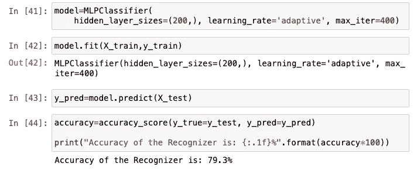

# 用 Python 构建语音情感识别器

> 原文：<https://towardsdatascience.com/building-a-speech-emotion-recognizer-using-python-4c1c7c89d713?source=collection_archive---------15----------------------->

## 用 MLP 人工神经网络逐步指导语音情感识别


Unsplash 上 [Soundtrap](https://unsplash.com/@soundtrap?utm_source=unsplash&utm_medium=referral&utm_content=creditCopyText) 拍摄的照片

在这篇文章中，我将向你展示如何从预先录制的录音中识别不同的情绪。我们知道，语音控制的个人助理，如亚马逊 Alexa、苹果 Siri 和谷歌助理等，已经变得更加强大，并且仍在不断发展。我们开始看到它们被集成到手机、笔记本电脑、厨房用具、汽车中，基本上在我们日常使用的任何东西上。我认为易用性是这个领域发展壮大的主要因素。

当我发现 Kaggle 上使用 *RAVDESS* 情感语音音频数据集的语音情感识别项目时，我决定自己动手，然后作为书面教程分享。我认为这是一个令人兴奋和有趣的项目。随着我们使用更多的语音控制设备，我相信情感识别将在未来几年成为这些设备的一部分。这些设备背后的人工智能将足够智能，能够理解我们对它们说话时的情绪，并给出更个性化的回应。

例如，在上路之前，我要求 Siri“从音乐应用程序播放音乐”，然后它就开始播放我的 broad mix。但是想象一下，如果我们在命令中加入情感识别能力。这样，它会根据我的心情播放各种音乐。许多音乐应用程序已经给出了不同需求的类别，那么为什么不通过一个简单的“播放音乐”命令来播放这些音乐呢？

我喜欢从事像这样的与语音识别相关的项目。我已经发表了一些与这个话题相关的文章。我会在本文末尾添加它们。如果你想在这个领域有所发展，请随意查阅。

如果你准备好了，让我们开始工作吧。这是我们将在本文中遵循的结构。

## 目录

*   *第一步——库*
*   *步骤 2——了解 RAVDESS 数据*
*   *步骤 3 —从录音中提取特征*
*   *步骤 4 —加载并准备数据*
*   *最后一步——MLP 分类器预测模型*
*   *结论*

# 步骤 1 —库

首先，让我们安装我们需要的库。我们可以使用 PIP install，这是一个 python 库管理工具。我们可以在一行中安装多个库，如下所示:

```
pip install soundfile librosa numpy sklearn
```

安装过程完成后，我们可以继续打开一个新的文本编辑器。我在大部分项目中使用 Jupyter Notebook，它在机器学习和数据科学项目中非常好用。

然后，我将导入我们在这个项目中需要的模块。我们可以在导入后使用“as”来重命名库。这使得它们更容易调用和使用。

```
import librosa as lb
import soundfile as sf
import numpy as np
import os, glob, picklefrom sklearn.model_selection import train_test_split
from sklearn.neural_network import MLPClassifier
from sklearn.metrics import accuracy_score
```

我将为每个库添加官方文档页面以供参考。这是了解更多模块及其使用方法的好地方:

*   [Librosa](https://librosa.org/doc/latest/index.html)
*   [声音文件](https://pypi.org/project/SoundFile/)
*   [NumPy](https://numpy.org/install/)
*   [Scikit-Learn](https://scikit-learn.org/stable/getting_started.html) (Sklearn)

# 步骤 2—了解 RAVDESS 数据

让我先分享一下 RAVDESS 代表什么*瑞尔森情感语音和歌曲视听资料库*。这是一个大型数据集将音频和视频数据库。该数据的原始大小约为 24Gb。但是我们将使用它的一小部分，而不是整个数据集。这将有助于我们保持专注，更快地训练我们的模型，并保持事情简单。数据集的一小部分可以在 Kaggle 上的[这里](https://www.kaggle.com/uwrfkaggler/ravdess-emotional-speech-audio)找到。

## **关于数据的一点背景信息**

RAVDESS 的这一部分包含 1440 个文件:每个演员 60 次审判 x 24 个演员= 1440。该数据包含 24 名职业演员:12 名女性和 12 名男性。言语情绪包括平静、快乐、悲伤、愤怒、恐惧、惊讶和厌恶的表情。你可以在 Kaggle 网站上了解更多信息。

文件名按照特定的模式重命名。这个模式由 7 部分组成。这些部分分为以下几个部分:情态，声道，情感，情感强度，陈述，重复，演员。每个信息也有它的子部分。所有这些信息都有标签；你可以在 Kaggle 网站上找到更多关于这些的信息。

以下是数据集中 Actor_1 文件夹的屏幕截图:


作者图片

## **情感标签**

以下是情感类别的标签。我们将创建这个字典，以便在训练机器学习模型时使用。在标签之后，我们正在创建一个情绪列表，我们希望在这个项目中关注这些情绪。很难使用所有的情绪来做预测，因为讲话可能同时用多种情绪来听，这将影响我们的预测分数。这就是为什么我选择了三种主要情绪，快乐、悲伤和愤怒。随意尝试不同的情绪。

```
emotion_labels = {
  '01':'neutral',
  '02':'calm',
  '03':'happy',
  '04':'sad',
  '05':'angry',
  '06':'fearful',
  '07':'disgust',
  '08':'surprised'
} focused_emotion_labels = ['happy', 'sad', 'angry']
```

# 步骤 3—从录音中提取特征

在这一步，我们将定义一个函数。这个函数将提取音频记录，并使用 numpy hstack 方法将它们作为堆栈数组按顺序水平返回。

音频文件有许多功能。其中一些是 MFCC，色度和梅尔。[这里的](/how-i-understood-what-features-to-consider-while-training-audio-files-eedfb6e9002b)是 Joel 写的一篇好文章，发表在 TDS publication 上。我喜欢作者解释每个音频特性在训练模型时如何产生影响的方式。

```
def audio_features(file_title, mfcc, chroma, mel):
    with sf.SoundFile(file_title) as audio_recording:
        audio = audio_recording.read(dtype="float32")
        sample_rate = audio_recording.samplerate

        if chroma:
            stft=np.abs(lb.stft(audio))
            result=np.array([])
        if mfcc:
            mfccs=np.mean(lb.feature.mfcc(y=audio, sr=sample_rate, n_mfcc=40).T, axis=0)
            result=np.hstack((result, mfccs))
        if chroma:
            chroma=np.mean(lb.feature.chroma_stft(S=stft, sr=sample_rate).T,axis=0)
            result=np.hstack((result, chroma))
        if mel:
            mel=np.mean(lb.feature.melspectrogram(audio, sr=sample_rate).T,axis=0)
            result=np.hstack((result, mel))
        return result
```

# 步骤 4 —加载和准备数据

在这一步中，我们将定义一个函数来加载数据集。首先，我们加载数据，然后使用上一步中定义的函数提取特征。在提取特征的同时，我们给特征加上情感标签。你可以把特征想象成我们的输入(x)，把被标记的情感想象成输出(y)。这是一个众所周知的机器学习模型，也被称为*监督学习*。

然后，我们将使用 *train_test_split()* 函数分割已标记的数据集。这是 Scikit-learn 模块的一个众所周知的拆分功能。它将数据集分成四个块。我们可以定义数据集的多少用于训练，多少用于测试。您可以调整这些值，看看它如何影响预测。没有放之四海而皆准的规则；这通常取决于数据集。但是在大多数情况下，应用 0.25 的测试大小。这意味着数据集的 3/4 用于训练，1/4 用于测试。

```
def loading_audio_data():
    x = []
    y = [] for file in glob.glob("data//Actor_*//*.wav"): file_path=os.path.basename(file)
        emotion = emotion_labels[file_path.split("-")[2]] if emotion not in focused_emotion_labels:
            continue
        feature = audio_features(file, mfcc=True, chroma=True, mel=True)

        x.append(feature)
        y.append(emotion) final_dataset = train_test_split(np.array(x), y, test_size=0.1, random_state=9) return final_dataset
```

# 最后一步— MLP 分类器预测模型

我们差不多完成了。这是最后一步，将开始调用我们之前定义的函数，并从语音音频记录中识别情绪。

## **加载并拆分数据**

让我们从运行 *loading_audio_data()* 函数开始。这个函数将返回四个列表。也就是说，我们将为每个列表使用四个不同的变量，顺序很重要。您应该熟悉这种拆分方法，尤其是如果您正在处理机器学习项目。

```
X_train, X_test, y_train, y_test = loading_audio_data()
```

## **定义模型**

MLP 分类器是多层感知器分类器。它使用神经网络模型，通过有限记忆 BFGS 或随机梯度下降来优化对数损失函数。

[这里的](https://scikit-learn.org/stable/modules/generated/sklearn.neural_network.MLPClassifier.html)是 MLP 分类器模型的官方文档页面。您可以了解更多有关其参数以及它们如何影响训练过程的信息。

```
model = MLPClassifier(hidden_layer_sizes=(200,), learning_rate='adaptive', max_iter=400)
```

## 拟合模型

```
model.fit(X_train,y_train)
```

## 模型预测准确度分数

在我们的模型拟合之后，我们可以进入预测步骤。我们将把预测值赋给一个名为 *y_pred* 的新变量。这样，我们就可以计算预测的准确度分数。精度得分函数检查有多少预测值与原始标注数据相匹配。下面是代码，我将在它下面添加一个结果截图。

```
y_pred = model.predict(X_test)accuracy = accuracy_score(y_true=y_test, y_pred=y_pred)print("Accuracy of the Recognizer is: {:.1f}%".format(accuracy*100))
```



作者图片

# 结论

我们的准确率是 79.3，这是非常令人印象深刻的。我一般都是多次拟合模型后得到一个差不多的分数。我确实认为，对于通过录音训练的情感识别模型来说，这是一个令人满意的分数。感谢机器学习和人工智能模型开发者。

恭喜你。我们使用 python 创建了一个语音情感识别器。正如我前面提到的，这个领域发展如此迅速，越来越成为我们日常生活的一部分。这些类型的项目将帮助你找到新的想法来实施。如果你今天学到了新东西，我很高兴。从事动手编程项目是提高编码技能的最佳方式。如果您在执行代码时有任何问题，请随时[联系我](https://sonsuzdesign.blog)。我尽最大努力回复大家。

> 我们来连线。查看我的[博客](https://medium.com/@lifexplorer)和 [youtube](https://www.youtube.com/behicguven) 来获得灵感。谢谢你，

## 更多语音识别相关的机器学习项目

[](/extracting-speech-from-video-using-python-f0ec7e312d38) [## 使用 Python 从视频中提取语音

### 使用 Google 语音识别 API 的简单实用项目

towardsdatascience.com](/extracting-speech-from-video-using-python-f0ec7e312d38) [](/speech-recognition-using-ibms-speech-to-text-api-9956254c46d4) [## 使用 IBM 的语音到文本 API 的语音识别

### 使用 Python 从音频记录中轻松提取对话

towardsdatascience.com](/speech-recognition-using-ibms-speech-to-text-api-9956254c46d4) 

*本文提到的 RAVDESS* *数据集参考资料:Livingstone & Russo 的《Ryerson 情感语音和歌曲视听数据库(RAVDESS)》在 CC BY-NA-SC 4.0 下授权。*