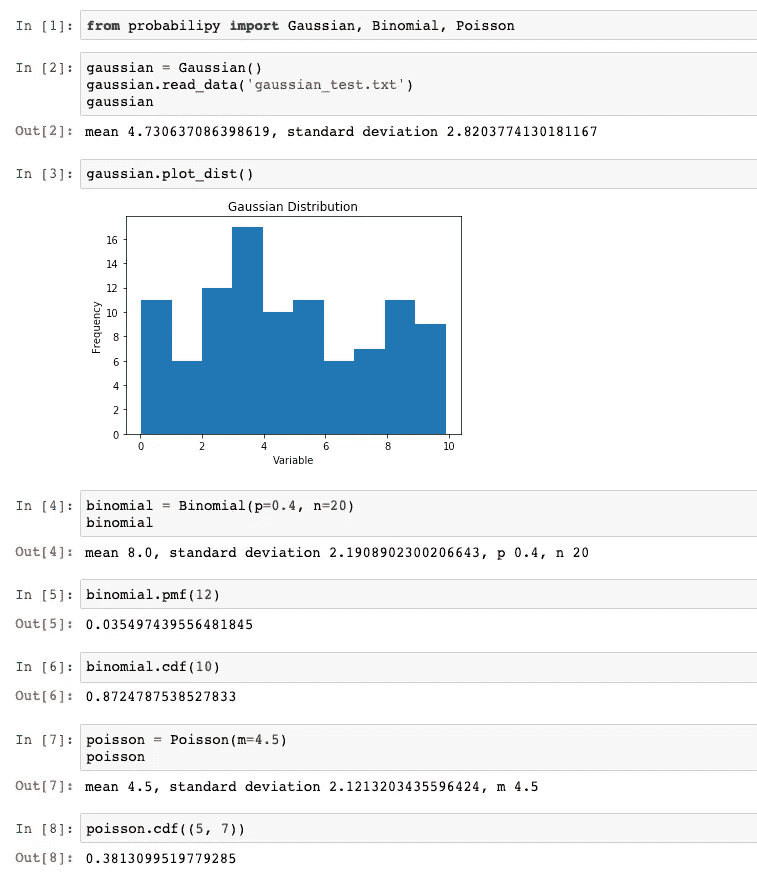

# 从头开始构建统计分析包

> 原文：<https://towardsdatascience.com/building-a-statistical-analysis-package-from-scratch-7e9ba0508a53?source=collection_archive---------37----------------------->

## Python 中的面向对象编程


詹姆斯·哈里逊在 [Unsplash](https://unsplash.com?utm_source=medium&utm_medium=referral) 上拍摄的照片

Pandas、NumPy 和 scikit-learn 都是数据科学工具包的重要组成部分。如果您在一个以数据为中心的项目中使用过 Python，那么您可能会熟悉如何使用至少一个(如果不是全部三个)上述包。

然而，您可能不太熟悉这些包在后端如何工作的细节:所谓的“幕后”机制。

本文将介绍从头构建 Python 包的过程，以提供一些指导，说明我们每天使用的工具中有多少实际上可以工作，以及如何使用面向对象编程(OOP)来创建新的工具。

作为一个演示工具，我们的目标是构建一个简单的统计分析包，我们称之为**概率**。一旦完成，我们的包应该能够从数据文件中创建随机变量的实例，以执行诸如输出统计属性、绘制分布和计算概率等操作。

使用面向对象的方法将允许我们编写模块，这些模块可以将来自推断统计理论的多种分布模型应用于不同形式的数据集。

建造过程将遵循三个主要步骤:

1.  我们将从为包的类编写模块化的基本代码开始:我们的包最终将执行的操作的关键
2.  然后，我们将在一个虚拟的本地环境中安装这个包，并运行一些单元测试来确保它能够工作
3.  最后，我们将把这个包上传到 PyPI，让它可以公开使用

# 第一步:编写模块化的基础代码

OOP 概念背后的基本思想是将代码组织成“对象”:以属性形式存储数据并执行操作以产生输出的字段。

在 Python 中，这转化为将代码编写到类中，我们最终可以将数据读入这些类，并调用的方法来完成期望的目标。

在我们示例的上下文中，每个分布模型将被编程为一个单独的对象，这意味着我们的包将能够处理的高斯、二项式和泊松分布都需要一个类。

术语“模块化代码”是指将代码组织成单独的文件(模块)，然后这些文件可以一起存储在一个目录中。这种方法的好处是使代码更容易管理、维护和最终共享。

在我们深入编程的具体细节之前，让我们先来看看 OOP 的另一个支柱:*继承*。

继承是指创建一个支配性的“父”对象(或多个对象)，然后单个“子”对象可以从该对象继承属性和方法。

这本质上是一种创建多个具有相似性的对象的方法，而不必一遍又一遍地重复代码。

记住这一点，作为我们的包的第一个对象，让我们创建一个通用的分发父类，我们的单个分发模型将能够继承它。

## 一般分发类别(父对象)

```
class Distribution():

    def __init__(self, mu=0, sigma=1):

        """Generic distribution class for analysing a probability distribution.

        Attributes:
            mean (float) representing the mean value of the distribution
            stdev (float) representing the standard deviation of the distribution
            data_list (list of floats) a list of floats extracted from the data file
        """

        self.mean = mu
        self.stdev = sigma
        self.data = []
```

每个对象的第一个方法应该是 instantiate ( `__init__()`)函数:这个函数定义了创建对象实例的过程。

我们的父 distribution 类的 instantiate 方法将被后续的子类继承，并将创建实例，其分布的*均值*和*标准差*的属性分别设置为默认值 0 和 1，以及一个空的*数据*属性。

不熟悉 OOP 的读者可能会对包含一个 *self* 参数感到困惑。这将是我们的包中每个方法的一个特性，本质上是用来引用对象在它自己的方法中的实例。例如，该方法中的`self.mean = mu`指示对象将自己的 *mean* 属性设置为 mu 的值。

请注意，该方法包含一个 docstring。在编写程序时，建议在每个函数/方法中包含一个 docstring，以便将来的用户和代码贡献者清楚每个组件是如何工作的。实例化函数的 docstring 应该描述对象的属性。

对于我们的通用分布类的下一个方法，让我们考虑我们的每个后续类应该共享的另一个函数:从文件读入数据的能力。因此，我们可以将它作为一个方法包含在父对象中。

```
def read_data(self, file_name):

        """Function to read in data from a .txt file.
        File should contain one float per line.

        Args:
            file_name (string): file to read data from

        Returns:
            None

        """

        with open(file_name) as file:
            data_list = []
            line = file.readline()
            while line:
                data_list.append(float(line))
                line = file.readline()
        file.close()

        self.data = data_list
        self.calculate_mean()
        self.calculate_stdev()
```

调用该方法将从指定文件中读取数据，并将其存储在对象的*数据*属性中。它还将计算所提供数据的平均值和标准差，并更新模型的其他属性。这些方法必须写在我们随后的子对象中，因为计算根据分布模型而不同。

注意，这个方法的 docstring 与第一个略有不同，因为它包含了用于 *Args* 和 *Returns* 的部分。这是为了描述应该提供给函数的参数(在这种情况下是要从中读取数据的文件的名称)，以及我们期望函数返回的内容(在这种情况下什么也不返回，因为该方法只更新对象的属性)。

这对我们的父对象中包含的方法来说应该足够了。遵循模块化编码的概念，我们可以将类作为一个名为`Generaldistribution.py` 的文件保存在一个名为`probabilipy/`的目录中，然后继续为我们各自的分布模型创建对象。

## 高斯、二项式和泊松分布类(子对象)

由于这些对象将包括执行诸如执行计算和绘制分布图等操作的方法，我们的第一步应该是导入几个包来帮助我们完成这些过程:即 [python-math](https://pypi.org/project/python-math/) 和 [matplotlib](https://pypi.org/project/matplotlib/) 。

*(更顽固的读者可能会在这里争辩说，使用预先存在的包与从头创建一个新包的概念相矛盾。然而，由于构建可视化绘图仪超出了本文的范围，我不得不在这方面做出一些让步。*

我们还需要导入我们的 General distribution 类，因为我们希望子对象继承它的特性。这突出了将我们包中的每个模块存储在同一个目录中的需要。

```
import math
import matplotlib.pyplot as plt
from .Generaldistribution import Distribution
```

我们现在可以开始编写我们的第一个分发模型了。如前所述，对象的第一个方法应该是实例化函数。

```
class Gaussian(Distribution):

    """Gaussian distribution class for analysing a Gaussian probability distribution.

    Attributes:
        mean (float) representing the mean value of the distribution
        stdev (float) representing the standard deviation of the distribution
        data_list (list of floats) a list of floats extracted from the data file
    """

    def __init__(self, mu=0, sigma=1):
        Distribution.__init__(self, mu, sigma)
```

我们可以在新类的开头指定这个对象是我们的通用分布类的后代。对于新对象的实例化函数，我们可以简单地使用父对象中定义的方法。

现在让我们开始编写特定于每个分布模型对象的方法。例如，在父对象中定义的`read_data()` 方法之后，可以调用下面的方法来计算所提供数据的平均值，并相应地更新对象的 *mean* 属性。

```
def calculate_mean(self):

        """Function to calculate the mean of the data set.

        Args:
            None

        Returns:
            float: mean of the data set

        """

        mean = float(sum(self.data)) / len(self.data)
        self.mean = mean
        return self.mean
```

我不会在本文中包含所有包的类的每个方法的代码，因为这样做会使阅读变得相当长(也许很费力)。然而，有兴趣探索全部代码的读者可以在我的 Github 的这个库中找到它。

一旦我们完成了每个高斯、二项式和泊松分布类的方法，我们就可以进入安装和测试步骤。

# 步骤二:在本地安装软件包并执行单元测试

## 设置

要在本地环境中安装我们的包，除了基本代码之外，我们还需要创建几个文件。

第一个是位于`probabilipy/`目录中的`__init__.py`文件。这实质上提供了关于在包的实例化时要执行的步骤的指令。如果这个文件只是空白，安装仍然可以工作，但是在这种情况下，我们将指示环境从这三个文件中的每一个导入类，以避免在使用时必须完整地键入它们。

```
from .Gaussiandistribution import Gaussian
from .Binomialdistribution import Binomial
from .Poissondistribution import Poisson
```

第二份是一份`setup.py`文件。这应该在`probabilipy/`目录之外，但是在它的下一级目录之内。我们可以称这个目录为`probabilipy_package/`。安装文件指示环境可以在哪个目录中找到包的文件，并且可以选择性地用于提供关于安装的其他信息。

```
from setuptools import setupsetup(name='probabilipy',
      version='1.0',
      description='Probability distributions analysis package',
      packages=['probabilipy'],
      zip_safe=False)
```

## 测试

添加实例化和安装文件就足以让我们在本地安装这个包了。然而，因为我们还计划运行一些单元测试来确保代码工作，所以让我们也创建一个`test.py`文件。

对于这个文件，我们可以利用 python 的 [unittest](https://pypi.org/project/unittest/) 包。我们还需要将我们的每个类导入到测试文件中。

```
import unittestfrom probabilipy import Gaussian, Binomial, Poisson
```

然后，我们可以为每个分发类定义一个测试类，并为该类包含的每个方法编写一个单元测试。例如，下面的代码首先创建一个二项式类的实例，然后从一个随机生成的二进制数的文件中读入数据(数据文件应该存储在与`test.py`相同的目录中)。第一个测试断言 class' `calculate_mean()`方法返回预先计算的答案 9。

```
class TestBinomialClass(unittest.TestCase):
    def setUp(self):
        self.binomial = Binomial()
        self.binomial.read_data('binomial_test.txt')

    def test_calculatemean(self):
        mean = self.binomial.calculate_mean()
        self.assertEqual(mean, 9)
```

现在一切就绪，我们可以继续在本地环境中安装这个包了(建议使用一个[虚拟环境](https://docs.python.org/3/library/venv.html)以避免干扰机器现有的 Python 安装)。为此，我们只需在命令行上导航到`probabilipy_package/`目录，并输入以下命令:

```
pip install .
```

一旦运行完成，我们就可以运行我们的单元测试了。因为我们仍然在`probabilipy_package/`目录中，所以我们需要做的就是启动一个 Python 解释器并运行文件:

```
python test.py
```

单元测试的结果应该能够发现代码中的任何错误。例如，下面强调了泊松分布类中累积密度函数的计算方法问题。


这表明我们需要审查基本代码，并纠正任何单元测试失败的方法。一旦我们检查完毕，我们就可以重新安装该软件包:

```
pip install --upgrade .
```

并再次运行测试文件。应该重复这个过程，直到所有的单元测试都通过，就像这样:


一旦我们的包通过了测试，我们知道它是有效的，它就准备好与世界分享(或者至少与那些对统计分析感兴趣的人分享)！

# 第三步:将包上传到 PyPI

## 创建必要的上传文件

为了准备我们的 PyPI 上传包，我们还需要在`probabilipy/`目录中创建一些额外的文件。

第一个是一个`README.md`文件。这对于上传来说并不是绝对必要的，但是包含它总是一个好的实践，因为它为软件包的未来用户提供了一种理解其功能的方式。

第二份是一份`license.txt`文件。这应该是一个包含软件包版权信息的文本文件。可用于创建该文件的模板示例是 [MIT 许可证](https://choosealicense.com/licenses/mit/)。

最后，我们需要添加一个`setup.cfg`文件。这应该只包含一些关于包的元数据，PyPI 可以在配置上传时读取这些元数据。下面是一个可以包含哪些内容的示例:

```
[metadata]
name = 'probabilipy'
version = 1.0
description-file = README.md
```

一旦我们在`probabilipy/`目录中放置好这三个文件，我们的包应该准备好上传到 [PyPI](https://pypi.org/) 。

## 上传

***注意:*** *建议先上传一个包到* [*测试 PyPI*](https://test.pypi.org/) *网站，确认运行正常后再上传到工作索引。此外，需要在测试 PyPI 和 PyPI 网站上创建单独的帐户来执行上传。*

上传包的第一步是在命令行中导航到`probabilipy_package/`目录并输入命令:

```
python setup.py sdist
```

该命令使用我们在前面定义的`setup.py`文件来创建一个源分发目录，将上传所需的所有文件打包并压缩到一个`tar.gz`文件中。

接下来，我们需要安装 [twine](https://pypi.org/project/twine/) :一个在 PyPI 上发布包的实用程序。这可以用通常的方法来完成:

```
pip install twine
```

最后，我们可以输入命令:

```
twine upload dist/*
```

将我们的源代码分发目录上传到 PyPI 网站。这个命令应该提示输入用户名和密码，然后应该成功上传我们的包。


# 结束语

太好了！看起来我们的包裹在 PyPI 网站上直播了。让我们在本地安装它:

```
pip install probabilipy
```

并在 Jupyter 笔记本上测试它的一些功能:



这样，我们就有了一个从头开始构建的工作统计分析包。

如前所述，有兴趣探索创建这个包的完整代码的读者可以在我的 Github 的 [this repository](https://github.com/HarryR96/probabilipy) 中找到它。随时欢迎反馈、建议和问题。