# 使用带有 Google 数据流的 SQL 构建流管道

> 原文：<https://towardsdatascience.com/building-a-streaming-pipeline-using-sql-with-google-dataflow-726564caf92?source=collection_archive---------11----------------------->

## 大家都在说实时数据。没有人知道如何做这件事。每个人都认为其他人都在做，所以每个人都声称自己在做。JK！


约书亚·索蒂诺在 [Unsplash](https://unsplash.com?utm_source=medium&utm_medium=referral) 上拍摄的照片

# 什么是实时数据

实时数据是指在收集数据时交付的数据。这使您能够处理和查询这些数据，为决策提供信息或推动数据应用。有一些术语，如实时、近实时和批处理。这三者之间的区别没有明确定义，但您可以大致使用以下指南(IMHO)。

*   **实时:**亚秒/分钟延迟，精度最差。
*   **接近实时:**1–5 分钟延迟，更高精度。
*   **批次:**从 1 小时、1 天到 1 周的任何时间，潜伏期在 5 分钟以上，精确度最高。

除非您需要处理金融交易，否则大多数流分析用例将属于近实时类别。例如，如果您开展促销活动，您将需要向客户发送一条消息，说明他们的购买是否符合特定标准。在这种情况下，你可以在购买发生后几分钟内完成。

# 实时数据的价值

实时访问数据对许多企业都有好处，因为数据是当今许多企业的命脉。您可以访问最新的信息来做出更好的决策，而不是依赖过时的、更新缓慢的信息。大多数现代数据仓库和 BI 工具都支持流式插入和查询，因此您的公司可以访问实时指标。

更好的是，许多决策可以使用流管道和一些业务逻辑自主做出。例如，您可以在将产品添加到购物车但未在最后 30 分钟内结帐后通知客户。

# 使用 SQL 构建流式管道

过去，资金雄厚的科技初创公司或拥有数百万美元预算的公司可以访问实时数据。你通常还需要一个数据工程师团队来构建和维护流管道。然而，随着云计算和开源数据社区的进步，许多这些功能正在向我们所有人开放。

## 商业案例

假设你是一家电子商务公司，有一个营销活动，奖励任何消费超过 5000 美元并进行新购买的客户。当这些顾客购买新商品时，你想发送一条应用程序推送来祝贺他们。您还需要一个实时仪表板来跟踪活动的进展情况。开发团队说他们已经满负荷了，不会在这个活动中帮助你，所以你只能靠自己了。

像这样的任务通常需要两个数据源并将它们组合起来。您需要查询您的数据仓库来获取所有消费超过$ 5000 的客户。您还需要实时数据来捕获今天的新交易。这也被称为 lambda 架构，其中有一个每天至少运行一次的批处理层和一个实时流数据的速度层。

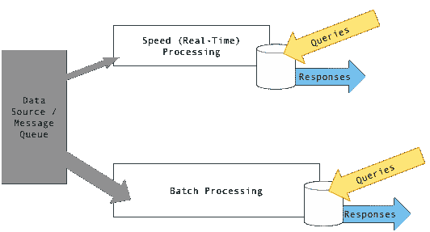

λ建筑—图片来源:[维基百科](https://en.wikipedia.org/wiki/Lambda_architecture)

## 建筑

假设您的开发团队能够构建订单和客户数据的流源(这实际上是一个先决条件)，我们的架构将如下所示。

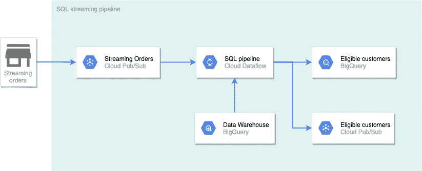

作者图表

在这种架构中，新订单(一天之内)被流式传输到发布/订阅。数据流创建的管道将检查每一笔新的购买，以查看该客户是否在花费超过 5000 美元的客户列表中。结果将被写入两个目的地。BigQuery 的结果将用于带有可视化工具的实时仪表板。写入发布/订阅的结果将用于向获胜的客户发送推送通知。

## 入门指南

以下是一些入门的先决条件:

*   谷歌云账户
*   一个有效的付费账户(你可以注册 300 美元的免费试用)
*   谷歌云项目

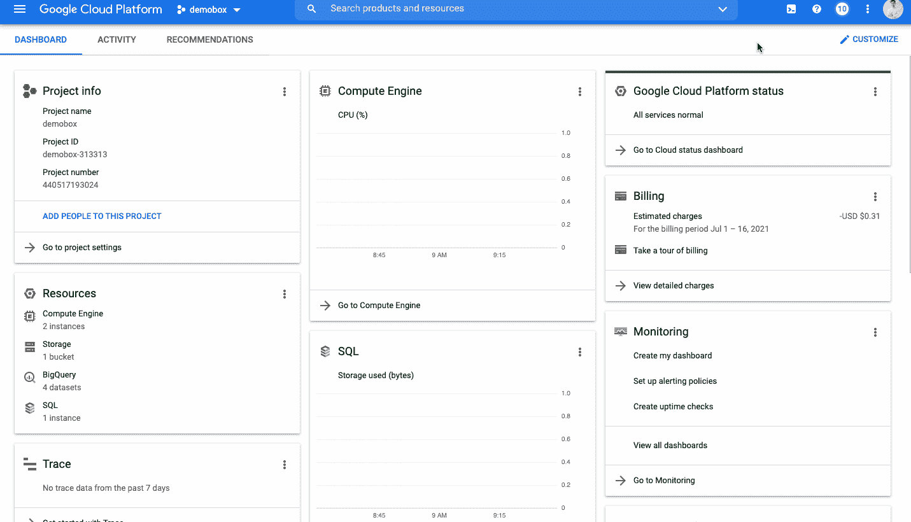

激活云壳—作者 GIF

[](https://github.com/tuanchris/dataflow-sql) [## Tuan Chris/数据流-sql

### Permalink 无法加载最新的提交信息。gcloud pubsub 主题创建订单构建实时管道...

github.com](https://github.com/tuanchris/dataflow-sql) 

通过运行以下命令将此存储库克隆到 Cloudshell:

```
# Clone the repo locally
git clone [https://github.com/tuanchris/dataflow-sql](https://github.com/tuanchris/dataflow-sql)
cd dataflow-sql# Install requirements
pip3 install -r requirements.txt
```

## 创建数据源

我们的流管道需要两个数据源，如下所示:

**1。一个大查询批量源**——所有订单和客户信息，每天更新

```
# This script will create 100 customers with 1000 orders
python3 generate_data.py batch \
 --customer_count=100 \
 --order_count=1000 \
 --project_id=$DEVSHELL_PROJECT_ID
# Replace the project_id varaible if you are running locally
```

*当云壳要求验证您的请求时，选择“授权”。*

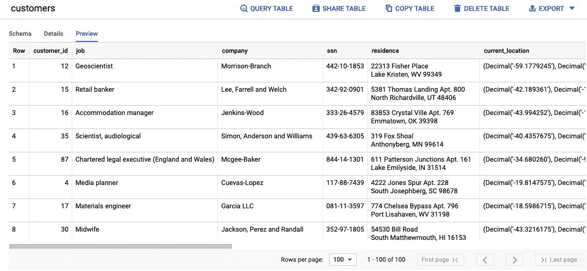

生成的客户表-按作者分类的图像

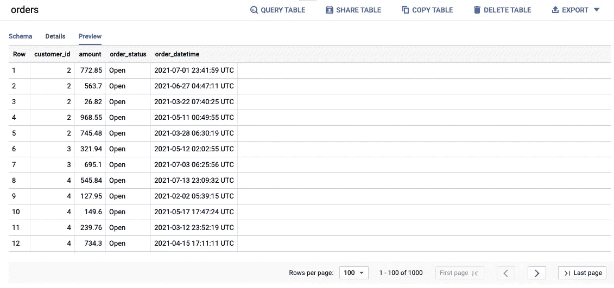

生成的订单表-按作者排序的图像

**2。名为** `**orders**`的发布/订阅主题——通过订阅发布/订阅主题获得的订单数据流

```
# Create a Pub/Sub topic
gcloud pubsub topics create orders# Generate a stream of order data to Pub/Sub
python3 generate_data.py stream \
 --customer_range 100 \
 --project_id $DEVSHELL_PROJECT_ID
```

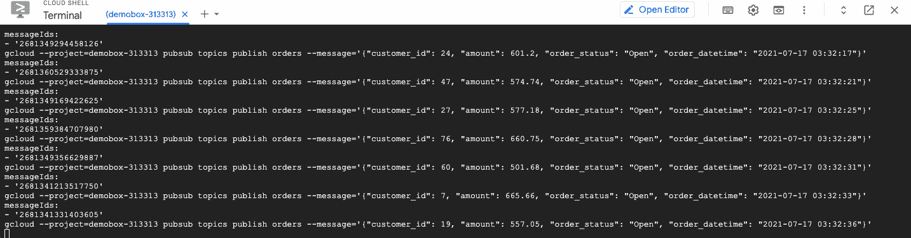

实时流向发布/订阅的模拟订单—图片由作者提供

## 将发布/订阅源添加到 BigQuery

要将发布/订阅源添加到 BigQuery，请执行以下步骤:

1.  **将 BigQuery 中的查询引擎改为云数据流引擎**

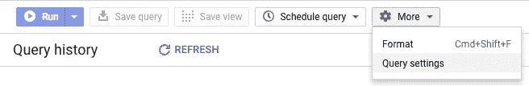

更改查询设置-按作者排序的图像

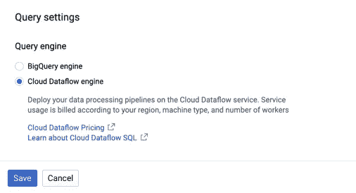

将查询引擎更改为云数据流—图片由作者提供

**2。从 BigQuery UI 中，选择添加数据并选择云数据流源**

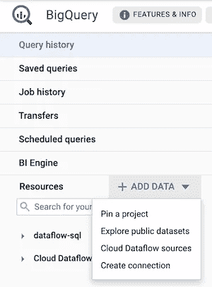

添加云数据流源—图片由作者提供

**3。添加发布/订阅主题源**

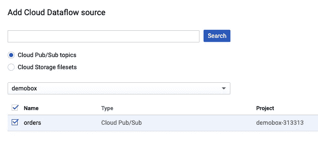

选择项目和发布/订阅主题—按作者分类的图像

**4。为订单主题添加一个模式**

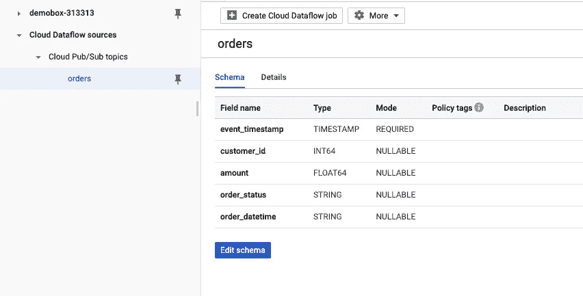

选择“添加的订单”主题，然后单击“编辑模式——按作者排序的图像”

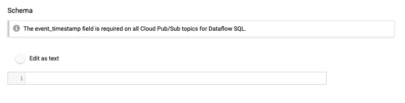

切换编辑为文本并粘贴以下值-按作者排序的图像

```
[
    {
        "name": "event_timestamp",
        "description": "",
        "mode": "REQUIRED",
        "type": "TIMESTAMP"
    },
    {
        "name": "customer_id",
        "description": "",
        "mode": "NULLABLE",
        "type": "INT64"
    },
    {
        "name": "amount",
        "description": "",
        "mode": "NULLABLE",
        "type": "FLOAT64"
    },
    {
        "name": "order_status",
        "description": "",
        "mode": "NULLABLE",
        "type": "STRING"
    },
    {
        "name": "order_datetime",
        "description": "",
        "mode": "NULLABLE",
        "type": "STRING"
    }
]
```

**写一个 SQL 查询**

下面是一个简单的 SQL 查询，它将回答我们的业务问题。

```
WITH
  eligible_customers AS (
  SELECT
    o.customer_id,
    SUM(o.amount) AS total_spent
  FROM
    bigquery.table.`demobox-313313`.ecommerce.orders o
  WHERE
    o.order_status = 'Closed'
  GROUP BY
    1
  HAVING
    total_spent >= 5000)
SELECT
  o.*,
  ec.total_spent
FROM
  pubsub.topic.`demobox-313313`.orders o
INNER JOIN
  eligible_customers ec
USING
  (customer_id)
WHERE
  o.order_status != 'Cancelled'
```

我们首先从 orders 表中选择数据，只筛选出“已完成”的订单，然后按客户分组，计算总支出，并筛选出购买了$5，000 或更多的客户。然后，我们将符合条件的客户列表加入到任何新的交易中，过滤掉状态为`Cancelled`的交易。

您可以看到，像上面这样编写 SQL 很容易，任何分析师都可以做到。尝试时，请确保替换您的 project_id。

## 创建数据流作业

查询准备好并得到验证后，您可以从 BigQuery UI 中选择`Create Dataflow job`。按照下图配置两个目的地。您可以将其他值保留为默认值。

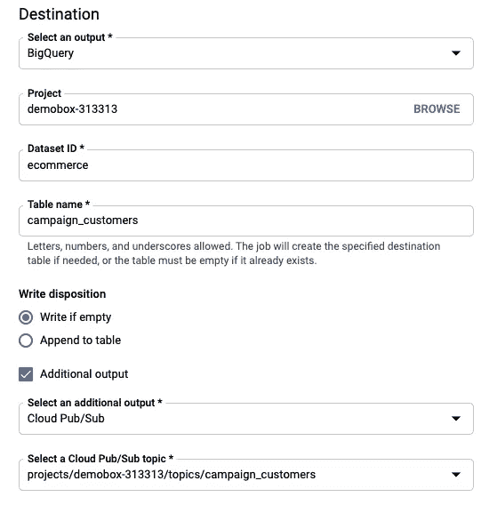

配置大查询目标和发布/订阅目标—按作者分类的图像

创建数据流作业后，您可以看到下面的结果。按照作业 ID 中的链接查看您的数据流作业及其状态。

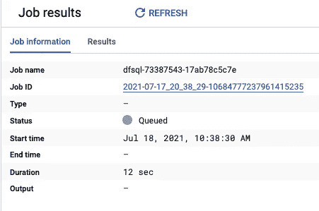

数据流创建结果-作者图片

数据流作业可能需要 3-5 分钟才能启动。之后，您应该能够像下面这样处理管道。

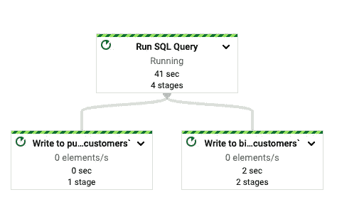

数据流 SQL 管道—作者图片

## 验证结果

在数据流作业成功启动和运行之后，您可以进入 BigQuery 和 Pub/Sub 来验证我们的管道是否按预期工作。

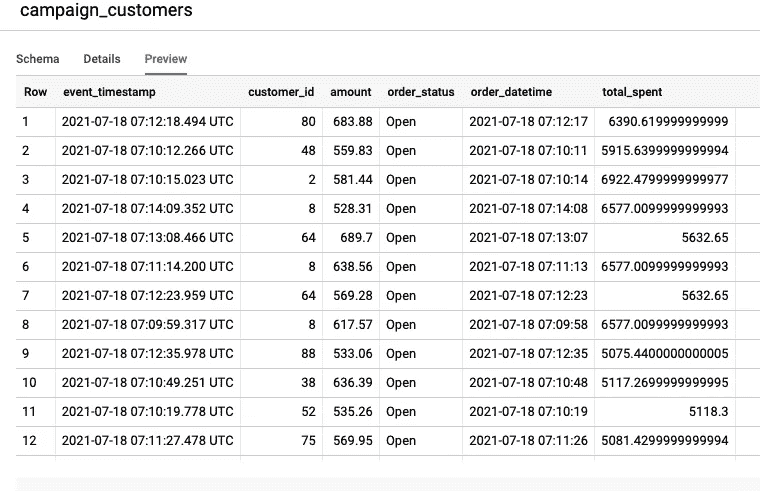

购买金额超过 5000 美元且有新交易的客户列表-按作者分类的图片

通过运行数据流作业，我们可以看到关于管道的各种作业指标。比如数据流处理数据需要 11 秒，还不错！

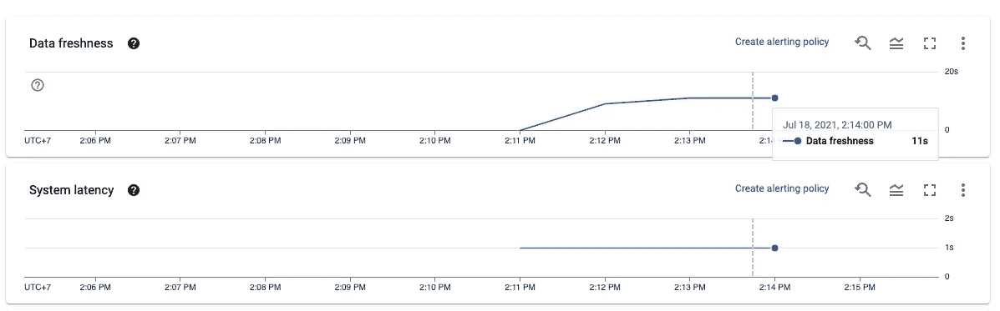

数据新鲜度报告-按作者分类的图像

## 打扫

确保取消数据流管道，删除发布/订阅主题，并删除 BigQuery 数据集，以避免产生成本。

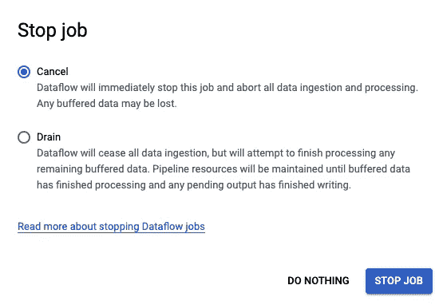

取消数据流作业-按作者分类的图像

# 结论

实时数据过去非常昂贵，而且只为最熟练的数据工程师保留。它仍然很贵，而且需要相当多的技术知识。然而，有了 SQL Dataflow 这样的托管工具或 Kafka 的 KSQL 和 Spark SQL 这样的开源替代工具，流式分析有望大众化，更容易获得。

快乐学习！