# 模拟一场网球比赛

> 原文：<https://towardsdatascience.com/building-a-tennis-match-simulator-in-python-3add9af6bebe?source=collection_archive---------15----------------------->

照片由[莫伊斯·阿历克斯](https://unsplash.com/@arnok?utm_source=unsplash&utm_medium=referral&utm_content=creditCopyText)在 [Unsplash](https://unsplash.com/s/photos/tennis?utm_source=unsplash&utm_medium=referral&utm_content=creditCopyText) 上拍摄

## 使用 Python 验证网球比赛基于点的建模背后的数学原理

网球，像其他球拍类运动(和排球)一样，有一个特定的得分系统，包括将得分分为子集，这些子集是对整体比赛重要的，而不是每个单独的点。这就引出了一个自然的问题:

*“给定得分的胜算概率与网球比赛的胜算概率有什么关系？”*

希望是积极的，否则技能不会得到奖励。以下是我关于如何使用“基于点的模型”对网球比赛进行建模的笔记，作为构建网球比赛模拟器的一部分，以便回答一些有趣的问题，这些问题围绕着改变比赛的各种规则(如取消二发或减少平手到猝死)的影响。

目的是:

*   贯穿基于点的模型的思想
*   推导出服务器赢得游戏的概率公式
*   使用模块`tennisim`中的 python 模拟来测试这种推导

## 只有一个变量，p

为了简单起见，我们将假设一个点可以完全由一个变量来描述，`p`:服务器在游戏中赢得给定点的概率。围绕这一点的假设是:

*   这个概率可以在玩游戏之前以合理的准确度进行估算
*   这个概率在整个游戏中是不变的
*   每个点都是独立的:前一个点(或前一个点的集合)的结果不会影响该点的概率

## 如何在一场网球比赛中得分

网球之所以有趣，是因为并非每一点都同样重要。这场比赛不仅仅是一场 150 分左右的比赛，大数法则(LLN)将开始发挥作用，因此很少有冷门。

取而代之的是，分数被细分为游戏，每场游戏都有一名玩家获得优势——他们可以随心所欲地通过第一枪就开始得分。

## 基于点的建模基础

这被称为基于点的建模，因为为了得到游戏、集合和比赛的结果，我们依赖于计算所有组成点的结果。尽管这可能不是模拟比赛总体结果的最具预测性的模型(它似乎是 ELO 的修改版)，但它非常有用，因为它产生了大量的赛内信息，从而为制定“比赛中的赔率”提供了基础。

鉴于:

*   `p`:发球方得分的概率
*   `(1-p)`:返回者赢得分数的概率(假设没有其他人可以赢得分数)

然后，我们可以生成以下网球比赛进程的“流程图”:

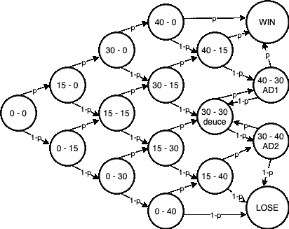

图片由作者使用[https://app.diagrams.net/](https://app.diagrams.net/)

所以简单描述一下上面的内容:

*   我们从 0-0 开始
*   以概率`p`服务器赢得了这一点，我们在图表上“向上”移动
*   反之亦然，概率为`(1-p)` -我们在图表中“下移”
*   如果我们打成平手，我们在最后会有某种循环行为，如果一名球员没有连续赢得 2 分，那么我们会反弹到平手(这与 30-30 相同，因为在这一点上，两名球员需要连续赢得 2 分才能结束比赛)

我们可以用这个图表来直观地展示如何以方程式的形式为游戏建模。比如，我们可以看到，一场比赛要想赢得爱情，只有一个办法:连赢 4 分。如果你是服务器，那么发生这种情况的概率是(`p x p x p x p`)。对于回球者来说，反过来也是正确的，他用所有其他可能的路线来打破发球，以结束由图表中间的路径描述的比赛。

对于游戏的每一个可能的最终结果，为了得到它发生的概率，我们需要:

*   计算游戏以某个分数结束的概率，例如:爱赢了
*   用达到最终*分数的方式的数量乘以这个数，例如，1 代表爱*

例如，有多种方式可以结束游戏，服务器获胜，返回者在游戏结束时有 15 分，因为返回者可能在整个游戏的不同情况下赢得该分。假设我们将每个点视为一个[伯努利变量](https://en.wikipedia.org/wiki/Bernoulli_distribution)，即只有两个互斥的结果，那么我们可以将一组点视为一个遵循二项式分布的[二项式变量](https://en.wikipedia.org/wiki/Binomial_distribution)。

然后，我们可以写出下面的内容——如果我们玩`n`点，服务器将赢得其中的`x`点的概率`P`是:

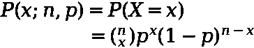

作者图片

这里我们还定义了[‘二项式系数’](https://en.wikipedia.org/wiki/Binomial_coefficient):

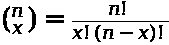

作者图片

## 写出给定游戏的方程式

我们需要小心的最后一件事是**不要重复计算结果**——这可以通过一个例子得到最好的说明。对于服务器来说，要赢得一场比赛，他们需要赢得 4 分，他们的对手赢得 1 分。在上面的例子中，服务器赢了`x=4`，就可以玩`n=5`点游戏。上面的等式(二项式系数)告诉我们有 5 种方式可以做到这一点。然而，这并不完全正确，因为它是在计算服务器赢得前 4 分，返回者赢得最后一分的结果-但这是不可能的，因为游戏已经结束了(服务器将赢得爱情)。

为了绕过这一点，我们可以应用[包含-排除原则](https://en.wikipedia.org/wiki/Inclusion%E2%80%93exclusion_principle)——为了得到上述可能发生的方式的数量，我们需要减去服务器可以赢得爱的方式的数量。

现在，让我们写下以下作为服务器赢得一场比赛的概率:

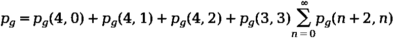

作者图片

换句话说，服务器赢得游戏的概率是:

*   他们赢得爱情的概率
*   他们获胜的概率为 15
*   他们获胜的概率为 30
*   他们进入“平手”然后设法(在某个时候)连续赢得 2 分的概率

在深入最后一点之前，我们可以先解决前几个问题，因为它们比较简单。

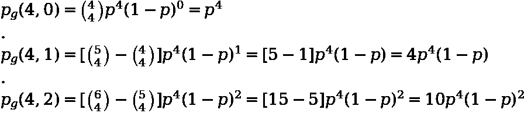

作者图片

现在我们可以把最后一部分分成:

*   当我们玩 6 分游戏时，每个玩家赢 3 分的概率(简单)
*   最终服务器将设法赢得 2 个连续点的概率(硬)

第一位可以简单地写成:

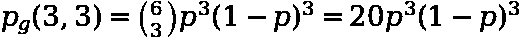

作者图片

这里我们不需要担心重复计算，因为没有人得到 4 分，所以比赛不会结束。现在是棘手的部分——让我们首先计算出服务器赢得`n+2`积分的任何`n`的概率。我们可以认为这是以下各项的总和:

*   发球方直接赢得 2 分(从平手)
*   发球方赢 1，然后回球方赢 1，然后发球方赢 2
*   返回者赢 1，然后服务器赢 1，然后服务器赢 2 获胜
*   服务器赢，返回者赢，服务器赢，返回者赢，服务器赢 2 胜
*   等等。等等。等等。

我们可以用数学方法表示为:

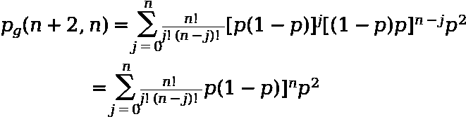

作者图片

其中:

*   `p(1-p)`是发球胜分的结果，然后是回发球
*   `(1-p)p`是回球者赢分，然后是发球者的结果
*   然后服务器会赢得下一个 2 分吗

然后，我们可以将其简化为:

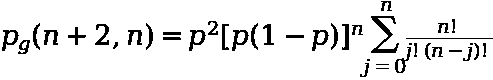

作者图片

我们把所有不依赖于`j`的东西都去掉了。剩下的是二项式系数的[和，即:](https://en.wikipedia.org/wiki/Binomial_coefficient#Sums_of_binomial_coefficients)

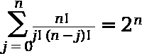

作者图片

现在我们把它代入原始表达式，得到:

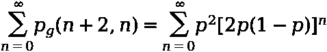

作者图片

最后，把括号外的`p^2`去掉，然后对[无限几何级数](https://en.wikipedia.org/wiki/Geometric_progression#Infinite_geometric_series)求和，我们得到了拼图的最后一块:

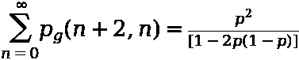

作者图片

将这一点与上面的结合起来，我们得到了下面的表达式，即一个发球者赢得一场比赛的概率，只是根据他们在发球时赢得一分的概率:

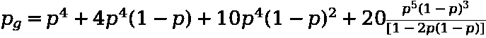

作者图片

## 使用模拟来检查

现在我们有:

*   封闭形式的解
*   python 由我们支配

我们不妨运行一些模拟来验证我们所期望的服务器赢得游戏的概率，给定他们将赢得任何给定分数的概率，对应于我们在模拟时所看到的平均值。

我已经将下面的内容打包成了`tennisim`，只需使用`pip install tennisim`就可以在 PyPI 上获得，但是为了完整起见，下面是来自`tennisim`的代码，用来模拟一个游戏以及一些用于制图的导入:

我们可以首先看一下服务器赢得游戏的概率如何随着服务器赢得任何给定点的概率而变化:

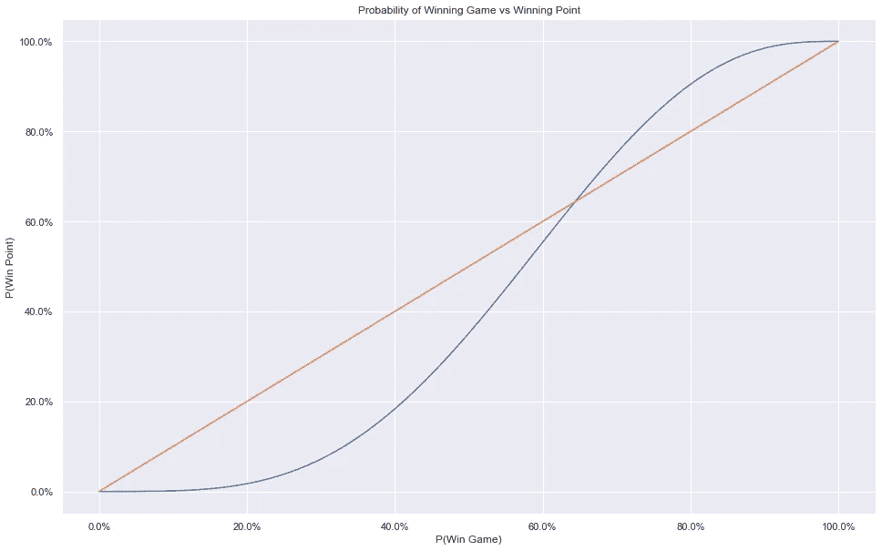

作者图片

现在让我们检查一下，如果我们模拟网球比赛，我们的方程是否与数据相符。我们将:

*   模拟 1000 组 100 个游戏，服务器以不同的概率赢得给定的分数
*   将这些组的分布与使用上面推导的公式计算的预期概率进行比较

作者图片

因此，看起来模拟是在支持这种推导——模拟的每个分布都围绕着理论上的获胜概率(红线)。

有趣的是，前面的线形图显示，服务器赢得一分的概率每增加 1%,赢得游戏的概率就会增加 1%以上。这只在上面图表的特定范围内是正确的，但考虑到大多数职业选手坐在 60-80%左右，这表明提高你的发球有多重要，因为它比线性增加了你保持发球比赛的机会。

## 结论

一旦我们假设一场网球比赛可以简化为一系列独立的点，并且发球方以固定的概率赢得每一个点，我们已经证明了发球方赢得比赛的概率可以用封闭的形式来描述。通过一系列模拟来验证这一点，表明模拟简单的概率设置是多么有用，模拟可用于以下文章:

*   调查改变`p`对游戏的预期长度(以点为单位)的影响
*   调查改变`p`对集合分数(6–4、7–5、6–2 等)预期分布的影响