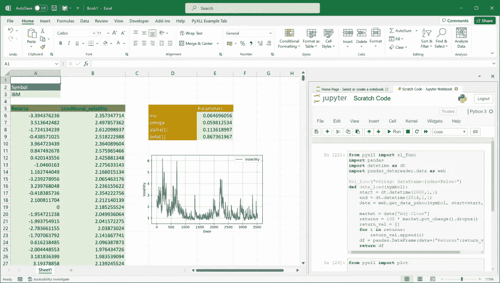
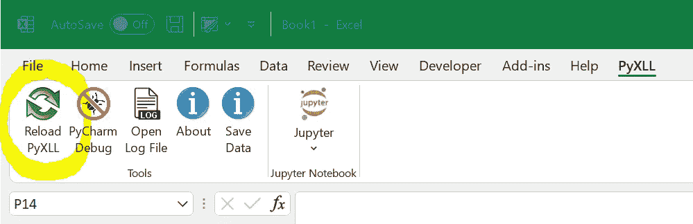
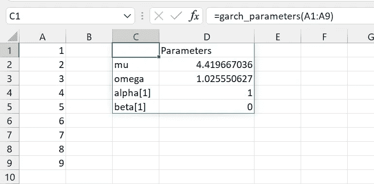
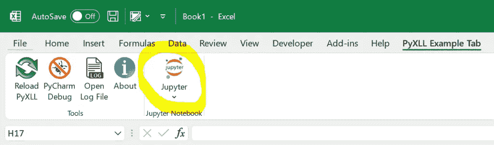
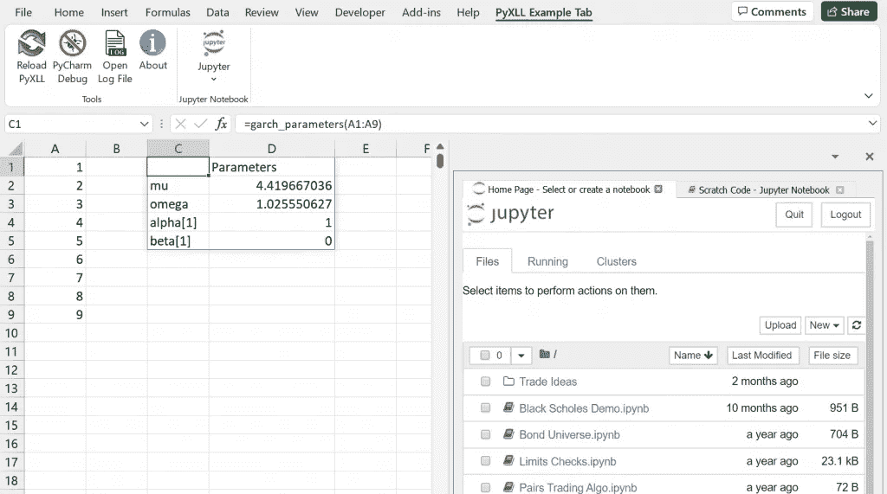
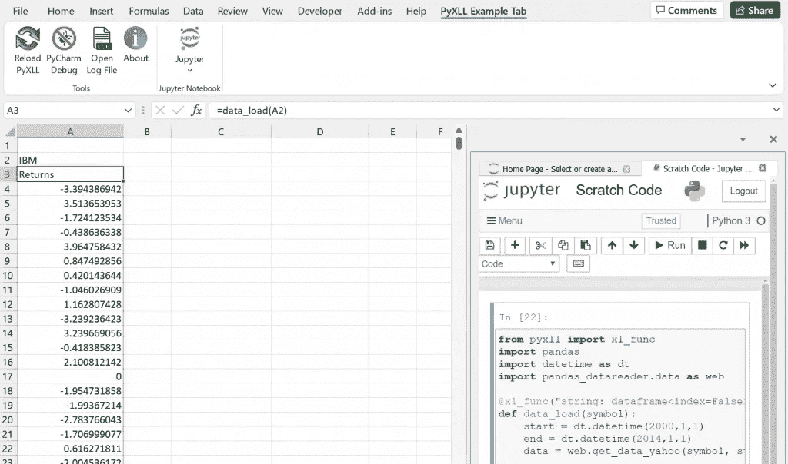
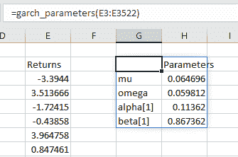
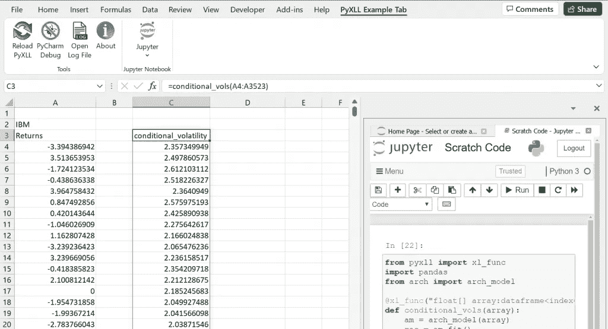
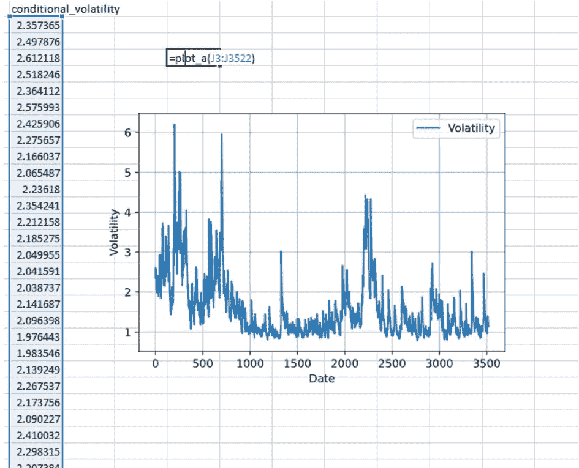

# 在 Excel 中构建一元 GARCH 模型

> 原文：<https://towardsdatascience.com/building-a-univariate-garch-model-in-excel-dfb4c671eff7?source=collection_archive---------13----------------------->

## 用 Python 和 PyXLL 在 Excel 中使用 GARCH 进行波动率预测

用 Python 和 PyXLL 在 Excel 中进行波动率建模。图片为作者本人。

在本文中，我们将在 Excel 中构建一个单变量 Garch 模型。Garch 模型用于估计金融资产的波动性。

本文最早出现在 PyXLL 博客这里:[https://www . PyXLL . com/blog/building-a-univariate-GARCH-model-in-excel/](https://www.pyxll.com/blog/building-a-univariate-garch-model-in-excel/)

在 VBA 建立这个模型将是一项极其艰巨的任务，即使对于非常了解 VBA 的人来说也是如此。估计单变量 Garch 参数需要我们利用最大对数似然法。特别是，Excel 中没有内置的包来执行这样的任务。

然而，用 Python 构建这样的模型非常简单，使用 PyXLL，我们可以在 Excel 中使用 Python 模型。

更喜欢看？这篇文章附有这段视频。视频为作者本人。

# 用 Python 构建 Garch 模型

我们首先需要编写 Python 代码来估计 Garch 模型的参数。完成这项工作的代码如下:

下面描述了编写此代码所涉及的步骤:

## 安装所需的依赖项

我们需要使用 Pip 安装两个必需的包。

*   首先是 arch 包，它将帮助我们估计 Garch 参数。我们可以通过运行“pip install arch”来安装它。这个 arch 包的文档可以在这里找到【https://arch.readthedocs.io/en/latest/ 。
*   第二个包是熊猫，它帮助我们组织我们的数据框架。如果你还没有安装熊猫，你可以通过运行“pip 安装熊猫”来完成。熊猫的资料在这里【https://pandas.pydata.org/ 。

## 编写 garch_parameters 函数

我们函数的名字叫“garch_parameters”。该函数将接受一个数字列表，并返回一个包含估计模型参数的 pandas 数据帧。Garch 模型通常会从一项金融资产(如股票或指数)获取一系列回报。

1.  我们创建一个名为“am”的变量，它从 arch 包中调用 arch_model 库。
2.  我们创建另一个名为“res”的变量。这个“res”变量将从 arch 包的 arch_model 库中调用函数 fit()。
3.  现在，这个“res”变量存储了与我们的 Garch 模型相关的所有信息。这包括模型参数、预测值、预测值等
4.  在这种情况下，我们只需要参数信息。因此，我们创建了另一个名为“parameters”的变量，并将其设置为“res”对象的“params”属性。“res.params”对象是熊猫系列。
5.  之后，我们创建一个新的 pandas 数据框架，它有一个“Parameters”列，用模型中的参数填充。
6.  最后，我们必须从“garch_parameters”函数返回 DataFrame。

## 测试我们的功能

我们想测试我们的功能，以确保它确实如预期的那样工作。

我们可以通过向“garch_parameters”函数传递一个从 1 到 9 的数字列表来实现。这些数字没有意义，但现在可以用来测试我们的功能。之后，我们想打印出函数的结果。

这样做的结果如下。第一部分是拟合模型时的日志输出，最后一部分是我们返回的数据帧。

# 从 Excel 调用 Garch 模型

既然我们知道 Python 函数可以工作，那么我们如何在 Excel 环境中使用这个函数呢？这就是 PyXLL 发挥作用的地方。PyXLL 是一个 Excel 插件，允许我们直接从 Excel 调用 Python 函数。

如果你不熟悉 PyXLL，请访问 https://www.pyxll.com。在那里可以找到更多关于 PyXLL 的信息，包括如何安装和配置插件。

我们将使用 PyXLL 的 *xl_func* 装饰器。 *xl_func* decorator 指示 PyXLL 插件将该函数作为工作表函数公开给 Excel。PyXLL 会将这个函数导出到 Excel，这样我们就可以从 Excel 工作表中调用它。

视频[https://www.pyxll.com/docs/videos/worksheet-functions.html](https://www.pyxll.com/docs/videos/worksheet-functions.html)很好地介绍了使用 PyXLL 用 Python 编写 Excel 工作表函数。如果您之前没有使用 PyXLL 编写过工作表函数，这个视频是一个很好的起点。

## 向 Excel 公开 Python 函数

为了将我们的“garch_parameters”函数公开给 Excel，我们只需要将 *xl_func* decorator 应用于该函数。我们还必须将 Python 模块添加到“pyxll.cfg”配置文件的“模块”列表中(没有。py 扩展名)。您可能还需要将源文件夹添加到“pythonpath”设置中。源文件夹是保存 Python 模块的文件夹。

*xl_func* decorator 接受一个字符串，该字符串告诉 PyXLL 函数期望什么参数，以及它返回什么。PyXLL 使用它将 Excel 函数输入转换为 Python 参数。如果我们不指定任何东西，PyXLL 将应用一些默认转换，但是在这种情况下，我们希望是显式的。

我们的修饰函数如下所示:

我们的 Excel 函数接受一个数字数组，并将一个 2d 数据数组返回给 Excel。这是通过传递给 *xl_func* 装饰器的函数签名字符串来实现的。“float[]”参数意味着该函数将从 Excel 中接受一个一维数组，并将其作为一个浮点数列表传递给我们的函数。在冒号之后，我们指定函数返回类型，这告诉 PyXLL 如何将我们的返回值转换成 Excel 可以处理的东西。我们希望 PyXLL 将返回的数据帧(包括索引)转换为 Excel 中的一系列值，因此我们使用“dataframe < index=True >作为返回类型。

你可以在 https://www.pyxll.com/docs/userguide/udfs/argtypes.html[的用户指南中找到更多关于 PyXLL 如何处理参数和返回类型的信息。](https://www.pyxll.com/docs/userguide/udfs/argtypes.html)

## 从 Excel 调用 Python 函数

现在我们可以在 Excel 中测试这个函数了。如果打开 excel，该功能将在 Excel 中自动可用。如果已经打开了 Excel，则需要重新加载 PyXLL 加载项。重新加载 PyXLL 将会加载您在 pyxll.cfg 文件中配置的 Python 模块。

Python 代码无需重启 Excel 即可重新加载。图片为作者本人。

通过 PyXLL 功能区重新加载。您的功能区可能看起来不同，并且可以通过 ribbon.xml 文件进行自定义。

为了从 Excel 中调用这个函数，我们输入“=garch_parameters(…)”，并向它传递一个数字数组。使用相同的数字数组，我们调用 Python 函数，在 Excel 中得到相同的结果。

在 Excel 中调用 garch_parameters Python 函数。图片为作者本人。

**注意**:如果你使用的是旧版本的 Excel，你可能会发现数组不会自动扩展。动态数组是 Office 365 中的新功能。要在旧版本中自动扩展数组，请将“auto_expand=True”传递给 xl_func 装饰器。关于数组函数的更多细节见[https://www.pyxll.com/docs/userguide/udfs/arrayfuncs.html](https://www.pyxll.com/docs/userguide/udfs/arrayfuncs.html)。

# 使用 Jupyter 笔记本进行 Python 开发

该过程的下一步是加载真实数据，并基于该数据估计 garch 模型。我们将使用 PyXLL-Jupyter 包在 Jupyter 笔记本中完成这项工作。

使用 Jupyter 笔记本可以让我们直接在 Excel 中快速编写 Python 代码。使用 Jupyter 笔记本的一个缺点是启动 Excel 时它不会自动加载。Jupyter 笔记本必须运行，我们的代码才能在 Excel 中可用。这对于开发很有用，因为我们可以快速迭代，但是对于部署来说，将代码移动到 Python 模块通常更好。

在 Excel 中使用 Jupyter 笔记本之前，我们需要安装 PyXLL-Jupyter 包，这可以通过运行以下命令来完成:

安装后，重新加载 PyXLL，您将在 PyXLL 功能区中看到 Jupyter 按钮。

在 Microsoft Excel 中打开 Jupyter 的按钮。图片为作者本人。

单击 Jupyter 按钮将在 Excel 中打开 Jupyter 笔记本应用程序。有关如何使用 PyXLL-Jupyter 包的更多详细信息，请参见[https://www . PyXLL . com/blog/python-Jupyter-notebooks-in-excel/](https://www.pyxll.com/blog/python-jupyter-notebooks-in-excel/)。

Jupyter 笔记本在微软 Excel 中运行。图片为作者本人。

# 将 Garch 模型与真实数据结合使用

## 从 Yahoo Finance 获取返回数据

我们已经用一些测试数据测试了“garch_parameters”函数。然而，为了有用，我们需要一些真实的数据，我们可以使用“pandas_datareader”包从 Yahoo Finance 加载这些数据。

我们需要的另外两个包是*日期时间*和*熊猫 _ 数据阅读器*。pandas_datareader 包用于从 Yahoo Finance 加载数据。datetime 包用于指定我们加载数据的开始和结束日期(ed:这些日期可以传递到我们的函数中，而不是硬编码在函数中)。

我们的新函数 *data_load* 接受一个字符串作为参数，并返回一个 DataFrame。这种情况下的字符串参数是股票的符号，例如:AAPL、IBM 等。返回的数据帧包含该符号的返回。

笔记本上写的“data _ load”Python 函数可以从 Excel 中调用。图片为作者本人。

不要忘记“运行”Jupyter 笔记本中的单元格来运行 Python 代码！

在 Jupyter 笔记本中输入代码并运行单元后，我们新的“data_load”函数就可以从 Excel 中调用了。

## 拟合模型参数

我们在 Excel 中已经有了“garch_parameters”函数。我们可以使用刚才加载的返回来调用它！

用调用“garch_parameters”函数会返回数据。图片为作者本人。

## 从模型中获取条件波动率

除了模型参数之外，Garch 模型还可以返回条件波动率。要访问这些，我们可以写一个类似于 garch_parameters 函数的函数，但是从模型中获取条件波动率。

这里我们不使用“res.params”，而是使用“res.conditional_volatility”。这个函数采用与 garch_parameters 函数相同的返回数组，我们可以使用加载的返回数据从 Excel 中调用它。

模型的条件波动率。图片为作者本人。

## 绘制结果

熊猫有出色的绘图能力。使用 *pyxll.plot()* 函数，我们可以在 Excel 中显示用熊猫绘制的图。以下函数采用一组数字，并使用熊猫来绘制一个简单的线图:

最后一行“plot()”(从 pyxll 包导入)显示 Excel 中的熊猫图，下面是调用函数的地方。

使用熊猫创建的波动图。图片为作者本人。

当我们更改模型的输入时，输出会自动重新计算，并且绘图会更新。

# 后续步骤…

在本文中，我们看到了如何使用 Python 包“arch”拟合 Garch 模型。我们还看到了如何从 Excel 中调用 Python 模型、加载数据以及从模型中提取结果。

Garch 模型通常用于预测未来的波动性，作为交易策略的一部分。本博客中使用的方法可以扩展到基于 Excel 中的输入进行预测。使用 Excel 作为模型的前端意味着我们可以非常容易地与它进行交互。对输入的任何更改都会导致计算自动重新计算，并且结果会实时更新。

由于代码是普通的 Python 代码，因此可以在 Excel 之外使用，例如用于单元测试或作为批处理的一部分。我们的 Python 代码利用了复杂的 Python 包，我们的 Excel 电子表格只需调用相同的 Python 代码。

通过向我们的 Python 模块添加更多的 Garch 函数，我们可以在 Excel 中构建一个完整的 Garch 函数工具包。这可以用来直接在 Excel 中执行分析，甚至构建一个交易应用程序，其中所有的输入和输出都可供 Excel 用户使用。使用 *pyxll.plot* 函数允许我们在 Excel 应用程序中构建类似仪表板的特性。

# 参考

*   博文原文：<https://www.pyxll.com/blog/building-a-univariate-garch-model-in-excel/>
*   【拱门】蟒蛇包:【https://arch.readthedocs.io/en/latest/ 
*   PyXLL，Excel Python 插件:[https://www.pyxll.com](https://www.pyxll.com/)
*   使用 PyXLL 在 Excel 中编写工作表函数:[https://www.pyxll.com/docs/videos/worksheet-functions.html](https://www.pyxll.com/docs/videos/worksheet-functions.html)
*   Excel 中的 Python Juputer 笔记本:[https://www . pyxll . com/blog/python-jupyter-notebooks-in-Excel/](https://www.pyxll.com/blog/python-jupyter-notebooks-in-excel/)
*   熊猫:[https://pandas.pydata.org/](https://pandas.pydata.org/)
*   Excel 中的 Python 绘图:[https://www.pyxll.com/docs/userguide/plotting/index.html](https://www.pyxll.com/docs/userguide/plotting/index.html)