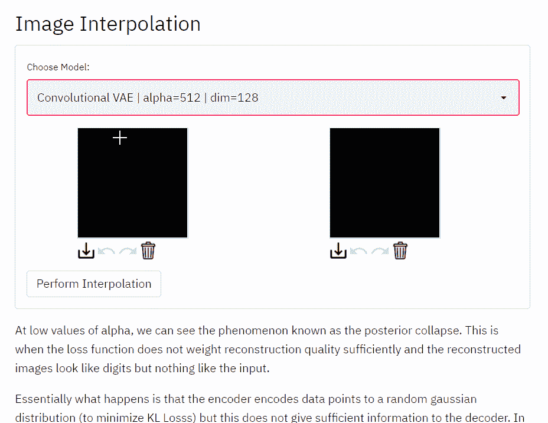

# 用 Streamlit 建造 VAE 游乐场

> 原文：<https://towardsdatascience.com/building-a-vae-playground-with-streamlit-aa88a3394c04?source=collection_archive---------22----------------------->

## 借助 Streamlit，创建和部署 web 应用程序变得非常简单！

这篇博客文章是一个迷你系列的一部分，该系列讨论了使用可变自动编码器构建 PyTorch 深度学习项目的不同方面。

MNIST 数据集上的 Streamlit 应用

> [*第一部分*](/beginner-guide-to-variational-autoencoders-vae-with-pytorch-lightning-13dbc559ba4b) *:数学基础与实现* [*第二部分*](/beginner-guide-to-variational-autoencoders-vae-with-pytorch-lightning-part-2-6b79ad697c79) *:用 py torch Lightning* [*增压第三部分*](/beginner-guide-to-variational-autoencoders-vae-with-pytorch-lightning-part-3-9d686d0d85d9#1921-b4c73b02c87) *:卷积 VAE、继承与单元测试* [*第四部分*](/building-a-vae-playground-with-streamlit-aa88a3394c04) *:部署*

在前面的章节中，我们学习了如何使用 PyTorch Lightning 训练两种不同类型的变分自动编码器。第一种是使用线性层的普通 VAE，而第二种是使用卷积层进行特征提取和数据生成的卷积 VAE。

在这一节中，我们将看看如何使用 Docker 和 Streamlit 来创建这个 web 应用程序，在这里我们可以直接与模型进行交互。通过与模型交互并获得即时预测，我们有望更好地了解如何调整 VAEs。

## **流线型**

 [## Streamlit *构建和共享数据应用的最快方式

### 用我们神奇简单的 API，用几行代码构建一个应用程序。然后看到它随着你的迭代自动更新…

streamlit.io](https://streamlit.io/) 

Streamlit 是任何数据科学应用程序的绝佳工具。有了它，你可以使用纯 Python 创建漂亮的网络应用，而不需要任何 HTML、CSS 或 JavaScript。Streamlit 最棒的地方在于它的代码非常直观和 pythonic 化。Streamlit 可以帮助创建令人印象深刻的演示，并且是帮助您的项目实现的一个很好的工具！

## **设计应用**

这个应用程序将非常简单，有两个功能**重建**和**插值**。

对于重建，我们只需通过 VAE 传递一个图像，然后查看输出。由此，我们可以从图像重建的质量来评估 VAE。

插值更有趣一点。通过执行插值，我们可以探索 VAE 的潜在空间。首先，我们从数据集中提取两幅图像并进行编码。对于 VAE，这意味着获取μ和 log(σ)向量，并从分布中抽取样本。这个样本给了我们数据的潜在概率分布中的一个点。我们对第二幅图像做同样的处理，得到另一个点。

这里，我们在潜在概率分布中取等间距的点，并在这些点上运行解码器。这允许我们观察潜在的概率分布，并想象这些点是如何被绘制的。理想情况下，我们希望两个数据点之间平滑过渡。

我们可以在 VAE 类中用函数的形式来写这个

VAE 类的插值函数

`Conv_VAE`类也将继承这个函数，我们不必再重写它

## **Streamlit 可绘制画布**

现在让用户与模型互动。让我们创建一个应用程序，用户可以直接在应用程序上绘图来创建一个全新的数据点，而不是上传图像或从 MNIST 数据集中选择图像！

幸运的是，包`streamlit-drawable-canvas`已经为我们做了！我们可以使用它来创建一个区域，用户可以使用鼠标来创建一个绘图，我们可以使用它作为模型的输入

 [## 和平面/流线型可画画布

### Streamlit 组件提供了一个使用 Fabric.js 的素描画布。自由绘制，线条，圆形，方框和多边形…

github.com](https://github.com/andfanilo/streamlit-drawable-canvas) 

有了这个包，我们可以在任何我们想要的地方创建一个可绘制的画布。所有我们需要做的是设置一些参数，如高度，重量，填充颜色等。我们我们完了。我们可以在应用程序中使用这个组件，然后将用户的绘图保存为 numpy 数组。

实例化 Streamlit 可绘制画布

除此之外，我们还需要一些预处理功能。需要注意的一点是，MNIST 数据集图像只有 28 x 28，这对我们来说太小了，无法绘制。下面是我们的预处理函数要做的事情

1.移除 Alpha(透明)通道
2。转换为黑白
3。缩放至[-1，1]
4。将其转换为具有正确形状的张量
5。调整张量的大小

预处理功能

我们可以将所有这些放入`app_utils.py`的一个函数中，让我们的 Streamlit 应用程序使用它。

## **模型加载**

现在我们有了生成数据点的方法，我们只剩下加载模型了！

`vae_models`是一个将类似`”conv-vae”`的字符串映射到类对象`Conv_VAE`的字典。我们加载模型并将其设置为`eval`模式，然后将其返回。

模型加载功能

剩下的就是写一些代码来创建运行插值的按钮，信不信由你，我们已经完成了！剩下的就是在命令行中运行`streamlit run app.py`，然后进入`localhost:8501/`访问应用程序。

使用 Streamlit，我们可以使用我们非常熟悉的工具创建非常专业的 web 应用程序，并在很短的时间内完成。让我们花些时间来探索这款应用

在`saved_models/`目录中有 6 种不同的模型，你可以用不同的α值来玩。概括地说，我们的损失函数是`MSELoss * alpha + kl_loss`，这意味着α值越高，模型优先考虑图像重建质量而不是潜在空间规律性。

太好了，现在我们的应用程序工作了，让我们在网络上分享它。为此，我们将使用 Docker 来封装应用程序，并将其部署在 Heroku dyno 上。

# **Docker 是什么？**

Docker 是一个集装箱工具。通过拍摄当前环境的快照并创建一个隔离的环境来运行应用程序，实现了可再现性。这使得我们可以在任何安装了 docker 的设备上发布和运行我们的代码。除了容器化应用程序，我们甚至可以使用 Docker 来创建可配置和可复制的开发人员环境。Docker 的安装说明可在以下链接中找到:

 [## Docker | Docker 入门

### 了解 Docker 提供的完整容器解决方案。为开发人员、IT 运营和…查找信息

www.docker.com](https://www.docker.com/get-started) 

我们需要做的是创建一个`Dockerfile`，它包含 Docker 创建容器所需的所有指令。这个容器将包含我们需要的所有文件，也与我们运行应用程序的环境相同。

对于这样一个简单的 Python 应用程序，有 4 个主要组件。

1.**来自 python:3.8-slim-buster**

Docker 映像是使用层构建的，这允许 Docker 从现有映像快速构建映像，而不必从头开始构建。从一个 python 映像开始，我们得到的是一个 Linux Ubuntu 发行版，它包含一些重要的 Python 包并安装了 Python 3。

2.**工作目录和副本**

`WORKDIR`命令为容器创建一个工作目录。这将作为`./`路径，防止容器过于混乱。`COPY`命令只是将所有必要的文件复制到映像中。类似于。gitignore 我们可以创建一个. dockerignore 来指定任何我们不想复制的文件，比如我们正在使用的数据集。

3.**运行 pip 3 install-r requirements . txt**

`RUN`允许 docker 运行项目所需的任何终端命令。我们可以运行 pip install 来安装项目所需的软件包。需要注意的一点是，我们为 PyTorch 安装了 CPU 专用版本。这避免了安装额外的 CUDA 驱动程序的需要，并保持容器较小。

4. **CMD**

开始运行应用程序的最后一个命令。这基本上是用于在本地环境中运行 Streamlit 的终端命令

首先，在命令行中运行`docker build -t <name_of_image> .`。这告诉 Docker 在当前目录中查找 Docker 文件，并使用它构建一个映像。这一步需要相当长的时间，因为 PyTorch 是一个相当大的包

一旦建立了映像，我们可以使用命令`docker run`创建一个容器

默认情况下，容器与外部环境完全隔离，要访问我们的应用程序，我们必须使用`-p`标志打开一个端口。完成这项工作的完整命令是`docker run -p 8501:8501 <name_of_image>`，我们可以在`localhost:8501/`看到这个应用程序

这可能看起来有点罗嗦，但是将我们的应用程序归档的好处是，我们可以毫无问题地与其他人共享它。我们可以将图像推送到 Docker hub(Docker Images 的 Github ),任何人都可以毫无问题地运行这个应用程序。除此之外，容器化在部署应用程序时也会有所帮助。

## **部署**

很好，现在可以将最后一部分部署到网络上了。为此，我们将使用 Heroku a PaaS(平台即服务),它允许我们部署 web 应用程序，而不必担心维护基础设施。这真的很容易使用，免费层通常是足够的个人项目。有几种方法可以部署到 Heroku，但是我们将使用容器方法。

登录 Heroku 账号后，我们首先需要创建一个 app。我们可以通过给应用程序命名并设置区域，非常容易地从仪表板创建应用程序。记住应用程序名称，因为我们将在部署中使用它。

使用 Heroku 的一个重要注意事项是，端口是随机分配给不同的应用程序的。Heroku 提供给 app 的端口是不固定的，但它将作为环境变量`$PORT`给出。因此，我们必须对之前的 docker 文件做一个小小的修改。

Heroku 部署的 Dockerfile

这样做的目的是更改最终命令，使其使用`$PORT`环境变量，而不是分配默认端口 8501。

# 最终部署步骤

第一步是登录 Heroku

`heroku login`

然后，我们指定用于 Heroku 构建的 docker 映像

`heroku container:push -a <app_name> web`

这个命令成功后，剩下唯一要做的就是释放应用程序。

`heroku container:release -a <app_name> web`

就是这样！该应用程序现在在 Heroku 提供的 URL 上运行。

希望这篇文章向您展示了如何使用 Streamlit 以及部署 web 应用程序所需的一些步骤来轻松构建 web 应用程序！

请随意查看 GitHub 上的完整代码，非常感谢您的任何反馈！

**Github**:[https://github.com/reoneo97/vae-playground](https://github.com/reoneo97/vae-playground)
**LinkedIn**:[https://www.linkedin.com/in/reo-neo/](https://www.linkedin.com/in/reo-neo/)