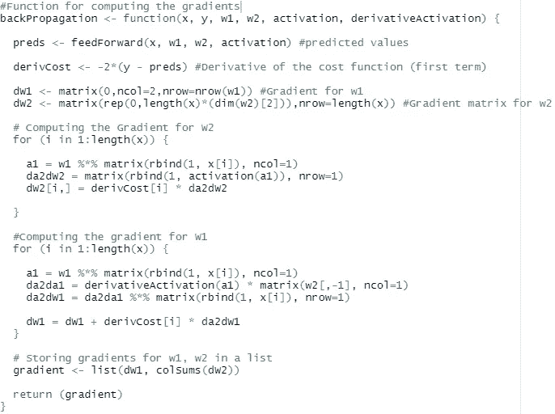

# 从头开始构建一个普通的人工神经网络

> 原文：<https://towardsdatascience.com/building-a-vanilla-artificial-neural-network-from-scratch-in-r-5f03dfec628b?source=collection_archive---------8----------------------->

## 从基础到实际实施

# **什么是神经网络？**

人工神经网络(ANN)是一种现代机器学习方法，它试图模仿人脑学习和处理信息的方式。

来源:[https://pix abay . com/插图/人工神经网络-ann-3501528/](https://pixabay.com/illustrations/artificial-neural-network-ann-3501528/)

如今，人工神经网络广泛用于开发人工智能驱动的产品，对于计算机视觉(CV)和自然语言处理(NLP)中的不同应用，存在许多不同的神经网络架构:

*   面部识别
*   语言翻译
*   目标检测
*   语音识别
*   自动更正文本
*   创造艺术

可能性是无穷无尽的，清单还在继续…

# **它们是如何工作的？**

通过将人工神经网络分解为基本组件，可以更好地理解人工神经网络:

*   前馈机制
*   重量优化

## 前馈机制

该组件负责使我们的模型能够进行预测。在其最简单的形式中，前馈机制首先将线性函数应用于给定的输入，然后使用称为“激活”的非线性函数将结果转换为期望的输出。

让我们通过考虑由一组输入、一个隐藏神经元和一个输出神经元组成的简单模型来可视化这些操作:

*   x:输入的矩阵集合(**预测器**)。
*   w:一些可以被视为输入和输出之间关系的斜率/变化率的矩阵，称为**权重**。
*   b:类似于“y 轴截距”的常数，称为**偏差**。
*   *g(a):* 应用于线性输出‘a’的非线性**‘激活’**函数(一些最流行的激活函数的例子):
    -整流线性单位(ReLU): max{0，x }
    -Sigmoid:1/(1+exp {-x })
    -双曲正切(tanh): sinh(x) / cosh(x)

当处理由几个预测值组成的数据时，我们通常需要更多的隐藏层和神经元，但我们仍然应用与上述相同的操作顺序。唯一的区别是，我们的模型变得明显更加复杂，使得最终训练我们的模型变得更加困难。

## 重量优化

*我们如何知道前馈机制做出的预测实际上是正确的？*

人工神经网络通过优化与预测器相关的权重矩阵来学习更好地逼近目标变量。与前馈组件相比，优化模型权重是一个不太直观的过程，因此无需深入研究所需的严格数学，我将给出继续本教程所需的概念性理解。

**反向传播**是一种先进的数学算法，结合了链式法则和相应变量的偏导数，计算权重矩阵的梯度。

*那么，既然有了梯度，我们如何优化权重呢？*

**随机梯度下降** ( **SGD** )，通过在选定数量的训练迭代(**时期**)上以指定的收敛速率(**学习速率**)最小化成本函数，利用反向传播算法来调整模型权重。由于梯度是一个常数，在每个时期，我们调整权重，直到收敛到全局最优值。

希望这个图表可以帮助我们了解 SGD 在每个时期的目标。

# 在 R 中构建模型

现在我们有了所需的基础知识，我们终于可以开始构建模型了！！！

我将通过一个简单的指南从头开始构建一个“香草”人工神经网络(不使用任何内置模块)。我们将建立的模型类型将是一个**回归变量**，因为预测变量和响应变量都是数字。

## 为什么从零开始？

我也曾经问过自己同样的问题，但是一旦我被迫从头开始编写自己的代码，我注意到我开始在更深的层次上理解底层的概念(及其乐趣)。

## 模型架构

我们将要构建的人工神经网络将由一组输入、一个包含 5 个神经元的隐藏层和一个最终输出层组成。让我们来看看组装模型所必需的构件:

*   输入数据( **X** ):来自区间[-2，2 ]上连续均匀分布的 60 个模拟随机变量。
*   响应(**Y**):X 的某三角函数，( *f(X)* ) = cos(2x +1)
*   激活功能:**乙状结肠**
*   权重矩阵( **w1，w2** ):大小为{N * (p + 1)，Q * (N +1)}，其中 N 是每层中隐藏神经元的数量，p 是不同预测器的数量，Q 是输出(1)的维数。最初，随机模拟模型权重，然后通过我们的随机梯度下降算法进行优化。
*   成本函数:使用误差平方和( **SSE** )来评估我们模型的预测质量，因此我们将使用**二次成本**。

让我们看看我们如何在 R 中定义这些变量:

## 前馈机制

现在我们已经有了变量，我们定义我们自己的函数，我们将用它来预测我们的输入向量。

## 反向传播

首先，我们必须定义激活函数的导数，因为它是通过网络反向传播时的关键特征:

让我们仔细看看为了执行反向传播我们需要概述的必要操作。

分解代码:

*   **preds** :最小化成本函数所需的模型预测
*   **derivCost** :由于我们使用上证综指作为模型误差的衡量标准(二次成本)，对预测值求导会产生上述结果
*   **(dW1，dW2)** :最初，我们用来存储权重矩阵梯度的空矩阵。

理解代码块的其余部分需要对反向传播算法有更深入的理解。这个视频应该可以达到目的:

执行反向传播很不直观，而且这些只是对通过隐藏层的一组输入的计算。随着更多的层被添加到网络中，计算梯度在计算上变得昂贵。

## 模特培训

如果你已经注意到了，我们还没有真正使用我们在代码块中定义的任何函数。在这里，我们通过调用所有前面的函数来执行模型训练，从而将所有东西联系在一起。

我们定义了随机梯度下降函数来优化我们的权重和跟踪训练误差。

本质上，我们将在每次迭代时通过选择的学习率(通常是从 0 到 1 的浮点数)来调整权重矩阵，同时我们将在每个时期将 SSE 值存储在一个空矩阵中。

最后，我们的模型参数通过调用我们的 SGD 函数获得…(我选择 200 个历元，因为通过反复试验，它给出了最好的结果)。

# 模型评估图

## 训练误差

这是我们的训练误差在历元数(200)上的图，我们看到性能在开始时有很大提高，随后在每次连续迭代后模型误差稳步下降。

*****注意:**我们省略测试误差图的原因是我们实际上没有测试集，因为我们的预测值是从随机均匀分布模拟的，而不是从实际数据集模拟的。

## 实际值与预测值

让我们看看我们的模型如何通过绘制原始响应值与预测值来预测目标变量:

还不错！我们的模型在解释响应变量方面做得很好，性能似乎偏向右尾，但没有过度拟合的迹象。

# 最后的想法

神经网络负责为我们今天看到的最先进的人工智能技术提供动力。我们从头开始浏览了构建简单的香草人工神经网络架构的指南。

现在，您已经对神经网络如何工作有了基本的了解，我鼓励您探索更高级的模型架构，这些架构支持我们今天拥有的一些最好的人工智能产品/服务。

这里是一个开始的好地方:

 [## 解释了最完整的神经网络图

### 神经网络类型的动物园呈指数增长。人们需要一张地图在众多新兴架构之间导航…

towardsdatascience.com](/the-mostly-complete-chart-of-neural-networks-explained-3fb6f2367464) 

我真的希望你喜欢这个小教程！如果你觉得有用或有趣，请随意评论，并[订阅](https://medium.com/@andrew.tchircoff)关于机器学习和其他技术主题的未来文章:)

*****获取完整 R 脚本:**

 [## 神经网络/ANN/tristanofetto 主回归器/神经网络

### 使用深度学习库来实现针对不同类型数据优化的各种网络架构…

github.com](https://github.com/tristanoprofetto/neural-networks/tree/main/ANN/Regressor)