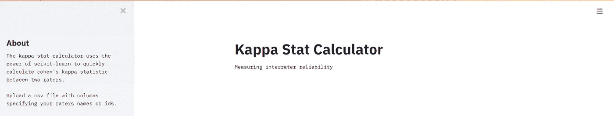
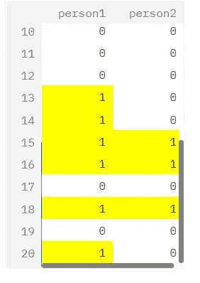
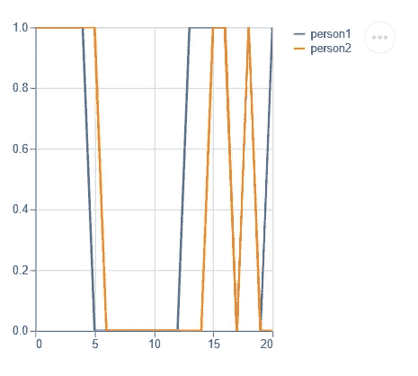
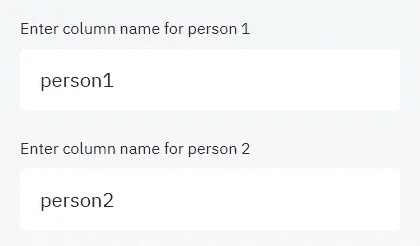
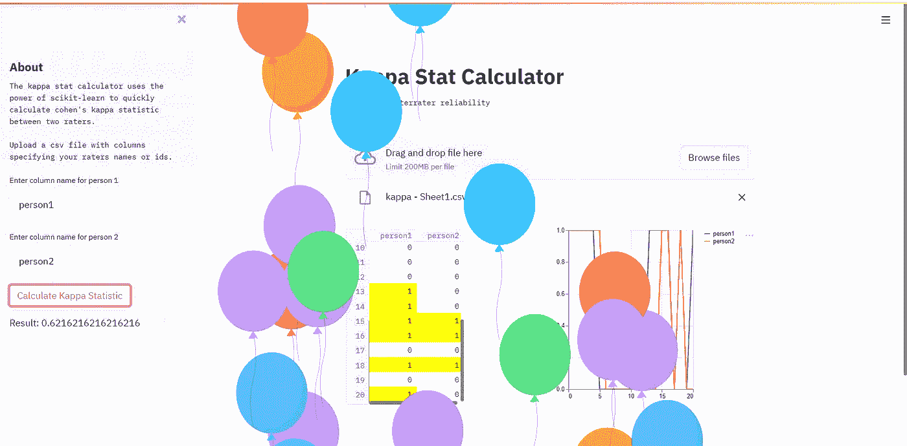

# 构建一个计算科恩 Kappa 系数的 Web 应用程序

> 原文：<https://towardsdatascience.com/building-a-web-app-to-calculate-cohens-kappa-coefficient-39781fda0cf?source=collection_archive---------40----------------------->

## 混合使用 streamlit 和 scikit-learn


图片来自 [Unsplash](https://unsplash.com/)

# 介绍

在医疗保健研究中，经常有多个小组或个人在研究同一种情况或变量。他们独立地收集数据，但是期望，并且经常需要，报告发现的人之间的一致性。因此，设计良好的程序必须包括各种数据收集者之间的系统测量协议。数据收集者之间的一致程度被称为 ***评分者信度*** 。

从历史上看，衡量两个评分者之间的可靠性是通过简单的*百分比一致度*来实现的，该百分比表示分数总数中一致度的总数。然而，这并不能控制两个计分员无意中达成一致的可能性。

因此，Cohen 的 Kappa 系数被开发出来以调整这种可能性。

> 简而言之，科恩的 Kappa 是一种衡量两个评分者(法官、观察员)之间可靠性的方法，修正了偶然发生一致的概率。

更多关于科恩卡帕系数的阅读，请查看以下内容:

 [## 科恩的卡帕-维基百科

### Cohen 的 kappa 系数(κ)是一个统计量，用于测量评分者之间的可靠性(以及评分者内部的可靠性)

en.wikipedia.org](https://en.wikipedia.org/wiki/Cohen%27s_kappa) [](https://www.ncbi.nlm.nih.gov/pmc/articles/PMC3900052/) [## 评分者之间的可靠性:kappa 统计

### kappa 统计经常被用来检验评分者之间的可靠性。评分者信度的重要性在于…

www.ncbi.nlm.nih.gov](https://www.ncbi.nlm.nih.gov/pmc/articles/PMC3900052/) [](/cohens-kappa-9786ceceab58) [## 科恩的卡帕

### 理解科恩的卡帕系数

towardsdatascience.com](/cohens-kappa-9786ceceab58) 

# 构建一个简单的 Kappa 统计应用程序

我希望这个应用程序能够创建一个简单的方法来输入数据，以计算 Cohen 的 Kappa 系数。为此，我使用了 *streamlit* ，这是一个使用纯 python 快速创建数据科学应用的开源框架，以及 *scikit-learn* ，这是一个用于机器学习和数据分析的开源库。

[](https://streamlit.io/) [## Streamlit *构建和共享数据应用的最快方式

### 用我们神奇简单的 API，用几行代码构建一个应用程序。然后看到它随着你的迭代自动更新…

streamlit.io](https://streamlit.io/) [](https://scikit-learn.org/stable/) [## sci kit-学习

### “我们使用 scikit-learn 来支持前沿基础研究[...]" "我认为这是我设计过的最棒的 ML 套装…

scikit-learn.org](https://scikit-learn.org/stable/) 

*以下是使用 streamlit 和 scikit-learn 构建简单 kappa 统计应用程序的教程。*

# 搭建舞台

让我们从导入我们需要的库开始。最重要的是，我们将 *scikit-learn* (sklearn)用于我们的功能，将 *streamlit* 用于我们的用户界面。

```
import pandas as pd
import streamlit as st
import sklearn
from sklearn import metrics
import os
import numpy as np

from urllib.error import URLError
import matplotlib.pyplot as plt

import base64
```

# 标题和文本

Streamlit 让在我们的应用程序中添加文本变得简单。

为此，我们使用 **streamlit.title** 和 **streamlit.text.** 我们使用 **streamlit.sidebar.** 向我们的侧边栏添加额外的文本

```
st.title("Kappa Stat Calculator")
st.text("Measuring interrater reliability")
st.sidebar.header("About")
st.sidebar.text("""The kappa stat calculator uses the
power of scikit-learn to quickly
calculate cohen's kappa statistic
between two raters.Upload a csv file with columns
specifying your raters names or ids.
""")
```



标题和文本

# 文件上传

接下来，我们可以使用 **streamlit.file_uploader 将文件上传到我们的应用程序中。**

```
df = st.file_uploader("Choose a file")
```


文件上传

# 拆分成列

对于下一部分，我们将屏幕分成两列，以保持易用性和交互性。这可以通过 **streamlit.beta_columns** 来完成。

```
col1, col2 = st.beta_columns(2)
```

# 左列

左栏将显示我们的数据框，使用 pandas 处理我们的数据。我们使用 **streamlit.dataframe** 并添加 **df.style.highlight** 以使探索数据更容易，从而暴露潜在的差异。

```
with col1:
   st.dataframe(df.style.highlight_max(axis=0)) 
```



包含评分者列的数据框架

# 右列

右栏将显示一个图表，以便进一步浏览数据。我们可以用 **streamlit.linechart** 查看折线图。

```
with col2:
   st.linechart(df)
```



显示数据帧的牛郎星线图

# 输入字段

接下来，我们创建文本输入字段来指定数据帧中的列。在这种情况下，我们的数据有两个名为*人员 1* 和*人员 2 的评价人。*

```
person1 = st.sidebar.text_input("Enter column name for person 1")
person2 = st.sidebar.text_input("Enter column name for person 2")
```



文本输入字段

# 功能

为了使用 scikit-learn 的 cohen's kappa 统计计算器，我们使用了**sk learn . metrics . Cohen _ kappa _ score**并显示了一个带有 **streamlit.button.** 的按钮

```
kap = sklearn.metrics.cohen_kappa_score(y1, y2,labels=None, weights=None, sample_weight=None)
```


具有 sckit-learn 功能的 Streamlit 按钮

# 结果和庆祝！

我们的函数将使用 **streamlit.write** 在按钮下方显示 Cohen's Kappa 统计数据。

```
st.sidebar.write('Result: %s' % kap)
```


卡帕统计量

然后我们用**流线型气球**庆祝！！！



# 外卖食品

本文简要概述了如何为一个通用的医疗保健研究指标创建工具。我希望您对 Cohen 的 Kappa、streamlit 和 scikit-learn 有了更好的理解。

这个项目的源代码可以在这里找到[。](https://github.com/chags1313/kappa-app)

*更多来自作者的故事:*

[](/making-it-rain-with-raincloud-plots-496c39a2756f) [## 用雨云图让它下雨

### 使用 python 实现 ptitprince 库以实现健壮的数据可视化

towardsdatascience.com](/making-it-rain-with-raincloud-plots-496c39a2756f) [](/introducing-openhac-an-open-source-toolkit-for-digital-biomarker-analysis-and-machine-learning-6e107c4524ad) [## 介绍 open HAC——用于数字生物标记分析和机器学习的开源工具包

### 用于人体活动分类研究和模型创建的新视频分析平台。

towardsdatascience.com](/introducing-openhac-an-open-source-toolkit-for-digital-biomarker-analysis-and-machine-learning-6e107c4524ad) 

## 感谢您的阅读！！