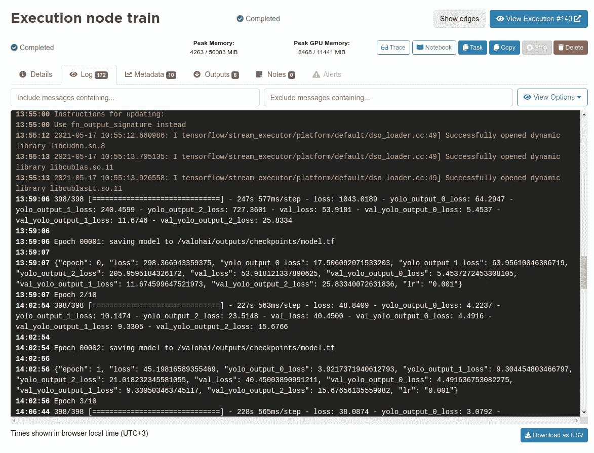

# 用 Valohai 和 Superb AI 构建 YOLOv3 管道

> 原文：<https://towardsdatascience.com/building-a-yolov3-pipeline-with-valohai-and-superb-ai-45275aa5ebde?source=collection_archive---------44----------------------->

## 每次训练模型时，建立管道的价值都会增加

作者图片

本文展示了一个管道示例，该管道集成了 Valohai 和 Superb AI，使用预训练的权重和转移学习来训练计算机视觉模型。对于该模型，我们使用 YOLOv3，它是为实时对象检测而构建的。

在这个例子中，Superb AI 用于管理训练数据，并产生可用于训练的标记数据集。另一方面，Valohai 接收这些数据，并通过训练步骤和批量推理步骤来运行流水线。我们在这里写了一个关于这些平台如何互补的更全面的分析。

*   [Superb AI](https://www.superb-ai.com/) 是一个 ML DataOps 平台，帮助计算机视觉团队自动化和管理整个数据管道:从摄取和标记到数据质量评估和交付。
*   [Valohai](https://valohai.com/) 是一个 MLOps 平台，帮助在任何云或本地硬件上构建和运行全自动培训管道。非常适合计算机视觉和深度学习。

**项目详情**

*   **储存库:**[https://github.com/valohai/yolov3-tf2](https://github.com/valohai/yolov3-tf2/)
*   **型号:** YOLOv3-416 ( [重量](https://pjreddie.com/media/files/yolov3.weights))
*   **框架:** Tensorflow 2.4.0 + OpenCV 4.1
*   **模式:**迁移学习
*   **数据集:** ~3000 张图像(COCO 2017 验证集)
*   **类:**人，车，椅子，书，瓶子

注意:管道是通用的，这意味着使用 Superb.ai 平台上的任何数据集和任何种类的类，使用符合 YOLOv3 模型的任何权重进行训练都是微不足道的。这里列出的只是我们使用的默认值。

# 在高超的人工智能中准备数据

首先，我们需要在高超的人工智能平台上创建一个新项目。选择任何名称和描述。对于这个例子，数据类型将是图像和注释类型框。

作者图片

然后添加五个类(人，车，椅子，书，瓶子)来匹配我们的 COCO 数据集，我们会上传到平台。

作者图片

人们也可以利用高超的人工智能的自动标记功能，但在这个例子中，我们将在 COCO 数据集中已经有了标签。现在我们已经在平台中准备好了项目和数据集模板，是时候使用高超的 AI SDK 和 CLI 来转换和上传实际的数据+标签了。遵循这个[示例存储库](https://github.com/Superb-AI-Suite/spb-example/tree/main/create-coco-project)中的说明。

一旦转换和上传完成，该项目应该包含 3000 多张图片，随时可供瓦罗海的培训管道使用。

作者图片

# 瓦罗海训练管道

在瓦罗海，培训渠道是任何成功项目的关键组成部分。我们的示例管道由四个步骤组成。

作者图片

`convert-superbai`步骤从 Superb.ai 中提取数据，根据 Superb.ai 标记拆分训练集和验证集，最后将这两个集转换为。模型的 tfrecord 文件。

`weights`步骤从 Joseph Redmon 的网站下载预训练的权重，将它们转换为 Tensorflow 检查点，最后通过对单幅图像运行推理来验证它们是否正确工作。

`train`步骤基于超参数在 GPU 环境(其他步骤默认为 CPU)中训练模型。

最后，`detect`步骤对作为该步骤输入给出的一组图像的新训练模型进行推理。这一步的输出是图像的新版本，边界框和标签呈现在原始图像之上。

每个步骤(通常)都是一个 Python 文件。这里是我们的`weights`步骤的 [weights.py](https://github.com/valohai/yolov3-tf2/blob/master/weights.py) 的源代码。它有一个参数`weights_num_classes`(预训练模型使用了多少个类别)和一个输入`weights`(实际预训练权重)。

参数和输入被提供给对 Valohai SDK 的`valohai.prepare()`调用。Valohai CLI 可以解析这个调用，以自动生成参数化该步骤所需的配置。

管道本身在 [pipeline.py](https://github.com/valohai/yolov3-tf2/blob/master/pipeline.py) 中定义，它也使用新的 SDK。

# 在瓦罗海建立管道

首先，在 Valohai 中创建一个新项目，并从项目设置中链接 GitHub [示例存储库](https://github.com/valohai/yolov3-tf2.git)。

作者图片

现在，您可以从 pipelines 选项卡创建一个新的管道，并从蓝图下拉列表中选择`train-superbai`。

# 与卓越的人工智能相结合

在运行管道之前，您需要告诉它从哪里获取数据。图像和标签是两个独立的 URL，这意味着从 Superb.ai 到 Valohai 的两次复制粘贴。

**图片:**设置>通用(Superb.ai)

作者图片

**标签:**导出>导出历史(Superb.ai)

作者图片

**管道输入(Valohai)**

作者图片

# 运行管道

现在，我们已经在卓越的人工智能平台中集成了我们的数据集，我们的管道已经准备就绪！

Valohai 记录了管道每一步的所有输入、参数、日志和指标。这些是输入、参数、Docker 图像、环境和执行`train`步骤的其余信息:

作者图片

这是训练代码打印出的所有日志的一部分。

作者图片

这些是由培训代码打印出来的指标。Valohai 将所有打印的 JSON 解析为一个度量(在 Valohai 中称为元数据)。

作者图片

最后，在`detect`步骤的输出选项卡中，我们可以用一些实际的图像来检查模型的执行情况。

作者图片

# 对标签进行迭代

作者图片

一旦您知道您的模型需要优化的地方，因为它与数据有关，您可以通过他们的 SDK 将您的模型输出快速发送回 Superb AI 套件以进行模型辅助标记，从而快速启动您的下一次迭代。

# 为什么为您的 YOLOv3 模型建立一个端到端的管道是显而易见的

在本文中，端到端管道建立在两个专门构建的工具之上:用于数据管理的 Superb AI 和用于模型生命周期管理的 Valohai。这个示例中的整个设置可以在几个小时内完成，但是每次训练模型时，前期工作的价值都会增加。

训练数据集随着时间的推移而发展，它可以独立于训练管道被重新标记和改变。类似地，训练管道中的代码可以被迭代，同时保持端到端管道的完整性以用于连续操作。此外，随着训练数据集和建模复杂性的增长，Valohai 上的训练管道可以轻松扩展到更强大的 GPU 实例。

*最初发表于*[*https://valohai.com*](https://valohai.com/blog/building-a-yolov3-pipeline/)*。*