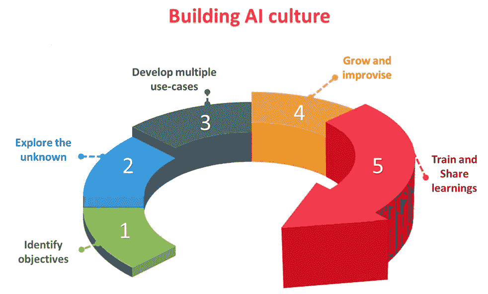

# 在组织中建立人工智能文化

> 原文：<https://towardsdatascience.com/building-ai-culture-in-organisations-11d660b04768?source=collection_archive---------32----------------------->

## 如何建立大型人工智能驱动的工程团队

图片来自 [pixabay](https://pixabay.com/photos/technology-developer-touch-finger-3389904/?download)

# **我们在这里谈论什么？**

围绕人工智能的炒作可能非常真实，但公平地说，任何有能力改变世界的技术都必须如此。坐下来想想过去几天，你可能会在社交媒体上找到一些关于人工智能将如何改变我们生活方式的参考资料，特别是在医疗保健、金融、娱乐或旅游领域。任何关注科技新闻或与数字化转型有某种关联的人，肯定已经了解智能机器。他们中的一些人可能会不经意地认为它只是机器人技术的另一个花哨的词，或者它将如何在某一天夺走他们的工作，但它有这么多必须谈论的东西。人工智能乐观主义者认为，这只是一场革命的开始，这场革命有能力改变我们所知的世界的一切。

这导致了一些组织采用人工智能策略来构建解决方案，并为他们的业务增加更多价值。有许多关于如何成为人工智能驱动的组织的猜测，但它们往往无法融合，因为有多个维度来理解人工智能。作为一名企业主，重要的是要知道采取什么途径来拥抱人工智能，吸收组织的文化，同时将风险降至最低，并小心行事。

文化需要不断的培养和关注。它需要一段时间的演变，需要不断的努力。一个人如何开始在一个组织内的不同团队之间建立正确的文化？考虑到它是昂贵的，难以理解的，甚至更难正确实施，如何进行呢？谨慎的做法是为人工智能战略创建一个框架，以建立与组织愿景一致的正确文化，从而提供切实的好处。使用人工智能的创新文化…

# **双击 AI 路径**

一个组织面临的最大挑战是弄清楚从哪里开始。确定人工智能需要解决的重要业务用例。下面的框架可以用来创建一个组织范围的人工智能策略，可以被不同的团队采用。

作者图片

1.  **制定正确的期望并设定目标**

不管一个组织如何看待它对人工智能的最新认识，就人工智能实际上是什么以及它如何与他们的业务相关进行头脑风暴并形成观点是极其重要的。获得对人工智能及其工作原理的基本理解需要时间和努力。对于跨职能团队来说，坐下来讨论这对他们意味着什么是非常重要的。这并不意味着温习数学技能并开始解复杂的方程，而是要知道人工智能有多强大，以及如何使用它。在进行任何巨额投资之前，该组织真的能从中受益吗？它解决什么样的问题？

这可能需要广泛的阅读和讨论，从会议中收集见解。从其他已经过了这个阶段的人的工作中获得灵感总是有帮助的。通常很难鼓励人们走出舒适区，收集如何与他们的业务相关的想法。但是这个阶段对于在团队中引入正确的文化非常重要。一种有足够自由的文化，有利于创新和对新兴技术的积极氛围。远离悲观主义者总是有帮助的，悲观主义者相信“这也会像其他人一样随着时间的推移而消失，所以为什么要学习它呢”。人工智能不是一个工具或一个库或一项技术，但它是一种范式转变，一种前所未有的高效解决复杂问题的方式。它会留在这里，所以跳上来..

**2。探索未知**

弄脏你的手。可以挑选一些流行的用例来加深对人工智能实际工作方式的理解。找出其他人喜欢的各种工具、框架和库，并学习它们来开发 AI 解决方案。一个问题如何解决或者通常由行业内的其他人来解决。学习一些基本的机器学习技术。确定回归与分类问题、数据清理需求、基础设施需求等。找到一种方法来比较使用两种不同算法的结果。弄清楚聊天机器人是如何开发的，计算机视觉问题是如何解决的，预测解决方案是如何建立的。训练数据集高度偏斜怎么办？如何设置数据和 ML 管道？达到更容易提供基于人工智能的商业问题解决方案的阶段，或者至少对何时使用哪种算法有一个看法。

必须了解人工智能解决方案在生产中是如何部署的。如果生产中的真实数据与培训中使用的数据相差很大怎么办？这可以通过在生产运行时重新训练人工智能模型来解决吗？还是需要离线分析和训练？多少数据足够用于训练目的？它会对精确度产生什么样的影响？

实验-分析-讨论-重复。

**3。就这么做——开发多个用例**

在这一阶段，团队应该渴望开发小的解决方案来解决一些与组织业务相关的实际问题。构思想法、进行多次概念验证、演示、收集反馈、集思广益和改进。这是团队真正需要合作的阶段，以展示他们在人工智能领域可以做什么，以及它如何帮助业务。这个阶段是最重要的，因为它给了决策者对团队开发的能力的信心。在这一阶段需要做出许多决定，如团队成员的资金、基础设施等。确定人工智能与组织的确切相关程度。这个阶段应该提供足够的清晰度来决定在这个过程中应该进行多少投资。获得启发，看看是从头开始做“人工智能研究”有意义，还是只是用可用的东西做“应用人工智能”，或者两者兼而有之。

**4。成长和即兴创作**

基于人工智能的解决方案需要持续的关注和监控。总是在寻找新出现的和可用的东西。人工智能是一个如此快节奏的领域，每天都有新的研究发表。设定了新的基准，在准确性、性能和效率方面对过去的人工智能模型进行了改进。不断完善解决方案，让它们变得更好。最终，这导致团队即兴发挥并提出新的创新解决方案的阶段。人们可以找到以前从未探索过的道路，并取得重大突破。这以组织的名义建立了专有的解决方案或专利，并提供了超越竞争对手的优势。

围绕人工智能治理建立指导方针。解决方案的精确度应该是多少，才能被组织和客户所接受？如何最小化人类的偏见？谁领导负责人工智能工程的团队？定义组织内的角色和职责，以建立清晰的问责制。

**5。培训和传播意识**

当务之急是帮助组织内的其他团队理解人工智能，并传播对所开发的解决方案的认识。一个组织对基于人工智能的计划了解得越多，超越他人的机会就越大。这可能需要提供培训课程、发布白皮书、时事通讯、演示等。其他的就不用从头开始了。团队应该互相帮助学习、激励和提高。有时，一个想法可能会通过这些会议转化为有用的业务用例。

当涉及到像人工智能这样复杂的事情时，合作是关键。此外，任何基于人工智能的系统都是为了解决由产品团队确定的真实业务问题，由销售团队出售，并由营销团队打上品牌。他们都需要知道它是如何工作的，具体是做什么的。因此，人工智能的学习路径需要被各个团队一起采用。正如 IT 界的一句谚语所说，不管怎样，隐居的工作不会有好结果。

# **需要说的话**

很明显，朝着正确方向迈出的一小步真的可以推动整个组织拥抱创新文化。这是一个不断努力的过程，本质上，这就是目标本身。避免不必要的不和谐，继续前进。

许多人相信人工智能将来会做大事。在未来，人工智能将使我们更有效率，更有生产力。在未来，人工智能掌握着大规模解决全球问题的关键。人工智能帮助我们做出更好决策的未来。一个超越人类的未来。

但是有些人相信，未来已经到来..