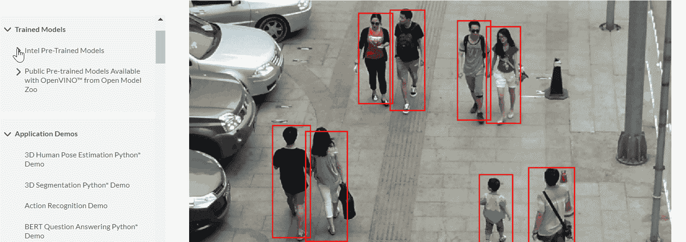
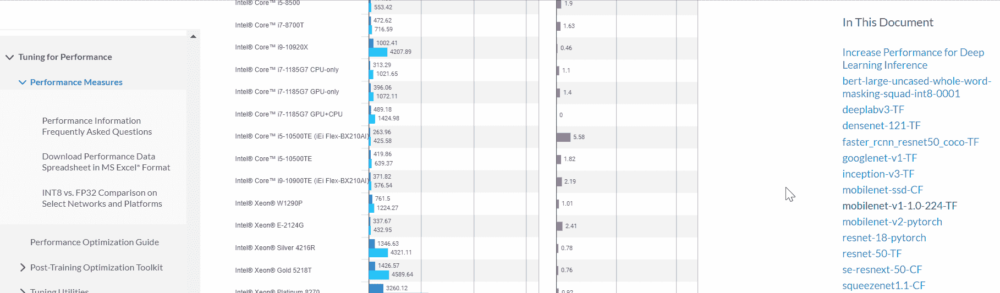
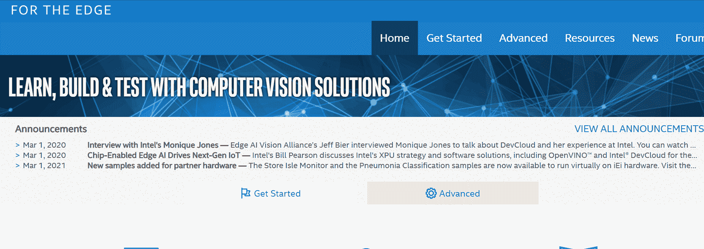
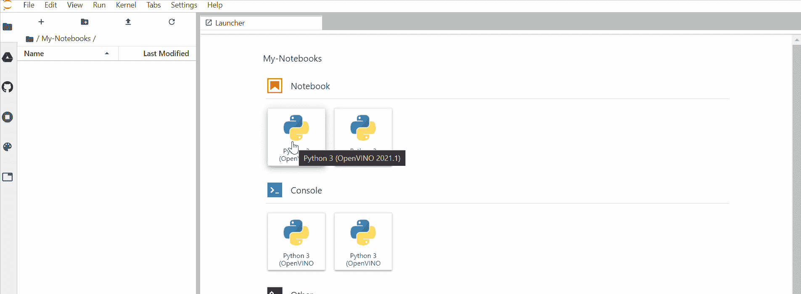
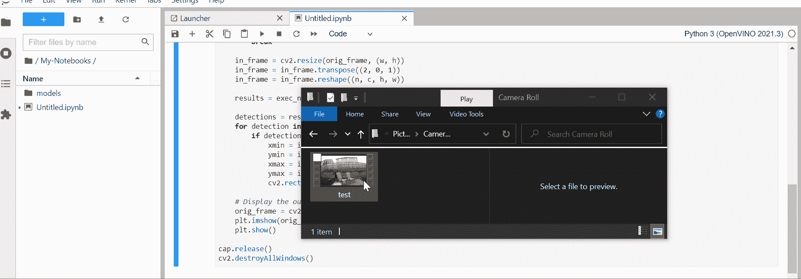
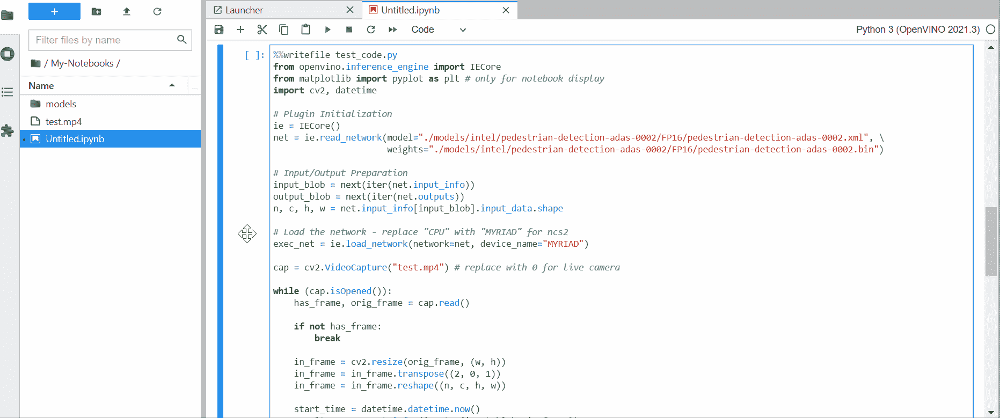
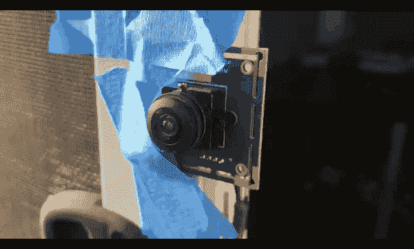

# 构建人工智能概念验证

> 原文：<https://towardsdatascience.com/building-an-ai-poc-b7b1077e492e?source=collection_archive---------32----------------------->

## 开始到结束/迭代原型/工作流

## 在云中建立原型，并部署在插入信用卡大小的计算机中的神经网络加速器上

我个人项目的主要要求是:

> 一种可充电的电池供电的小型设备，连接有超广角摄像头，能够在不同的照明条件下检测部分遮挡的移动人类，而无需任何互联网接入。

这篇文章是一个从头到尾的演练——从研究、迭代原型到设置和部署功能代码。

> [**英特尔 DevCloud for Edge**](https://devcloud.intel.com/edge/) **(免费):**浏览器中的快速迭代原型制作
> [**英特尔 OpenVINO 工具包**](https://docs.openvinotoolkit.org/latest/index.html) **(免费):**预先训练好的模型动物园和推理 API
> [**NCS 2**](https://www.intel.com/content/dam/support/us/en/documents/boardsandkits/neural-compute-sticks/NCS2_Product-Brief-English.pdf)**(75 美元):**神经网络加速器硬件
> [**树莓 Pi 4**](https://www.raspberrypi.org/products/raspberry-pi-4-model-b/) **($美元)**

还可以选择直接在 Raspberry Pi 上运行 TFLite，利用板载计算资源，为主应用程序留出很少的空间。本文中推理硬件和软件的工作流程和选择是快速建立原型的更灵活的选择之一。你可能会发现这种方法对你下一个需要人工智能的伟大想法很有用。

# 1.在线搜索可用的预训练模型

> [OpenVINO Model Zoo](https://docs.openvinotoolkit.org/latest/omz_models_intel_index.html) 网页是一个很好的资源，可以找到英特尔和公共的预训练模型，这些模型带有随时可用的视觉截图。

选择符合要求的型号。例如，在我的情况下，前置摄像头的放置——同时在准确性*(精度)*与复杂性 *(GFlops)* 之间取得平衡。**行人检测 adas-0002** 预训练模型似乎是我的应用程序的一个很好的候选对象。



> 对于像我之前的[帖子](/train-a-neural-network-to-classify-images-and-openvino-cpu-inferencing-in-10mins-22ec868b4d1b)这样的定制培训工作流，在开始之前，从[基准测试网页](https://docs.openvinotoolkit.org/latest/openvino_docs_performance_benchmarks.html)提前获得对目标硬件上的模型性能的粗略估计将会很有帮助。



# 2.面向 Edge 的英特尔 DevCloud 原型

在投入时间进行安装之前，让我们对该解决方案在目标设置中的表现有所了解，例如特定 fps 下的鱼眼镜头失真、环境照明和分辨率。

> 新的 Jupyter 实验室界面带有示例，可以非常方便地在 CPU 上借用代码灵感、调试和推理，这些 CPU 包括英特尔凌动、酷睿 i5、i7、i9、至强、iGPU、NCS2 (1 个 VPU)、Mustang (8 个 VPU)和 FPGA。



## 2.a .从模型动物园下载模型

在**“我的笔记本”**目录下创建一个新的笔记本，并通过从 OpenVINO 模型动物园发现中指定**确切的** **名称**来下载感兴趣的预训练模型。

```
!/opt/intel/openvino/deployment_tools/tools/model_downloader/downloader.py --name pedestrian-detection-adas-0002 -o models
```



## 2.b .在 CPU 上快速测试，快速失败

通过直接连接鱼眼镜头摄像机，使用默认的 [Windows 10 摄像机应用程序](https://www.microsoft.com/en-us/p/windows-camera/9wzdncrfjbbg?activetab=pivot:overviewtab)在目标位置录制一个 *"test.mp4"* 片段。使用 IntelliSense 与 **TAB** 键的组合以及来自示例笔记本的代码灵感来学习 OpenVINO API 流程并进行非常快速的测试。

> 没什么特别的(例如，异步代码、多请求...)只是快速编码！
> **SHIFT + ENTER** 在新的笔记本单元格中运行下面的代码。

```
from openvino.inference_engine import IECore
from matplotlib import pyplot as plt
import cv2, datetime# Plugin Initialization
ie = IECore()
net = ie.read_network(model="./models/intel/pedestrian-detection-adas-0002/FP16/pedestrian-detection-adas-0002.xml", \
                      weights="./models/intel/pedestrian-detection-adas-0002/FP16/pedestrian-detection-adas-0002.bin")# Input/Output Preparation
input_blob = next(iter(net.input_info))
output_blob = next(iter(net.outputs))
n, c, h, w = net.input_info[input_blob].input_data.shape# Load the network
exec_net = ie.load_network(network=net, device_name="CPU")cap = cv2.VideoCapture("test.mp4")while (cap.isOpened()):
    has_frame, orig_frame = cap.read()

    if not has_frame:
        break

    in_frame = cv2.resize(orig_frame, (w, h))
    in_frame = in_frame.transpose((2, 0, 1))
    in_frame = in_frame.reshape((n, c, h, w))

    results = exec_net.infer(inputs={input_blob: in_frame})

    detections = results[output_blob][0][0]
    for detection in detections:
        if detection[2] > 0.50: # threshold
            xmin = int(detection[3] * orig_frame.shape[1]) # 1:w
            ymin = int(detection[4] * orig_frame.shape[0]) # 0:h
            xmax = int(detection[5] * orig_frame.shape[1])
            ymax = int(detection[6] * orig_frame.shape[0])
            cv2.rectangle(orig_frame, (xmin, ymin), (xmax, ymax), (0, 125, 255), 3)

    # display result
    orig_frame = cv2.cvtColor(orig_frame, cv2.COLOR_BGR2RGB)
    plt.imshow(orig_frame)
    plt.show()cap.release()
cv2.destroyAllWindows()
```



代码是功能性的！点击**停止**以防止单元随着每一帧结果无限扩大。

## 2.c .提交 NCS2 的作业

将目标设备从 **CPU** 更换为**万千**。

```
exec_net = ie.load_network(network=net, device_name="MYRIAD")
```

此外，测量在 NCS2 上执行的时间。在本地设置真实设备之前，预先在 DevCloud 上验证非常有用。

```
start_time = datetime.datetime.now()
results = exec_net.infer(inputs={input_blob: in_frame})
end_time = datetime.datetime.now()
```

由于我们无法直观地看到 NCS2 作业的结果，通过用以下代码替换**显示结果**代码段，将结果保存到文件中。

```
# Write single image to file and exit
duration = round((end_time - start_time).total_seconds() * 1000)
time_st = 'NCS2 Inference time: {:.2f} ms'.format((duration), 2)cv2.putText(orig_frame,time_st, (10,60), cv2.FONT_HERSHEY_SIMPLEX, 1, (0, 255, 0), 6)cv2.imwrite("result.png", orig_frame)
    break
```

要提交具有上述更改的 NCS2 作业，通过在开头添加 magic 命令并再次运行单元，将其写出到 python 文件中。

```
%%writefile test_code.py
```

在新单元中，创建作业脚本以运行 python 代码文件。

```
%%writefile test_job.sh
cd $PBS_O_WORKDIR # required for running remote job
python3 test_code.py
```

最后，通过在新的单元格中运行下面的代码来运行作业。

```
job_id_ncs2 = !qsub test_job.sh -l nodes=1:idc004nc2
print(job_id_ncs2[0])
```

> 您将在几秒钟内看到生成的图像和额外的作业信息文件。这些文件对于运行时调试任何错误都很有用。在多次运行的情况下，
> 文件名将包含打印在下面的 **ID** 。
> 点击**目录** **刷新**按钮如果一段时间后你没有看到任何变化。



此时，我们可以开始在本地进行真正的设置。

# 3.在 RaspbianOS 上设置 OpenVINO 和 NCS2

以下是官方[文档](https://docs.openvinotoolkit.org/latest/openvino_docs_install_guides_installing_openvino_raspbian.html)中经过简化和验证的步骤。

## 3.a .树莓 Pi 上的 OpenVINO 安装

*   导航到[软件包存储库](https://storage.openvinotoolkit.org/repositories/openvino/packages/)以获得适当的最新版本。
*   寻找*l _ open vino _ toolkit _ runtime _ raspbian _ p _<版本>。tgz* 右键*“复制链接地址”*获取文件路径。

> 在一个新的终端窗口中，如果你不在乎获取最新的版本，你可以盲目地按顺序运行下面的命令。

```
cd ~/Downloads/wget [https://storage.openvinotoolkit.org/repositories/openvino/packages/2021.2/l_openvino_toolkit_runtime_raspbian_p_2021.2.185.tgz](https://storage.openvinotoolkit.org/repositories/openvino/packages/2021.2/l_openvino_toolkit_runtime_raspbian_p_2021.2.185.tgz)sudo mkdir -p /opt/intel/openvinosudo tar -xf l_openvino_toolkit_runtime_raspbian_p_2021.2.185.tgz --strip 1 -C /opt/intel/openvinosudo apt install cmakeecho "source /opt/intel/openvino/bin/setupvars.sh" >> ~/.bashrc
```

> 搞定了。此时，关闭所有终端并重新打开一个新终端。


## 3.b .设置 NCS2 设备

```
sudo usermod -a -G users “$(whoami)”
```

> 注销系统，重新登录以使更改生效，并运行以下命令来安装 USB 规则。您应该得到一个类似“Udev 规则已经成功安装”的确认消息。

```
sh topt/intel/openvino/install_dependencies/install_NCS_udev_rules.sh
```

## 3.c .将 NCS2 插入 Raspberry Pi 运行

假设只插入了一个相机设备，在 OpenCV 代码中用相机 0 替换 test.mp4。

```
cap = cv2.VideoCapture(0)
```

用下面的 OpenCV imshow 代码替换**显示结果**代码部分，并注释掉 matplotlib 导入代码。

```
cv2.imshow(“Output “, orig_frame)
if cv2.waitKey(25) & 0xFF == ord(‘q’):
   break
```



> 满足基本要求！
> 继续与 PoC 的其余部分集成。

# 结论

*   虽然 OpenVINO model zoo 并不能解决世界上所有的人工智能问题，但它确实包含了各种各样预先训练好的优化模型，用于快速原型制作。
*   像 Google Colab 一样，DevCloud for Edge 可以方便地进行快速原型开发，还可以在云中的各种英特尔设备上进行测试。
*   对于像 Raspberry Pi 这样的低功耗和计算设备，NCS2 是一个很好的附件，可以快速启动 AI PoC。