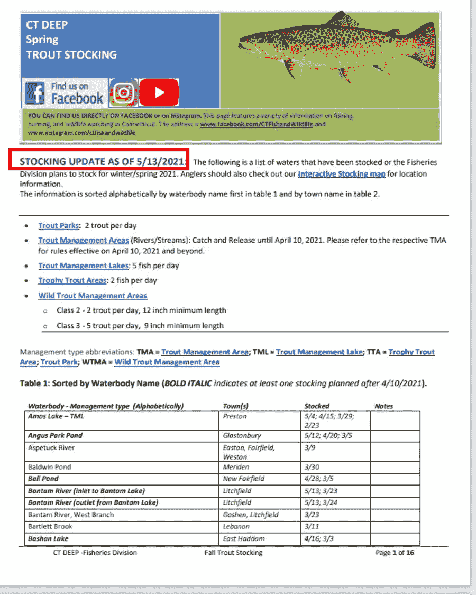
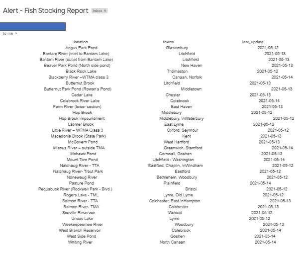

# 构建一个帮助你钓更多鱼的应用程序

> 原文：<https://towardsdatascience.com/building-an-app-that-helps-you-catch-more-fish-b2eb76b885d4?source=collection_archive---------52----------------------->

## 一个警报系统使用数据通知你何时何地捕鱼

凯利·西克玛在 [Unsplash](https://unsplash.com?utm_source=medium&utm_medium=referral) 上的照片

我最近开始涉足淡水捕鱼。任何一直在钓鱼的人都知道，这可能是命中或错过，特别是如果你是这项运动的新手或在一个不熟悉的地方钓鱼。没有人想得到*【一败涂地】*。幸运的是，养鱼使得这种情况更容易避免。

鱼类放养是指在孵化场饲养鱼类，并将其放入水体，以帮助补充现有种群或在没有种群的地方创造新的种群。放养通常由国家部门完成，它们也有助于休闲渔业，提供更丰富的鱼类种群。

在美国，州保护或环境部门经常在网上发布库存更新。通常，一旦人们看到他们已经被放养，他们就会聚集到这些地方，在接下来的几天里，这些地方会被大量捕捞。

这让我开始思考。如果我开发一个应用程序，可以抓取网站，并在库存更新时提醒我，会怎么样？

考虑到这一点，我决定构建一个 Python 脚本，并将其部署在 Heroku 上，以便在发现新的库存更新时通过电子邮件自动通知我。我的目标不一定是第一个尽快耗尽所有湖中的鱼，而只是意识到任何更新，而不是必须记住检查它。这样，如果我外出并得到通知，我可以顺便去钓鱼，享受一天中的时光！

下面，我将带您了解如何构建这个应用程序，以及它是如何工作的，以便您可以构建类似的应用程序。

# 目标数据

我将收集的更新是康涅狄格州能源和环境保护部(DEEP)发布的康涅狄格州鳟鱼放养报告。该报告存储在 PDF 格式的表格中，并放在他们的网站上。

CT DEEP [鳟鱼放养报告](https://portal.ct.gov/-/media/DEEP/fishing/weekly_reports/CurrentStockingReport.pdf)第 1 页。*注:根据政策*提取数据允许 CT 政府网站

报告顶部列出的日期将作为我们的指示器，指示自我们上次抓取 PDF 以来报告是否已更新。在此之下，每个页面都有一个长期运行的表，其中列出了所有特定的水体、它们的位置以及它们最后一次储存的详细信息。

# 读入 PDF 数据

我们要做的第一件事是创建一个单行文本文件`last_stocked_date.txt`,存储 PDF 的最后更新日期。首先，我们可以在文件中设置日期`5/1/2021`。这将允许我们读入数据，并将其存储到主程序的变量`LAST_STOCK_DATE`中。

接下来，我们要从网站下载并存储当前的 PDF。为了检查 PDF 文件是否已经更新，我们将使用`pdfplumber`打开文件，并仅从第一页提取所有文本。使用一些字符串操作，我们将基于子字符串“STOCKING UPDATE from”从该文本中提取日期。

# 检查最近的更新

在这里，我们将启动我们的主程序，并检查 PDF 中的日期是否与我们抓取并存储的上一个日期不同。如果是这样，程序将从前 8 页的表格中提取数据，并将其存储到数据帧中。我们只需要提取前 8 页，因为它们给出了库存的所有位置(任何超出的都是重复数据)。

接下来，我们将在 dataframe `last_update`中创建一个新列，该列只提取某个特定位置的最后库存时间，并将其转换为`datetime`类型。例如，我们可以通过过去 3 天的库存位置来过滤数据框。

此外，我们希望记得更新存储上次库存日期的文本文件。这将确保我们的脚本下次运行时，只有在确定了新日期的情况下才会继续处理。

# 发送电子邮件警报

接下来要做的是发送一封电子邮件来提醒我们鱼已经被放养了，以及它们被放养在哪里。

为此，我们需要首先设置环境变量来收集我们的 Gmail 帐户、凭据和收件人详细信息。由于发送电子邮件需要提供凭证，我们不想直接在我们的脚本中存储这样的敏感数据。相反，我们将创建一个环境文件来存储这些数据。这对于在本地运行脚本是可行的，但是当使用 Heroku 这样的云解决方案进行实时部署时，我们还需要将这些环境变量定义为`Config Vars`。

接下来，我们可以加载所需的环境变量。

我们还希望将之前存储位置的过滤数据框转换为字符串，以便我们可以将它包含在电子邮件的消息或正文中。之后，我们可以把邮件的所有内容拼凑起来，选择我们想要的邮件主题。

有了这个设置，我们应该能够运行脚本并收到类似这样的电子邮件！*注意——使用谷歌的 Gmail 时，您可能会在第一时间收到安全通知，并且可能需要并允许* [*不太安全的应用*](https://support.google.com/accounts/answer/6010255?hl=en) *使用您的凭据发送电子邮件。*

程序成功发送电子邮件提醒的示例(由作者提供)

# 把所有东西放在一起

我们现在有一个完整的预警系统来跟踪鱼类资源的更新！完整的代码将包括错误处理，以及捕捉任何通知我们可能发生的任何潜在问题，如果 PDF 文件格式或数据以某种方式改变，不能再由程序的代码捕获。

# 自动化脚本

从这里开始，最后一步是自动运行警报系统。有许多方法可以做到这一点，但主要有两种方法:

1.  在本地运行，通过`Task Scheduler` (Windows)或`cron` (Mac 或 Linux)等软件进行调度。
2.  将程序部署到供应商的云平台，如`Heroku`或`AWS`，并使用他们的工具对其进行调度。

第一种方法很容易设置，而且是免费的，但是需要启动机器才能运行脚本。第二种方法是托管在云中的服务器上，因此可以随时运行，但可能更复杂，并且可能需要花费资金来设置。

出于我们的目的，我已经使用免费会员在 Heroku 上部署了该应用程序，并安排脚本每小时运行一次。这足够每月免费运行，不需要超过 Heroku 为其基本会员提供的免费时间或积分。在 Heroku 上部署将需要我们的主程序中一些额外的步骤，以及额外的文件，如`requirements.txt`和`runtime.txt`文件。

如果你更喜欢在本地运行程序，有很多很棒的教程教你如何使用像任务调度器这样的工具。

</automate-your-python-scripts-with-task-scheduler-661d0a40b279>  

我希望你觉得这个教程是有用的，令人愉快的。如果您有任何问题或反馈，请联系我们。如果您对 Heroku 上更深入的部署指南感兴趣，请随时在下面发表评论！

*这个项目的所有代码都可以在这个* [*Github 资源库*](https://github.com/bicachu/fish-stocking-report-alert) *中找到，您可以下载并立即开始运行，无论是在本地还是在 Heroku(如果您有帐户的话)。*